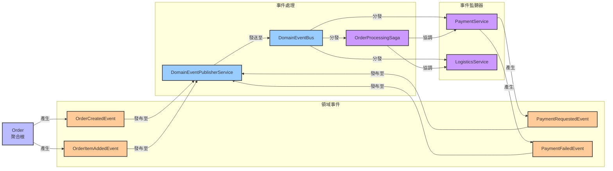

# 資訊視點 (Information Viewpoint)

## 概覽

資訊視點描述系統如何儲存、操作、管理和分發資訊。這個視點關注資料結構、資訊流、資料一致性和資料生命週期管理。

## 利害關係人

- **主要關注者**: 資料架構師、資料庫管理員、資料工程師
- **次要關注者**: 開發者、業務分析師、合規專員

## 關注點

1. **資料模型設計**: 資料結構和關係定義
2. **資訊流管理**: 資料在系統中的流動
3. **資料一致性**: 資料完整性和一致性保證
4. **事件驅動架構**: 領域事件和事件處理
5. **資料持久化**: 資料儲存和檢索策略

## 架構元素

### 資料模型
- \1 - 實體關係和資料結構
- \1 - 一致性保證機制

### 事件驅動架構
- [領域事件](domain-events.md) - 事件設計和實現
- \1 - 事件風暴建模
- \1 - 資料流動和轉換

#### 事件驅動架構圖

*完整的事件驅動架構，展示領域事件的產生、發布、處理和監聽流程，包括 Saga 模式的協調機制*

#### 資訊視點詳細架構

!!!!!

*資訊視點的詳細架構設計，包括資料模型、資訊流和事件處理的完整實現*

## 品質屬性考量

> 📋 **完整交叉引用**: 查看 [Viewpoint-Perspective 交叉引用矩陣](../../viewpoint-perspective-matrix.md) 了解所有觀點的詳細影響分析

### 🔴 高影響觀點

#### [安全性觀點](../../perspectives/security/README.md)
- **資料加密**: 敏感資料的靜態加密 (AES-256) 和傳輸加密 (TLS 1.3)
- **存取控制**: 資料層面的細粒度權限管理和角色控制
- **資料遮罩**: 敏感資料的動態遮罩和匿名化處理
- **稽核軌跡**: 所有資料存取和修改的完整記錄
- **相關實現**: \1 | \1

#### [性能觀點](../../perspectives/performance/README.md)
- **查詢優化**: 資料庫查詢的索引策略和執行計畫優化
- **快取策略**: 多層快取架構和快取失效策略
- **資料分割**: 水平和垂直分割策略，支援大規模資料處理
- **連接池**: 資料庫連接池的配置和監控
- **相關實現**: \1 | \1

#### [可用性觀點](../../perspectives/availability/README.md)
- **資料備份**: 自動化備份策略和多地區備份
- **資料複製**: 主從複製和多主複製配置
- **災難恢復**: RTO ≤ 5分鐘，RPO ≤ 1分鐘的恢復目標
- **資料一致性**: 分散式環境下的資料一致性保證
- **相關實現**: \1 | \1

#### [法規觀點](../../perspectives/regulation/README.md)
- **資料治理**: 資料分類、標記和生命週期管理
- **隱私保護**: GDPR、CCPA 等隱私法規的合規實現
- **資料保留**: 法規要求的資料保留和刪除政策
- **合規稽核**: 資料處理活動的合規性稽核和報告
- **相關實現**: \1 | \1

### 🟡 中影響觀點

#### [演進性觀點](../../perspectives/evolution/README.md)
- **資料模型演進**: 資料庫 schema 的版本管理和遷移策略
- **向後相容性**: 資料格式變更的相容性保證
- **遷移策略**: 零停機資料遷移和轉換
- **相關實現**: \1 | \1

#### [使用性觀點](../../perspectives/usability/README.md)
- **資料呈現**: 資料的可視化和報表展示
- **搜尋體驗**: 全文搜尋和智能過濾功能
- **資料匯出**: 用戶友好的資料匯出和下載功能
- **相關實現**: \1 | \1

#### [位置觀點](../../perspectives/location/README.md)
- **資料本地化**: 資料的地理分佈和本地化存儲
- **資料主權**: 資料存儲的法律管轄權和合規要求
- **跨區域同步**: 多地區資料中心的資料同步策略
- **相關實現**: \1 | \1

#### [成本觀點](../../perspectives/cost/README.md)
- **存儲成本**: 資料存儲的成本優化和分層存儲策略
- **傳輸成本**: 資料傳輸和網路頻寬的成本控制
- **查詢成本**: 資料庫查詢和計算資源的成本優化
- **相關實現**: \1 | \1

## 相關圖表

- [Event Storming Big Picture](../../diagrams/viewpoints/functional/event-storming-big-picture.puml)
- [Event Storming Process Level](../../diagrams/viewpoints/functional/event-storming-process-level.puml)
- [領域事件流程圖](../../diagrams/viewpoints/functional/domain-events-flow.puml)
- ## 事件驅動架構圖

- [應用服務概覽圖](../../diagrams/viewpoints/functional/application-services-overview.puml)

## 與其他視點的關聯

- **[情境視點](../context/README.md)**: 外部資料交換和整合協議
- **[功能視點](../functional/README.md)**: 業務功能驅動資料需求
- **[並發視點](../concurrency/README.md)**: 資料存取的並發控制
- **[開發視點](../development/README.md)**: 資料存取層的實現
- **[部署視點](../deployment/README.md)**: 資料庫部署和配置
- **[運營視點](../operational/README.md)**: 資料監控和維護

## 實現指南

### 事件驅動架構實現
1. **領域事件設計**: 使用 Record 實現不可變事件
2. **事件發布**: 聚合根收集事件，應用服務發布
3. **事件處理**: 使用 @TransactionalEventListener
4. **事件儲存**: 支援 Event Sourcing 模式

### 資料一致性策略
1. **強一致性**: 同一聚合內的 ACID 保證
2. **最終一致性**: 跨聚合的事件驅動一致性
3. **補償機制**: Saga 模式處理分散式交易
4. **衝突解決**: 樂觀鎖和版本控制

### 資料模型設計原則
1. **正規化**: 避免資料重複和異常
2. **反正規化**: 查詢性能優化
3. **分片策略**: 水平擴展支援
4. **索引設計**: 查詢性能優化

## 驗證標準

- [ ] 資料模型支援所有業務需求
- [ ] 資料一致性機制正確實現
- [ ] 領域事件設計合理
- [ ] 資料存取性能滿足需求
- [ ] 資料安全和隱私保護到位
- [ ] 資料備份和恢復機制完善

---

**相關文件**:
- [領域事件實現指南](domain-events.md)
- 資料架構師和資料工程師
- 系統整合工程師和API設計師

