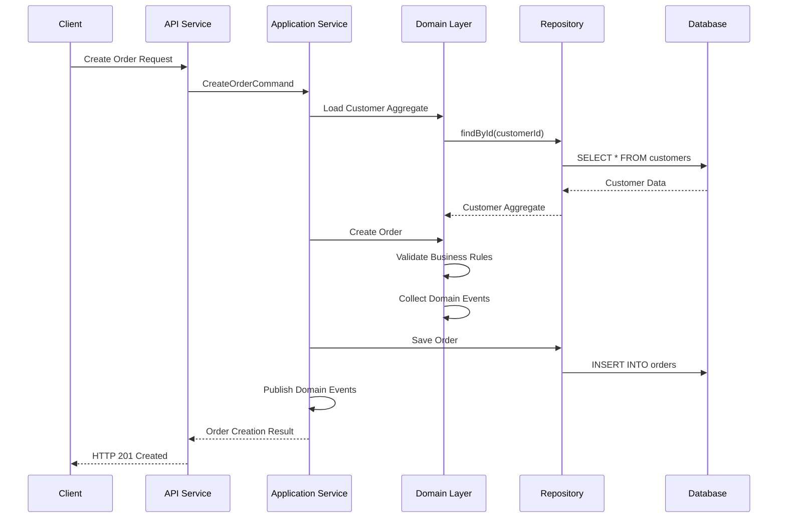
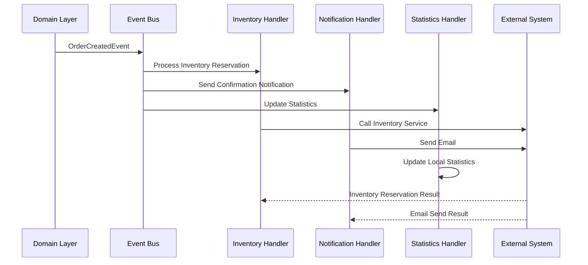

# Information Viewpoint Architecture Elements

## Overview

The Information Viewpoint focuses on the structure, flow, and management of data within the system, including core architectural elements such as data models, domain events, information flow, and data consistency strategies.

## Core Architecture Elements

### 1. Data Models

#### Domain Data Models

The system adopts Domain-Driven Design, where data models directly reflect business concepts and relationships.

```java
// Customer Data Model
@Entity
@Table(name = "customers")
public class CustomerEntity {
    @Id
    private String id;
    
    @Column(nullable = false)
    private String name;
    
    @Column(nullable = false, unique = true)
    private String email;
    
    @Enumerated(EnumType.STRING)
    private MembershipLevel membershipLevel;
    
    @Enumerated(EnumType.STRING)
    private CustomerStatus status;
    
    @OneToMany(mappedBy = "customer", cascade = CascadeType.ALL, fetch = FetchType.LAZY)
    private List<DeliveryAddressEntity> addresses = new ArrayList<>();
    
    @OneToMany(mappedBy = "customer", cascade = CascadeType.ALL, fetch = FetchType.LAZY)
    private List<PaymentMethodEntity> paymentMethods = new ArrayList<>();
    
    @CreationTimestamp
    private LocalDateTime createdAt;
    
    @UpdateTimestamp
    private LocalDateTime updatedAt;
}

// Order Data Model
@Entity
@Table(name = "orders")
public class OrderEntity {
    @Id
    private String id;
    
    @Column(name = "customer_id", nullable = false)
    private String customerId;
    
    @Enumerated(EnumType.STRING)
    private OrderStatus status;
    
    @Column(precision = 19, scale = 2)
    private BigDecimal totalAmount;
    
    @Column(length = 3)
    private String currency;
    
    @OneToMany(mappedBy = "order", cascade = CascadeType.ALL, fetch = FetchType.LAZY)
    private List<OrderItemEntity> items = new ArrayList<>();
    
    @Embedded
    private DeliveryAddressEmbedded deliveryAddress;
    
    @CreationTimestamp
    private LocalDateTime createdAt;
    
    @UpdateTimestamp
    private LocalDateTime updatedAt;
}
```

#### Data Relationship Design

| Entity | Relationship Type | Target Entity | Description |
|--------|-------------------|---------------|-------------|
| Customer | OneToMany | DeliveryAddress | Customer can have multiple delivery addresses |
| Customer | OneToMany | PaymentMethod | Customer can have multiple payment methods |
| Customer | OneToMany | Order | Customer can have multiple orders |
| Order | OneToMany | OrderItem | Order contains multiple product items |
| Order | ManyToOne | Customer | Order belongs to one customer |
| Product | OneToMany | OrderItem | Product can be in multiple order items |
| Category | OneToMany | Product | Category contains multiple products |

### 2. Domain Events

#### Event Classification System

```java
// Customer-related Events
public record CustomerRegisteredEvent(
    CustomerId customerId,
    CustomerName customerName,
    Email email,
    MembershipLevel membershipLevel,
    UUID eventId,
    LocalDateTime occurredOn
) implements DomainEvent {}

public record CustomerProfileUpdatedEvent(
    CustomerId customerId,
    CustomerName oldName,
    CustomerName newName,
    Email oldEmail,
    Email newEmail,
    UUID eventId,
    LocalDateTime occurredOn
) implements DomainEvent {}

// Order-related Events
public record OrderCreatedEvent(
    OrderId orderId,
    CustomerId customerId,
    List<OrderItemData> orderItems,
    Money totalAmount,
    UUID eventId,
    LocalDateTime occurredOn
) implements DomainEvent {}

public record OrderStatusChangedEvent(
    OrderId orderId,
    OrderStatus oldStatus,
    OrderStatus newStatus,
    String reason,
    UUID eventId,
    LocalDateTime occurredOn
) implements DomainEvent {}

// Payment-related Events
public record PaymentProcessedEvent(
    PaymentId paymentId,
    OrderId orderId,
    Money amount,
    PaymentMethod paymentMethod,
    PaymentStatus status,
    UUID eventId,
    LocalDateTime occurredOn
) implements DomainEvent {}
```

#### Event Storage Structure

```sql
-- Event Store Table Structure
CREATE TABLE event_store (
    event_id UUID PRIMARY KEY,
    event_type VARCHAR(255) NOT NULL,
    aggregate_id VARCHAR(255) NOT NULL,
    aggregate_type VARCHAR(255) NOT NULL,
    event_data JSONB NOT NULL,
    event_version INTEGER NOT NULL DEFAULT 1,
    occurred_on TIMESTAMP NOT NULL,
    created_at TIMESTAMP DEFAULT CURRENT_TIMESTAMP,
    
    INDEX idx_aggregate_id (aggregate_id),
    INDEX idx_event_type (event_type),
    INDEX idx_occurred_on (occurred_on)
);

-- Event Processing Record Table
CREATE TABLE processed_events (
    id UUID PRIMARY KEY,
    event_id UUID NOT NULL,
    handler_name VARCHAR(255) NOT NULL,
    processed_at TIMESTAMP DEFAULT CURRENT_TIMESTAMP,
    processing_result VARCHAR(50) NOT NULL,
    error_message TEXT,
    
    UNIQUE KEY uk_event_handler (event_id, handler_name),
    FOREIGN KEY fk_event_id (event_id) REFERENCES event_store(event_id)
);
```

### 3. Information Flow Design

#### Synchronous Information Flow



#### Asynchronous Information Flow



### 4. Data Consistency Strategy

#### Strong Consistency Scenarios

```java
@Service
@Transactional
public class OrderApplicationService {
    
    // Strong Consistency: Order creation and inventory deduction in same transaction
    public Order createOrderWithInventoryReservation(CreateOrderCommand command) {
        // 1. Verify inventory availability
        InventoryCheckResult checkResult = inventoryService.checkAvailability(command.getItems());
        if (!checkResult.isAvailable()) {
            throw new InsufficientInventoryException(checkResult.getUnavailableItems());
        }
        
        // 2. Create order
        Order order = Order.create(command.getCustomerId(), command.getItems());
        Order savedOrder = orderRepository.save(order);
        
        // 3. Reserve inventory (same transaction)
        inventoryService.reserveItems(command.getItems());
        
        // 4. Publish events
        domainEventService.publishEventsFromAggregate(savedOrder);
        
        return savedOrder;
    }
}
```

#### Eventual Consistency Scenarios

```java
@Component
public class OrderEventHandler {
    
    // Eventual Consistency: Cross-aggregate consistency through event processing
    @EventListener
    @Transactional
    public void handleOrderCreated(OrderCreatedEvent event) {
        try {
            // Asynchronously update customer statistics
            updateCustomerOrderStatistics(event.getCustomerId(), event.getTotalAmount());
            
            // Asynchronously update product sales statistics
            updateProductSalesStatistics(event.getOrderItems());
            
            // Record successful processing
            markEventAsProcessed(event.getEventId());
            
        } catch (Exception e) {
            // Record processing failure for later retry
            recordEventProcessingFailure(event.getEventId(), e);
            throw e;
        }
    }
    
    @Retryable(value = {TransientException.class}, maxAttempts = 3)
    private void updateCustomerOrderStatistics(CustomerId customerId, Money orderAmount) {
        CustomerStatistics stats = customerStatsRepository.findByCustomerId(customerId)
            .orElse(new CustomerStatistics(customerId));
            
        stats.addOrder(orderAmount);
        customerStatsRepository.save(stats);
    }
}
```

### 5. Query Model Design

#### CQRS Read Models

```java
// Customer Summary Query Model
@Entity
@Table(name = "customer_summaries")
public class CustomerSummaryView {
    @Id
    private String customerId;
    
    private String customerName;
    private String email;
    private String membershipLevel;
    private String status;
    
    private Integer totalOrders;
    private BigDecimal totalSpent;
    private LocalDateTime lastOrderDate;
    private LocalDateTime registrationDate;
    
    // Index fields for fast queries
    @Column(name = "search_text")
    private String searchText; // Search text containing name and email
    
    @Column(name = "segment")
    private String customerSegment; // Customer segmentation
}

// Order Summary Query Model
@Entity
@Table(name = "order_summaries")
public class OrderSummaryView {
    @Id
    private String orderId;
    
    private String customerId;
    private String customerName;
    private String status;
    private BigDecimal totalAmount;
    private String currency;
    private Integer itemCount;
    private LocalDateTime orderDate;
    private LocalDateTime estimatedDeliveryDate;
    
    // Aggregated data
    private String productCategories; // JSON format product category list
    private String deliveryAddress;   // Formatted delivery address
}
```

#### Query Service Implementation

```java
@Service
@Transactional(readOnly = true)
public class CustomerQueryService {
    
    private final CustomerSummaryViewRepository customerSummaryRepository;
    
    public Page<CustomerSummaryView> searchCustomers(CustomerSearchCriteria criteria, Pageable pageable) {
        Specification<CustomerSummaryView> spec = Specification.where(null);
        
        if (criteria.getSearchText() != null) {
            spec = spec.and((root, query, cb) -> 
                cb.like(cb.lower(root.get("searchText")), 
                       "%" + criteria.getSearchText().toLowerCase() + "%"));
        }
        
        if (criteria.getMembershipLevel() != null) {
            spec = spec.and((root, query, cb) -> 
                cb.equal(root.get("membershipLevel"), criteria.getMembershipLevel()));
        }
        
        if (criteria.getSegment() != null) {
            spec = spec.and((root, query, cb) -> 
                cb.equal(root.get("customerSegment"), criteria.getSegment()));
        }
        
        return customerSummaryRepository.findAll(spec, pageable);
    }
    
    public CustomerDetailView getCustomerDetail(String customerId) {
        CustomerSummaryView summary = customerSummaryRepository.findById(customerId)
            .orElseThrow(() -> new CustomerNotFoundException(customerId));
            
        List<OrderSummaryView> recentOrders = orderSummaryRepository
            .findByCustomerIdOrderByOrderDateDesc(customerId, PageRequest.of(0, 10));
            
        return CustomerDetailView.builder()
            .summary(summary)
            .recentOrders(recentOrders)
            .build();
    }
}
```

### 6. Data Synchronization Mechanism

#### Read Model Updates

```java
@Component
public class ReadModelUpdater {
    
    @EventListener
    @Transactional
    public void updateCustomerSummary(CustomerRegisteredEvent event) {
        CustomerSummaryView summary = new CustomerSummaryView();
        summary.setCustomerId(event.getCustomerId().value());
        summary.setCustomerName(event.getCustomerName().value());
        summary.setEmail(event.getEmail().value());
        summary.setMembershipLevel(event.getMembershipLevel().name());
        summary.setStatus("PENDING_VERIFICATION");
        summary.setTotalOrders(0);
        summary.setTotalSpent(BigDecimal.ZERO);
        summary.setRegistrationDate(event.getOccurredOn());
        summary.setSearchText(buildSearchText(event.getCustomerName().value(), event.getEmail().value()));
        summary.setCustomerSegment(determineInitialSegment(event.getMembershipLevel()));
        
        customerSummaryRepository.save(summary);
    }
    
    @EventListener
    @Transactional
    public void updateOrderSummary(OrderCreatedEvent event) {
        OrderSummaryView summary = new OrderSummaryView();
        summary.setOrderId(event.getOrderId().value());
        summary.setCustomerId(event.getCustomerId().value());
        summary.setStatus(OrderStatus.PENDING.name());
        summary.setTotalAmount(event.getTotalAmount().getAmount());
        summary.setCurrency(event.getTotalAmount().getCurrency().getCurrencyCode());
        summary.setItemCount(event.getOrderItems().size());
        summary.setOrderDate(event.getOccurredOn());
        
        // Load customer information
        Customer customer = customerRepository.findById(event.getCustomerId())
            .orElseThrow(() -> new CustomerNotFoundException(event.getCustomerId()));
        summary.setCustomerName(customer.getName().value());
        
        orderSummaryRepository.save(summary);
        
        // Update customer statistics
        updateCustomerStatistics(event.getCustomerId(), event.getTotalAmount());
    }
}
```

## Data Architecture Patterns

### 1. Event Sourcing Pattern

```java
@Component
public class EventSourcedOrderRepository implements OrderRepository {
    
    private final EventStore eventStore;
    private final OrderSnapshotRepository snapshotRepository;
    
    @Override
    public Optional<Order> findById(OrderId orderId) {
        // 1. Try to load from snapshot
        Optional<OrderSnapshot> snapshot = snapshotRepository.findLatest(orderId);
        
        Order order;
        long fromVersion = 0;
        
        if (snapshot.isPresent()) {
            order = snapshot.get().toOrder();
            fromVersion = snapshot.get().getVersion();
        } else {
            order = null;
        }
        
        // 2. Load events after snapshot
        List<DomainEvent> events = eventStore.getEventsForAggregate(
            orderId.value(), fromVersion);
        
        if (order == null && events.isEmpty()) {
            return Optional.empty();
        }
        
        // 3. Replay events to rebuild aggregate state
        if (order == null) {
            order = new Order(); // Empty aggregate
        }
        
        for (DomainEvent event : events) {
            order.apply(event);
        }
        
        return Optional.of(order);
    }
    
    @Override
    public Order save(Order order) {
        List<DomainEvent> uncommittedEvents = order.getUncommittedEvents();
        
        // Save events to event store
        for (DomainEvent event : uncommittedEvents) {
            eventStore.store(event);
        }
        
        // Mark events as committed
        order.markEventsAsCommitted();
        
        // Create snapshot periodically
        if (shouldCreateSnapshot(order)) {
            createSnapshot(order);
        }
        
        return order;
    }
}
```

### 2. CQRS Pattern

```java
// Command Side - Write Model
@Service
@Transactional
public class OrderCommandService {
    
    public Order createOrder(CreateOrderCommand command) {
        // Write model focuses on business logic and data consistency
        Order order = Order.create(command.getCustomerId(), command.getItems());
        return orderRepository.save(order);
    }
}

// Query Side - Read Model
@Service
@Transactional(readOnly = true)
public class OrderQueryService {
    
    public Page<OrderSummaryView> getOrdersByCustomer(String customerId, Pageable pageable) {
        // Read model focuses on query performance and user experience
        return orderSummaryRepository.findByCustomerIdOrderByOrderDateDesc(customerId, pageable);
    }
    
    public OrderDetailView getOrderDetail(String orderId) {
        return orderDetailRepository.findById(orderId)
            .orElseThrow(() -> new OrderNotFoundException(orderId));
    }
}
```

## Data Quality Assurance

### 1. Data Validation

```java
@Component
public class DataValidationService {
    
    public ValidationResult validateCustomerData(CustomerEntity customer) {
        ValidationResult result = new ValidationResult();
        
        // Basic field validation
        if (customer.getName() == null || customer.getName().trim().isEmpty()) {
            result.addError("name", "Customer name cannot be empty");
        }
        
        if (customer.getEmail() == null || !isValidEmail(customer.getEmail())) {
            result.addError("email", "Invalid email format");
        }
        
        // Business rule validation
        if (customerRepository.existsByEmailAndIdNot(customer.getEmail(), customer.getId())) {
            result.addError("email", "Email is already used by another customer");
        }
        
        return result;
    }
}
```

### 2. Data Integrity Constraints

```sql
-- Database-level integrity constraints
ALTER TABLE customers 
ADD CONSTRAINT chk_email_format 
CHECK (email ~ '^[A-Za-z0-9._%+-]+@[A-Za-z0-9.-]+\.[A-Za-z]{2,}$');

ALTER TABLE orders 
ADD CONSTRAINT chk_total_amount_positive 
CHECK (total_amount >= 0);

ALTER TABLE order_items 
ADD CONSTRAINT chk_quantity_positive 
CHECK (quantity > 0);

-- Foreign key constraints
ALTER TABLE orders 
ADD CONSTRAINT fk_orders_customer 
FOREIGN KEY (customer_id) REFERENCES customers(id);

ALTER TABLE order_items 
ADD CONSTRAINT fk_order_items_order 
FOREIGN KEY (order_id) REFERENCES orders(id);
```

## Monitoring and Metrics

### 1. Data Quality Monitoring

```java
@Component
@Scheduled(fixedRate = 300000) // Execute every 5 minutes
public class DataQualityMonitor {
    
    public void checkDataQuality() {
        // Check data integrity
        long orphanedOrderItems = orderItemRepository.countOrphanedItems();
        if (orphanedOrderItems > 0) {
            alertService.sendAlert("Found " + orphanedOrderItems + " orphaned order items");
        }
        
        // Check data consistency
        long inconsistentOrderTotals = orderRepository.countInconsistentTotals();
        if (inconsistentOrderTotals > 0) {
            alertService.sendAlert("Found " + inconsistentOrderTotals + " orders with inconsistent totals");
        }
        
        // Check event processing delay
        Duration maxEventAge = eventProcessingService.getMaxUnprocessedEventAge();
        if (maxEventAge.toMinutes() > 30) {
            alertService.sendAlert("Event processing delay exceeds 30 minutes");
        }
    }
}
```

### 2. Performance Monitoring

```java
@Component
public class DataAccessMetrics {
    
    private final MeterRegistry meterRegistry;
    
    @EventListener
    public void recordQueryExecution(QueryExecutionEvent event) {
        Timer.Sample sample = Timer.start(meterRegistry);
        sample.stop(Timer.builder("database.query.duration")
            .tag("query.type", event.getQueryType())
            .tag("table", event.getTableName())
            .register(meterRegistry));
            
        if (event.getDuration().toMillis() > 1000) {
            Counter.builder("database.slow.queries")
                .tag("query.type", event.getQueryType())
                .register(meterRegistry)
                .increment();
        }
    }
}
```

---

**Related Documents**:
- [Domain Events Design](domain-events.md)
- [Data Model Design](data-model.md)
- [Event Sourcing Implementation](event-sourcing.md)
- [Data Governance Architecture](data-governance-architecture.md)
