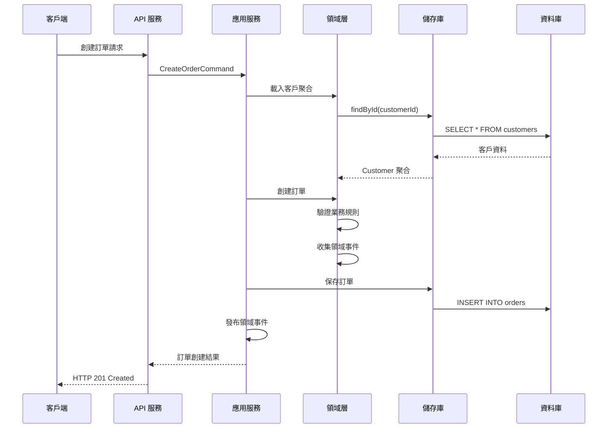
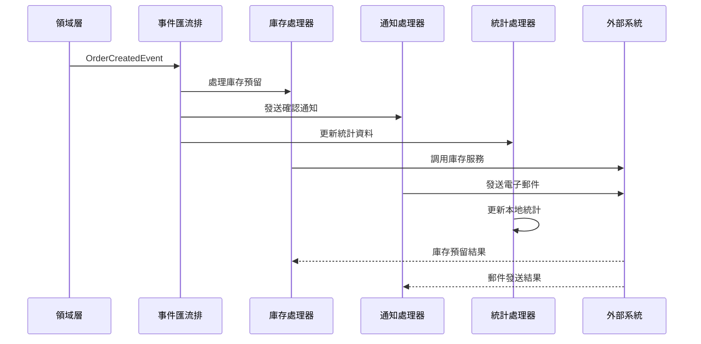

# 資訊視點架構元素

## 概覽

資訊視點關注系統中資料的結構、流動和管理，包括資料模型、領域事件、資訊流和資料一致性策略等核心架構元素。

## 核心架構元素

### 1. 資料模型 (Data Models)

#### 領域資料模型

系統採用領域驅動設計，資料模型直接反映業務概念和關係。

```java
// 客戶資料模型
@Entity
@Table(name = "customers")
public class CustomerEntity {
    @Id
    private String id;
    
    @Column(nullable = false)
    private String name;
    
    @Column(nullable = false, unique = true)
    private String email;
    
    @Enumerated(EnumType.STRING)
    private MembershipLevel membershipLevel;
    
    @Enumerated(EnumType.STRING)
    private CustomerStatus status;
    
    @OneToMany(mappedBy = "customer", cascade = CascadeType.ALL, fetch = FetchType.LAZY)
    private List<DeliveryAddressEntity> addresses = new ArrayList<>();
    
    @OneToMany(mappedBy = "customer", cascade = CascadeType.ALL, fetch = FetchType.LAZY)
    private List<PaymentMethodEntity> paymentMethods = new ArrayList<>();
    
    @CreationTimestamp
    private LocalDateTime createdAt;
    
    @UpdateTimestamp
    private LocalDateTime updatedAt;
}

// 訂單資料模型
@Entity
@Table(name = "orders")
public class OrderEntity {
    @Id
    private String id;
    
    @Column(name = "customer_id", nullable = false)
    private String customerId;
    
    @Enumerated(EnumType.STRING)
    private OrderStatus status;
    
    @Column(precision = 19, scale = 2)
    private BigDecimal totalAmount;
    
    @Column(length = 3)
    private String currency;
    
    @OneToMany(mappedBy = "order", cascade = CascadeType.ALL, fetch = FetchType.LAZY)
    private List<OrderItemEntity> items = new ArrayList<>();
    
    @Embedded
    private DeliveryAddressEmbedded deliveryAddress;
    
    @CreationTimestamp
    private LocalDateTime createdAt;
    
    @UpdateTimestamp
    private LocalDateTime updatedAt;
}
```

#### 資料關係設計

| 實體 | 關係類型 | 目標實體 | 說明 |
|------|----------|----------|------|
| Customer | OneToMany | DeliveryAddress | 客戶可有多個配送地址 |
| Customer | OneToMany | PaymentMethod | 客戶可有多個支付方式 |
| Customer | OneToMany | Order | 客戶可有多個訂單 |
| Order | OneToMany | OrderItem | 訂單包含多個商品項目 |
| Order | ManyToOne | Customer | 訂單屬於一個客戶 |
| Product | OneToMany | OrderItem | 產品可在多個訂單項目中 |
| Category | OneToMany | Product | 分類包含多個產品 |

### 2. 領域事件 (Domain Events)

#### 事件分類體系

```java
// 客戶相關事件
public record CustomerRegisteredEvent(
    CustomerId customerId,
    CustomerName customerName,
    Email email,
    MembershipLevel membershipLevel,
    UUID eventId,
    LocalDateTime occurredOn
) implements DomainEvent {}

public record CustomerProfileUpdatedEvent(
    CustomerId customerId,
    CustomerName oldName,
    CustomerName newName,
    Email oldEmail,
    Email newEmail,
    UUID eventId,
    LocalDateTime occurredOn
) implements DomainEvent {}

// 訂單相關事件
public record OrderCreatedEvent(
    OrderId orderId,
    CustomerId customerId,
    List<OrderItemData> orderItems,
    Money totalAmount,
    UUID eventId,
    LocalDateTime occurredOn
) implements DomainEvent {}

public record OrderStatusChangedEvent(
    OrderId orderId,
    OrderStatus oldStatus,
    OrderStatus newStatus,
    String reason,
    UUID eventId,
    LocalDateTime occurredOn
) implements DomainEvent {}

// 支付相關事件
public record PaymentProcessedEvent(
    PaymentId paymentId,
    OrderId orderId,
    Money amount,
    PaymentMethod paymentMethod,
    PaymentStatus status,
    UUID eventId,
    LocalDateTime occurredOn
) implements DomainEvent {}
```

#### 事件存儲結構

```sql
-- 事件存儲表結構
CREATE TABLE event_store (
    event_id UUID PRIMARY KEY,
    event_type VARCHAR(255) NOT NULL,
    aggregate_id VARCHAR(255) NOT NULL,
    aggregate_type VARCHAR(255) NOT NULL,
    event_data JSONB NOT NULL,
    event_version INTEGER NOT NULL DEFAULT 1,
    occurred_on TIMESTAMP NOT NULL,
    created_at TIMESTAMP DEFAULT CURRENT_TIMESTAMP,
    
    INDEX idx_aggregate_id (aggregate_id),
    INDEX idx_event_type (event_type),
    INDEX idx_occurred_on (occurred_on)
);

-- 事件處理記錄表
CREATE TABLE processed_events (
    id UUID PRIMARY KEY,
    event_id UUID NOT NULL,
    handler_name VARCHAR(255) NOT NULL,
    processed_at TIMESTAMP DEFAULT CURRENT_TIMESTAMP,
    processing_result VARCHAR(50) NOT NULL,
    error_message TEXT,
    
    UNIQUE KEY uk_event_handler (event_id, handler_name),
    FOREIGN KEY fk_event_id (event_id) REFERENCES event_store(event_id)
);
```

### 3. 資訊流設計 (Information Flow)

#### 同步資訊流



#### 非同步資訊流



### 4. 資料一致性策略

#### 強一致性場景

```java
@Service
@Transactional
public class OrderApplicationService {
    
    // 強一致性：訂單創建和庫存扣減在同一事務中
    public Order createOrderWithInventoryReservation(CreateOrderCommand command) {
        // 1. 驗證庫存可用性
        InventoryCheckResult checkResult = inventoryService.checkAvailability(command.getItems());
        if (!checkResult.isAvailable()) {
            throw new InsufficientInventoryException(checkResult.getUnavailableItems());
        }
        
        // 2. 創建訂單
        Order order = Order.create(command.getCustomerId(), command.getItems());
        Order savedOrder = orderRepository.save(order);
        
        // 3. 預留庫存（同一事務）
        inventoryService.reserveItems(command.getItems());
        
        // 4. 發布事件
        domainEventService.publishEventsFromAggregate(savedOrder);
        
        return savedOrder;
    }
}
```

#### 最終一致性場景

```java
@Component
public class OrderEventHandler {
    
    // 最終一致性：通過事件處理實現跨聚合一致性
    @EventListener
    @Transactional
    public void handleOrderCreated(OrderCreatedEvent event) {
        try {
            // 異步更新客戶統計
            updateCustomerOrderStatistics(event.getCustomerId(), event.getTotalAmount());
            
            // 異步更新產品銷售統計
            updateProductSalesStatistics(event.getOrderItems());
            
            // 記錄處理成功
            markEventAsProcessed(event.getEventId());
            
        } catch (Exception e) {
            // 記錄處理失敗，稍後重試
            recordEventProcessingFailure(event.getEventId(), e);
            throw e;
        }
    }
    
    @Retryable(value = {TransientException.class}, maxAttempts = 3)
    private void updateCustomerOrderStatistics(CustomerId customerId, Money orderAmount) {
        CustomerStatistics stats = customerStatsRepository.findByCustomerId(customerId)
            .orElse(new CustomerStatistics(customerId));
            
        stats.addOrder(orderAmount);
        customerStatsRepository.save(stats);
    }
}
```

### 5. 查詢模型設計 (Query Models)

#### CQRS 讀模型

```java
// 客戶摘要查詢模型
@Entity
@Table(name = "customer_summaries")
public class CustomerSummaryView {
    @Id
    private String customerId;
    
    private String customerName;
    private String email;
    private String membershipLevel;
    private String status;
    
    private Integer totalOrders;
    private BigDecimal totalSpent;
    private LocalDateTime lastOrderDate;
    private LocalDateTime registrationDate;
    
    // 用於快速查詢的索引欄位
    @Column(name = "search_text")
    private String searchText; // 包含姓名、電子郵件的搜尋文字
    
    @Column(name = "segment")
    private String customerSegment; // 客戶分群
}

// 訂單摘要查詢模型
@Entity
@Table(name = "order_summaries")
public class OrderSummaryView {
    @Id
    private String orderId;
    
    private String customerId;
    private String customerName;
    private String status;
    private BigDecimal totalAmount;
    private String currency;
    private Integer itemCount;
    private LocalDateTime orderDate;
    private LocalDateTime estimatedDeliveryDate;
    
    // 聚合資料
    private String productCategories; // JSON 格式的產品分類列表
    private String deliveryAddress;   // 格式化的配送地址
}
```

#### 查詢服務實現

```java
@Service
@Transactional(readOnly = true)
public class CustomerQueryService {
    
    private final CustomerSummaryViewRepository customerSummaryRepository;
    
    public Page<CustomerSummaryView> searchCustomers(CustomerSearchCriteria criteria, Pageable pageable) {
        Specification<CustomerSummaryView> spec = Specification.where(null);
        
        if (criteria.getSearchText() != null) {
            spec = spec.and((root, query, cb) -> 
                cb.like(cb.lower(root.get("searchText")), 
                       "%" + criteria.getSearchText().toLowerCase() + "%"));
        }
        
        if (criteria.getMembershipLevel() != null) {
            spec = spec.and((root, query, cb) -> 
                cb.equal(root.get("membershipLevel"), criteria.getMembershipLevel()));
        }
        
        if (criteria.getSegment() != null) {
            spec = spec.and((root, query, cb) -> 
                cb.equal(root.get("customerSegment"), criteria.getSegment()));
        }
        
        return customerSummaryRepository.findAll(spec, pageable);
    }
    
    public CustomerDetailView getCustomerDetail(String customerId) {
        CustomerSummaryView summary = customerSummaryRepository.findById(customerId)
            .orElseThrow(() -> new CustomerNotFoundException(customerId));
            
        List<OrderSummaryView> recentOrders = orderSummaryRepository
            .findByCustomerIdOrderByOrderDateDesc(customerId, PageRequest.of(0, 10));
            
        return CustomerDetailView.builder()
            .summary(summary)
            .recentOrders(recentOrders)
            .build();
    }
}
```

### 6. 資料同步機制

#### 讀模型更新

```java
@Component
public class ReadModelUpdater {
    
    @EventListener
    @Transactional
    public void updateCustomerSummary(CustomerRegisteredEvent event) {
        CustomerSummaryView summary = new CustomerSummaryView();
        summary.setCustomerId(event.getCustomerId().value());
        summary.setCustomerName(event.getCustomerName().value());
        summary.setEmail(event.getEmail().value());
        summary.setMembershipLevel(event.getMembershipLevel().name());
        summary.setStatus("PENDING_VERIFICATION");
        summary.setTotalOrders(0);
        summary.setTotalSpent(BigDecimal.ZERO);
        summary.setRegistrationDate(event.getOccurredOn());
        summary.setSearchText(buildSearchText(event.getCustomerName().value(), event.getEmail().value()));
        summary.setCustomerSegment(determineInitialSegment(event.getMembershipLevel()));
        
        customerSummaryRepository.save(summary);
    }
    
    @EventListener
    @Transactional
    public void updateOrderSummary(OrderCreatedEvent event) {
        OrderSummaryView summary = new OrderSummaryView();
        summary.setOrderId(event.getOrderId().value());
        summary.setCustomerId(event.getCustomerId().value());
        summary.setStatus(OrderStatus.PENDING.name());
        summary.setTotalAmount(event.getTotalAmount().getAmount());
        summary.setCurrency(event.getTotalAmount().getCurrency().getCurrencyCode());
        summary.setItemCount(event.getOrderItems().size());
        summary.setOrderDate(event.getOccurredOn());
        
        // 載入客戶資訊
        Customer customer = customerRepository.findById(event.getCustomerId())
            .orElseThrow(() -> new CustomerNotFoundException(event.getCustomerId()));
        summary.setCustomerName(customer.getName().value());
        
        orderSummaryRepository.save(summary);
        
        // 更新客戶統計
        updateCustomerStatistics(event.getCustomerId(), event.getTotalAmount());
    }
}
```

## 資料架構模式

### 1. Event Sourcing 模式

```java
@Component
public class EventSourcedOrderRepository implements OrderRepository {
    
    private final EventStore eventStore;
    private final OrderSnapshotRepository snapshotRepository;
    
    @Override
    public Optional<Order> findById(OrderId orderId) {
        // 1. 嘗試從快照載入
        Optional<OrderSnapshot> snapshot = snapshotRepository.findLatest(orderId);
        
        Order order;
        long fromVersion = 0;
        
        if (snapshot.isPresent()) {
            order = snapshot.get().toOrder();
            fromVersion = snapshot.get().getVersion();
        } else {
            order = null;
        }
        
        // 2. 載入快照之後的事件
        List<DomainEvent> events = eventStore.getEventsForAggregate(
            orderId.value(), fromVersion);
        
        if (order == null && events.isEmpty()) {
            return Optional.empty();
        }
        
        // 3. 重播事件重建聚合狀態
        if (order == null) {
            order = new Order(); // 空聚合
        }
        
        for (DomainEvent event : events) {
            order.apply(event);
        }
        
        return Optional.of(order);
    }
    
    @Override
    public Order save(Order order) {
        List<DomainEvent> uncommittedEvents = order.getUncommittedEvents();
        
        // 保存事件到事件存儲
        for (DomainEvent event : uncommittedEvents) {
            eventStore.store(event);
        }
        
        // 標記事件為已提交
        order.markEventsAsCommitted();
        
        // 定期創建快照
        if (shouldCreateSnapshot(order)) {
            createSnapshot(order);
        }
        
        return order;
    }
}
```

### 2. CQRS 模式

```java
// 命令端 - 寫模型
@Service
@Transactional
public class OrderCommandService {
    
    public Order createOrder(CreateOrderCommand command) {
        // 寫模型專注於業務邏輯和資料一致性
        Order order = Order.create(command.getCustomerId(), command.getItems());
        return orderRepository.save(order);
    }
}

// 查詢端 - 讀模型
@Service
@Transactional(readOnly = true)
public class OrderQueryService {
    
    public Page<OrderSummaryView> getOrdersByCustomer(String customerId, Pageable pageable) {
        // 讀模型專注於查詢性能和使用者體驗
        return orderSummaryRepository.findByCustomerIdOrderByOrderDateDesc(customerId, pageable);
    }
    
    public OrderDetailView getOrderDetail(String orderId) {
        return orderDetailRepository.findById(orderId)
            .orElseThrow(() -> new OrderNotFoundException(orderId));
    }
}
```

## 資料品質保證

### 1. 資料驗證

```java
@Component
public class DataValidationService {
    
    public ValidationResult validateCustomerData(CustomerEntity customer) {
        ValidationResult result = new ValidationResult();
        
        // 基本欄位驗證
        if (customer.getName() == null || customer.getName().trim().isEmpty()) {
            result.addError("name", "客戶姓名不能為空");
        }
        
        if (customer.getEmail() == null || !isValidEmail(customer.getEmail())) {
            result.addError("email", "電子郵件格式無效");
        }
        
        // 業務規則驗證
        if (customerRepository.existsByEmailAndIdNot(customer.getEmail(), customer.getId())) {
            result.addError("email", "電子郵件已被其他客戶使用");
        }
        
        return result;
    }
}
```

### 2. 資料完整性約束

```sql
-- 資料庫層面的完整性約束
ALTER TABLE customers 
ADD CONSTRAINT chk_email_format 
CHECK (email ~ '^[A-Za-z0-9._%+-]+@[A-Za-z0-9.-]+\.[A-Za-z]{2,}$');

ALTER TABLE orders 
ADD CONSTRAINT chk_total_amount_positive 
CHECK (total_amount >= 0);

ALTER TABLE order_items 
ADD CONSTRAINT chk_quantity_positive 
CHECK (quantity > 0);

-- 外鍵約束
ALTER TABLE orders 
ADD CONSTRAINT fk_orders_customer 
FOREIGN KEY (customer_id) REFERENCES customers(id);

ALTER TABLE order_items 
ADD CONSTRAINT fk_order_items_order 
FOREIGN KEY (order_id) REFERENCES orders(id);
```

## 監控和度量

### 1. 資料品質監控

```java
@Component
@Scheduled(fixedRate = 300000) // 每5分鐘執行
public class DataQualityMonitor {
    
    public void checkDataQuality() {
        // 檢查資料完整性
        long orphanedOrderItems = orderItemRepository.countOrphanedItems();
        if (orphanedOrderItems > 0) {
            alertService.sendAlert("發現 " + orphanedOrderItems + " 個孤立的訂單項目");
        }
        
        // 檢查資料一致性
        long inconsistentOrderTotals = orderRepository.countInconsistentTotals();
        if (inconsistentOrderTotals > 0) {
            alertService.sendAlert("發現 " + inconsistentOrderTotals + " 個訂單總額不一致");
        }
        
        // 檢查事件處理延遲
        Duration maxEventAge = eventProcessingService.getMaxUnprocessedEventAge();
        if (maxEventAge.toMinutes() > 30) {
            alertService.sendAlert("事件處理延遲超過30分鐘");
        }
    }
}
```

### 2. 性能監控

```java
@Component
public class DataAccessMetrics {
    
    private final MeterRegistry meterRegistry;
    
    @EventListener
    public void recordQueryExecution(QueryExecutionEvent event) {
        Timer.Sample sample = Timer.start(meterRegistry);
        sample.stop(Timer.builder("database.query.duration")
            .tag("query.type", event.getQueryType())
            .tag("table", event.getTableName())
            .register(meterRegistry));
            
        if (event.getDuration().toMillis() > 1000) {
            Counter.builder("database.slow.queries")
                .tag("query.type", event.getQueryType())
                .register(meterRegistry)
                .increment();
        }
    }
}
```

---

**相關文件**:
- [領域事件設計](domain-events.md)
- [資料流設計](information-flow.md)
- [資料一致性策略](data-consistency.md)
- [Event Storming 分析](event-storming.md)