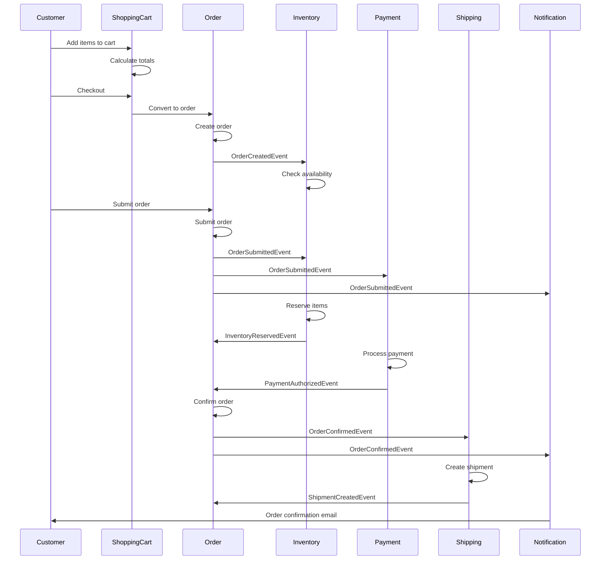
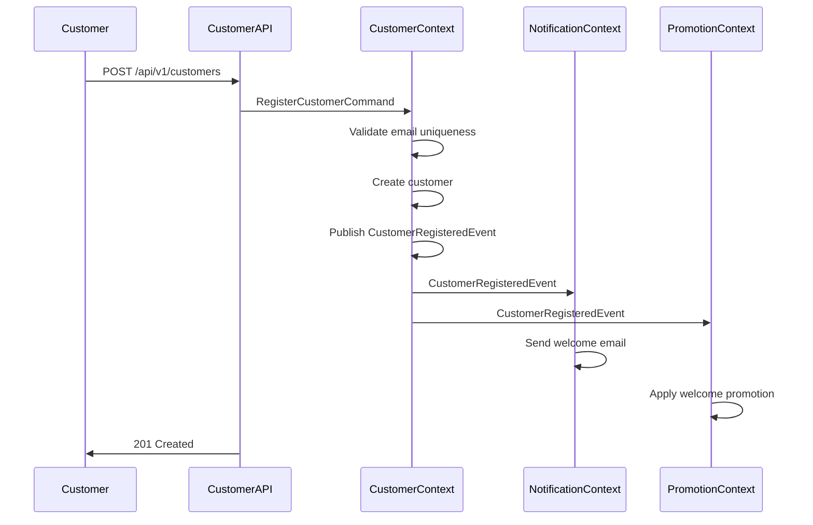
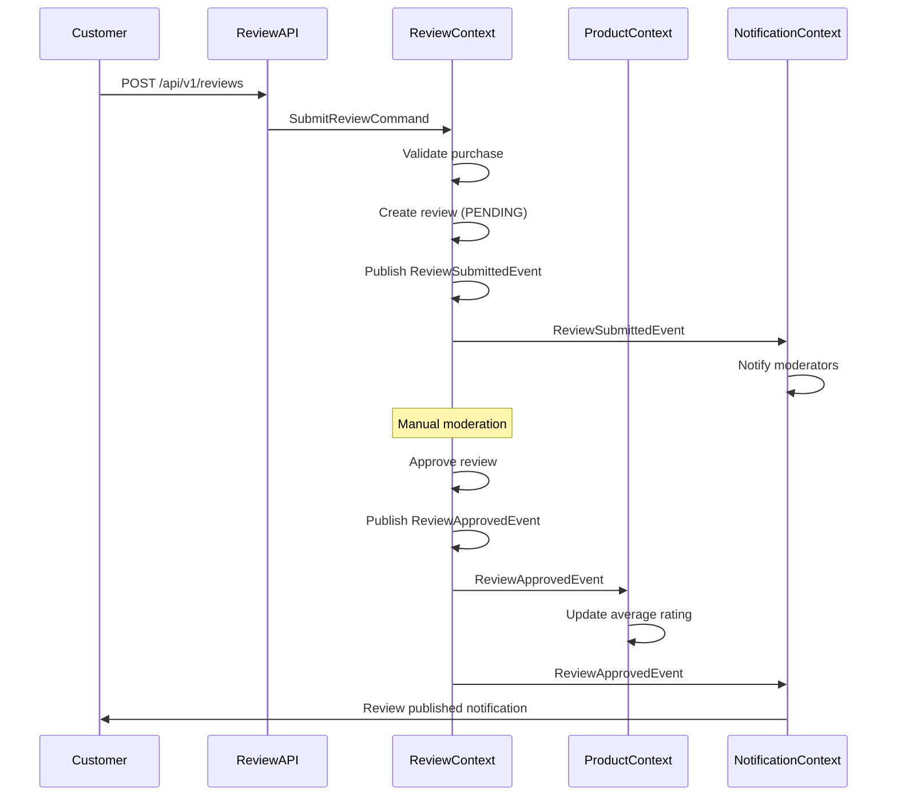
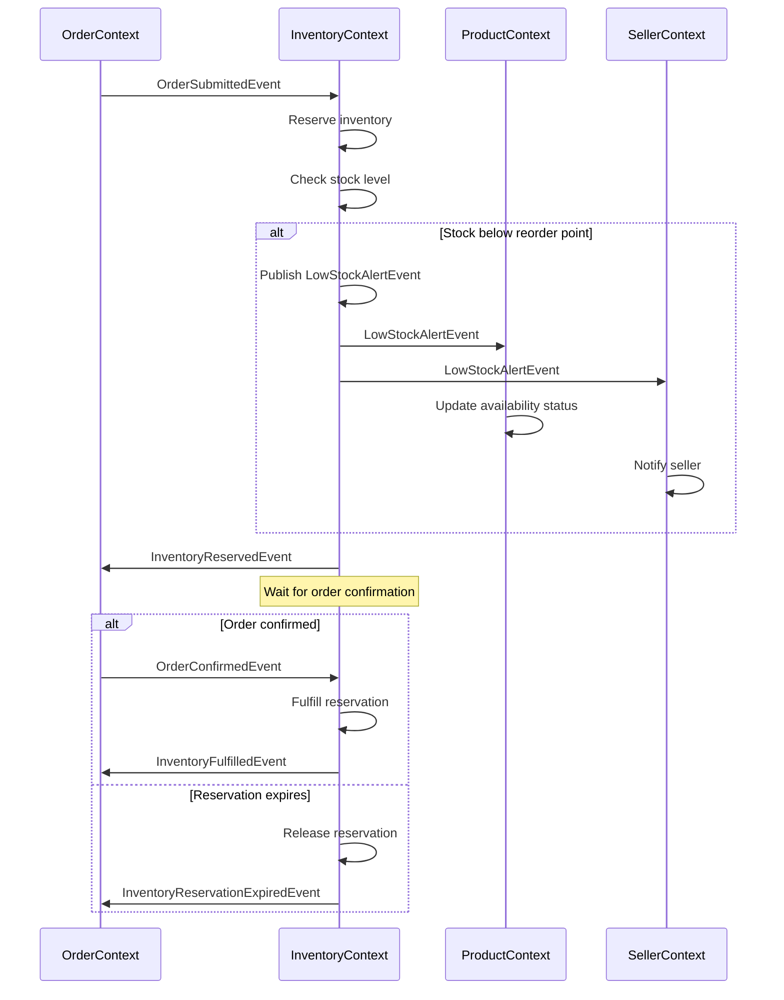

# Data Flow

## Overview

This document describes how data flows through the system, including synchronous and asynchronous patterns, event-driven communication, and data synchronization strategies.

## Data Flow Patterns

### 1. Command-Event Pattern (Write Operations)

The primary pattern for state changes in the system:

```text
User Request → REST API → Command → Application Service → Aggregate → Domain Event → Event Handlers
```

**Flow Steps**:

1. **User Request**: Client sends HTTP request to REST API
2. **Command Creation**: Controller creates command object from request
3. **Application Service**: Orchestrates use case execution
4. **Aggregate**: Executes business logic and collects events
5. **Event Publishing**: Application service publishes collected events
6. **Event Handlers**: Other contexts react to events asynchronously

**Example: Order Submission**

```text
POST /api/v1/orders/{orderId}/submit
    ↓
SubmitOrderCommand
    ↓
OrderApplicationService.submitOrder()
    ↓
Order.submit() → collectEvent(OrderSubmittedEvent)
    ↓
DomainEventApplicationService.publishEventsFromAggregate()
    ↓
OrderSubmittedEvent published to Kafka
    ↓
Event Handlers:

  - InventoryService.reserveItems()
  - PaymentService.processPayment()
  - NotificationService.sendOrderConfirmation()

```

---

### 2. Query Pattern (Read Operations)

Optimized read operations without side effects:

```text
User Request → REST API → Query → Application Service → Repository → Read Model → Response
```

**Flow Steps**:

1. **User Request**: Client sends HTTP GET request
2. **Query Creation**: Controller creates query object
3. **Application Service**: Executes query logic
4. **Repository**: Fetches data from database
5. **Read Model**: Optimized view of data
6. **Response**: DTO returned to client

**Example: Get Customer Orders**

```text
GET /api/v1/customers/{customerId}/orders
    ↓
GetCustomerOrdersQuery
    ↓
OrderApplicationService.getCustomerOrders()
    ↓
OrderRepository.findByCustomerId()
    ↓
OrderResponse DTOs
    ↓
HTTP 200 OK with order list
```

---

### 3. Event-Driven Integration Pattern

Asynchronous communication between bounded contexts:

```text
Context A → Domain Event → Kafka Topic → Context B Event Handler → Context B Aggregate
```

**Flow Steps**:

1. **Event Publication**: Context A publishes domain event
2. **Message Bus**: Event sent to Kafka topic
3. **Event Consumption**: Context B consumes event
4. **Event Handler**: Processes event and updates local state
5. **Idempotency Check**: Prevents duplicate processing
6. **Local Update**: Context B updates its own data

**Example: Inventory Reservation**

```text
Order Context:
  OrderSubmittedEvent published
    ↓
Kafka Topic: order-events
    ↓
Inventory Context:
  OrderSubmittedEventHandler.handle()
    ↓
  Check if already processed (idempotency)
    ↓
  InventoryItem.reserve(quantity)
    ↓
  InventoryReservedEvent published
    ↓
Kafka Topic: inventory-events
    ↓
Order Context:
  InventoryReservedEventHandler.handle()
    ↓
  Order.confirmInventoryReservation()
```

---

## Key Data Flows

### Order Processing Flow

Complete flow from cart to delivery:



**Detailed Steps**:

1. **Cart Management** (Shopping Cart Context)
   - Customer adds items to cart
   - Cart calculates totals with current prices
   - Cart validates item availability

2. **Order Creation** (Order Context)
   - Cart is converted to order
   - Order snapshots product details and prices
   - `OrderCreatedEvent` published

3. **Inventory Check** (Inventory Context)
   - Receives `OrderCreatedEvent`
   - Checks product availability
   - May publish `LowStockAlertEvent`

4. **Order Submission** (Order Context)
   - Customer submits order
   - Order validates business rules
   - `OrderSubmittedEvent` published

5. **Inventory Reservation** (Inventory Context)
   - Receives `OrderSubmittedEvent`
   - Reserves inventory for order
   - `InventoryReservedEvent` published
   - Reservation expires in 15 minutes if not fulfilled

6. **Payment Processing** (Payment Context)
   - Receives `OrderSubmittedEvent`
   - Authorizes payment
   - `PaymentAuthorizedEvent` published

7. **Order Confirmation** (Order Context)
   - Receives `InventoryReservedEvent` and `PaymentAuthorizedEvent`
   - Confirms order
   - `OrderConfirmedEvent` published

8. **Shipment Creation** (Shipping Context)
   - Receives `OrderConfirmedEvent`
   - Creates shipment
   - `ShipmentCreatedEvent` published

9. **Notification** (Notification Context)
   - Receives various events
   - Sends order confirmation email
   - Sends shipping notification

---

### Customer Registration Flow



**Detailed Steps**:

1. **Registration Request**
   - Customer submits registration form
   - API validates input format

2. **Customer Creation** (Customer Context)
   - Validates email uniqueness
   - Creates customer aggregate
   - Hashes password securely
   - `CustomerRegisteredEvent` published

3. **Welcome Email** (Notification Context)
   - Receives `CustomerRegisteredEvent`
   - Sends welcome email with account details
   - Logs notification delivery

4. **Welcome Promotion** (Promotion Context)
   - Receives `CustomerRegisteredEvent`
   - Applies welcome discount
   - Creates coupon code for first purchase

---

### Product Review Flow



**Detailed Steps**:

1. **Review Submission**
   - Customer submits review for purchased product
   - API validates input

2. **Review Creation** (Review Context)
   - Validates customer purchased product
   - Creates review with PENDING status
   - `ReviewSubmittedEvent` published

3. **Moderation Notification** (Notification Context)
   - Receives `ReviewSubmittedEvent`
   - Notifies moderators for review

4. **Review Approval** (Review Context)
   - Moderator approves review
   - Review status changed to APPROVED
   - `ReviewApprovedEvent` published

5. **Rating Update** (Product Context)
   - Receives `ReviewApprovedEvent`
   - Recalculates average rating
   - Updates product rating cache

6. **Customer Notification** (Notification Context)
   - Receives `ReviewApprovedEvent`
   - Notifies customer review is published

---

### Inventory Management Flow



**Detailed Steps**:

1. **Reservation Request**
   - Order context publishes `OrderSubmittedEvent`
   - Inventory context receives event

2. **Inventory Reservation**
   - Checks available quantity
   - Creates reservation record
   - Decrements available quantity
   - `InventoryReservedEvent` published

3. **Low Stock Check**
   - If available < reorder point
   - `LowStockAlertEvent` published
   - Product context updates availability
   - Seller context notifies seller

4. **Reservation Fulfillment**
   - Order confirmed → fulfill reservation
   - Decrements on-hand quantity
   - `InventoryFulfilledEvent` published

5. **Reservation Expiration**
   - If not fulfilled in 15 minutes
   - Release reservation
   - Increments available quantity
   - `InventoryReservationExpiredEvent` published

---

## Data Synchronization Patterns

### 1. Real-Time Synchronization

**Use Case**: Critical data that must be immediately consistent

**Pattern**: Synchronous API calls

**Example**: Payment authorization

```java
@Service
public class OrderApplicationService {
    
    public void submitOrder(SubmitOrderCommand command) {
        Order order = orderRepository.findById(command.orderId());
        
        // Synchronous call to Payment context
        PaymentResult result = paymentService.authorizePayment(
            order.getTotalAmount(),
            command.paymentMethod()
        );
        
        if (result.isSuccess()) {
            order.submit();
            orderRepository.save(order);
        } else {
            throw new PaymentAuthorizationFailedException();
        }
    }
}
```

**Characteristics**:

- Immediate consistency
- Higher latency
- Tight coupling
- Use sparingly

---

### 2. Eventual Consistency

**Use Case**: Non-critical data that can be eventually consistent

**Pattern**: Asynchronous event handling

**Example**: Customer profile updates

```java
@Component
public class CustomerProfileUpdatedEventHandler 
    extends AbstractDomainEventHandler<CustomerProfileUpdatedEvent> {
    
    @Override
    @Transactional
    public void handle(CustomerProfileUpdatedEvent event) {
        // Update local cache of customer information
        customerCache.update(
            event.customerId(),
            event.customerName(),
            event.email()
        );
    }
}
```

**Characteristics**:

- Eventual consistency (seconds to minutes)
- Lower latency
- Loose coupling
- Preferred pattern

---

### 3. Snapshot Pattern

**Use Case**: Historical data that should not change

**Pattern**: Copy data at point in time

**Example**: Order items with product details

```java
@Entity
public class OrderItem {
    @Id
    private String id;
    
    // Reference to Product context
    private String productId;
    
    // Snapshot of product details at order time
    private String productName;
    private String productDescription;
    private Money unitPrice;
    
    // These values never change after order creation
}
```

**Characteristics**:

- Point-in-time consistency
- No synchronization needed
- Immune to source changes
- Use for audit trail

---

### 4. Cache-Aside Pattern

**Use Case**: Frequently read, rarely updated data

**Pattern**: Cache with lazy loading

**Example**: Product catalog caching

```java
@Service
public class ProductCacheService {
    
    @Cacheable(value = "products", key = "#productId")
    public ProductSummary getProduct(String productId) {
        // Cache miss - fetch from Product context
        return productClient.getProduct(productId);
    }
    
    @CacheEvict(value = "products", key = "#event.productId")
    @EventListener
    public void handleProductUpdated(ProductUpdatedEvent event) {
        // Invalidate cache on product update
    }
}
```

**Characteristics**:

- Fast reads from cache
- Eventual consistency
- Cache invalidation via events
- Reduces cross-context calls

---

## Event Flow Architecture

### Event Publication

```text
Aggregate → collectEvent() → Application Service → publishEventsFromAggregate() → 
Event Publisher → Kafka Producer → Kafka Topic
```

### Event Consumption

```text
Kafka Topic → Kafka Consumer → Event Listener → Event Handler → 
Idempotency Check → Business Logic → Local State Update
```

### Event Ordering

Events are ordered by:

1. **Timestamp**: `occurredOn` field in event
2. **Version**: Aggregate version number
3. **Sequence**: Kafka partition ordering

### Event Idempotency

All event handlers must be idempotent:

```java
@Component
public class OrderSubmittedEventHandler {
    
    @Transactional
    public void handle(OrderSubmittedEvent event) {
        // 1. Check if already processed
        if (processedEventRepository.existsByEventId(event.getEventId())) {
            return; // Already processed, skip
        }
        
        // 2. Process event
        inventoryService.reserveItems(event.orderId(), event.items());
        
        // 3. Mark as processed
        processedEventRepository.save(
            new ProcessedEvent(event.getEventId(), Instant.now())
        );
    }
}
```

---

## Data Flow Optimization

### 1. Batch Processing

For high-volume events:

```java
@Component
public class BatchEventProcessor {
    
    @Scheduled(fixedRate = 5000) // Every 5 seconds
    public void processBatch() {
        List<DomainEvent> events = eventQueue.pollBatch(100);
        
        // Process events in batch
        events.stream()
            .collect(Collectors.groupingBy(DomainEvent::getEventType))
            .forEach(this::processBatchByType);
    }
}
```

### 2. Parallel Processing

For independent events:

```java
@Component
public class ParallelEventProcessor {
    
    @Async("eventExecutor")
    public CompletableFuture<Void> processEvent(DomainEvent event) {
        eventHandler.handle(event);
        return CompletableFuture.completedFuture(null);
    }
}
```

### 3. Circuit Breaker

For resilient event handling:

```java
@Component
public class ResilientEventHandler {
    
    @CircuitBreaker(name = "eventProcessing", fallbackMethod = "fallback")
    @Retry(name = "eventProcessing", maxAttempts = 3)
    public void handle(DomainEvent event) {
        // Process event with circuit breaker protection
    }
    
    public void fallback(DomainEvent event, Exception ex) {
        // Send to dead letter queue
        deadLetterService.send(event, ex);
    }
}
```

---

## Data Flow Monitoring

### Key Metrics

- **Event Lag**: Time between event publication and consumption
- **Processing Time**: Time to process each event
- **Error Rate**: Percentage of failed event processing
- **Throughput**: Events processed per second
- **Queue Depth**: Number of pending events

### Monitoring Tools

- **Kafka Metrics**: Consumer lag, partition offset
- **Application Metrics**: Processing time, error count
- **Distributed Tracing**: X-Ray for end-to-end flow
- **Dashboards**: CloudWatch, Grafana

---

## Related Documentation

- [Information Viewpoint Overview](overview.md)
- [Domain Models](domain-models.md)
- [Data Ownership](data-ownership.md)
- [Domain Events Catalog](../../api/events/README.md)
- [Concurrency Viewpoint](../concurrency/overview.md)

### Diagrams

- [Order Processing Flow](../../diagrams/generated/information/order-processing-flow.png)
- [Event-Driven Data Sync](../../diagrams/generated/information/event-data-sync.png)
- [Customer Registration Flow](../../diagrams/generated/information/customer-registration-flow.png)

---

**Document Status**: Active  
**Last Review**: 2025-10-23  
**Next Review**: 2026-01-23  
**Owner**: Architecture Team
