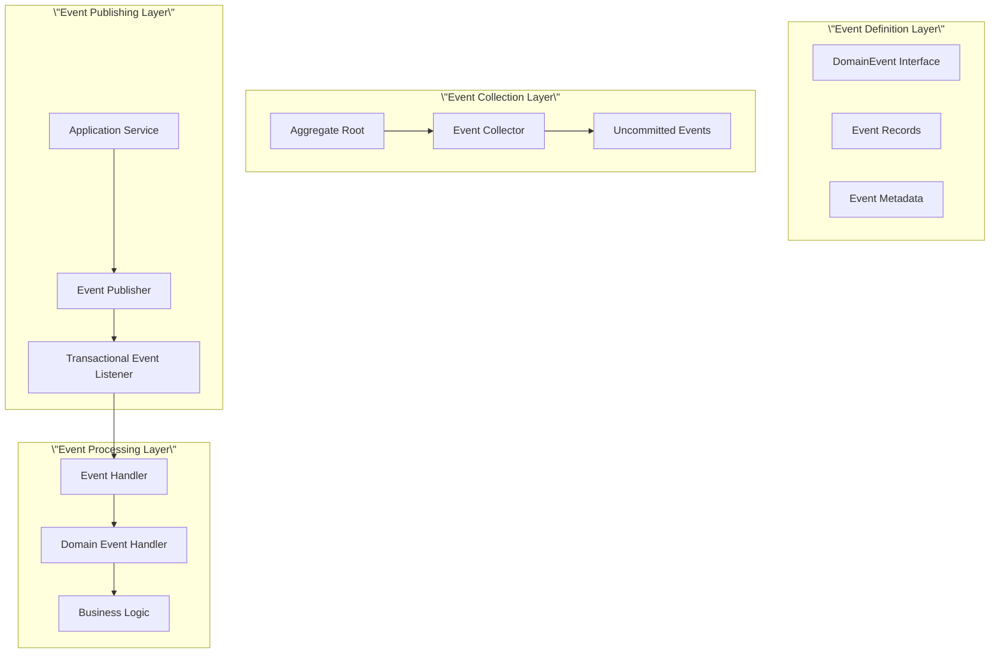

# Domain Events Design and Implementation

## Overview

This project implements a complete domain event system with 40+ domain events covering all 13 bounded contexts. Domain events are implemented using Records following immutability principles and enable decoupled communication between contexts through event-driven architecture.

## Domain Event Architecture

### Event Design Pattern



## Event Implementation Standards

### 1. Event Definition (Record Pattern)

All domain events are implemented using Java Records to ensure immutability:

```java
public record CustomerCreatedEvent(
    CustomerId customerId,
    CustomerName customerName,
    Email email,
    MembershipLevel membershipLevel,
    UUID eventId,
    LocalDateTime occurredOn
) implements DomainEvent {
    
    /**
     * Factory method with automatic eventId and occurredOn generation
     */
    public static CustomerCreatedEvent create(
        CustomerId customerId, 
        CustomerName customerName, 
        Email email,
        MembershipLevel membershipLevel
    ) {
        DomainEvent.EventMetadata metadata = DomainEvent.createEventMetadata();
        return new CustomerCreatedEvent(
            customerId, customerName, email, membershipLevel,
            metadata.eventId(), metadata.occurredOn()
        );
    }
    
    @Override
    public String getEventType() {
        return DomainEvent.getEventTypeFromClass(this.getClass());
    }
    
    @Override
    public String getAggregateId() { 
        return customerId.getValue(); 
    }
}
```

### 2. Event Collection Mechanism

Aggregate roots collect events through `AggregateRootInterface`:

```java
@AggregateRoot(name = \"Customer\", boundedContext = \"Customer\", version = \"2.0\")
public class Customer implements AggregateRootInterface {
    
    public void updateProfile(CustomerName newName, Email newEmail, Phone newPhone) {
        // 1. Execute business logic
        validateProfileUpdate(newName, newEmail, newPhone);
        
        // 2. Update state
        this.name = newName;
        this.email = newEmail;
        this.phone = newPhone;
        
        // 3. Collect domain event
        collectEvent(CustomerProfileUpdatedEvent.create(this.id, newName, newEmail, newPhone));
    }
}
```

### 3. Event Publishing Flow

Application services are responsible for publishing events collected by aggregate roots:

```java
@Service
@Transactional
public class CustomerApplicationService {
    
    public void updateCustomerProfile(UpdateProfileCommand command) {
        // 1. Load aggregate root
        Customer customer = customerRepository.findById(command.customerId())
            .orElseThrow(() -> new CustomerNotFoundException(command.customerId()));
        
        // 2. Execute business operation (events are collected)
        customer.updateProfile(command.name(), command.email(), command.phone());
        
        // 3. Save aggregate root
        customerRepository.save(customer);
        
        // 4. Publish collected events
        domainEventService.publishEventsFromAggregate(customer);
    }
}
```

## Event Classification and Statistics

### Classification by Bounded Context

| Bounded Context | Event Count | Main Event Types |
|----------------|-------------|------------------|
| Customer | 9 | CustomerCreated, CustomerProfileUpdated, MembershipLevelUpgraded |
| Order | 5 | OrderCreated, OrderSubmitted, OrderConfirmed |
| Product | 5 | ProductCreated, ProductPriceChanged, ProductActivated |
| Inventory | 3 | InventoryCreated, StockReserved, StockAdded |
| Payment | 2 | PaymentProcessed, PaymentFailed |
| Review | 5 | ReviewCreated, ReviewApproved, ReviewRejected |
| ShoppingCart | 6 | CartCreated, CartItemAdded, CartItemRemoved |
| Delivery | 3 | DeliveryCreated, DeliveryStatusChanged, DeliveryCompleted |
| Notification | 2 | NotificationSent, NotificationDelivered |
| Others | 5+ | Various business events |

### Event Type Classification

#### 1. Lifecycle Events
- **Created Events**: Published when aggregate root is created
- **Updated Events**: Published when aggregate root state changes
- **Deleted Events**: Published when aggregate root is deleted

#### 2. State Transition Events
- **Status Changed Events**: Published during state machine transitions
- **Workflow Events**: Published when workflow steps are completed

#### 3. Business Rule Events
- **Validation Events**: Published during business rule validation
- **Calculation Events**: Published when calculations are completed

## Major Domain Events Details

### Customer Context Events

```java
// Customer creation event
public record CustomerCreatedEvent(
    CustomerId customerId,
    CustomerName customerName,
    Email email,
    MembershipLevel membershipLevel,
    UUID eventId,
    LocalDateTime occurredOn
) implements DomainEvent { }

// Customer profile update event
public record CustomerProfileUpdatedEvent(
    CustomerId customerId,
    CustomerName newName,
    Email newEmail,
    Phone newPhone,
    UUID eventId,
    LocalDateTime occurredOn
) implements DomainEvent { }

// Membership level upgrade event
public record MembershipLevelUpgradedEvent(
    CustomerId customerId,
    MembershipLevel oldLevel,
    MembershipLevel newLevel,
    UUID eventId,
    LocalDateTime occurredOn
) implements DomainEvent { }

// Reward points related events
public record RewardPointsEarnedEvent(
    CustomerId customerId,
    int pointsEarned,
    String reason,
    UUID eventId,
    LocalDateTime occurredOn
) implements DomainEvent { }

public record RewardPointsRedeemedEvent(
    CustomerId customerId,
    int pointsRedeemed,
    String reason,
    UUID eventId,
    LocalDateTime occurredOn
) implements DomainEvent { }
```

### Order Context Events

```java
// Order creation event
public record OrderCreatedEvent(
    OrderId orderId,
    CustomerId customerId,
    List<String> items,
    UUID eventId,
    LocalDateTime occurredOn
) implements DomainEvent { }

// Order submission event
public record OrderSubmittedEvent(
    OrderId orderId,
    CustomerId customerId,
    Money totalAmount,
    int itemCount,
    UUID eventId,
    LocalDateTime occurredOn
) implements DomainEvent { }

// Order confirmation event
public record OrderConfirmedEvent(
    OrderId orderId,
    CustomerId customerId,
    OrderStatus status,
    Money totalAmount,
    UUID eventId,
    LocalDateTime occurredOn
) implements DomainEvent { }

// Inventory reservation request event
public record OrderInventoryReservationRequestedEvent(
    OrderId orderId,
    CustomerId customerId,
    List<OrderItem> items,
    UUID eventId,
    LocalDateTime occurredOn
) implements DomainEvent { }

// Payment request event
public record OrderPaymentRequestedEvent(
    OrderId orderId,
    CustomerId customerId,
    PaymentMethodId paymentMethodId,
    Money paymentAmount,
    UUID eventId,
    LocalDateTime occurredOn
) implements DomainEvent { }
```

### Product Context Events

```java
// Product creation event
public record ProductCreatedEvent(
    ProductId productId,
    ProductName productName,
    ProductCategory category,
    Money price,
    UUID eventId,
    LocalDateTime occurredOn
) implements DomainEvent { }

// Product price change event
public record ProductPriceChangedEvent(
    ProductId productId,
    Money oldPrice,
    Money newPrice,
    UUID eventId,
    LocalDateTime occurredOn
) implements DomainEvent { }

// Product stock update event
public record ProductStockUpdatedEvent(
    ProductId productId,
    int oldQuantity,
    int newQuantity,
    UUID eventId,
    LocalDateTime occurredOn
) implements DomainEvent { }
```

### Inventory Context Events

```java
// Inventory creation event
public record InventoryCreatedEvent(
    ProductId productId,
    int initialQuantity,
    UUID eventId,
    LocalDateTime occurredOn
) implements DomainEvent { }

// Stock reservation event
public record StockReservedEvent(
    ProductId productId,
    OrderId orderId,
    int reservedQuantity,
    int remainingQuantity,
    UUID eventId,
    LocalDateTime occurredOn
) implements DomainEvent { }

// Stock addition event
public record StockAddedEvent(
    ProductId productId,
    int addedQuantity,
    int newTotalQuantity,
    UUID eventId,
    LocalDateTime occurredOn
) implements DomainEvent { }
```

### Review Context Events

```java
// Review creation event
public record ReviewCreatedEvent(
    ReviewId reviewId,
    ProductId productId,
    CustomerId customerId,
    ReviewRating rating,
    UUID eventId,
    LocalDateTime occurredOn
) implements DomainEvent { }

// Review approval event
public record ReviewApprovedEvent(
    ReviewId reviewId,
    ProductId productId,
    CustomerId reviewerId,
    UUID eventId,
    LocalDateTime occurredOn
) implements DomainEvent { }

// Review rejection event
public record ReviewRejectedEvent(
    ReviewId reviewId,
    ProductId productId,
    CustomerId reviewerId,
    String reason,
    UUID eventId,
    LocalDateTime occurredOn
) implements DomainEvent { }
```

### ShoppingCart Context Events

```java
// Shopping cart creation event
public record CartCreatedEvent(
    CartId cartId,
    CustomerId customerId,
    UUID eventId,
    LocalDateTime occurredOn
) implements DomainEvent { }

// Cart item addition event
public record CartItemAddedEvent(
    CartId cartId,
    CustomerId customerId,
    ProductId productId,
    int quantity,
    Money unitPrice,
    UUID eventId,
    LocalDateTime occurredOn
) implements DomainEvent { }

// Cart item quantity update event
public record CartItemQuantityUpdatedEvent(
    CartId cartId,
    CustomerId customerId,
    ProductId productId,
    int oldQuantity,
    int newQuantity,
    Money unitPrice,
    UUID eventId,
    LocalDateTime occurredOn
) implements DomainEvent { }
```

## Event Processing Mechanism

### 1. Event Handler Base Class

```java
@Component
public abstract class AbstractDomainEventHandler<T extends DomainEvent> 
    implements DomainEventHandler<T> {
    
    @Override
    @TransactionalEventListener(phase = TransactionPhase.AFTER_COMMIT)
    public void handle(T event) {
        // Implement idempotency check
        if (isEventAlreadyProcessed(event.getEventId())) {
            return;
        }
        
        try {
            // Execute business logic
            handleEvent(event);
            
            // Mark event as processed
            markEventAsProcessed(event.getEventId());
            
        } catch (Exception e) {
            logger.error(\"Event processing failed: {}\", event, e);
            throw new DomainEventProcessingException(\"Event processing failed\", e);
        }
    }
    
    protected abstract void handleEvent(T event);
    protected abstract Class<T> getSupportedEventType();
}
```

### 2. Concrete Event Handler Example

```java
@Component
public class CustomerCreatedEventHandler extends AbstractDomainEventHandler<CustomerCreatedEvent> {
    
    private final EmailService emailService;
    private final CustomerStatsService customerStatsService;
    
    @Override
    protected void handleEvent(CustomerCreatedEvent event) {
        // Send welcome email
        emailService.sendWelcomeEmail(event.email(), event.customerName());
        
        // Create customer statistics record
        customerStatsService.createStatsRecord(event.customerId());
        
        // Initialize customer preference settings
        customerPreferencesService.initializeDefaultPreferences(event.customerId());
    }
    
    @Override
    protected Class<CustomerCreatedEvent> getSupportedEventType() {
        return CustomerCreatedEvent.class;
    }
}
```

### 3. Cross-Context Event Processing

```java
@Component
public class OrderCreatedEventHandler extends AbstractDomainEventHandler<OrderCreatedEvent> {
    
    @Override
    protected void handleEvent(OrderCreatedEvent event) {
        // Reserve inventory
        inventoryService.reserveStock(event.orderId(), event.items());
        
        // Update customer statistics
        customerStatsService.updateOrderCount(event.customerId());
        
        // Send order confirmation notification
        notificationService.sendOrderConfirmation(event);
    }
}
```

## Event Publishing Strategy

### 1. Transactional Event Publishing

```java
@Component
public class TransactionalDomainEventPublisher implements DomainEventPublisher {
    
    @Override
    @Transactional
    public void publish(DomainEvent event) {
        // Publish event within transaction
        applicationEventPublisher.publishEvent(
            new DomainEventWrapper(event)
        );
    }
    
    @Override
    @Transactional
    public void publishAll(List<DomainEvent> events) {
        events.forEach(this::publish);
    }
}
```

### 2. Event Publishing Adapter

```java
@Component
public class DomainEventPublisherAdapter implements DomainEventPublisher {
    
    private final ApplicationEventPublisher eventPublisher;
    
    @Override
    public void publish(DomainEvent event) {
        // Wrap domain event as Spring application event
        DomainEventWrapper wrapper = new DomainEventWrapper(event);
        eventPublisher.publishEvent(wrapper);
    }
    
    public static class DomainEventWrapper {
        private final DomainEvent source;
        
        public DomainEventWrapper(DomainEvent source) {
            this.source = source;
        }
        
        public DomainEvent getSource() {
            return source;
        }
    }
}
```

## Event Monitoring and Observability

### 1. Event Metrics Collection

```java
@Component
public class DomainEventMetrics {
    
    private final MeterRegistry meterRegistry;
    
    @TransactionalEventListener
    public void recordEventPublished(DomainEventWrapper wrapper) {
        DomainEvent event = wrapper.getSource();
        
        Counter.builder(\"domain.events.published\")
            .tag(\"event.type\", event.getEventType())
            .tag(\"aggregate.type\", getAggregateType(event))
            .register(meterRegistry)
            .increment();
    }
    
    @TransactionalEventListener
    public void recordEventProcessed(DomainEventProcessedEvent event) {
        Timer.builder(\"domain.events.processing.time\")
            .tag(\"event.type\", event.getEventType())
            .tag(\"handler\", event.getHandlerName())
            .register(meterRegistry)
            .record(event.getProcessingTime(), TimeUnit.MILLISECONDS);
    }
}
```

### 2. Event Tracing

```java
@Component
public class EventTracingHandler {
    
    @TransactionalEventListener
    public void trace(DomainEventWrapper wrapper) {
        DomainEvent event = wrapper.getSource();
        
        Span span = tracer.nextSpan()
            .name(\"domain-event-processing\")
            .tag(\"event.type\", event.getEventType())
            .tag(\"event.id\", event.getEventId().toString())
            .tag(\"aggregate.id\", event.getAggregateId())
            .start();
            
        try (Tracer.SpanInScope ws = tracer.withSpanInScope(span)) {
            // Event processing is traced
        } finally {
            span.end();
        }
    }
}
```

## Event Version Management

### 1. Event Version Evolution

```java
// V1 version event
public record CustomerCreatedEventV1(
    CustomerId customerId,
    CustomerName customerName,
    Email email,
    UUID eventId,
    LocalDateTime occurredOn
) implements DomainEvent { }

// V2 version event - backward compatible
public record CustomerCreatedEvent(
    CustomerId customerId,
    CustomerName customerName,
    Email email,
    MembershipLevel membershipLevel, // New field
    Optional<LocalDate> birthDate,   // Optional field
    UUID eventId,
    LocalDateTime occurredOn
) implements DomainEvent {
    
    // Backward compatible factory method
    public static CustomerCreatedEvent fromV1(CustomerCreatedEventV1 v1Event) {
        return new CustomerCreatedEvent(
            v1Event.customerId(),
            v1Event.customerName(),
            v1Event.email(),
            MembershipLevel.STANDARD, // Default value
            Optional.empty(),         // Default value
            v1Event.eventId(),
            v1Event.occurredOn()
        );
    }
}
```

### 2. Event Upcasting

```java
@Component
public class EventUpcaster {
    
    public DomainEvent upcast(StoredEvent storedEvent) {
        return switch (storedEvent.eventType()) {
            case \"CustomerCreated\" -> upcastCustomerCreatedEvent(storedEvent);
            default -> deserializeEvent(storedEvent);
        };
    }
    
    private CustomerCreatedEvent upcastCustomerCreatedEvent(StoredEvent storedEvent) {
        // Handle version upgrade logic
        JsonNode eventData = parseJson(storedEvent.eventData());
        
        if (!eventData.has(\"membershipLevel\")) {
            // Upgrade V1 event to V2
            return CustomerCreatedEvent.fromV1(
                deserializeAsV1(storedEvent)
            );
        }
        
        return deserializeAsV2(storedEvent);
    }
}
```

## Error Handling and Retry

### 1. Retry Mechanism

```java
@Component
public class ResilientEventHandler extends AbstractDomainEventHandler<CustomerCreatedEvent> {
    
    @Retryable(
        value = {TransientException.class},
        maxAttempts = 3,
        backoff = @Backoff(delay = 1000, multiplier = 2)
    )
    @Override
    protected void handleEvent(CustomerCreatedEvent event) {
        // Event processing logic with retry support
    }
    
    @Recover
    public void recover(TransientException ex, CustomerCreatedEvent event) {
        // Handle final failure after all retries
        deadLetterService.send(event, ex);
    }
}
```

### 2. Dead Letter Queue

```java
@Component
public class DeadLetterService {
    
    public void send(DomainEvent event, Exception cause) {
        DeadLetterEvent deadLetter = new DeadLetterEvent(
            event.getEventId(),
            event.getClass().getSimpleName(),
            serializeEvent(event),
            cause.getMessage(),
            Instant.now()
        );
        
        deadLetterRepository.save(deadLetter);
        
        // Optional: Send to external dead letter queue
        messageQueue.send(\"dead-letter-queue\", deadLetter);
    }
}
```

## Testing Strategy

### 1. Event Collection Testing

```java
@Test
void should_collect_customer_created_event_when_customer_is_created() {
    // Given
    CustomerId customerId = CustomerId.generate();
    CustomerName name = new CustomerName(\"John Doe\");
    Email email = new Email(\"john@example.com\");
    
    // When
    Customer customer = new Customer(customerId, name, email, MembershipLevel.STANDARD);
    
    // Then
    assertThat(customer.hasUncommittedEvents()).isTrue();
    List<DomainEvent> events = customer.getUncommittedEvents();
    assertThat(events).hasSize(1);
    assertThat(events.get(0)).isInstanceOf(CustomerCreatedEvent.class);
    
    CustomerCreatedEvent event = (CustomerCreatedEvent) events.get(0);
    assertThat(event.customerId()).isEqualTo(customerId);
    assertThat(event.customerName()).isEqualTo(name);
    assertThat(event.email()).isEqualTo(email);
}
```

### 2. Event Processing Testing

```java
@Test
void should_send_welcome_email_when_customer_created() {
    // Given
    CustomerCreatedEvent event = CustomerCreatedEvent.create(
        CustomerId.of(\"CUST-001\"),
        new CustomerName(\"John Doe\"),
        new Email(\"john@example.com\"),
        MembershipLevel.STANDARD
    );
    
    // When
    customerCreatedEventHandler.handle(event);
    
    // Then
    verify(emailService).sendWelcomeEmail(event.email(), event.customerName());
    verify(customerStatsService).createStatsRecord(event.customerId());
}
```

## Related Diagrams

- [Event Storming Big Picture](../../diagrams/viewpoints/functional/event-storming-big-picture.puml)
- [Event Storming Process Level](../../diagrams/viewpoints/functional/event-storming-process-level.puml)
- [Domain Events Flow Diagram](../../diagrams/viewpoints/functional/domain-events-flow.puml)

## Event-Driven Architecture Diagram

```mermaid
graph LR
    subgraph Domain Events [\"Domain Events\"]
        OCE[OrderCreatedEvent]
        OIAE[OrderItemAddedEvent]
        PRE[PaymentRequestedEvent]
        PFE[PaymentFailedEvent]
    end
    
    subgraph Event Processing [\"Event Processing\"]
        EP[DomainEventPublisherService]
        EB[DomainEventBus]
        OS[OrderProcessingSaga]
    end
    
    subgraph Event Listeners [\"Event Listeners\"]
        PS[PaymentService]
        LS[LogisticsService]
    end
    
    AGG[Order<br>Aggregate Root] -->|Generates| OCE
    AGG -->|Generates| OIAE
    OCE -->|Publishes to| EP
    OIAE -->|Publishes to| EP
    EP -->|Sends to| EB
    EB -->|Distributes| OS
    EB -->|Distributes| PS
    EB -->|Distributes| LS
    OS -->|Coordinates| PS
    OS -->|Coordinates| LS
    PS -->|Generates| PRE
    PS -->|Generates| PFE
    PRE -->|Publishes to| EP
    PFE -->|Publishes to| EP
    
    classDef event fill:#ffcc99,stroke:#333,stroke-width:2px
    classDef publisher fill:#99ccff,stroke:#333,stroke-width:2px
    classDef handler fill:#cc99ff,stroke:#333,stroke-width:2px
    classDef aggregateRoot fill:#bbf,stroke:#333,stroke-width:2px
    
    class OCE,OIAE,PRE,PFE event
    class EP,EB publisher
    class OS,PS,LS handler
    class AGG aggregateRoot
```

- [Application Services Overview Diagram](../../diagrams/viewpoints/functional/application-services-overview.puml)

## Relationships with Other Viewpoints

- **[Functional Viewpoint](../functional/README.md)**: Aggregate root design and business logic
- **[Concurrency Viewpoint](../concurrency/README.md)**: Asynchronous event processing and transaction boundaries
- **[Operational Viewpoint](../operational/README.md)**: Event monitoring and observability

## Best Practices Summary

1. **Immutability**: Use Records to ensure event immutability
2. **Semantics**: Event names use past tense, clearly expressing business facts that have occurred
3. **Completeness**: Events contain all information needed for processing
4. **Idempotency**: Event handlers must support repeated processing
5. **Traceability**: Each event has a unique ID and timestamp
6. **Version Management**: Support backward-compatible evolution of event structures
7. **Monitoring**: Complete monitoring of event publishing and processing
8. **Error Handling**: Comprehensive retry and dead letter mechanisms

This domain event system provides the project with powerful decoupling capabilities and extensibility, supporting complex business processes and cross-context collaboration.
