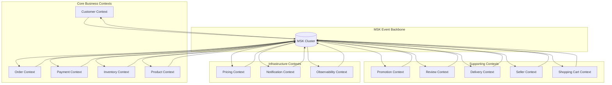

# MSK Data Flow Architecture

**Document Version**: 2.0  
**Last Updated**: September 24, 2025 10:15 PM (Taipei Time)  
**Responsible Team**: Architects + Data Engineering Team

## 📋 Overview

This document details the MSK (Amazon Managed Streaming for Apache Kafka) data flow architecture in the GenAI Demo application, including event-driven data governance, data lineage tracking across 13 bounded contexts, and event architecture patterns.

## 🎯 MSK Data Flow Architecture Goals

### Business Goals
- **Zero Data Loss**: Ensure zero data loss in high-throughput scenarios (>10K events/sec)
- **Complete Data Lineage**: End-to-end data tracking across 13 bounded contexts
- **Real-time Monitoring**: <100ms anomaly detection and automatic alerts
- **Compliance Auditing**: Complete audit trail for financial transactions and customer data processing

### Technical Goals
- **High Availability**: 99.9% system availability
- **Low Latency**: 95th percentile < 100ms event processing latency
- **High Throughput**: Support >10,000 events/second peak load
- **Auto Scaling**: Automatic scaling capability for 10x traffic growth

## 🏗️ MSK Cluster Architecture

### Cluster Topology Design

```
┌─────────────────────────────────────────────────────────────┐
│                    MSK Cluster (Multi-AZ)                  │
├─────────────────────────────────────────────────────────────┤
│  AZ-1a          │  AZ-1b          │  AZ-1c                │
│  ┌─────────────┐ │ ┌─────────────┐ │ ┌─────────────┐       │
│  │   Broker-1  │ │ │   Broker-2  │ │ │   Broker-3  │       │
│  │   Leader    │ │ │   Follower  │ │ │   Follower  │       │
│  │   m5.large  │ │ │   m5.large  │ │ │   m5.large  │       │
│  └─────────────┘ │ └─────────────┘ │ └─────────────┘       │
└─────────────────────────────────────────────────────────────┘
```

### Technical Specifications
- **Instance Type**: m5.large (2 vCPU, 8 GB RAM)
- **Storage**: 100 GB EBS gp3 per broker
- **Network**: Enhanced networking enabled
- **Encryption**: In-transit (TLS 1.2) and at-rest (KMS) encryption
- **Monitoring**: CloudWatch + JMX + Prometheus integration

## 📊 Event-Driven Data Governance

### Data Classification Architecture

#### 1. Business Events
```yaml
Topics:
  - business-events-orders      # Order lifecycle events
  - business-events-customers   # Customer management events  
  - business-events-payments    # Payment processing events
  - business-events-inventory   # Inventory management events
  - business-events-products    # Product catalog events
  - business-events-promotions  # Promotional activity events
  - business-events-reviews     # Review and rating events
  - business-events-delivery    # Delivery tracking events
  - business-events-sellers     # Seller management events
  - business-events-shopping    # Shopping cart events
  - business-events-pricing     # Pricing strategy events
  - business-events-notifications # Notification service events
  - business-events-observability # Observability events

Partitioning Strategy:
  - Key: aggregateId (Customer ID, Order ID, etc.)
  - Partitions: 12 per topic (support high concurrency)
  - Replication Factor: 3 (cross-AZ replication)
```

#### 2. System Events
```yaml
Topics:
  - system-events-infrastructure  # Infrastructure events
  - system-events-deployment     # Deployment and configuration events
  - system-events-monitoring     # Monitoring and alert events
  - system-events-security       # Security and audit events

Configuration:
  - Retention: 7 days (compliance requirement)
  - Compression: gzip (save storage)
  - Cleanup Policy: delete
```

#### 3. Error Events
```yaml
Topics:
  - error-events-application     # Application errors
  - error-events-infrastructure  # Infrastructure errors
  - error-events-dlq            # Dead Letter Queue

Error Handling:
  - Max Retries: 3
  - Backoff Strategy: Exponential (1s, 2s, 4s)
  - DLQ Routing: Automatic after max retries
```

### Event Schema Registry

#### Schema Version Management Strategy
```json
{
  "schemaRegistry": {
    "type": "JSON Schema",
    "versioningStrategy": "backward_compatible",
    "evolutionRules": {
      "addField": "allowed_with_default",
      "removeField": "deprecated_first",
      "changeType": "not_allowed",
      "renameField": "alias_supported"
    }
  }
}
```

#### Standard Event Schema
```json
{
  "$schema": "http://json-schema.org/draft-07/schema#",
  "title": "DomainEvent",
  "type": "object",
  "required": ["eventId", "eventType", "aggregateId", "occurredOn", "version"],
  "properties": {
    "eventId": {
      "type": "string",
      "format": "uuid",
      "description": "Unique event identifier"
    },
    "eventType": {
      "type": "string",
      "pattern": "^[A-Z][a-zA-Z]*Event$",
      "description": "Event type following naming convention"
    },
    "aggregateId": {
      "type": "string",
      "description": "Aggregate root identifier"
    },
    "aggregateType": {
      "type": "string",
      "description": "Type of aggregate root"
    },
    "occurredOn": {
      "type": "string",
      "format": "date-time",
      "description": "Event occurrence timestamp"
    },
    "version": {
      "type": "integer",
      "minimum": 1,
      "description": "Event schema version"
    },
    "payload": {
      "type": "object",
      "description": "Event-specific data"
    },
    "metadata": {
      "type": "object",
      "properties": {
        "correlationId": {"type": "string"},
        "causationId": {"type": "string"},
        "userId": {"type": "string"},
        "traceId": {"type": "string"}
      }
    }
  }
}
```

## 🔄 Data Lineage Tracking Across 13 Bounded Contexts

### Bounded Context Mapping



### Data Lineage Tracking Implementation

#### 1. Event Correlation ID Strategy
```java
public class EventCorrelation {
    private final String correlationId;    // Business process ID
    private final String causationId;      // Triggering event ID
    private final String traceId;          // X-Ray trace ID
    private final String sessionId;       // User session ID
    
    // Lineage tracking method
    public EventLineage buildLineage() {
        return EventLineage.builder()
            .correlationId(correlationId)
            .causationId(causationId)
            .traceId(traceId)
            .sessionId(sessionId)
            .build();
    }
}
```

#### 2. Cross-Context Event Flow Example
```
Order Created Event Flow:
┌─────────────┐    ┌─────────────┐    ┌─────────────┐    ┌─────────────┐
│   Customer  │───▶│    Order    │───▶│  Inventory  │───▶│   Payment   │
│   Context   │    │   Context   │    │   Context   │    │   Context   │
└─────────────┘    └─────────────┘    └─────────────┘    └─────────────┘
       │                   │                   │                   │
       ▼                   ▼                   ▼                   ▼
┌─────────────────────────────────────────────────────────────────────┐
│                        MSK Event Backbone                          │
│  CustomerValidated  →  OrderCreated  →  InventoryReserved  →      │
│                                                PaymentProcessed    │
└─────────────────────────────────────────────────────────────────────┘
       │                   │                   │                   │
       ▼                   ▼                   ▼                   ▼
┌─────────────┐    ┌─────────────┐    ┌─────────────┐    ┌─────────────┐
│Notification │    │   Delivery  │    │   Pricing   │    │Observability│
│   Context   │    │   Context   │    │   Context   │    │   Context   │
└─────────────┘    └─────────────┘    └─────────────┘    └─────────────┘
```

#### 3. Lineage Tracking Query API
```java
@RestController
@RequestMapping("/api/v1/data-lineage")
public class DataLineageController {
    
    @GetMapping("/trace/{correlationId}")
    public EventLineageResponse traceEventFlow(@PathVariable String correlationId) {
        return dataLineageService.traceEventFlow(correlationId);
    }
    
    @GetMapping("/impact-analysis/{aggregateId}")
    public ImpactAnalysisResponse analyzeImpact(@PathVariable String aggregateId) {
        return dataLineageService.analyzeDownstreamImpact(aggregateId);
    }
}
```

## 🔧 MSK Event Architecture Patterns

### 1. Event Sourcing Pattern

#### Event Storage Strategy
```java
@Component
public class MSKEventStore implements EventStore {
    
    @Override
    public void store(DomainEvent event) {
        // Send to MSK topic
        kafkaTemplate.send(getTopicName(event), event.getAggregateId(), event);
        
        // Also store to event store (optional)
        if (requiresPersistence(event)) {
            eventRepository.save(StoredEvent.from(event));
        }
    }
    
    private String getTopicName(DomainEvent event) {
        return "business-events-" + event.getAggregateType().toLowerCase();
    }
}
```

#### Event Replay Mechanism
```java
@Service
public class EventReplayService {
    
    public void replayEvents(String aggregateId, LocalDateTime fromTime) {
        // Replay events from MSK topic
        List<DomainEvent> events = kafkaEventReader.readEvents(
            aggregateId, fromTime, LocalDateTime.now()
        );
        
        // Rebuild aggregate state
        events.forEach(eventProcessor::process);
    }
}
```

### 2. CQRS Pattern Integration

#### Command and Query Separation
```java
// Command side - Write to MSK
@Component
public class OrderCommandHandler {
    
    @EventHandler
    public void handle(CreateOrderCommand command) {
        Order order = Order.create(command);
        orderRepository.save(order);
        
        // Publish events to MSK
        domainEventPublisher.publish(order.getUncommittedEvents());
    }
}

// Query side - Consume from MSK to update read models
@Component
public class OrderProjectionHandler {
    
    @KafkaListener(topics = "business-events-orders")
    public void handle(OrderCreatedEvent event) {
        OrderProjection projection = OrderProjection.from(event);
        orderProjectionRepository.save(projection);
    }
}
```

### 3. Saga Pattern Implementation

#### Distributed Transaction Coordination
```java
@Component
public class OrderProcessingSaga {
    
    @SagaOrchestrationStart
    @KafkaListener(topics = "business-events-orders")
    public void handle(OrderCreatedEvent event) {
        // Step 1: Validate inventory
        sagaManager.choreography()
            .step("validate-inventory")
            .compensate("release-inventory")
            .invoke(inventoryService::validateInventory, event.getOrderId());
    }
    
    @SagaOrchestrationStep("validate-inventory")
    @KafkaListener(topics = "business-events-inventory")
    public void handle(InventoryValidatedEvent event) {
        // Step 2: Process payment
        sagaManager.choreography()
            .step("process-payment")
            .compensate("refund-payment")
            .invoke(paymentService::processPayment, event.getOrderId());
    }
}
```

## 📈 Data Consistency Strategy

### Eventual Consistency Pattern

#### 1. Event Ordering Guarantee
```yaml
Topic Configuration:
  partitioning_strategy: "by_aggregate_id"
  ordering_guarantee: "per_partition"
  idempotency: "enabled"
  
Producer Configuration:
  enable.idempotence: true
  acks: "all"
  retries: 2147483647
  max.in.flight.requests.per.connection: 5
```

#### 2. Idempotency Handling
```java
@Component
public class IdempotentEventHandler {
    
    @KafkaListener(topics = "business-events-orders")
    public void handle(OrderCreatedEvent event) {
        // Check if event already processed
        if (processedEventRepository.existsByEventId(event.getEventId())) {
            logger.info("Event already processed: {}", event.getEventId());
            return;
        }
        
        try {
            // Process event
            processOrderCreated(event);
            
            // Mark as processed
            processedEventRepository.save(
                ProcessedEvent.of(event.getEventId(), Instant.now())
            );
        } catch (Exception e) {
            logger.error("Error processing event: {}", event.getEventId(), e);
            throw e;
        }
    }
}
```

#### 3. Compensation Mechanism
```java
@Component
public class CompensationHandler {
    
    @KafkaListener(topics = "error-events-application")
    public void handle(PaymentFailedEvent event) {
        // Trigger compensation actions
        CompensationCommand compensation = CompensationCommand.builder()
            .correlationId(event.getCorrelationId())
            .compensationType(CompensationType.RELEASE_INVENTORY)
            .reason(event.getFailureReason())
            .build();
            
        compensationService.execute(compensation);
    }
}
```

## 🔍 Data Quality Monitoring Framework

### Event Quality Metrics

#### 1. Data Integrity Checks
```java
@Component
public class DataQualityMonitor {
    
    @EventListener
    public void validateEventQuality(DomainEvent event) {
        DataQualityReport report = DataQualityReport.builder()
            .eventId(event.getEventId())
            .timestamp(Instant.now())
            .build();
            
        // Check required fields
        report.addCheck("required_fields", validateRequiredFields(event));
        
        // Check data format
        report.addCheck("data_format", validateDataFormat(event));
        
        // Check business rules
        report.addCheck("business_rules", validateBusinessRules(event));
        
        // Publish quality report
        if (report.hasFailures()) {
            qualityAlertService.sendAlert(report);
        }
    }
}
```

#### 2. Real-time Quality Dashboard
```yaml
Quality Metrics:
  - event_schema_validation_rate: 99.9%
  - event_processing_success_rate: 99.5%
  - data_completeness_score: 98.0%
  - business_rule_compliance_rate: 99.8%
  
Alerting Thresholds:
  - schema_validation_failure_rate > 0.1%
  - processing_failure_rate > 0.5%
  - data_completeness_score < 95%
  - business_rule_violations > 10/hour
```

## 🚀 Performance Optimization Strategies

### 1. Partitioning Strategy Optimization
```java
@Component
public class OptimizedPartitioner implements Partitioner {
    
    @Override
    public int partition(String topic, Object key, byte[] keyBytes, 
                        Object value, byte[] valueBytes, Cluster cluster) {
        
        // Consistent hashing based on aggregate ID
        if (key instanceof String aggregateId) {
            return Math.abs(aggregateId.hashCode()) % cluster.partitionCountForTopic(topic);
        }
        
        // Default round-robin partitioning
        return ThreadLocalRandom.current().nextInt(cluster.partitionCountForTopic(topic));
    }
}
```

### 2. Batch Processing Optimization
```yaml
Producer Configuration:
  batch.size: 16384          # 16KB batch size
  linger.ms: 10              # 10ms wait time
  compression.type: "gzip"   # Compression to reduce network transfer
  
Consumer Configuration:
  fetch.min.bytes: 1024      # Minimum fetch size
  fetch.max.wait.ms: 500     # Maximum wait time
  max.poll.records: 500      # Records per poll
```

### 3. Connection Pool Optimization
```java
@Configuration
public class KafkaOptimizationConfig {
    
    @Bean
    public KafkaTemplate<String, Object> kafkaTemplate() {
        return new KafkaTemplate<>(producerFactory());
    }
    
    @Bean
    public ProducerFactory<String, Object> producerFactory() {
        Map<String, Object> props = new HashMap<>();
        props.put(ProducerConfig.BOOTSTRAP_SERVERS_CONFIG, kafkaBootstrapServers);
        props.put(ProducerConfig.KEY_SERIALIZER_CLASS_CONFIG, StringSerializer.class);
        props.put(ProducerConfig.VALUE_SERIALIZER_CLASS_CONFIG, JsonSerializer.class);
        
        // Performance optimization configuration
        props.put(ProducerConfig.ACKS_CONFIG, "all");
        props.put(ProducerConfig.RETRIES_CONFIG, 3);
        props.put(ProducerConfig.BATCH_SIZE_CONFIG, 16384);
        props.put(ProducerConfig.LINGER_MS_CONFIG, 10);
        props.put(ProducerConfig.BUFFER_MEMORY_CONFIG, 33554432);
        props.put(ProducerConfig.COMPRESSION_TYPE_CONFIG, "gzip");
        
        return new DefaultKafkaProducerFactory<>(props);
    }
}
```

## 📊 Monitoring and Observability

### Data Flow Monitoring Metrics

#### 1. Business Metrics
```yaml
Business Metrics:
  - events_per_second_by_context: 
      customer: 50/sec
      order: 100/sec
      payment: 80/sec
      inventory: 60/sec
  - end_to_end_processing_latency: <100ms (P95)
  - event_loss_rate: 0%
  - data_consistency_score: 99.9%
```

#### 2. Technical Metrics
```yaml
Technical Metrics:
  - kafka_producer_throughput: 10K events/sec
  - kafka_consumer_lag: <1000 messages
  - partition_distribution_balance: >90%
  - broker_cpu_utilization: <70%
  - broker_memory_utilization: <80%
  - network_io_utilization: <60%
```

#### 3. Alert Configuration
```yaml
Critical Alerts:
  - offline_partitions > 0
  - under_replicated_partitions > 0
  - consumer_lag > 10000 messages
  - event_processing_failure_rate > 1%
  
Warning Alerts:
  - consumer_lag > 1000 messages
  - broker_cpu_utilization > 70%
  - event_processing_latency > 200ms
  - schema_validation_failure_rate > 0.1%
```

## 🔐 Security and Compliance

### Data Security Strategy

#### 1. Encryption Configuration
```yaml
Encryption:
  in_transit: "TLS 1.2"
  at_rest: "AWS KMS"
  key_rotation: "automatic_annual"
  
Authentication:
  mechanism: "SASL/SCRAM-SHA-512"
  user_management: "AWS MSK IAM"
  
Authorization:
  acl_enabled: true
  principal_mapping: "IAM roles"
```

#### 2. Audit Trail
```java
@Component
public class AuditTrailService {
    
    @EventListener
    public void auditEvent(DomainEvent event) {
        AuditRecord audit = AuditRecord.builder()
            .eventId(event.getEventId())
            .eventType(event.getEventType())
            .aggregateId(event.getAggregateId())
            .userId(getCurrentUserId())
            .timestamp(event.getOccurredOn())
            .ipAddress(getCurrentIpAddress())
            .userAgent(getCurrentUserAgent())
            .build();
            
        auditRepository.save(audit);
    }
}
```

## 📋 Best Practices Guide

### 1. Event Design Principles
- **Event Immutability**: Events cannot be modified once published
- **Backward Compatibility**: Schema evolution maintains backward compatibility
- **Business Language**: Use business terminology understood by domain experts
- **Fine-grained Events**: Each event represents a single business fact

### 2. Performance Best Practices
- **Batch Processing**: Use batch processing to improve throughput
- **Compression**: Enable compression to reduce network and storage costs
- **Partitioning Strategy**: Consistent partitioning based on aggregate ID
- **Connection Pooling**: Reuse connections to reduce establishment costs

### 3. Reliability Best Practices
- **Idempotency**: Ensure event processing idempotency
- **Retry Mechanism**: Implement exponential backoff retry strategy
- **Dead Letter Queue**: Handle unprocessable events
- **Monitoring Alerts**: Set up comprehensive monitoring and alerts

## 🔄 Disaster Recovery Strategy

### 1. Backup Strategy
```yaml
Backup Configuration:
  topic_backup: "cross_region_replication"
  retention_period: "7_days_operational + 90_days_compliance"
  backup_frequency: "continuous_replication"
  
Recovery Objectives:
  RTO: "< 5 minutes"
  RPO: "< 1 minute"
  availability_target: "99.9%"
```

### 2. Failover Procedure
```java
@Component
public class DisasterRecoveryService {
    
    public void initiateFailover() {
        // 1. Stop producers
        producerManager.stopAllProducers();
        
        // 2. Wait for consumers to complete processing
        consumerManager.waitForConsumersToComplete();
        
        // 3. Switch to backup cluster
        clusterManager.switchToBackupCluster();
        
        // 4. Restart producers and consumers
        producerManager.startAllProducers();
        consumerManager.startAllConsumers();
    }
}
```

---

**Document Maintenance**: This document is continuously updated with MSK architecture evolution  
**Next Review**: December 24, 2025  
**Contact**: Architecture Team (architecture-team@company.com)