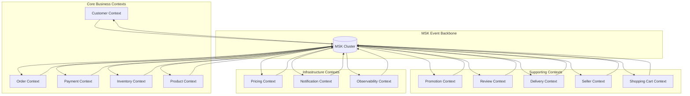

# MSK Data Flow Architecture

**文檔版本**: 2.0  
**最後更新**: 2025年9月24日 下午10:15 (台北時間)  
**負責團隊**: 架構師 + 資料工程團隊

## 📋 概述

本文檔詳細描述了 MSK (Amazon Managed Streaming for Apache Kafka) 在 GenAI Demo 應用中的資料流架構，包括事件驅動的資料治理、跨 13 個有界上下文的資料血緣追蹤，以及事件架構模式。

## 🎯 MSK 資料流架構目標

### 業務目標
- **零資料遺失**: 高吞吐量場景下 (>10K events/sec) 確保零資料遺失
- **完整資料血緣**: 跨 13 個有界上下文的端到端資料追蹤
- **即時監控**: <100ms 異常檢測和自動警報
- **合規審計**: 金融交易和客戶資料處理的完整審計軌跡

### 技術目標
- **高可用性**: 99.9% 系統可用性
- **低延遲**: 95th percentile < 100ms 事件處理延遲
- **高吞吐量**: 支援 >10,000 events/second 峰值負載
- **自動擴展**: 10x 流量增長的自動擴展能力

## 🏗️ MSK 集群架構

### 集群拓撲設計

```
┌─────────────────────────────────────────────────────────────┐
│                    MSK Cluster (Multi-AZ)                  │
├─────────────────────────────────────────────────────────────┤
│  AZ-1a          │  AZ-1b          │  AZ-1c                │
│  ┌─────────────┐ │ ┌─────────────┐ │ ┌─────────────┐       │
│  │   Broker-1  │ │ │   Broker-2  │ │ │   Broker-3  │       │
│  │   Leader    │ │ │   Follower  │ │ │   Follower  │       │
│  │   m5.large  │ │ │   m5.large  │ │ │   m5.large  │       │
│  └─────────────┘ │ └─────────────┘ │ └─────────────┘       │
└─────────────────────────────────────────────────────────────┘
```

### 技術規格
- **實例類型**: m5.large (2 vCPU, 8 GB RAM)
- **儲存**: 100 GB EBS gp3 per broker
- **網路**: Enhanced networking enabled
- **加密**: 傳輸中 (TLS 1.2) 和靜態 (KMS) 加密
- **監控**: CloudWatch + JMX + Prometheus 整合

## 📊 事件驅動資料治理

### 資料分類架構

#### 1. 業務事件 (Business Events)
```yaml
Topics:
  - business-events-orders      # 訂單生命週期事件
  - business-events-customers   # 客戶管理事件  
  - business-events-payments    # 支付處理事件
  - business-events-inventory   # 庫存管理事件
  - business-events-products    # 產品目錄事件
  - business-events-promotions  # 促銷活動事件
  - business-events-reviews     # 評論和評分事件
  - business-events-delivery    # 配送追蹤事件
  - business-events-sellers     # 賣家管理事件
  - business-events-shopping    # 購物車事件
  - business-events-pricing     # 定價策略事件
  - business-events-notifications # 通知服務事件
  - business-events-observability # 可觀測性事件

Partitioning Strategy:
  - Key: aggregateId (Customer ID, Order ID, etc.)
  - Partitions: 12 per topic (支援高並發)
  - Replication Factor: 3 (跨 AZ 複製)
```

#### 2. 系統事件 (System Events)
```yaml
Topics:
  - system-events-infrastructure  # 基礎設施事件
  - system-events-deployment     # 部署和配置事件
  - system-events-monitoring     # 監控和警報事件
  - system-events-security       # 安全和審計事件

Configuration:
  - Retention: 7 days (合規要求)
  - Compression: gzip (節省儲存)
  - Cleanup Policy: delete
```

#### 3. 錯誤事件 (Error Events)
```yaml
Topics:
  - error-events-application     # 應用程式錯誤
  - error-events-infrastructure  # 基礎設施錯誤
  - error-events-dlq            # Dead Letter Queue

Error Handling:
  - Max Retries: 3
  - Backoff Strategy: Exponential (1s, 2s, 4s)
  - DLQ Routing: Automatic after max retries
```

### 事件 Schema Registry

#### Schema 版本管理策略
```json
{
  "schemaRegistry": {
    "type": "JSON Schema",
    "versioningStrategy": "backward_compatible",
    "evolutionRules": {
      "addField": "allowed_with_default",
      "removeField": "deprecated_first",
      "changeType": "not_allowed",
      "renameField": "alias_supported"
    }
  }
}
```

#### 標準事件 Schema
```json
{
  "$schema": "http://json-schema.org/draft-07/schema#",
  "title": "DomainEvent",
  "type": "object",
  "required": ["eventId", "eventType", "aggregateId", "occurredOn", "version"],
  "properties": {
    "eventId": {
      "type": "string",
      "format": "uuid",
      "description": "Unique event identifier"
    },
    "eventType": {
      "type": "string",
      "pattern": "^[A-Z][a-zA-Z]*Event$",
      "description": "Event type following naming convention"
    },
    "aggregateId": {
      "type": "string",
      "description": "Aggregate root identifier"
    },
    "aggregateType": {
      "type": "string",
      "description": "Type of aggregate root"
    },
    "occurredOn": {
      "type": "string",
      "format": "date-time",
      "description": "Event occurrence timestamp"
    },
    "version": {
      "type": "integer",
      "minimum": 1,
      "description": "Event schema version"
    },
    "payload": {
      "type": "object",
      "description": "Event-specific data"
    },
    "metadata": {
      "type": "object",
      "properties": {
        "correlationId": {"type": "string"},
        "causationId": {"type": "string"},
        "userId": {"type": "string"},
        "traceId": {"type": "string"}
      }
    }
  }
}
```

## 🔄 跨 13 個有界上下文的資料血緣追蹤

### 有界上下文映射



### 資料血緣追蹤實現

#### 1. 事件關聯 ID 策略
```java
public class EventCorrelation {
    private final String correlationId;    // 業務流程 ID
    private final String causationId;      // 觸發事件 ID
    private final String traceId;          // X-Ray 追蹤 ID
    private final String sessionId;       // 用戶會話 ID
    
    // 血緣追蹤方法
    public EventLineage buildLineage() {
        return EventLineage.builder()
            .correlationId(correlationId)
            .causationId(causationId)
            .traceId(traceId)
            .sessionId(sessionId)
            .build();
    }
}
```

#### 2. 跨上下文事件流範例
```
Order Created Event Flow:
┌─────────────┐    ┌─────────────┐    ┌─────────────┐    ┌─────────────┐
│   Customer  │───▶│    Order    │───▶│  Inventory  │───▶│   Payment   │
│   Context   │    │   Context   │    │   Context   │    │   Context   │
└─────────────┘    └─────────────┘    └─────────────┘    └─────────────┘
       │                   │                   │                   │
       ▼                   ▼                   ▼                   ▼
┌─────────────────────────────────────────────────────────────────────┐
│                        MSK Event Backbone                          │
│  CustomerValidated  →  OrderCreated  →  InventoryReserved  →      │
│                                                PaymentProcessed    │
└─────────────────────────────────────────────────────────────────────┘
       │                   │                   │                   │
       ▼                   ▼                   ▼                   ▼
┌─────────────┐    ┌─────────────┐    ┌─────────────┐    ┌─────────────┐
│Notification │    │   Delivery  │    │   Pricing   │    │Observability│
│   Context   │    │   Context   │    │   Context   │    │   Context   │
└─────────────┘    └─────────────┘    └─────────────┘    └─────────────┘
```

#### 3. 血緣追蹤查詢 API
```java
@RestController
@RequestMapping("/api/v1/data-lineage")
public class DataLineageController {
    
    @GetMapping("/trace/{correlationId}")
    public EventLineageResponse traceEventFlow(@PathVariable String correlationId) {
        return dataLineageService.traceEventFlow(correlationId);
    }
    
    @GetMapping("/impact-analysis/{aggregateId}")
    public ImpactAnalysisResponse analyzeImpact(@PathVariable String aggregateId) {
        return dataLineageService.analyzeDownstreamImpact(aggregateId);
    }
}
```

## 🔧 MSK 事件架構模式

### 1. Event Sourcing 模式

#### 事件存儲策略
```java
@Component
public class MSKEventStore implements EventStore {
    
    @Override
    public void store(DomainEvent event) {
        // 發送到 MSK 主題
        kafkaTemplate.send(getTopicName(event), event.getAggregateId(), event);
        
        // 同時存儲到事件存儲 (可選)
        if (requiresPersistence(event)) {
            eventRepository.save(StoredEvent.from(event));
        }
    }
    
    private String getTopicName(DomainEvent event) {
        return "business-events-" + event.getAggregateType().toLowerCase();
    }
}
```

#### 事件重播機制
```java
@Service
public class EventReplayService {
    
    public void replayEvents(String aggregateId, LocalDateTime fromTime) {
        // 從 MSK 主題重播事件
        List<DomainEvent> events = kafkaEventReader.readEvents(
            aggregateId, fromTime, LocalDateTime.now()
        );
        
        // 重建聚合狀態
        events.forEach(eventProcessor::process);
    }
}
```

### 2. CQRS 模式整合

#### 命令和查詢分離
```java
// 命令端 - 寫入 MSK
@Component
public class OrderCommandHandler {
    
    @EventHandler
    public void handle(CreateOrderCommand command) {
        Order order = Order.create(command);
        orderRepository.save(order);
        
        // 發布事件到 MSK
        domainEventPublisher.publish(order.getUncommittedEvents());
    }
}

// 查詢端 - 從 MSK 消費更新讀取模型
@Component
public class OrderProjectionHandler {
    
    @KafkaListener(topics = "business-events-orders")
    public void handle(OrderCreatedEvent event) {
        OrderProjection projection = OrderProjection.from(event);
        orderProjectionRepository.save(projection);
    }
}
```

### 3. Saga 模式實現

#### 分散式事務協調
```java
@Component
public class OrderProcessingSaga {
    
    @SagaOrchestrationStart
    @KafkaListener(topics = "business-events-orders")
    public void handle(OrderCreatedEvent event) {
        // 步驟 1: 驗證庫存
        sagaManager.choreography()
            .step("validate-inventory")
            .compensate("release-inventory")
            .invoke(inventoryService::validateInventory, event.getOrderId());
    }
    
    @SagaOrchestrationStep("validate-inventory")
    @KafkaListener(topics = "business-events-inventory")
    public void handle(InventoryValidatedEvent event) {
        // 步驟 2: 處理支付
        sagaManager.choreography()
            .step("process-payment")
            .compensate("refund-payment")
            .invoke(paymentService::processPayment, event.getOrderId());
    }
}
```

## 📈 資料一致性策略

### 最終一致性模式

#### 1. 事件順序保證
```yaml
Topic Configuration:
  partitioning_strategy: "by_aggregate_id"
  ordering_guarantee: "per_partition"
  idempotency: "enabled"
  
Producer Configuration:
  enable.idempotence: true
  acks: "all"
  retries: 2147483647
  max.in.flight.requests.per.connection: 5
```

#### 2. 冪等性處理
```java
@Component
public class IdempotentEventHandler {
    
    @KafkaListener(topics = "business-events-orders")
    public void handle(OrderCreatedEvent event) {
        // 檢查事件是否已處理
        if (processedEventRepository.existsByEventId(event.getEventId())) {
            logger.info("Event already processed: {}", event.getEventId());
            return;
        }
        
        try {
            // 處理事件
            processOrderCreated(event);
            
            // 標記為已處理
            processedEventRepository.save(
                ProcessedEvent.of(event.getEventId(), Instant.now())
            );
        } catch (Exception e) {
            logger.error("Error processing event: {}", event.getEventId(), e);
            throw e;
        }
    }
}
```

#### 3. 補償機制
```java
@Component
public class CompensationHandler {
    
    @KafkaListener(topics = "error-events-application")
    public void handle(PaymentFailedEvent event) {
        // 觸發補償動作
        CompensationCommand compensation = CompensationCommand.builder()
            .correlationId(event.getCorrelationId())
            .compensationType(CompensationType.RELEASE_INVENTORY)
            .reason(event.getFailureReason())
            .build();
            
        compensationService.execute(compensation);
    }
}
```

## 🔍 資料品質監控框架

### 事件品質指標

#### 1. 資料完整性檢查
```java
@Component
public class DataQualityMonitor {
    
    @EventListener
    public void validateEventQuality(DomainEvent event) {
        DataQualityReport report = DataQualityReport.builder()
            .eventId(event.getEventId())
            .timestamp(Instant.now())
            .build();
            
        // 檢查必填欄位
        report.addCheck("required_fields", validateRequiredFields(event));
        
        // 檢查資料格式
        report.addCheck("data_format", validateDataFormat(event));
        
        // 檢查業務規則
        report.addCheck("business_rules", validateBusinessRules(event));
        
        // 發布品質報告
        if (report.hasFailures()) {
            qualityAlertService.sendAlert(report);
        }
    }
}
```

#### 2. 即時品質儀表板
```yaml
Quality Metrics:
  - event_schema_validation_rate: 99.9%
  - event_processing_success_rate: 99.5%
  - data_completeness_score: 98.0%
  - business_rule_compliance_rate: 99.8%
  
Alerting Thresholds:
  - schema_validation_failure_rate > 0.1%
  - processing_failure_rate > 0.5%
  - data_completeness_score < 95%
  - business_rule_violations > 10/hour
```

## 🚀 效能優化策略

### 1. 分區策略優化
```java
@Component
public class OptimizedPartitioner implements Partitioner {
    
    @Override
    public int partition(String topic, Object key, byte[] keyBytes, 
                        Object value, byte[] valueBytes, Cluster cluster) {
        
        // 基於聚合 ID 的一致性雜湊
        if (key instanceof String aggregateId) {
            return Math.abs(aggregateId.hashCode()) % cluster.partitionCountForTopic(topic);
        }
        
        // 預設輪詢分區
        return ThreadLocalRandom.current().nextInt(cluster.partitionCountForTopic(topic));
    }
}
```

### 2. 批次處理優化
```yaml
Producer Configuration:
  batch.size: 16384          # 16KB 批次大小
  linger.ms: 10              # 10ms 等待時間
  compression.type: "gzip"   # 壓縮減少網路傳輸
  
Consumer Configuration:
  fetch.min.bytes: 1024      # 最小拉取大小
  fetch.max.wait.ms: 500     # 最大等待時間
  max.poll.records: 500      # 每次拉取記錄數
```

### 3. 連接池優化
```java
@Configuration
public class KafkaOptimizationConfig {
    
    @Bean
    public KafkaTemplate<String, Object> kafkaTemplate() {
        return new KafkaTemplate<>(producerFactory());
    }
    
    @Bean
    public ProducerFactory<String, Object> producerFactory() {
        Map<String, Object> props = new HashMap<>();
        props.put(ProducerConfig.BOOTSTRAP_SERVERS_CONFIG, kafkaBootstrapServers);
        props.put(ProducerConfig.KEY_SERIALIZER_CLASS_CONFIG, StringSerializer.class);
        props.put(ProducerConfig.VALUE_SERIALIZER_CLASS_CONFIG, JsonSerializer.class);
        
        // 效能優化配置
        props.put(ProducerConfig.ACKS_CONFIG, "all");
        props.put(ProducerConfig.RETRIES_CONFIG, 3);
        props.put(ProducerConfig.BATCH_SIZE_CONFIG, 16384);
        props.put(ProducerConfig.LINGER_MS_CONFIG, 10);
        props.put(ProducerConfig.BUFFER_MEMORY_CONFIG, 33554432);
        props.put(ProducerConfig.COMPRESSION_TYPE_CONFIG, "gzip");
        
        return new DefaultKafkaProducerFactory<>(props);
    }
}
```

## 📊 監控和可觀測性

### 資料流監控指標

#### 1. 業務指標
```yaml
Business Metrics:
  - events_per_second_by_context: 
      customer: 50/sec
      order: 100/sec
      payment: 80/sec
      inventory: 60/sec
  - end_to_end_processing_latency: <100ms (P95)
  - event_loss_rate: 0%
  - data_consistency_score: 99.9%
```

#### 2. 技術指標
```yaml
Technical Metrics:
  - kafka_producer_throughput: 10K events/sec
  - kafka_consumer_lag: <1000 messages
  - partition_distribution_balance: >90%
  - broker_cpu_utilization: <70%
  - broker_memory_utilization: <80%
  - network_io_utilization: <60%
```

#### 3. 警報配置
```yaml
Critical Alerts:
  - offline_partitions > 0
  - under_replicated_partitions > 0
  - consumer_lag > 10000 messages
  - event_processing_failure_rate > 1%
  
Warning Alerts:
  - consumer_lag > 1000 messages
  - broker_cpu_utilization > 70%
  - event_processing_latency > 200ms
  - schema_validation_failure_rate > 0.1%
```

## 🔐 安全和合規

### 資料安全策略

#### 1. 加密配置
```yaml
Encryption:
  in_transit: "TLS 1.2"
  at_rest: "AWS KMS"
  key_rotation: "automatic_annual"
  
Authentication:
  mechanism: "SASL/SCRAM-SHA-512"
  user_management: "AWS MSK IAM"
  
Authorization:
  acl_enabled: true
  principal_mapping: "IAM roles"
```

#### 2. 審計追蹤
```java
@Component
public class AuditTrailService {
    
    @EventListener
    public void auditEvent(DomainEvent event) {
        AuditRecord audit = AuditRecord.builder()
            .eventId(event.getEventId())
            .eventType(event.getEventType())
            .aggregateId(event.getAggregateId())
            .userId(getCurrentUserId())
            .timestamp(event.getOccurredOn())
            .ipAddress(getCurrentIpAddress())
            .userAgent(getCurrentUserAgent())
            .build();
            
        auditRepository.save(audit);
    }
}
```

## 📋 最佳實踐指南

### 1. 事件設計原則
- **事件不可變性**: 事件一旦發布不可修改
- **向後相容性**: Schema 演進保持向後相容
- **業務語言**: 使用領域專家理解的業務術語
- **細粒度事件**: 每個事件代表單一業務事實

### 2. 效能最佳實踐
- **批次處理**: 使用批次處理提高吞吐量
- **壓縮**: 啟用壓縮減少網路和儲存成本
- **分區策略**: 基於聚合 ID 的一致性分區
- **連接池**: 重用連接減少建立成本

### 3. 可靠性最佳實踐
- **冪等性**: 確保事件處理的冪等性
- **重試機制**: 實現指數退避重試策略
- **死信佇列**: 處理無法處理的事件
- **監控警報**: 設置全面的監控和警報

## 🔄 災難恢復策略

### 1. 備份策略
```yaml
Backup Configuration:
  topic_backup: "cross_region_replication"
  retention_period: "7_days_operational + 90_days_compliance"
  backup_frequency: "continuous_replication"
  
Recovery Objectives:
  RTO: "< 5 minutes"
  RPO: "< 1 minute"
  availability_target: "99.9%"
```

### 2. 故障轉移程序
```java
@Component
public class DisasterRecoveryService {
    
    public void initiateFailover() {
        // 1. 停止生產者
        producerManager.stopAllProducers();
        
        // 2. 等待消費者完成處理
        consumerManager.waitForConsumersToComplete();
        
        // 3. 切換到備用集群
        clusterManager.switchToBackupCluster();
        
        // 4. 重新啟動生產者和消費者
        producerManager.startAllProducers();
        consumerManager.startAllConsumers();
    }
}
```

---

**文檔維護**: 本文檔隨 MSK 架構演進持續更新  
**下次審核**: 2025年12月24日  
**聯絡人**: 架構團隊 (architecture-team@company.com)