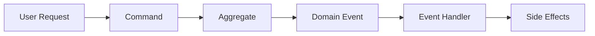
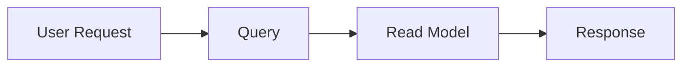
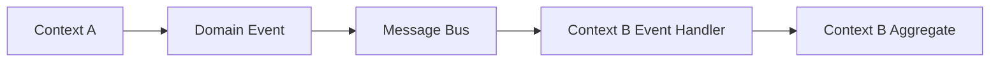

# Information Viewpoint

## Overview

The Information Viewpoint describes how the system stores, manages, and distributes information. It focuses on the structure, ownership, lifecycle, and quality of data within the system, ensuring that information is accurate, consistent, and accessible to those who need it.

### Purpose

This viewpoint addresses the following key concerns:

- **Data Structure**: How information is organized and structured
- **Data Ownership**: Which bounded contexts own which data
- **Data Consistency**: How consistency is maintained across distributed contexts
- **Data Flow**: How information moves through the system
- **Data Quality**: How data integrity and quality are ensured
- **Data Lifecycle**: How data is created, updated, archived, and deleted

### Scope

This viewpoint covers:

- Domain models and entity relationships within each bounded context
- Value objects and their validation rules
- Aggregate boundaries and consistency guarantees
- Domain events as the primary mechanism for data synchronization
- Data ownership and eventual consistency strategies
- Data flow patterns between bounded contexts

## Key Principles

### 1. Domain-Driven Design (DDD)

Our information architecture is based on DDD tactical patterns:

- **Aggregates**: Consistency boundaries that group related entities
- **Entities**: Objects with unique identity that change over time
- **Value Objects**: Immutable objects defined by their attributes
- **Domain Events**: Represent state changes and enable eventual consistency

### 2. Bounded Context Ownership

Each bounded context owns its data:

- **Single Source of Truth**: Each piece of data has one authoritative source
- **No Shared Databases**: Contexts do not share database tables
- **Event-Driven Integration**: Contexts communicate via domain events
- **Eventual Consistency**: Cross-context consistency is achieved asynchronously

### 3. Event Sourcing Principles

While not using full event sourcing, we apply key principles:

- **Domain Events**: All significant state changes produce events
- **Event Store**: Events are persisted for audit and replay
- **Event-Driven Architecture**: Events drive cross-context workflows
- **Immutable Events**: Events are never modified after creation

### 4. Data Quality

We ensure data quality through:

- **Validation at Boundaries**: Input validation at API and domain layers
- **Invariant Enforcement**: Aggregates enforce business rules
- **Type Safety**: Value objects provide type-safe domain primitives
- **Audit Trail**: Domain events provide complete audit history

## Information Architecture

### Bounded Contexts and Data Ownership

Our system is organized into 13 bounded contexts, each owning specific data:

| Bounded Context | Primary Data Owned | Key Aggregates |
|----------------|-------------------|----------------|
| Customer | Customer profiles, preferences | Customer |
| Order | Order details, order items | Order |
| Product | Product catalog, specifications | Product |
| Inventory | Stock levels, reservations | InventoryItem |
| Payment | Payment transactions, methods | Payment |
| Shipping | Shipment tracking, addresses | Shipment |
| Promotion | Discount rules, campaigns | Promotion |
| Notification | Notification templates, logs | Notification |
| Review | Product reviews, ratings | Review |
| Shopping Cart | Active carts, cart items | ShoppingCart |
| Pricing | Pricing rules, calculations | PriceList |
| Seller | Seller profiles, products | Seller |
| Delivery | Delivery schedules, routes | Delivery |

### Data Consistency Model

#### Strong Consistency (Within Aggregate)

- **Scope**: Within a single aggregate boundary
- **Mechanism**: ACID transactions
- **Guarantee**: Immediate consistency
- **Example**: Adding an item to an order maintains order total consistency

#### Eventual Consistency (Across Contexts)

- **Scope**: Between different bounded contexts
- **Mechanism**: Domain events + event handlers
- **Guarantee**: Consistency achieved asynchronously
- **Example**: Order placement triggers inventory reservation via events

### Data Flow Patterns

#### 1. Command-Event Pattern



- Commands modify aggregate state
- Aggregates collect domain events
- Application services publish events
- Event handlers in other contexts react

#### 2. Query Pattern



- Queries read from optimized read models
- No side effects from queries
- CQRS pattern for complex queries

#### 3. Integration Pattern



- Asynchronous communication via events
- Loose coupling between contexts
- Resilient to temporary failures

## Data Management Strategies

### 1. Aggregate Design

**Principles**:

- Keep aggregates small and focused
- One aggregate per transaction
- Reference other aggregates by ID only
- Enforce invariants within aggregate boundaries

**Example**: Order Aggregate

```java
@AggregateRoot
public class Order {
    private OrderId id;
    private CustomerId customerId;  // Reference by ID
    private List<OrderItem> items;  // Owned entities
    private Money totalAmount;      // Calculated value
    private OrderStatus status;
    
    // Business methods enforce invariants
    public void submit() {
        validateOrderSubmission();
        this.status = OrderStatus.PENDING;
        collectEvent(OrderSubmittedEvent.create(...));
    }
}
```

### 2. Value Object Design

**Principles**:

- Immutable by design (use Records)
- Validate in constructor
- Provide meaningful domain types
- Replace primitive obsession

**Example**: Email Value Object

```java
public record Email(String value) {
    public Email {
        if (value == null || !value.matches("^[A-Za-z0-9+_.-]+@(.+)$")) {
            throw new IllegalArgumentException("Invalid email format");
        }
    }
}
```

### 3. Domain Event Design

**Principles**:

- Immutable records
- Past tense naming
- Include all necessary data
- Include event metadata

**Example**: OrderSubmittedEvent

```java
public record OrderSubmittedEvent(
    OrderId orderId,
    CustomerId customerId,
    Money totalAmount,
    UUID eventId,
    LocalDateTime occurredOn
) implements DomainEvent {
    // Factory method with automatic metadata
    public static OrderSubmittedEvent create(...) { ... }
}
```

### 4. Repository Pattern

**Principles**:

- Interface in domain layer
- Implementation in infrastructure layer
- Return domain objects, not entities
- One repository per aggregate root

**Example**: OrderRepository

```java
// Domain layer interface
public interface OrderRepository {
    Optional<Order> findById(OrderId orderId);
    Order save(Order order);
}

// Infrastructure layer implementation
@Repository
public class JpaOrderRepository implements OrderRepository {
    // JPA implementation details
}
```

## Data Quality and Integrity

### Validation Layers

1. **API Layer**: Input validation using Bean Validation
2. **Domain Layer**: Business rule validation in aggregates
3. **Database Layer**: Constraints and foreign keys

### Audit Trail

- **Domain Events**: Complete history of state changes
- **Event Store**: Persistent event log
- **Audit Queries**: Reconstruct entity history from events

### Data Migration

- **Flyway**: Database schema versioning
- **Event Upcasting**: Handle event schema evolution
- **Backward Compatibility**: Maintain compatibility during migrations

## Technology Stack

### Persistence

- **Primary Database**: PostgreSQL (production)
- **Development Database**: H2 (in-memory)
- **ORM**: Spring Data JPA + Hibernate
- **Schema Migration**: Flyway

### Event Store

- **Development**: JPA-based event store
- **Production**: EventStore DB (recommended)
- **Alternative**: In-memory (testing only)

### Caching

- **Distributed Cache**: Redis (ElastiCache)
- **Application Cache**: Spring Cache abstraction
- **Cache Strategy**: Cache-aside pattern

### Messaging

- **Event Bus**: Apache Kafka (MSK)
- **Message Format**: JSON
- **Delivery Guarantee**: At-least-once

## Related Documentation

### Detailed Information Models

- [Domain Models](domain-models.md) - Entity relationships for each context
- [Data Ownership](data-ownership.md) - Context ownership and boundaries
- [Data Flow](data-flow.md) - Information flow patterns
- [Event Catalog](../../api/events/README.md) - Complete event reference

### Related Viewpoints

- [Functional Viewpoint](../functional/overview.md) - System capabilities
- [Development Viewpoint](../development/overview.md) - Code organization
- [Deployment Viewpoint](../deployment/overview.md) - Database deployment

### Related Perspectives

- [Security Perspective](../../perspectives/security/overview.md) - Data protection
- [Performance Perspective](../../perspectives/performance/overview.md) - Query optimization
- [Evolution Perspective](../../perspectives/evolution/overview.md) - Schema evolution

## Diagrams

### Entity Relationship Diagrams

- [Customer Context ER Diagram](../../diagrams/generated/information/customer-context-er.png)
- [Order Context ER Diagram](../../diagrams/generated/information/order-context-er.png)
- [Product Context ER Diagram](../../diagrams/generated/information/product-context-er.png)

### Data Flow Diagrams

- [Order Processing Data Flow](../../diagrams/generated/information/order-processing-flow.png)
- [Event-Driven Data Synchronization](../../diagrams/generated/information/event-data-sync.png)

### Aggregate Diagrams

- [Order Aggregate Structure](../../diagrams/generated/information/order-aggregate.png)
- [Customer Aggregate Structure](../../diagrams/generated/information/customer-aggregate.png)

---

**Document Status**: Active  
**Last Review**: 2025-10-23  
**Next Review**: 2026-01-23  
**Owner**: Architecture Team
