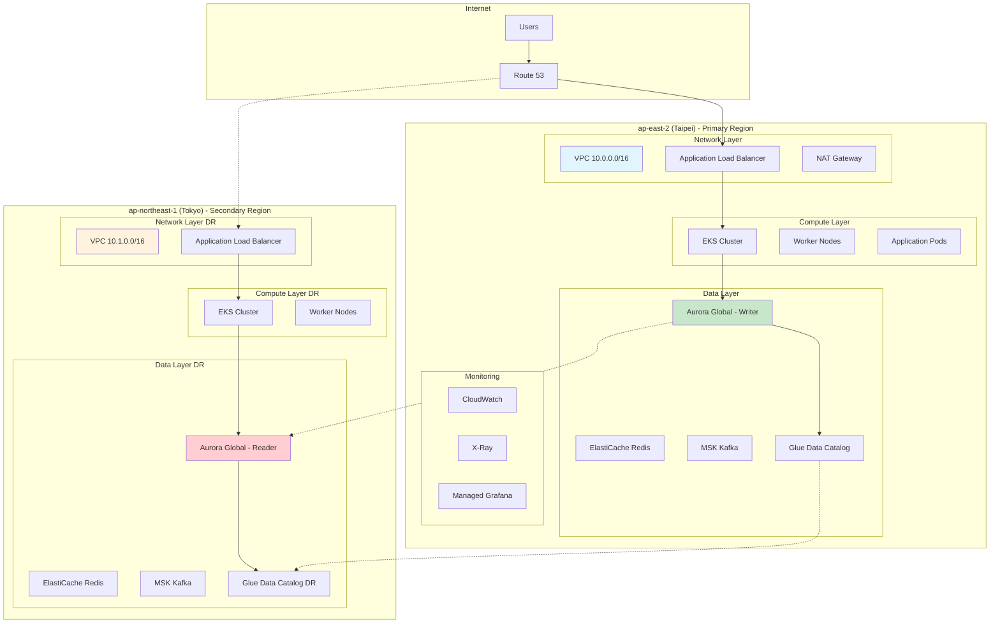
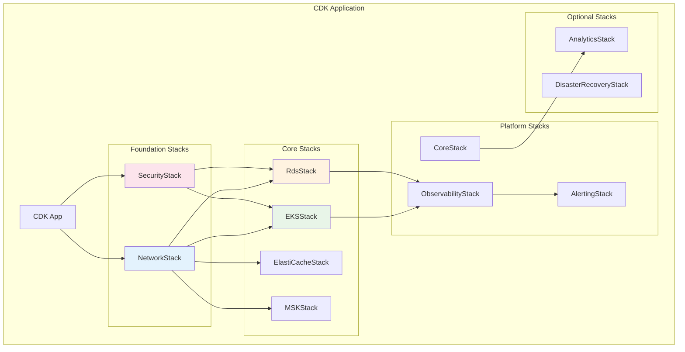
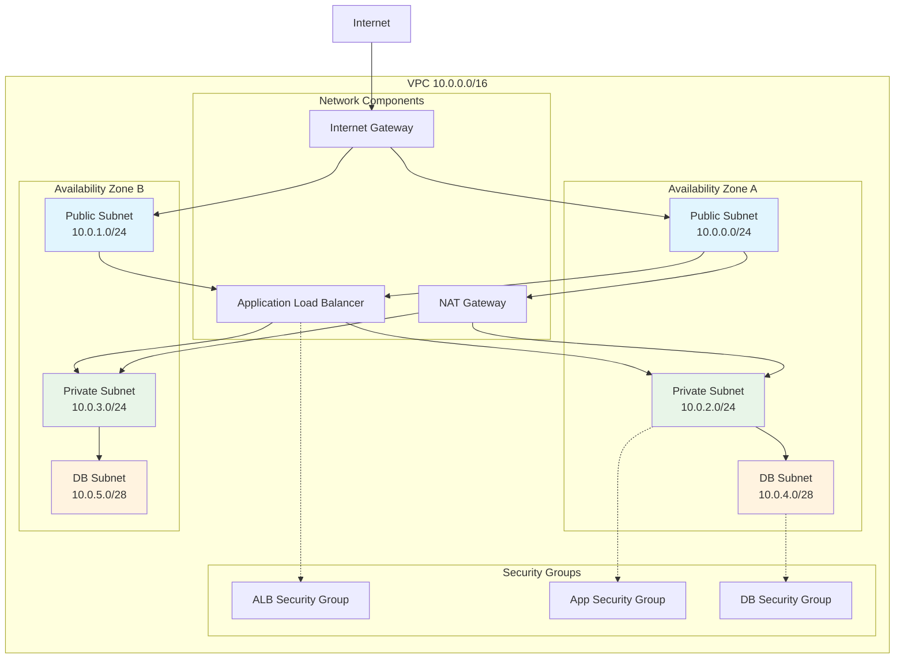
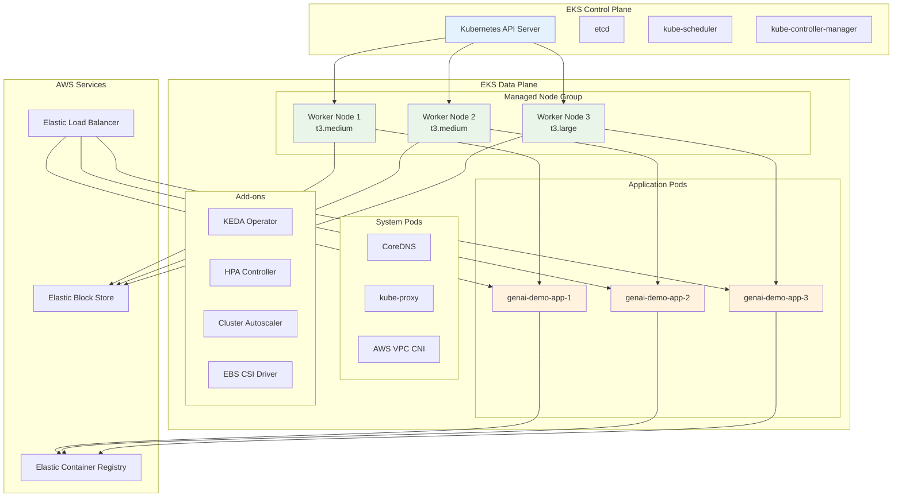
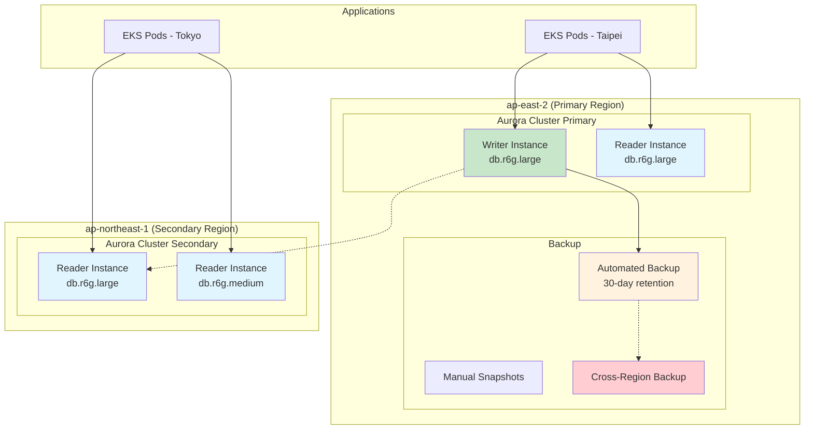
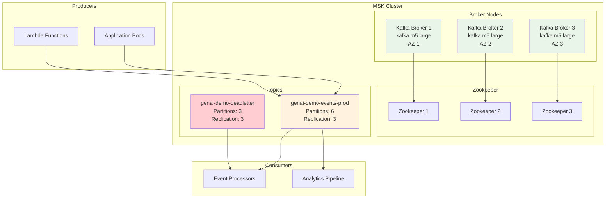
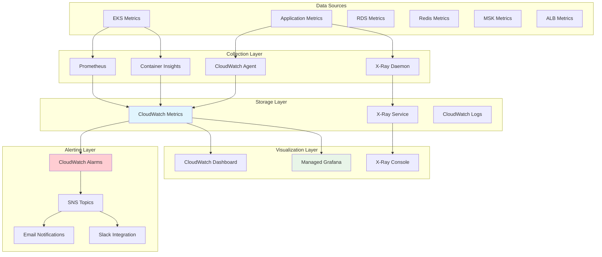
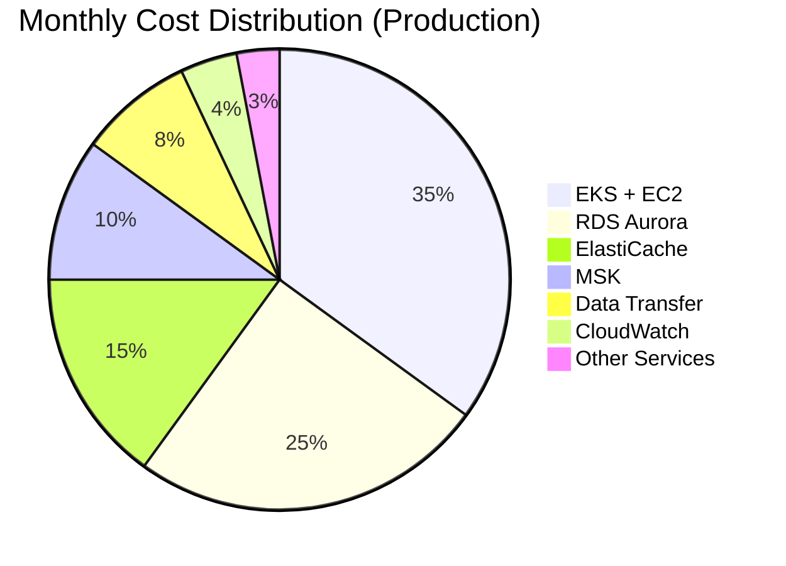
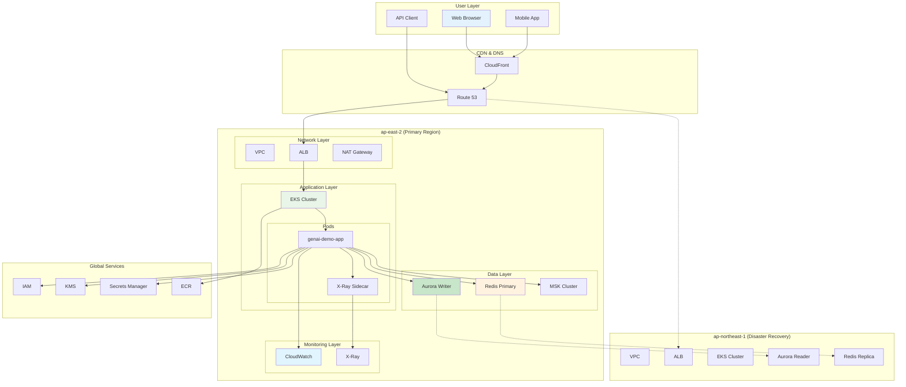

# Infrastructure Viewpoint - AWS Resource Architecture Design

**Document Version**: 1.0  
**Last Updated**: September 28, 2025 11:12 PM (Taipei Time)  
**Author**: Architecture Team  
**Status**: Active

## 📋 Table of Contents

- Overview
- Architecture Design Principles
- AWS Resource Architecture
- Network Architecture
- Compute Resources
- Data Storage
- Messaging Services
- Monitoring and Observability
- Cost Optimization
- Architecture Diagrams

## Overview

GenAI Demo adopts a Multi-Region Active-Active architecture deployed on AWS cloud platform, primarily serving users in Taiwan and the Asia-Pacific region. The system design follows the five pillars of the AWS Well-Architected Framework, ensuring high availability, security, performance, cost-effectiveness, and operational excellence.

### Core Design Objectives

- **High Availability**: 99.9% availability target with cross-region failover support
- **Scalability**: Support 10x traffic growth with auto-scaling mechanisms
- **Security**: Zero-trust architecture with end-to-end encryption
- **Cost Effectiveness**: Pay-as-you-go with resource optimization
- **Operational Excellence**: Automated deployment with comprehensive monitoring

## Architecture Design Principles

### 1. Cloud-Native Design

```yaml
Containerization: 
  - Applications: Docker containers
  - Orchestration: Amazon EKS (Kubernetes)
  - Images: Amazon ECR

Microservices Architecture:
  - Domain-Driven Design (DDD)
  - Event-driven architecture
  - API-First design

Serverless Services:
  - Lambda: Automation tasks
  - EventBridge: Event routing
  - Step Functions: Workflows
```

### 2. Multi-Region Architecture

```yaml
Primary Region: ap-east-2 (Taipei)
  - Purpose: Primary service region
  - Users: Taiwan, Hong Kong, Southeast Asia
  - Services: Complete service stack

Secondary Region: ap-northeast-1 (Tokyo)
  - Purpose: Disaster recovery, read replicas
  - Users: Japan, Korea
  - Services: Read services, failover
```

### 3. Infrastructure as Code (IaC)

```yaml
Tool: AWS CDK (TypeScript)
Version Control: Git
Deployment: CI/CD Pipeline
Testing: Unit tests + Integration tests
```

## AWS Resource Architecture

### Overall Architecture Overview



### CDK Stack Architecture



## Network Architecture

### VPC Design



### Network Security Design

```yaml
Security Group Rules:
  ALB Security Group:
    Inbound:
      - Port 80 (HTTP): 0.0.0.0/0
      - Port 443 (HTTPS): 0.0.0.0/0
    Outbound:
      - Port 8080: App Security Group

  App Security Group:
    Inbound:
      - Port 8080: ALB Security Group
      - Port 22: Bastion Security Group (management)
    Outbound:
      - Port 443: 0.0.0.0/0 (AWS APIs)
      - Port 5432: DB Security Group
      - Port 6379: Redis Security Group
      - Port 9092: MSK Security Group

  DB Security Group:
    Inbound:
      - Port 5432: App Security Group
    Outbound: None
```

## Compute Resources

### Amazon EKS Architecture



### Compute Resource Configuration

```yaml
EKS Cluster:
  Version: Kubernetes 1.28
  Endpoint: Private
  Logging: API, Audit, Authenticator, ControllerManager, Scheduler

Managed Node Groups:
  Min Nodes: 2
  Max Nodes: 10
  Desired Nodes: 2-3 (environment dependent)
  Instance Types: 
    - t3.medium (development)
    - t3.large (production)
  AMI: Amazon Linux 2
  Disk: 20GB GP3

Pod Specifications:
  CPU Request: 100m
  CPU Limit: 500m
  Memory Request: 128Mi
  Memory Limit: 512Mi

Auto Scaling:
  HPA: CPU 70%, Memory 80%
  KEDA: Custom metrics (thread pool, queue length)
  Cluster Autoscaler: Node utilization 70%
```

## Data Storage

### Database Architecture (Aurora Global)



### Data Storage Configuration

```yaml
Aurora PostgreSQL:
  Engine Version: 15.4
  Instance Types:
    Production: db.r6g.large
    Staging: db.r6g.medium
    Development: db.t3.medium
  Storage:
    Type: Aurora Storage
    Encryption: AES-256 (KMS)
    Auto Scaling: Enabled
  Backup:
    Automated Backup: 30 days (Production), 7 days (Development)
    Snapshots: Weekly manual snapshots
    Cross-Region Replication: Enabled (Production)
  Performance:
    Performance Insights: Enabled
    Enhanced Monitoring: Enabled

ElastiCache Redis:
  Version: 7.0
  Node Types:
    Production: cache.r6g.large
    Staging: cache.r6g.medium
    Development: cache.t3.micro
  Configuration:
    Replication Group: 3 nodes
    Multi-AZ: Enabled
    Automatic Failover: Enabled
  Security:
    Transit Encryption: TLS
    At-Rest Encryption: AES-256
    Authentication: AUTH token
```

## Messaging Services

### MSK Kafka Architecture



## Monitoring and Observability

### Monitoring Architecture



## Cost Optimization

### Cost Structure Analysis



### Cost Optimization Strategies

```yaml
Compute Resource Optimization:
  EKS:
    - Spot Instances: 30% of nodes use Spot
    - Auto Scaling: Based on actual load
    - Resource Request Optimization: Avoid over-provisioning
  Lambda:
    - ARM Graviton2: 20% cost savings
    - Memory Optimization: Based on actual usage

Storage Optimization:
  RDS:
    - Reserved Instances: 1-year term 40% savings
    - Storage Auto Scaling: Avoid over-provisioning
    - Read Replicas: Create only when needed
  S3:
    - Intelligent Tiering: Automatic cost optimization
    - Lifecycle Policies: Automatic archiving

Network Optimization:
  - CloudFront: Reduce Data Transfer costs
  - VPC Endpoints: Avoid NAT Gateway fees
  - Intra-Region Communication: Minimize cross-region traffic
```

## Architecture Diagrams

### Complete System Architecture Diagram



---

**Document Status**: ✅ Complete  
**Next Step**: Review [Security Viewpoint](../security/iam-permissions-architecture.md) for IAM permissions architecture  
**Related Documents**: 
- [Security Viewpoint - IAM Permissions Architecture](../security/iam-permissions-architecture.md)
- [Deployment Viewpoint - Deployment Architecture](../deployment/deployment-architecture.md)
- [Operational Viewpoint - DNS Resolution and Disaster Recovery](../operational/dns-disaster-recovery.md)