# Infrastructure Viewpoint - AWS 資源架構設計

**文件版本**: 1.0  
**最後更新**: 2025年9月24日 下午5:15 (台北時間)  
**作者**: Architecture Team  
**狀態**: Active

## 📋 目錄

- 概覽
- 架構設計原則
- AWS 資源架構
- 網路架構
- 計算資源
- 資料儲存
- 訊息服務
- 監控和可觀測性
- 成本優化
- 架構圖表

## 概覽

GenAI Demo 採用 Multi-Region Active-Active 架構，部署在 AWS 雲端平台上，主要服務台灣和亞太地區用戶。系統設計遵循 AWS Well-Architected Framework 的五大支柱，確保高可用性、安全性、效能、成本效益和營運卓越。

### 核心設計目標

- **高可用性**: 99.9% 可用性目標，支援跨區域故障轉移
- **可擴展性**: 支援 10x 流量增長，自動擴展機制
- **安全性**: 零信任架構，端到端加密
- **成本效益**: 按需付費，資源優化
- **營運卓越**: 自動化部署，全面監控

## 架構設計原則

### 1. 雲端原生設計 (Cloud-Native)

```yaml
容器化: 
  - 應用程式: Docker 容器
  - 編排: Amazon EKS (Kubernetes)
  - 映像: Amazon ECR

微服務架構:
  - 領域驅動設計 (DDD)
  - 事件驅動架構
  - API-First 設計

無伺服器服務:
  - Lambda: 自動化任務
  - EventBridge: 事件路由
  - Step Functions: 工作流程
```

### 2. 多區域架構 (Multi-Region)

```yaml
主要區域: ap-east-2 (台北)
  - 用途: 主要服務區域
  - 用戶: 台灣、香港、東南亞
  - 服務: 完整服務堆疊

次要區域: ap-northeast-1 (東京)
  - 用途: 災難恢復、讀取副本
  - 用戶: 日本、韓國
  - 服務: 讀取服務、故障轉移
```

### 3. 基礎設施即程式碼 (IaC)

```yaml
工具: AWS CDK (TypeScript)
版本控制: Git
部署: CI/CD Pipeline
測試: 單元測試 + 整合測試
```

## AWS 資源架構

### 整體架構概覽

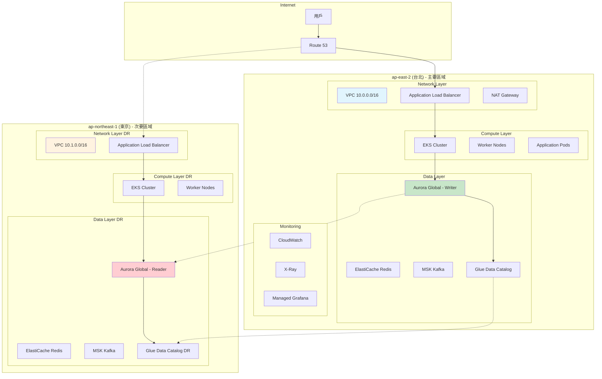

### CDK Stack 架構

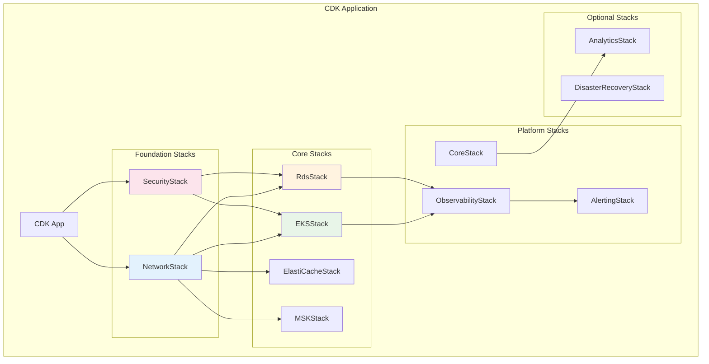

## 網路架構

### VPC 設計

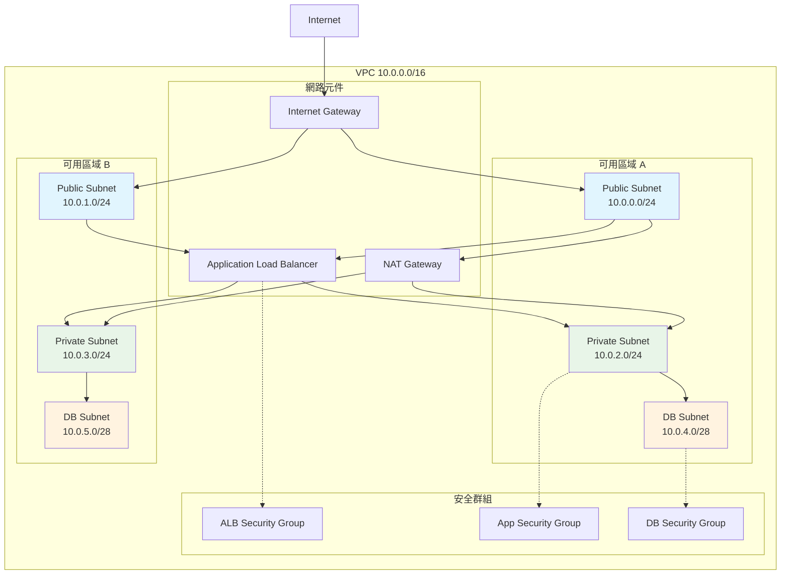

### 網路安全設計

```yaml
安全群組規則:
  ALB Security Group:
    入站:
      - Port 80 (HTTP): 0.0.0.0/0
      - Port 443 (HTTPS): 0.0.0.0/0
    出站:
      - Port 8080: App Security Group

  App Security Group:
    入站:
      - Port 8080: ALB Security Group
      - Port 22: Bastion Security Group (管理用)
    出站:
      - Port 443: 0.0.0.0/0 (AWS APIs)
      - Port 5432: DB Security Group
      - Port 6379: Redis Security Group
      - Port 9092: MSK Security Group

  DB Security Group:
    入站:
      - Port 5432: App Security Group
    出站: 無
```

## 計算資源

### Amazon EKS 架構

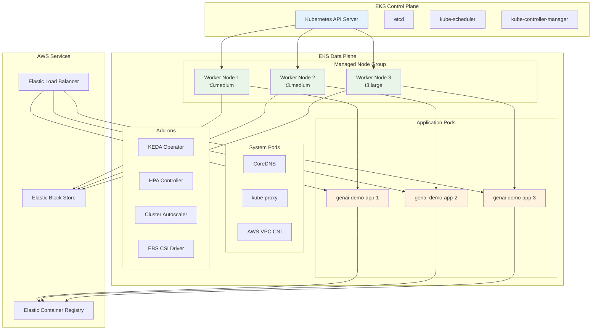

### 自動擴展架構

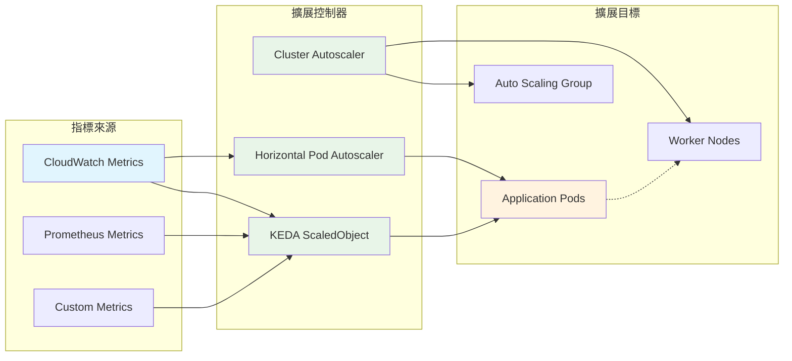

### 計算資源配置

```yaml
EKS Cluster:
  版本: Kubernetes 1.28
  端點: Private
  日誌: API, Audit, Authenticator, ControllerManager, Scheduler

Managed Node Groups:
  最小節點: 2
  最大節點: 10
  期望節點: 2-3 (環境相依)
  實例類型: 
    - t3.medium (開發)
    - t3.large (生產)
  AMI: Amazon Linux 2
  磁碟: 20GB GP3

Pod 規格:
  CPU 請求: 100m
  CPU 限制: 500m
  記憶體請求: 128Mi
  記憶體限制: 512Mi

自動擴展:
  HPA: CPU 70%, Memory 80%
  KEDA: 自定義指標 (執行緒池、佇列長度)
  Cluster Autoscaler: 節點使用率 70%
```

## 資料儲存

### 資料庫架構 (Aurora Global)

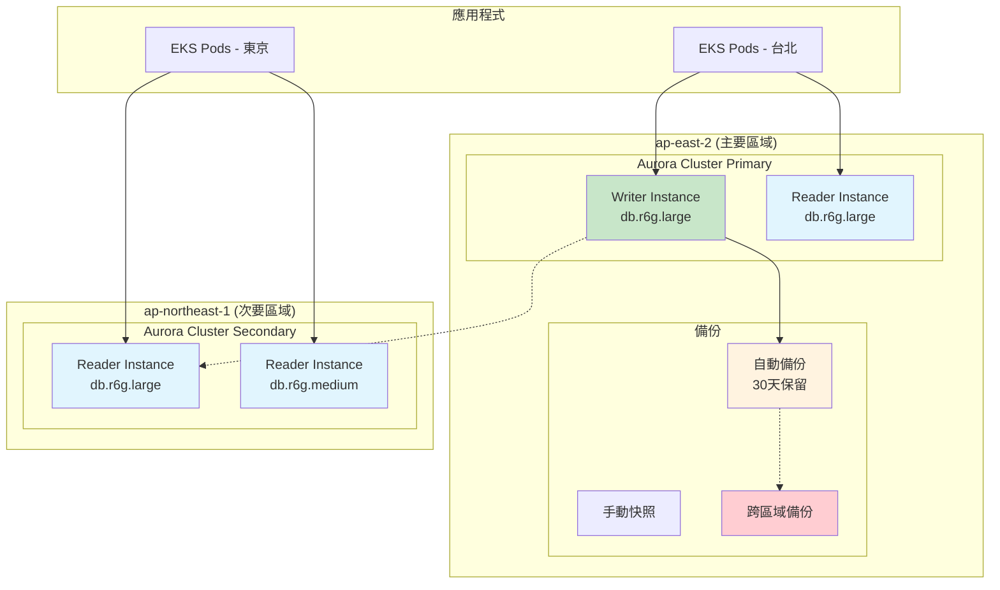

### 快取架構 (ElastiCache Redis)

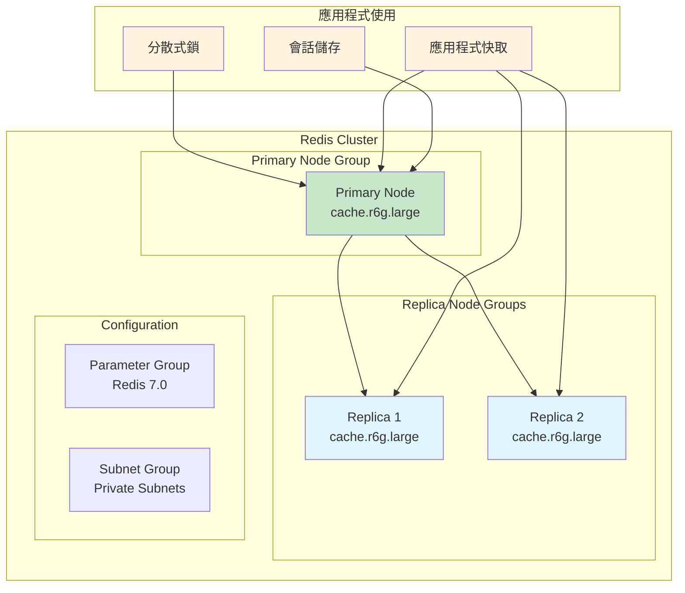

### 資料儲存配置

```yaml
Aurora PostgreSQL:
  引擎版本: 15.4
  實例類型:
    Production: db.r6g.large
    Staging: db.r6g.medium
    Development: db.t3.medium
  儲存:
    類型: Aurora Storage
    加密: AES-256 (KMS)
    自動擴展: 啟用
  備份:
    自動備份: 30天 (Production), 7天 (Development)
    快照: 每週手動快照
    跨區域複製: 啟用 (Production)
  效能:
    Performance Insights: 啟用
    Enhanced Monitoring: 啟用

ElastiCache Redis:
  版本: 7.0
  節點類型:
    Production: cache.r6g.large
    Staging: cache.r6g.medium
    Development: cache.t3.micro
  配置:
    複製群組: 3節點
    Multi-AZ: 啟用
    自動故障轉移: 啟用
  安全:
    傳輸加密: TLS
    靜態加密: AES-256
    認證: AUTH token
```

## 訊息服務

### MSK Kafka 架構

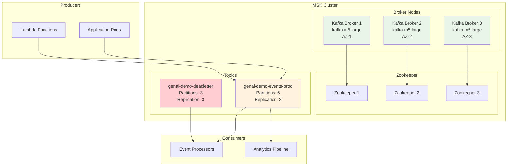

### 事件驅動架構

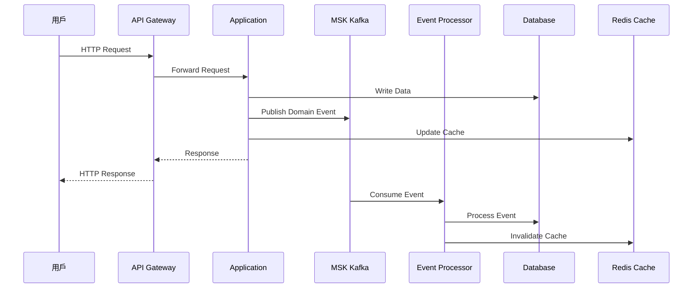

## 監控和可觀測性

### 監控架構

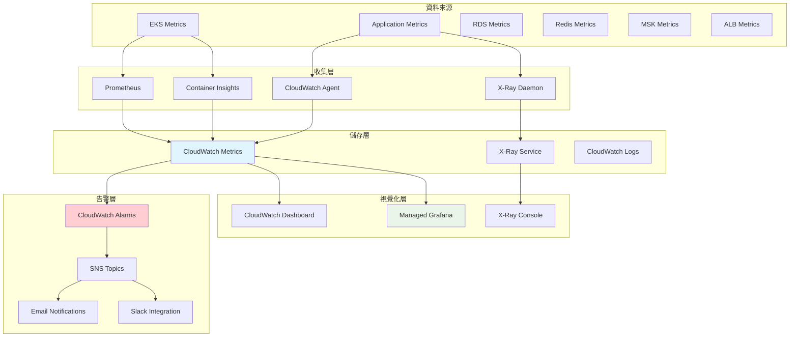

### 可觀測性配置

```yaml
CloudWatch Metrics:
  自定義指標:
    - 執行緒池使用率
    - JVM 記憶體使用
    - HTTP 請求指標
    - 業務指標 (訂單、用戶等)
  系統指標:
    - EKS: CPU, Memory, Network, Disk
    - RDS: CPU, Connections, IOPS, Latency
    - Redis: CPU, Memory, Commands, Connections
    - MSK: Throughput, Lag, Disk Usage

X-Ray Tracing:
  採樣率:
    Production: 5%
    Staging: 10%
    Development: 100%
  追蹤服務:
    - HTTP 請求
    - 資料庫查詢
    - Redis 操作
    - Kafka 訊息
    - 外部 API 調用

CloudWatch Logs:
  日誌群組:
    - /aws/genai-demo/application
    - /aws/eks/cluster-logs
    - /aws/rds/instance/postgresql
    - /aws/elasticache/redis
  保留期:
    Production: 30天
    Staging: 14天
    Development: 7天
```

## 成本優化

### 成本結構分析

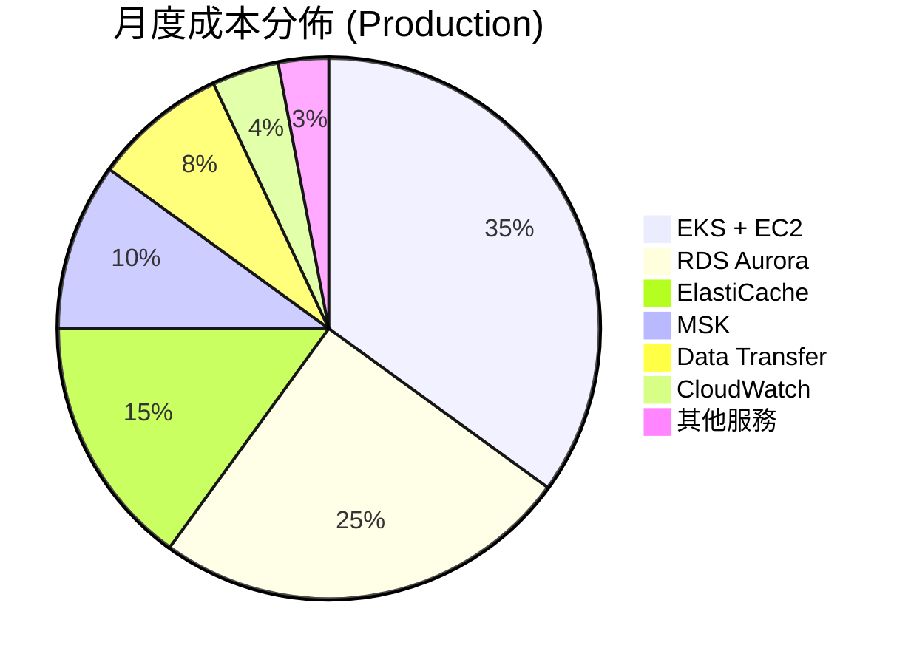

### 成本優化策略

```yaml
計算資源優化:
  EKS:
    - Spot Instances: 30% 節點使用 Spot
    - 自動擴展: 基於實際負載
    - 資源請求優化: 避免過度配置
  Lambda:
    - ARM Graviton2: 20% 成本節省
    - 記憶體優化: 基於實際使用

儲存優化:
  RDS:
    - Reserved Instances: 1年期 40% 節省
    - 儲存自動擴展: 避免過度配置
    - 讀取副本: 僅在需要時創建
  S3:
    - Intelligent Tiering: 自動成本優化
    - 生命週期政策: 自動歸檔

網路優化:
  - CloudFront: 減少 Data Transfer 成本
  - VPC Endpoints: 避免 NAT Gateway 費用
  - 區域內通訊: 最小化跨區域流量
```

## 架構圖表

### 完整系統架構圖

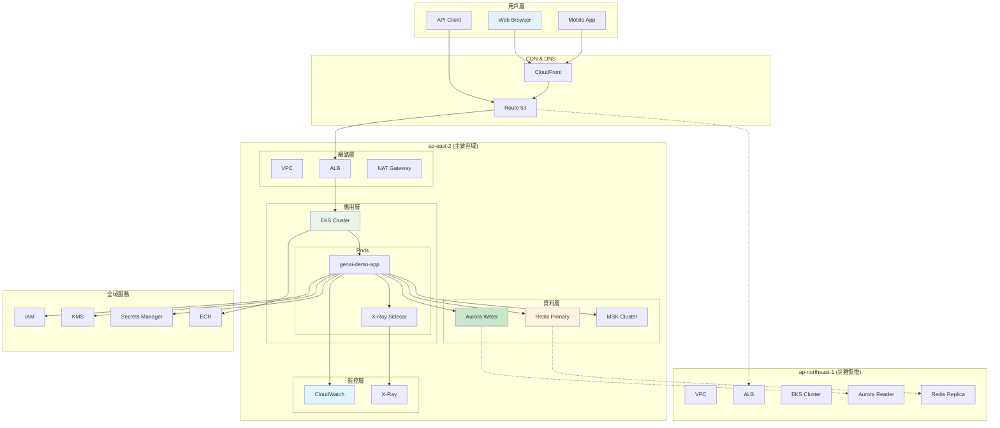

---

**文件狀態**: ✅ 完成  
**下一步**: 查看 [Security Viewpoint](../security/iam-permissions-architecture.md) 了解 IAM 權限架構  
**相關文件**: 
- [Security Viewpoint - IAM 權限架構](../security/iam-permissions-architecture.md)
- [Deployment Viewpoint - 部署架構](../deployment/deployment-architecture.md)
- [Operational Viewpoint - DNS 解析與災難恢復](../operational/dns-disaster-recovery.md)
