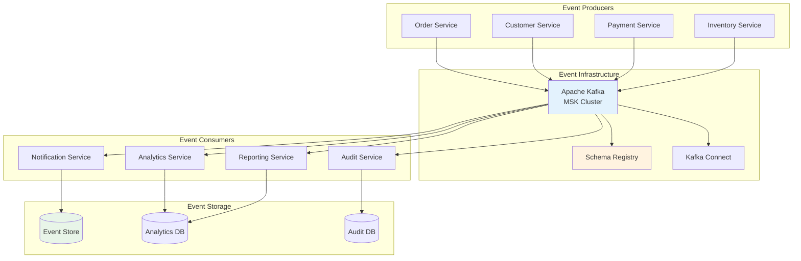

# Infrastructure Viewpoint - Event-Driven Configuration

**Document Version**: 1.0  
**Last Updated**: September 28, 2025 11:39 PM (Taipei Time)  
**Author**: Infrastructure Team  
**Status**: Active

## 📋 Table of Contents

- Overview
- Event-Driven Architecture
- Kafka Configuration
- Event Processing
- Event Sourcing
- Monitoring and Alerting

## Overview

This document describes the event-driven configuration for the GenAI Demo system, including Kafka setup, event processing patterns, and event sourcing implementation.

### Design Objectives

- **Scalable Event Processing**: Handle high-volume event streams efficiently
- **Reliable Message Delivery**: Ensure events are processed reliably with proper error handling
- **Event Sourcing**: Maintain complete audit trail of system state changes
- **Real-time Processing**: Enable real-time event processing and notifications
- **Decoupled Architecture**: Promote loose coupling between system components

## Event-Driven Architecture

### Architecture Overview



## Kafka Configuration

### MSK Cluster Setup

```yaml
# MSK Cluster Configuration
MSK Configuration:
  Cluster Name: genai-demo-kafka
  Kafka Version: 2.8.1
  Instance Type: kafka.t3.small
  Number of Brokers: 3
  
  Network Configuration:
    VPC: genai-demo-vpc
    Subnets: 
      - private-subnet-1a
      - private-subnet-1b
      - private-subnet-1c
    Security Groups:
      - kafka-cluster-sg
  
  Storage:
    EBS Volume Type: gp3
    Volume Size: 100 GB per broker
    
  Encryption:
    Encryption in Transit: TLS
    Encryption at Rest: AWS KMS
    
  Authentication:
    Client Authentication: SASL/SCRAM
    
  Monitoring:
    CloudWatch Metrics: Enhanced
    JMX Exporter: Enabled
```

### Kafka Topics Configuration

```java
@Configuration
@EnableKafka
public class KafkaTopicConfiguration {
    
    @Value("${spring.kafka.bootstrap-servers}")
    private String bootstrapServers;
    
    @Bean
    public KafkaAdmin kafkaAdmin() {
        Map<String, Object> configs = new HashMap<>();
        configs.put(AdminClientConfig.BOOTSTRAP_SERVERS_CONFIG, bootstrapServers);
        configs.put(AdminClientConfig.SECURITY_PROTOCOL_CONFIG, "SASL_SSL");
        configs.put(SaslConfigs.SASL_MECHANISM, "SCRAM-SHA-512");
        configs.put(SaslConfigs.SASL_JAAS_CONFIG, 
            "org.apache.kafka.common.security.scram.ScramLoginModule required " +
            "username=\"${kafka.username}\" password=\"${kafka.password}\";");
        
        return new KafkaAdmin(configs);
    }
    
    @Bean
    public NewTopic customerEventsTopic() {
        return TopicBuilder.name("customer-events")
            .partitions(6)
            .replicas(3)
            .config(TopicConfig.RETENTION_MS_CONFIG, "604800000") // 7 days
            .config(TopicConfig.COMPRESSION_TYPE_CONFIG, "snappy")
            .config(TopicConfig.MIN_IN_SYNC_REPLICAS_CONFIG, "2")
            .build();
    }
    
    @Bean
    public NewTopic orderEventsTopic() {
        return TopicBuilder.name("order-events")
            .partitions(12)
            .replicas(3)
            .config(TopicConfig.RETENTION_MS_CONFIG, "2592000000") // 30 days
            .config(TopicConfig.COMPRESSION_TYPE_CONFIG, "snappy")
            .config(TopicConfig.MIN_IN_SYNC_REPLICAS_CONFIG, "2")
            .build();
    }
    
    @Bean
    public NewTopic paymentEventsTopic() {
        return TopicBuilder.name("payment-events")
            .partitions(6)
            .replicas(3)
            .config(TopicConfig.RETENTION_MS_CONFIG, "7776000000") // 90 days
            .config(TopicConfig.COMPRESSION_TYPE_CONFIG, "snappy")
            .config(TopicConfig.MIN_IN_SYNC_REPLICAS_CONFIG, "2")
            .build();
    }
    
    @Bean
    public NewTopic inventoryEventsTopic() {
        return TopicBuilder.name("inventory-events")
            .partitions(6)
            .replicas(3)
            .config(TopicConfig.RETENTION_MS_CONFIG, "604800000") // 7 days
            .config(TopicConfig.COMPRESSION_TYPE_CONFIG, "snappy")
            .config(TopicConfig.MIN_IN_SYNC_REPLICAS_CONFIG, "2")
            .build();
    }
    
    @Bean
    public NewTopic deadLetterTopic() {
        return TopicBuilder.name("dead-letter-queue")
            .partitions(3)
            .replicas(3)
            .config(TopicConfig.RETENTION_MS_CONFIG, "31536000000") // 1 year
            .config(TopicConfig.COMPRESSION_TYPE_CONFIG, "snappy")
            .build();
    }
}
```

### Producer Configuration

```java
@Configuration
public class KafkaProducerConfiguration {
    
    @Value("${spring.kafka.bootstrap-servers}")
    private String bootstrapServers;
    
    @Bean
    public ProducerFactory<String, Object> producerFactory() {
        Map<String, Object> configProps = new HashMap<>();
        
        // Connection settings
        configProps.put(ProducerConfig.BOOTSTRAP_SERVERS_CONFIG, bootstrapServers);
        configProps.put(ProducerConfig.SECURITY_PROTOCOL_CONFIG, "SASL_SSL");
        configProps.put(SaslConfigs.SASL_MECHANISM, "SCRAM-SHA-512");
        configProps.put(SaslConfigs.SASL_JAAS_CONFIG, 
            "org.apache.kafka.common.security.scram.ScramLoginModule required " +
            "username=\"${kafka.username}\" password=\"${kafka.password}\";");
        
        // Serialization
        configProps.put(ProducerConfig.KEY_SERIALIZER_CLASS_CONFIG, StringSerializer.class);
        configProps.put(ProducerConfig.VALUE_SERIALIZER_CLASS_CONFIG, JsonSerializer.class);
        
        // Performance and reliability settings
        configProps.put(ProducerConfig.ACKS_CONFIG, "all");
        configProps.put(ProducerConfig.RETRIES_CONFIG, 3);
        configProps.put(ProducerConfig.RETRY_BACKOFF_MS_CONFIG, 1000);
        configProps.put(ProducerConfig.ENABLE_IDEMPOTENCE_CONFIG, true);
        configProps.put(ProducerConfig.MAX_IN_FLIGHT_REQUESTS_PER_CONNECTION, 1);
        
        // Batching and compression
        configProps.put(ProducerConfig.BATCH_SIZE_CONFIG, 16384);
        configProps.put(ProducerConfig.LINGER_MS_CONFIG, 10);
        configProps.put(ProducerConfig.COMPRESSION_TYPE_CONFIG, "snappy");
        
        // Buffer settings
        configProps.put(ProducerConfig.BUFFER_MEMORY_CONFIG, 33554432);
        configProps.put(ProducerConfig.REQUEST_TIMEOUT_MS_CONFIG, 30000);
        
        return new DefaultKafkaProducerFactory<>(configProps);
    }
    
    @Bean
    public KafkaTemplate<String, Object> kafkaTemplate() {
        KafkaTemplate<String, Object> template = new KafkaTemplate<>(producerFactory());
        
        // Set default topic
        template.setDefaultTopic("default-events");
        
        // Add producer interceptors for monitoring
        template.setProducerInterceptors(List.of(new ProducerMetricsInterceptor()));
        
        return template;
    }
}
```

### Consumer Configuration

```java
@Configuration
@EnableKafka
public class KafkaConsumerConfiguration {
    
    @Value("${spring.kafka.bootstrap-servers}")
    private String bootstrapServers;
    
    @Bean
    public ConsumerFactory<String, Object> consumerFactory() {
        Map<String, Object> configProps = new HashMap<>();
        
        // Connection settings
        configProps.put(ConsumerConfig.BOOTSTRAP_SERVERS_CONFIG, bootstrapServers);
        configProps.put(ConsumerConfig.SECURITY_PROTOCOL_CONFIG, "SASL_SSL");
        configProps.put(SaslConfigs.SASL_MECHANISM, "SCRAM-SHA-512");
        configProps.put(SaslConfigs.SASL_JAAS_CONFIG, 
            "org.apache.kafka.common.security.scram.ScramLoginModule required " +
            "username=\"${kafka.username}\" password=\"${kafka.password}\";");
        
        // Deserialization
        configProps.put(ConsumerConfig.KEY_DESERIALIZER_CLASS_CONFIG, StringDeserializer.class);
        configProps.put(ConsumerConfig.VALUE_DESERIALIZER_CLASS_CONFIG, JsonDeserializer.class);
        configProps.put(JsonDeserializer.TRUSTED_PACKAGES, "solid.humank.genaidemo.domain.events");
        
        // Consumer group settings
        configProps.put(ConsumerConfig.GROUP_ID_CONFIG, "genai-demo-consumer-group");
        configProps.put(ConsumerConfig.AUTO_OFFSET_RESET_CONFIG, "earliest");
        configProps.put(ConsumerConfig.ENABLE_AUTO_COMMIT_CONFIG, false);
        
        // Performance settings
        configProps.put(ConsumerConfig.FETCH_MIN_BYTES_CONFIG, 1024);
        configProps.put(ConsumerConfig.FETCH_MAX_WAIT_MS_CONFIG, 500);
        configProps.put(ConsumerConfig.MAX_POLL_RECORDS_CONFIG, 100);
        configProps.put(ConsumerConfig.MAX_POLL_INTERVAL_MS_CONFIG, 300000);
        
        // Session settings
        configProps.put(ConsumerConfig.SESSION_TIMEOUT_MS_CONFIG, 30000);
        configProps.put(ConsumerConfig.HEARTBEAT_INTERVAL_MS_CONFIG, 10000);
        
        return new DefaultKafkaConsumerFactory<>(configProps);
    }
    
    @Bean
    public ConcurrentKafkaListenerContainerFactory<String, Object> kafkaListenerContainerFactory() {
        ConcurrentKafkaListenerContainerFactory<String, Object> factory = 
            new ConcurrentKafkaListenerContainerFactory<>();
        
        factory.setConsumerFactory(consumerFactory());
        
        // Concurrency settings
        factory.setConcurrency(3);
        
        // Error handling
        factory.setCommonErrorHandler(new DefaultErrorHandler(
            new FixedBackOff(1000L, 3L)
        ));
        
        // Manual acknowledgment
        factory.getContainerProperties().setAckMode(ContainerProperties.AckMode.MANUAL_IMMEDIATE);
        
        // Consumer interceptors for monitoring
        factory.setConsumerFactory(consumerFactory());
        
        return factory;
    }
}
```

## Event Processing

### Event Publisher Service

```java
@Service
@Slf4j
public class EventPublisherService {
    
    private final KafkaTemplate<String, Object> kafkaTemplate;
    private final MeterRegistry meterRegistry;
    
    public EventPublisherService(KafkaTemplate<String, Object> kafkaTemplate, 
                                MeterRegistry meterRegistry) {
        this.kafkaTemplate = kafkaTemplate;
        this.meterRegistry = meterRegistry;
    }
    
    public CompletableFuture<SendResult<String, Object>> publishEvent(
            String topic, String key, Object event) {
        
        Timer.Sample sample = Timer.start(meterRegistry);
        
        return kafkaTemplate.send(topic, key, event)
            .whenComplete((result, throwable) -> {
                sample.stop(Timer.builder("kafka.producer.send.time")
                    .tag("topic", topic)
                    .tag("success", throwable == null ? "true" : "false")
                    .register(meterRegistry));
                
                if (throwable == null) {
                    log.info("Event published successfully: topic={}, key={}, partition={}, offset={}", 
                        topic, key, result.getRecordMetadata().partition(), 
                        result.getRecordMetadata().offset());
                    
                    meterRegistry.counter("kafka.producer.send.success", "topic", topic).increment();
                } else {
                    log.error("Failed to publish event: topic={}, key={}", topic, key, throwable);
                    meterRegistry.counter("kafka.producer.send.failure", "topic", topic).increment();
                }
            });
    }
    
    public void publishEventAsync(String topic, String key, Object event) {
        publishEvent(topic, key, event)
            .exceptionally(throwable -> {
                log.error("Async event publishing failed: topic={}, key={}", topic, key, throwable);
                // Could implement retry logic or dead letter queue here
                return null;
            });
    }
    
    public void publishDomainEvent(DomainEvent event) {
        String topic = getTopicForEventType(event.getClass());
        String key = event.getAggregateId();
        
        publishEventAsync(topic, key, event);
    }
    
    private String getTopicForEventType(Class<?> eventType) {
        return switch (eventType.getSimpleName()) {
            case "CustomerCreatedEvent", "CustomerUpdatedEvent", "CustomerDeletedEvent" -> "customer-events";
            case "OrderCreatedEvent", "OrderUpdatedEvent", "OrderCancelledEvent" -> "order-events";
            case "PaymentProcessedEvent", "PaymentFailedEvent", "PaymentRefundedEvent" -> "payment-events";
            case "InventoryUpdatedEvent", "InventoryReservedEvent", "InventoryReleasedEvent" -> "inventory-events";
            default -> "default-events";
        };
    }
}
```

### Event Consumer Service

```java
@Component
@Slf4j
public class EventConsumerService {
    
    private final MeterRegistry meterRegistry;
    private final EventProcessorRegistry processorRegistry;
    
    public EventConsumerService(MeterRegistry meterRegistry, 
                               EventProcessorRegistry processorRegistry) {
        this.meterRegistry = meterRegistry;
        this.processorRegistry = processorRegistry;
    }
    
    @KafkaListener(topics = "customer-events", groupId = "genai-demo-customer-group")
    public void handleCustomerEvents(
            @Payload CustomerEvent event,
            @Header(KafkaHeaders.RECEIVED_TOPIC) String topic,
            @Header(KafkaHeaders.RECEIVED_PARTITION_ID) int partition,
            @Header(KafkaHeaders.OFFSET) long offset,
            Acknowledgment acknowledgment) {
        
        Timer.Sample sample = Timer.start(meterRegistry);
        
        try {
            log.info("Processing customer event: type={}, aggregateId={}, partition={}, offset={}", 
                event.getClass().getSimpleName(), event.getAggregateId(), partition, offset);
            
            EventProcessor<CustomerEvent> processor = processorRegistry.getProcessor(event.getClass());
            processor.process(event);
            
            acknowledgment.acknowledge();
            
            sample.stop(Timer.builder("kafka.consumer.process.time")
                .tag("topic", topic)
                .tag("event_type", event.getClass().getSimpleName())
                .tag("success", "true")
                .register(meterRegistry));
            
            meterRegistry.counter("kafka.consumer.process.success", 
                "topic", topic, "event_type", event.getClass().getSimpleName()).increment();
            
        } catch (Exception e) {
            log.error("Failed to process customer event: type={}, aggregateId={}", 
                event.getClass().getSimpleName(), event.getAggregateId(), e);
            
            sample.stop(Timer.builder("kafka.consumer.process.time")
                .tag("topic", topic)
                .tag("event_type", event.getClass().getSimpleName())
                .tag("success", "false")
                .register(meterRegistry));
            
            meterRegistry.counter("kafka.consumer.process.failure", 
                "topic", topic, "event_type", event.getClass().getSimpleName()).increment();
            
            // Send to dead letter queue
            sendToDeadLetterQueue(event, e);
            acknowledgment.acknowledge(); // Acknowledge to avoid reprocessing
        }
    }
    
    @KafkaListener(topics = "order-events", groupId = "genai-demo-order-group")
    public void handleOrderEvents(
            @Payload OrderEvent event,
            @Header(KafkaHeaders.RECEIVED_TOPIC) String topic,
            Acknowledgment acknowledgment) {
        
        try {
            log.info("Processing order event: type={}, aggregateId={}", 
                event.getClass().getSimpleName(), event.getAggregateId());
            
            EventProcessor<OrderEvent> processor = processorRegistry.getProcessor(event.getClass());
            processor.process(event);
            
            acknowledgment.acknowledge();
            
        } catch (Exception e) {
            log.error("Failed to process order event: type={}, aggregateId={}", 
                event.getClass().getSimpleName(), event.getAggregateId(), e);
            
            sendToDeadLetterQueue(event, e);
            acknowledgment.acknowledge();
        }
    }
    
    private void sendToDeadLetterQueue(Object event, Exception error) {
        DeadLetterEvent deadLetterEvent = new DeadLetterEvent(
            event.getClass().getSimpleName(),
            event,
            error.getMessage(),
            Instant.now()
        );
        
        try {
            kafkaTemplate.send("dead-letter-queue", deadLetterEvent);
        } catch (Exception e) {
            log.error("Failed to send event to dead letter queue", e);
        }
    }
}
```

## Event Sourcing

### Event Store Implementation

```java
@Repository
public class EventStoreRepository {
    
    private final JdbcTemplate jdbcTemplate;
    private final ObjectMapper objectMapper;
    
    public EventStoreRepository(JdbcTemplate jdbcTemplate, ObjectMapper objectMapper) {
        this.jdbcTemplate = jdbcTemplate;
        this.objectMapper = objectMapper;
    }
    
    public void saveEvent(DomainEvent event) {
        String sql = """
            INSERT INTO event_store (
                event_id, event_type, aggregate_id, aggregate_type, 
                event_data, event_version, occurred_on
            ) VALUES (?, ?, ?, ?, ?, ?, ?)
            """;
        
        try {
            String eventData = objectMapper.writeValueAsString(event);
            
            jdbcTemplate.update(sql,
                event.getEventId().toString(),
                event.getClass().getSimpleName(),
                event.getAggregateId(),
                getAggregateType(event),
                eventData,
                getEventVersion(event),
                Timestamp.from(event.getOccurredOn())
            );
            
        } catch (JsonProcessingException e) {
            throw new EventSerializationException("Failed to serialize event", e);
        }
    }
    
    public List<DomainEvent> getEventsForAggregate(String aggregateId) {
        String sql = """
            SELECT event_id, event_type, aggregate_id, aggregate_type, 
                   event_data, event_version, occurred_on
            FROM event_store 
            WHERE aggregate_id = ? 
            ORDER BY event_version ASC
            """;
        
        return jdbcTemplate.query(sql, this::mapRowToEvent, aggregateId);
    }
    
    public List<DomainEvent> getEventsByType(String eventType) {
        String sql = """
            SELECT event_id, event_type, aggregate_id, aggregate_type, 
                   event_data, event_version, occurred_on
            FROM event_store 
            WHERE event_type = ? 
            ORDER BY occurred_on ASC
            """;
        
        return jdbcTemplate.query(sql, this::mapRowToEvent, eventType);
    }
    
    public List<DomainEvent> getEventsAfter(Instant timestamp) {
        String sql = """
            SELECT event_id, event_type, aggregate_id, aggregate_type, 
                   event_data, event_version, occurred_on
            FROM event_store 
            WHERE occurred_on > ? 
            ORDER BY occurred_on ASC
            """;
        
        return jdbcTemplate.query(sql, this::mapRowToEvent, Timestamp.from(timestamp));
    }
    
    private DomainEvent mapRowToEvent(ResultSet rs, int rowNum) throws SQLException {
        try {
            String eventType = rs.getString("event_type");
            String eventData = rs.getString("event_data");
            
            Class<?> eventClass = Class.forName("solid.humank.genaidemo.domain.events." + eventType);
            return (DomainEvent) objectMapper.readValue(eventData, eventClass);
            
        } catch (Exception e) {
            throw new EventDeserializationException("Failed to deserialize event", e);
        }
    }
    
    private String getAggregateType(DomainEvent event) {
        // Extract aggregate type from event class name or metadata
        String eventType = event.getClass().getSimpleName();
        if (eventType.startsWith("Customer")) return "Customer";
        if (eventType.startsWith("Order")) return "Order";
        if (eventType.startsWith("Payment")) return "Payment";
        if (eventType.startsWith("Inventory")) return "Inventory";
        return "Unknown";
    }
    
    private long getEventVersion(DomainEvent event) {
        // Implementation depends on how you track event versions
        // This could be a field in the event or calculated based on aggregate state
        return System.currentTimeMillis();
    }
}
```

### Event Store Schema

```sql
-- Event Store Table
CREATE TABLE event_store (
    id BIGSERIAL PRIMARY KEY,
    event_id UUID NOT NULL UNIQUE,
    event_type VARCHAR(255) NOT NULL,
    aggregate_id VARCHAR(255) NOT NULL,
    aggregate_type VARCHAR(255) NOT NULL,
    event_data JSONB NOT NULL,
    event_version BIGINT NOT NULL,
    occurred_on TIMESTAMP NOT NULL,
    created_at TIMESTAMP DEFAULT CURRENT_TIMESTAMP
);

-- Indexes for performance
CREATE INDEX idx_event_store_aggregate_id ON event_store(aggregate_id);
CREATE INDEX idx_event_store_event_type ON event_store(event_type);
CREATE INDEX idx_event_store_occurred_on ON event_store(occurred_on);
CREATE INDEX idx_event_store_aggregate_type ON event_store(aggregate_type);

-- Composite index for aggregate reconstruction
CREATE INDEX idx_event_store_aggregate_version ON event_store(aggregate_id, event_version);

-- Snapshot Table (for performance optimization)
CREATE TABLE aggregate_snapshots (
    id BIGSERIAL PRIMARY KEY,
    aggregate_id VARCHAR(255) NOT NULL,
    aggregate_type VARCHAR(255) NOT NULL,
    snapshot_data JSONB NOT NULL,
    snapshot_version BIGINT NOT NULL,
    created_at TIMESTAMP DEFAULT CURRENT_TIMESTAMP,
    UNIQUE(aggregate_id, aggregate_type)
);

CREATE INDEX idx_snapshots_aggregate_id ON aggregate_snapshots(aggregate_id);
```

## Monitoring and Alerting

### Kafka Metrics Configuration

```java
@Configuration
public class KafkaMetricsConfiguration {
    
    @Bean
    public MeterRegistryCustomizer<MeterRegistry> kafkaMetricsCustomizer() {
        return registry -> {
            registry.config().commonTags(
                "application", "genai-demo",
                "component", "kafka"
            );
        };
    }
    
    @Bean
    public KafkaMetrics kafkaMetrics(MeterRegistry meterRegistry) {
        return new KafkaMetrics(meterRegistry);
    }
}

@Component
public class KafkaMetrics {
    
    private final Counter messagesProduced;
    private final Counter messagesConsumed;
    private final Timer producerLatency;
    private final Timer consumerLatency;
    private final Gauge consumerLag;
    
    public KafkaMetrics(MeterRegistry meterRegistry) {
        this.messagesProduced = Counter.builder("kafka.messages.produced")
            .description("Number of messages produced to Kafka")
            .register(meterRegistry);
            
        this.messagesConsumed = Counter.builder("kafka.messages.consumed")
            .description("Number of messages consumed from Kafka")
            .register(meterRegistry);
            
        this.producerLatency = Timer.builder("kafka.producer.latency")
            .description("Producer send latency")
            .register(meterRegistry);
            
        this.consumerLatency = Timer.builder("kafka.consumer.latency")
            .description("Consumer processing latency")
            .register(meterRegistry);
            
        this.consumerLag = Gauge.builder("kafka.consumer.lag")
            .description("Consumer lag in messages")
            .register(meterRegistry, this, KafkaMetrics::getCurrentConsumerLag);
    }
    
    public void recordMessageProduced(String topic) {
        messagesProduced.increment(Tags.of("topic", topic));
    }
    
    public void recordMessageConsumed(String topic) {
        messagesConsumed.increment(Tags.of("topic", topic));
    }
    
    public Timer.Sample startProducerTimer() {
        return Timer.start(meterRegistry);
    }
    
    public Timer.Sample startConsumerTimer() {
        return Timer.start(meterRegistry);
    }
    
    private double getCurrentConsumerLag() {
        // Implementation to get current consumer lag
        // This would typically query Kafka consumer group metadata
        return 0.0;
    }
}
```

### CloudWatch Alarms

```yaml
CloudWatch Alarms:
  
  High Producer Latency:
    Metric: kafka.producer.latency (P95)
    Threshold: > 1000ms
    Period: 5 minutes
    Action: SNS notification to engineering team
    
  High Consumer Lag:
    Metric: kafka.consumer.lag
    Threshold: > 1000 messages
    Period: 5 minutes
    Action: SNS notification to operations team
    
  Message Processing Failures:
    Metric: kafka.consumer.process.failure
    Threshold: > 10 failures in 5 minutes
    Period: 5 minutes
    Action: SNS notification and PagerDuty alert
    
  Dead Letter Queue Growth:
    Metric: kafka.messages.produced (topic=dead-letter-queue)
    Threshold: > 5 messages in 10 minutes
    Period: 10 minutes
    Action: SNS notification to engineering team
```

---

**Document Status**: ✅ Complete  
**Next Step**: Review [Glue Service Configuration](./glue-service-configuration.md) for data processing integration  
**Related Documents**: 
- [Architecture Viewpoint - Event-Driven Design](../architecture/event-driven-design.md)
- Domain Events Implementation
- [Infrastructure Viewpoint - MSK Infrastructure Configuration](./msk-infrastructure-configuration.md)