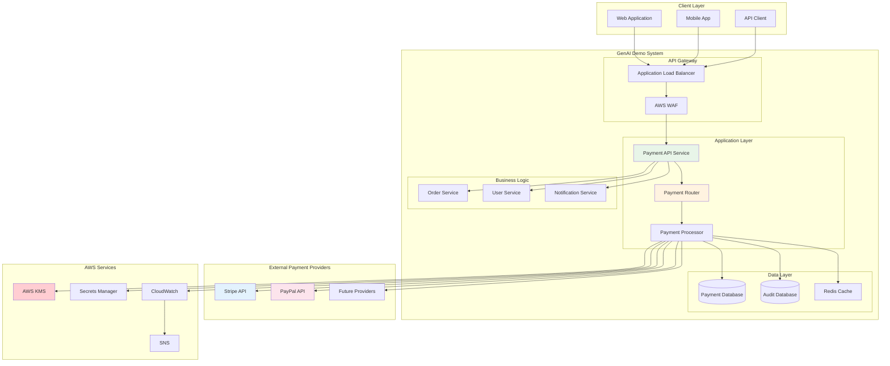

# Infrastructure Viewpoint - Payment Gateway Integration

**Document Version**: 1.0  
**Last Updated**: September 28, 2025 11:54 PM (Taipei Time)  
**Author**: Infrastructure Team  
**Status**: Active

## 📋 Table of Contents

- Overview
- Payment Gateway Architecture
- Stripe Integration
- PayPal Integration
- Security Implementation
- Error Handling and Retry Mechanisms
- Monitoring and Alerting
- Testing Strategy

## Overview

GenAI Demo system integrates multiple payment gateways to provide users with diverse payment options. The system adopts a unified payment interface design, supporting Stripe and PayPal as primary payment providers, with the capability to easily extend to other payment services.

### Design Objectives

- **Multi-Gateway Support**: Support multiple payment providers to reduce single point of failure risk
- **Unified Interface**: Provide consistent payment API for frontend applications
- **Security First**: Ensure all payment data transmission and storage comply with PCI DSS standards
- **High Availability**: Implement failover mechanisms to ensure payment service continuity
- **Monitoring**: Comprehensive payment transaction monitoring and alerting

## Payment Gateway Architecture

### Overall Architecture Diagram



## Stripe Integration

### Stripe Configuration

```yaml
Stripe Configuration:
  API Version: "2023-10-16"
  Base URL: "https://api.stripe.com"
  
  Authentication:
    Secret Key: Stored in AWS Secrets Manager
    Publishable Key: Environment variable
    Webhook Secret: Stored in AWS Secrets Manager
  
  Supported Features:
    - Payment Intents API
    - Payment Methods
    - Webhooks
    - Refunds
    - Disputes handling
  
  Webhook Events:
    - payment_intent.succeeded
    - payment_intent.payment_failed
    - payment_intent.canceled
    - charge.dispute.created
    - invoice.payment_succeeded
```

### Stripe Implementation

```java
@Service
@Slf4j
public class StripePaymentService implements PaymentGatewayService {
    
    private final StripeClient stripeClient;
    private final PaymentRepository paymentRepository;
    private final AuditService auditService;
    
    @Override
    public PaymentResponse createPayment(PaymentRequest request) {
        try {
            // Create Payment Intent
            PaymentIntentCreateParams params = PaymentIntentCreateParams.builder()
                .setAmount(request.getAmount().multiply(BigDecimal.valueOf(100)).longValue())
                .setCurrency(request.getCurrency().toLowerCase())
                .setCustomer(request.getCustomerId())
                .setDescription(request.getDescription())
                .setMetadata(Map.of(
                    "order_id", request.getOrderId(),
                    "user_id", request.getUserId()
                ))
                .setAutomaticPaymentMethods(
                    PaymentIntentCreateParams.AutomaticPaymentMethods.builder()
                        .setEnabled(true)
                        .build()
                )
                .build();
            
            PaymentIntent paymentIntent = PaymentIntent.create(params, stripeClient.getRequestOptions());
            
            // Save payment record
            Payment payment = Payment.builder()
                .id(paymentIntent.getId())
                .orderId(request.getOrderId())
                .userId(request.getUserId())
                .amount(request.getAmount())
                .currency(request.getCurrency())
                .status(PaymentStatus.PENDING)
                .gateway(PaymentGateway.STRIPE)
                .createdAt(Instant.now())
                .build();
            
            paymentRepository.save(payment);
            auditService.logPaymentCreated(payment);
            
            return PaymentResponse.builder()
                .paymentId(paymentIntent.getId())
                .clientSecret(paymentIntent.getClientSecret())
                .status(PaymentStatus.PENDING)
                .gateway(PaymentGateway.STRIPE)
                .build();
                
        } catch (StripeException e) {
            log.error("Stripe payment creation failed: {}", e.getMessage(), e);
            throw new PaymentGatewayException("Failed to create Stripe payment", e);
        }
    }
}
```

## PayPal Integration

### PayPal Configuration

```yaml
PayPal Configuration:
  Environment: sandbox # sandbox | live
  Base URL: "https://api.sandbox.paypal.com"
  
  Authentication:
    Client ID: Stored in AWS Secrets Manager
    Client Secret: Stored in AWS Secrets Manager
    
  OAuth:
    Token URL: "/v1/oauth2/token"
    Token Expiry: 32400 seconds (9 hours)
    
  Supported Features:
    - Orders API v2
    - Payments API
    - Webhooks
    - Refunds
    - Disputes handling
  
  Webhook Events:
    - CHECKOUT.ORDER.APPROVED
    - PAYMENT.CAPTURE.COMPLETED
    - PAYMENT.CAPTURE.DENIED
    - CUSTOMER.DISPUTE.CREATED
```

## Security Implementation

### PCI DSS Compliance

```yaml
PCI DSS Compliance Measures:
  
  Data Protection:
    - No credit card data stored in our systems
    - All payment data handled by certified providers
    - Tokenization for recurring payments
    - End-to-end encryption for all communications
  
  Network Security:
    - WAF protection for all payment endpoints
    - IP whitelisting for webhook endpoints
    - TLS 1.2+ for all external communications
    - VPC isolation for payment processing services
  
  Access Control:
    - Role-based access to payment systems
    - Multi-factor authentication for admin access
    - Audit logging for all payment operations
    - Principle of least privilege
  
  Monitoring:
    - Real-time fraud detection
    - Anomaly detection for payment patterns
    - Automated alerting for suspicious activities
    - Regular security assessments
```

## Error Handling and Retry Mechanisms

### Circuit Breaker Pattern

```java
@Component
public class PaymentGatewayCircuitBreaker {
    
    private final CircuitBreaker stripeCircuitBreaker;
    private final CircuitBreaker paypalCircuitBreaker;
    
    public PaymentGatewayCircuitBreaker() {
        this.stripeCircuitBreaker = CircuitBreaker.ofDefaults("stripe");
        this.paypalCircuitBreaker = CircuitBreaker.ofDefaults("paypal");
        
        stripeCircuitBreaker.getEventPublisher()
            .onStateTransition(event -> 
                log.info("Stripe circuit breaker state transition: {} -> {}", 
                    event.getStateTransition().getFromState(),
                    event.getStateTransition().getToState()));
    }
    
    public PaymentResponse processStripePayment(PaymentRequest request) {
        Supplier<PaymentResponse> decoratedSupplier = CircuitBreaker
            .decorateSupplier(stripeCircuitBreaker, () -> stripePaymentService.createPayment(request));
        
        return Try.ofSupplier(decoratedSupplier)
            .recover(throwable -> {
                log.error("Stripe payment failed, attempting PayPal fallback", throwable);
                return processPayPalPayment(request);
            })
            .get();
    }
}
```

## Monitoring and Alerting

### Payment Metrics

```java
@Component
public class PaymentMetrics {
    
    private final Counter paymentAttempts;
    private final Counter paymentSuccesses;
    private final Counter paymentFailures;
    private final Timer paymentProcessingTime;
    
    public PaymentMetrics(MeterRegistry meterRegistry) {
        this.paymentAttempts = Counter.builder("payment.attempts")
            .description("Total payment attempts")
            .register(meterRegistry);
            
        this.paymentSuccesses = Counter.builder("payment.successes")
            .description("Successful payments")
            .register(meterRegistry);
            
        this.paymentFailures = Counter.builder("payment.failures")
            .description("Failed payments")
            .register(meterRegistry);
            
        this.paymentProcessingTime = Timer.builder("payment.processing.time")
            .description("Payment processing time")
            .register(meterRegistry);
    }
    
    public void recordPaymentAttempt(PaymentGateway gateway) {
        paymentAttempts.increment(Tags.of("gateway", gateway.name().toLowerCase()));
    }
    
    public void recordPaymentSuccess(PaymentGateway gateway, Duration processingTime) {
        paymentSuccesses.increment(Tags.of("gateway", gateway.name().toLowerCase()));
        paymentProcessingTime.record(processingTime, Tags.of("gateway", gateway.name().toLowerCase()));
    }
}
```

## Testing Strategy

### Test Environment Setup

```yaml
Test Environments:
  
  Unit Tests:
    - Mock payment gateway responses
    - Test all error scenarios
    - Verify retry mechanisms
    - Test circuit breaker behavior
  
  Integration Tests:
    - Use sandbox environments
    - Test webhook processing
    - Verify database transactions
    - Test failover scenarios
  
  End-to-End Tests:
    - Complete payment flows
    - Refund processing
    - Error handling
    - Performance testing
```

---

**Document Status**: ✅ Complete  
**Next Step**: Review [Warehouse Integration](./warehouse-integration.md) for inventory management integration  
**Related Documents**: 
- [Security Viewpoint - IAM Permissions Architecture](../security/iam-permissions-architecture.md)
- [Infrastructure Viewpoint - AWS Resource Architecture](./aws-resource-architecture.md)
- Operational Viewpoint - Monitoring and Alerting