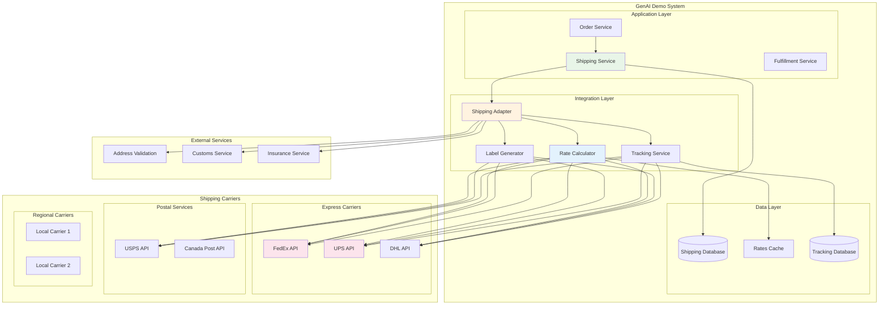

# Infrastructure Viewpoint - Shipping Integration

**Document Version**: 1.0  
**Last Updated**: September 28, 2025 11:54 PM (Taipei Time)  
**Author**: Infrastructure Team  
**Status**: Active

## 📋 Table of Contents

- Overview
- Shipping Integration Architecture
- Carrier Integration
- Shipping Rate Calculation
- Order Fulfillment Integration
- Tracking and Notifications
- Returns Management
- Monitoring and Analytics

## Overview

GenAI Demo system integrates with multiple shipping carriers and logistics providers to offer comprehensive shipping solutions. The system provides real-time shipping rates, automated label generation, package tracking, and delivery notifications.

### Design Objectives

- **Multi-Carrier Support**: Integration with multiple shipping carriers for competitive rates and service options
- **Real-time Rates**: Dynamic shipping rate calculation based on package dimensions, weight, and destination
- **Automated Processing**: Streamlined label generation and shipment processing
- **Package Tracking**: Real-time tracking updates and delivery notifications
- **Returns Management**: Simplified return label generation and processing
- **Analytics**: Comprehensive shipping performance analytics and cost optimization

## Shipping Integration Architecture

### Overall Architecture Diagram



## Carrier Integration

### FedEx Integration

```java
@Service
@Slf4j
public class FedExShippingService implements CarrierService {
    
    private final FedExApiClient fedexClient;
    private final ShippingConfigurationService configService;
    
    @Override
    public ShippingRateResponse getRates(ShippingRateRequest request) {
        try {
            FedExRateRequest fedexRequest = FedExRateRequest.builder()
                .accountNumber(configService.getFedExAccountNumber())
                .meterNumber(configService.getFedExMeterNumber())
                .shipper(mapToFedExAddress(request.getShipperAddress()))
                .recipient(mapToFedExAddress(request.getRecipientAddress()))
                .packages(mapToFedExPackages(request.getPackages()))
                .serviceTypes(request.getServiceTypes())
                .build();
            
            FedExRateResponse response = fedexClient.getRates(fedexRequest);
            
            return ShippingRateResponse.builder()
                .carrier(CarrierType.FEDEX)
                .rates(mapFromFedExRates(response.getRates()))
                .estimatedDeliveryDates(response.getDeliveryDates())
                .build();
                
        } catch (FedExApiException e) {
            log.error("FedEx rate calculation failed: {}", e.getMessage(), e);
            throw new ShippingServiceException("Failed to get FedEx rates", e);
        }
    }
    
    @Override
    public ShipmentResponse createShipment(ShipmentRequest request) {
        try {
            FedExShipmentRequest fedexRequest = FedExShipmentRequest.builder()
                .accountNumber(configService.getFedExAccountNumber())
                .meterNumber(configService.getFedExMeterNumber())
                .shipper(mapToFedExAddress(request.getShipperAddress()))
                .recipient(mapToFedExAddress(request.getRecipientAddress()))
                .packages(mapToFedExPackages(request.getPackages()))
                .serviceType(request.getServiceType())
                .labelSpecification(createLabelSpecification())
                .build();
            
            FedExShipmentResponse response = fedexClient.createShipment(fedexRequest);
            
            return ShipmentResponse.builder()
                .carrier(CarrierType.FEDEX)
                .trackingNumber(response.getTrackingNumber())
                .labelUrl(response.getLabelUrl())
                .totalCost(response.getTotalCost())
                .estimatedDeliveryDate(response.getEstimatedDeliveryDate())
                .build();
                
        } catch (FedExApiException e) {
            log.error("FedEx shipment creation failed: {}", e.getMessage(), e);
            throw new ShippingServiceException("Failed to create FedEx shipment", e);
        }
    }
}
```

### UPS Integration

```java
@Service
@Slf4j
public class UPSShippingService implements CarrierService {
    
    private final UPSApiClient upsClient;
    private final ShippingConfigurationService configService;
    
    @Override
    public ShippingRateResponse getRates(ShippingRateRequest request) {
        try {
            UPSRatingRequest upsRequest = UPSRatingRequest.builder()
                .accessLicenseNumber(configService.getUPSAccessKey())
                .userId(configService.getUPSUserId())
                .password(configService.getUPSPassword())
                .shipperNumber(configService.getUPSShipperNumber())
                .shipFrom(mapToUPSAddress(request.getShipperAddress()))
                .shipTo(mapToUPSAddress(request.getRecipientAddress()))
                .packages(mapToUPSPackages(request.getPackages()))
                .build();
            
            UPSRatingResponse response = upsClient.getRating(upsRequest);
            
            return ShippingRateResponse.builder()
                .carrier(CarrierType.UPS)
                .rates(mapFromUPSRates(response.getRatedShipments()))
                .build();
                
        } catch (UPSApiException e) {
            log.error("UPS rate calculation failed: {}", e.getMessage(), e);
            throw new ShippingServiceException("Failed to get UPS rates", e);
        }
    }
}
```

## Shipping Rate Calculation

### Multi-Carrier Rate Comparison

```java
@Service
@Slf4j
public class ShippingRateCalculationService {
    
    private final List<CarrierService> carrierServices;
    private final ShippingRuleEngine ruleEngine;
    private final RedisTemplate<String, Object> redisTemplate;
    
    public ShippingRateResponse calculateRates(ShippingRateRequest request) {
        // Check cache first
        String cacheKey = generateCacheKey(request);
        ShippingRateResponse cachedRates = getCachedRates(cacheKey);
        if (cachedRates != null) {
            return cachedRates;
        }
        
        List<CompletableFuture<ShippingRateResponse>> futures = carrierServices.stream()
            .map(service -> CompletableFuture.supplyAsync(() -> {
                try {
                    return service.getRates(request);
                } catch (Exception e) {
                    log.warn("Failed to get rates from carrier: {}", service.getCarrierType(), e);
                    return null;
                }
            }))
            .collect(Collectors.toList());
        
        // Wait for all carrier responses
        List<ShippingRateResponse> responses = futures.stream()
            .map(CompletableFuture::join)
            .filter(Objects::nonNull)
            .collect(Collectors.toList());
        
        // Combine and sort rates
        ShippingRateResponse combinedResponse = combineRates(responses);
        
        // Apply business rules
        ShippingRateResponse filteredResponse = ruleEngine.applyRules(combinedResponse, request);
        
        // Cache the results
        cacheRates(cacheKey, filteredResponse);
        
        return filteredResponse;
    }
    
    private ShippingRateResponse combineRates(List<ShippingRateResponse> responses) {
        List<ShippingRate> allRates = responses.stream()
            .flatMap(response -> response.getRates().stream())
            .sorted(Comparator.comparing(ShippingRate::getTotalCost))
            .collect(Collectors.toList());
        
        return ShippingRateResponse.builder()
            .rates(allRates)
            .build();
    }
}
```

### Dynamic Pricing Rules

```java
@Component
public class ShippingRuleEngine {
    
    public ShippingRateResponse applyRules(ShippingRateResponse response, ShippingRateRequest request) {
        List<ShippingRate> filteredRates = response.getRates().stream()
            .filter(rate -> applyBusinessRules(rate, request))
            .map(rate -> applyPricingRules(rate, request))
            .collect(Collectors.toList());
        
        return ShippingRateResponse.builder()
            .rates(filteredRates)
            .build();
    }
    
    private boolean applyBusinessRules(ShippingRate rate, ShippingRateRequest request) {
        // Free shipping threshold
        if (request.getOrderValue().compareTo(new BigDecimal("100")) >= 0) {
            return rate.getServiceType().equals("GROUND");
        }
        
        // Express shipping for high-value items
        if (request.getOrderValue().compareTo(new BigDecimal("500")) >= 0) {
            return rate.getServiceType().contains("EXPRESS");
        }
        
        // International shipping restrictions
        if (request.isInternational()) {
            return rate.getCarrier().supportsInternational();
        }
        
        return true;
    }
    
    private ShippingRate applyPricingRules(ShippingRate rate, ShippingRateRequest request) {
        BigDecimal adjustedCost = rate.getTotalCost();
        
        // Volume discount
        if (request.getPackages().size() > 5) {
            adjustedCost = adjustedCost.multiply(new BigDecimal("0.9")); // 10% discount
        }
        
        // Loyalty program discount
        if (request.getCustomerTier().equals("PREMIUM")) {
            adjustedCost = adjustedCost.multiply(new BigDecimal("0.95")); // 5% discount
        }
        
        return rate.toBuilder()
            .totalCost(adjustedCost)
            .build();
    }
}
```

## Order Fulfillment Integration

### Automated Shipping Label Generation

```java
@Service
@Slf4j
public class ShippingLabelService {
    
    private final Map<CarrierType, CarrierService> carrierServices;
    private final DocumentStorageService documentStorage;
    
    public ShippingLabelResponse generateLabel(ShippingLabelRequest request) {
        try {
            CarrierService carrierService = carrierServices.get(request.getCarrierType());
            if (carrierService == null) {
                throw new UnsupportedCarrierException("Carrier not supported: " + request.getCarrierType());
            }
            
            // Create shipment and get label
            ShipmentResponse shipmentResponse = carrierService.createShipment(
                mapToShipmentRequest(request));
            
            // Store label document
            String labelUrl = documentStorage.storeDocument(
                shipmentResponse.getLabelUrl(),
                "shipping-labels",
                shipmentResponse.getTrackingNumber() + ".pdf"
            );
            
            // Save shipment record
            Shipment shipment = Shipment.builder()
                .trackingNumber(shipmentResponse.getTrackingNumber())
                .carrier(request.getCarrierType())
                .serviceType(request.getServiceType())
                .labelUrl(labelUrl)
                .totalCost(shipmentResponse.getTotalCost())
                .estimatedDeliveryDate(shipmentResponse.getEstimatedDeliveryDate())
                .status(ShipmentStatus.LABEL_CREATED)
                .createdAt(Instant.now())
                .build();
            
            shipmentRepository.save(shipment);
            
            return ShippingLabelResponse.builder()
                .trackingNumber(shipmentResponse.getTrackingNumber())
                .labelUrl(labelUrl)
                .totalCost(shipmentResponse.getTotalCost())
                .estimatedDeliveryDate(shipmentResponse.getEstimatedDeliveryDate())
                .build();
                
        } catch (Exception e) {
            log.error("Failed to generate shipping label: {}", e.getMessage(), e);
            throw new ShippingLabelException("Failed to generate shipping label", e);
        }
    }
}
```

## Tracking and Notifications

### Real-time Package Tracking

```java
@Service
@Slf4j
public class PackageTrackingService {
    
    private final Map<CarrierType, CarrierService> carrierServices;
    private final NotificationService notificationService;
    
    @Scheduled(fixedRate = 300000) // Every 5 minutes
    public void updateTrackingStatus() {
        List<Shipment> activeShipments = shipmentRepository.findByStatusIn(
            Arrays.asList(ShipmentStatus.LABEL_CREATED, ShipmentStatus.IN_TRANSIT, ShipmentStatus.OUT_FOR_DELIVERY)
        );
        
        for (Shipment shipment : activeShipments) {
            try {
                updateShipmentTracking(shipment);
            } catch (Exception e) {
                log.error("Failed to update tracking for shipment: {}", shipment.getTrackingNumber(), e);
            }
        }
    }
    
    private void updateShipmentTracking(Shipment shipment) {
        CarrierService carrierService = carrierServices.get(shipment.getCarrier());
        if (carrierService == null) {
            return;
        }
        
        TrackingResponse trackingResponse = carrierService.getTrackingInfo(shipment.getTrackingNumber());
        
        if (!trackingResponse.getStatus().equals(shipment.getStatus())) {
            ShipmentStatus oldStatus = shipment.getStatus();
            shipment.setStatus(trackingResponse.getStatus());
            shipment.setLastUpdated(Instant.now());
            
            if (trackingResponse.getActualDeliveryDate() != null) {
                shipment.setActualDeliveryDate(trackingResponse.getActualDeliveryDate());
            }
            
            shipmentRepository.save(shipment);
            
            // Send notification for status changes
            sendStatusChangeNotification(shipment, oldStatus, trackingResponse.getStatus());
        }
        
        // Update tracking events
        updateTrackingEvents(shipment, trackingResponse.getTrackingEvents());
    }
    
    private void sendStatusChangeNotification(Shipment shipment, ShipmentStatus oldStatus, ShipmentStatus newStatus) {
        if (shouldNotifyCustomer(oldStatus, newStatus)) {
            TrackingNotification notification = TrackingNotification.builder()
                .trackingNumber(shipment.getTrackingNumber())
                .orderId(shipment.getOrderId())
                .customerId(shipment.getCustomerId())
                .status(newStatus)
                .estimatedDeliveryDate(shipment.getEstimatedDeliveryDate())
                .actualDeliveryDate(shipment.getActualDeliveryDate())
                .build();
            
            notificationService.sendTrackingNotification(notification);
        }
    }
}
```

### Delivery Notifications

```java
@Component
public class DeliveryNotificationService {
    
    private final EmailService emailService;
    private final SMSService smsService;
    private final PushNotificationService pushService;
    
    public void sendTrackingNotification(TrackingNotification notification) {
        Customer customer = customerService.findById(notification.getCustomerId());
        
        switch (notification.getStatus()) {
            case SHIPPED:
                sendShippedNotification(customer, notification);
                break;
            case OUT_FOR_DELIVERY:
                sendOutForDeliveryNotification(customer, notification);
                break;
            case DELIVERED:
                sendDeliveredNotification(customer, notification);
                break;
            case DELIVERY_EXCEPTION:
                sendDeliveryExceptionNotification(customer, notification);
                break;
        }
    }
    
    private void sendShippedNotification(Customer customer, TrackingNotification notification) {
        EmailTemplate template = EmailTemplate.builder()
            .templateId("order-shipped")
            .recipient(customer.getEmail())
            .variables(Map.of(
                "customerName", customer.getName(),
                "trackingNumber", notification.getTrackingNumber(),
                "estimatedDeliveryDate", notification.getEstimatedDeliveryDate(),
                "trackingUrl", generateTrackingUrl(notification.getTrackingNumber())
            ))
            .build();
        
        emailService.sendEmail(template);
        
        // Send push notification if customer has app
        if (customer.hasPushNotifications()) {
            PushNotification push = PushNotification.builder()
                .userId(customer.getId())
                .title("Your order has shipped!")
                .message("Track your package: " + notification.getTrackingNumber())
                .data(Map.of("trackingNumber", notification.getTrackingNumber()))
                .build();
            
            pushService.sendNotification(push);
        }
    }
}
```

## Returns Management

### Return Label Generation

```java
@Service
@Slf4j
public class ReturnsService {
    
    private final Map<CarrierType, CarrierService> carrierServices;
    private final ReturnPolicyService returnPolicyService;
    
    public ReturnLabelResponse generateReturnLabel(ReturnLabelRequest request) {
        try {
            // Validate return eligibility
            ReturnEligibility eligibility = returnPolicyService.checkEligibility(request.getOrderId());
            if (!eligibility.isEligible()) {
                throw new ReturnNotEligibleException(eligibility.getReason());
            }
            
            // Get original shipment details
            Shipment originalShipment = shipmentRepository.findByOrderId(request.getOrderId())
                .orElseThrow(() -> new ShipmentNotFoundException("Original shipment not found"));
            
            // Create return shipment request
            ShipmentRequest returnShipmentRequest = ShipmentRequest.builder()
                .shipperAddress(originalShipment.getRecipientAddress()) // Customer address
                .recipientAddress(originalShipment.getShipperAddress()) // Warehouse address
                .packages(request.getReturnPackages())
                .serviceType("GROUND") // Use ground service for returns
                .isReturn(true)
                .originalTrackingNumber(originalShipment.getTrackingNumber())
                .build();
            
            // Generate return label
            CarrierService carrierService = carrierServices.get(originalShipment.getCarrier());
            ShipmentResponse returnShipment = carrierService.createReturnShipment(returnShipmentRequest);
            
            // Save return record
            Return returnRecord = Return.builder()
                .orderId(request.getOrderId())
                .originalTrackingNumber(originalShipment.getTrackingNumber())
                .returnTrackingNumber(returnShipment.getTrackingNumber())
                .returnLabelUrl(returnShipment.getLabelUrl())
                .reason(request.getReason())
                .status(ReturnStatus.LABEL_CREATED)
                .createdAt(Instant.now())
                .build();
            
            returnRepository.save(returnRecord);
            
            return ReturnLabelResponse.builder()
                .returnTrackingNumber(returnShipment.getTrackingNumber())
                .returnLabelUrl(returnShipment.getLabelUrl())
                .returnInstructions(generateReturnInstructions(returnRecord))
                .build();
                
        } catch (Exception e) {
            log.error("Failed to generate return label: {}", e.getMessage(), e);
            throw new ReturnLabelException("Failed to generate return label", e);
        }
    }
}
```

## Monitoring and Analytics

### Shipping Performance Metrics

```java
@Component
public class ShippingMetrics {
    
    private final Counter shipmentsCreated;
    private final Counter deliverySuccesses;
    private final Counter deliveryFailures;
    private final Timer deliveryTime;
    private final Gauge averageShippingCost;
    
    public ShippingMetrics(MeterRegistry meterRegistry) {
        this.shipmentsCreated = Counter.builder("shipping.shipments.created")
            .description("Total shipments created")
            .register(meterRegistry);
            
        this.deliverySuccesses = Counter.builder("shipping.deliveries.success")
            .description("Successful deliveries")
            .register(meterRegistry);
            
        this.deliveryFailures = Counter.builder("shipping.deliveries.failure")
            .description("Failed deliveries")
            .register(meterRegistry);
            
        this.deliveryTime = Timer.builder("shipping.delivery.time")
            .description("Time from shipment to delivery")
            .register(meterRegistry);
            
        this.averageShippingCost = Gauge.builder("shipping.cost.average")
            .description("Average shipping cost")
            .register(meterRegistry, this, ShippingMetrics::calculateAverageShippingCost);
    }
    
    public void recordShipmentCreated(CarrierType carrier, String serviceType) {
        shipmentsCreated.increment(Tags.of(
            "carrier", carrier.name().toLowerCase(),
            "service_type", serviceType
        ));
    }
    
    public void recordDeliverySuccess(CarrierType carrier, Duration deliveryDuration) {
        deliverySuccesses.increment(Tags.of("carrier", carrier.name().toLowerCase()));
        deliveryTime.record(deliveryDuration, Tags.of("carrier", carrier.name().toLowerCase()));
    }
    
    private double calculateAverageShippingCost() {
        return shippingAnalyticsService.getAverageShippingCost();
    }
}
```

### Shipping Analytics Dashboard

```yaml
CloudWatch Dashboard:
  
  Shipping Performance:
    Widgets:
      - Shipments Created (by carrier)
      - Delivery Success Rate (by carrier)
      - Average Delivery Time (by service type)
      - Shipping Cost Trends
      - Return Rate Analysis
      
  Carrier Performance:
    Widgets:
      - Carrier Comparison (cost vs delivery time)
      - Service Level Performance
      - Delivery Exception Rates
      - Customer Satisfaction by Carrier
      
  Cost Analysis:
    Widgets:
      - Shipping Cost Distribution
      - Cost per Package Trends
      - Carrier Cost Comparison
      - Discount Utilization

Alarms:
  
  High Delivery Failure Rate:
    Metric: shipping.deliveries.failure
    Threshold: > 5% failure rate
    Action: SNS notification to operations team
    
  Slow Delivery Performance:
    Metric: shipping.delivery.time (P95)
    Threshold: > 7 days for ground shipping
    Action: SNS notification to logistics team
    
  High Shipping Costs:
    Metric: shipping.cost.average
    Threshold: > 20% increase from baseline
    Action: SNS notification to finance team
```

---

**Document Status**: ✅ Complete  
**Next Step**: Review [Payment Gateway Integration](./payment-gateway-integration.md) for payment processing integration  
**Related Documents**: 
- [Infrastructure Viewpoint - Warehouse Integration](./warehouse-integration.md)
- [Infrastructure Viewpoint - AWS Resource Architecture](./aws-resource-architecture.md)
- Operational Viewpoint - Monitoring and Alerting