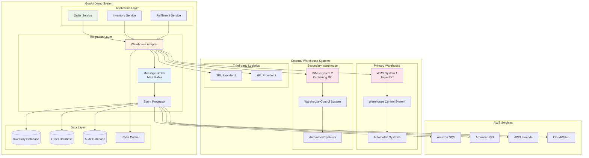
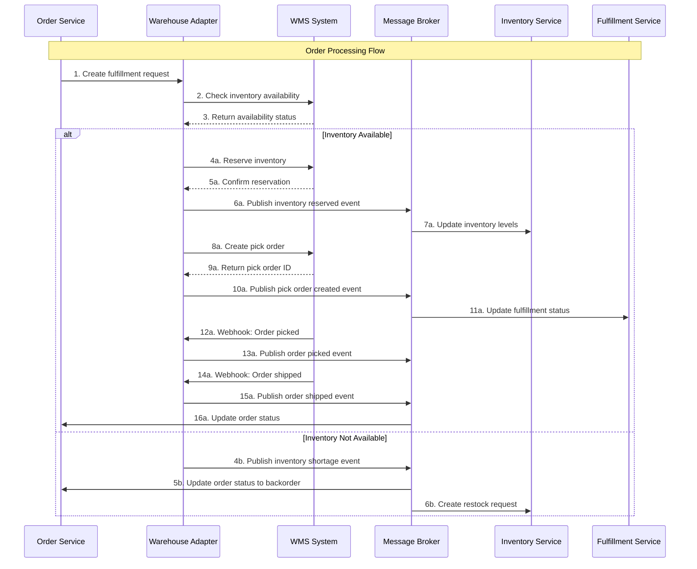

# Infrastructure Viewpoint - Warehouse Management System Integration

**Document Version**: 1.0  
**Last Updated**: September 28, 2025 11:12 PM (Taipei Time)  
**Author**: Infrastructure Team  
**Status**: Active

## 📋 Table of Contents

- Overview
- Warehouse Integration Architecture
- Inventory Management
- Order Fulfillment Process
- Real-time Synchronization
- Error Handling and Recovery
- Performance Optimization
- Monitoring and Alerting

## Overview

GenAI Demo system integrates with multiple warehouse management systems (WMS) to provide real-time inventory management and automated order fulfillment. The system supports both third-party WMS integration and internal warehouse operations, ensuring accurate inventory tracking and efficient order processing.

### Integration Objectives

- **Real-time Inventory Sync**: Maintain accurate inventory levels across all sales channels
- **Automated Order Fulfillment**: Streamline order processing from placement to shipment
- **Multi-warehouse Support**: Support multiple warehouse locations and distribution centers
- **Scalable Architecture**: Handle high-volume transactions with minimal latency
- **Error Recovery**: Robust error handling and data consistency mechanisms

## Warehouse Integration Architecture

### Overall Architecture Diagram



### Integration Patterns



## Inventory Management

### Real-time Inventory Tracking

```java
@Service
@Slf4j
public class InventoryService {
    
    private final InventoryRepository inventoryRepository;
    private final WarehouseAdapter warehouseAdapter;
    private final RedisTemplate<String, Object> redisTemplate;
    private final KafkaTemplate<String, Object> kafkaTemplate;
    
    @Transactional
    public InventoryReservationResult reserveInventory(InventoryReservationRequest request) {
        try {
            // Check cache first for performance
            String cacheKey = "inventory:" + request.getProductId() + ":" + request.getWarehouseId();
            InventoryLevel cachedLevel = (InventoryLevel) redisTemplate.opsForValue().get(cacheKey);
            
            if (cachedLevel != null && cachedLevel.getAvailableQuantity() >= request.getQuantity()) {
                // Reserve from cache
                cachedLevel.setReservedQuantity(cachedLevel.getReservedQuantity() + request.getQuantity());
                cachedLevel.setAvailableQuantity(cachedLevel.getAvailableQuantity() - request.getQuantity());
                redisTemplate.opsForValue().set(cacheKey, cachedLevel, Duration.ofMinutes(15));
                
                // Async update to WMS
                CompletableFuture.runAsync(() -> {
                    try {
                        warehouseAdapter.reserveInventory(request);
                    } catch (Exception e) {
                        log.error("Failed to sync inventory reservation to WMS", e);
                        // Compensate cache if WMS fails
                        compensateInventoryReservation(request);
                    }
                });
                
                // Update database
                updateInventoryDatabase(request);
                
                // Publish event
                publishInventoryReservedEvent(request);
                
                return InventoryReservationResult.success(request.getReservationId());
            } else {
                // Check real-time inventory from WMS
                InventoryLevel realTimeLevel = warehouseAdapter.getInventoryLevel(
                    request.getProductId(), request.getWarehouseId());
                
                if (realTimeLevel.getAvailableQuantity() >= request.getQuantity()) {
                    // Reserve inventory
                    WarehouseReservationResult wmsResult = warehouseAdapter.reserveInventory(request);
                    
                    if (wmsResult.isSuccess()) {
                        // Update cache and database
                        updateInventoryCache(request, realTimeLevel);
                        updateInventoryDatabase(request);
                        publishInventoryReservedEvent(request);
                        
                        return InventoryReservationResult.success(wmsResult.getReservationId());
                    }
                }
                
                return InventoryReservationResult.failure("Insufficient inventory");
            }
            
        } catch (Exception e) {
            log.error("Failed to reserve inventory", e);
            return InventoryReservationResult.error("System error during inventory reservation");
        }
    }
    
    @EventListener
    public void handleInventoryUpdateEvent(InventoryUpdateEvent event) {
        try {
            // Update cache
            String cacheKey = "inventory:" + event.getProductId() + ":" + event.getWarehouseId();
            InventoryLevel level = InventoryLevel.builder()
                .productId(event.getProductId())
                .warehouseId(event.getWarehouseId())
                .totalQuantity(event.getTotalQuantity())
                .availableQuantity(event.getAvailableQuantity())
                .reservedQuantity(event.getReservedQuantity())
                .lastUpdated(Instant.now())
                .build();
            
            redisTemplate.opsForValue().set(cacheKey, level, Duration.ofHours(1));
            
            // Update database
            inventoryRepository.updateInventoryLevel(level);
            
            // Check for low stock alerts
            if (event.getAvailableQuantity() < event.getReorderPoint()) {
                publishLowStockAlert(event);
            }
            
        } catch (Exception e) {
            log.error("Failed to handle inventory update event", e);
        }
    }
    
    private void compensateInventoryReservation(InventoryReservationRequest request) {
        String cacheKey = "inventory:" + request.getProductId() + ":" + request.getWarehouseId();
        InventoryLevel cachedLevel = (InventoryLevel) redisTemplate.opsForValue().get(cacheKey);
        
        if (cachedLevel != null) {
            cachedLevel.setReservedQuantity(cachedLevel.getReservedQuantity() - request.getQuantity());
            cachedLevel.setAvailableQuantity(cachedLevel.getAvailableQuantity() + request.getQuantity());
            redisTemplate.opsForValue().set(cacheKey, cachedLevel, Duration.ofMinutes(15));
        }
    }
}
```

### Multi-warehouse Inventory Allocation

```java
@Service
public class InventoryAllocationService {
    
    private final List<WarehouseConfig> warehouses;
    private final InventoryService inventoryService;
    private final ShippingCostCalculator shippingCalculator;
    
    public AllocationResult allocateInventory(AllocationRequest request) {
        List<AllocationOption> options = new ArrayList<>();
        
        // Get inventory levels from all warehouses
        for (WarehouseConfig warehouse : warehouses) {
            InventoryLevel level = inventoryService.getInventoryLevel(
                request.getProductId(), warehouse.getId());
            
            if (level.getAvailableQuantity() >= request.getQuantity()) {
                // Calculate shipping cost and delivery time
                ShippingQuote quote = shippingCalculator.calculateShipping(
                    warehouse.getLocation(), request.getDeliveryAddress(), request.getQuantity());
                
                AllocationOption option = AllocationOption.builder()
                    .warehouseId(warehouse.getId())
                    .availableQuantity(level.getAvailableQuantity())
                    .shippingCost(quote.getCost())
                    .estimatedDeliveryTime(quote.getEstimatedDeliveryTime())
                    .priority(warehouse.getPriority())
                    .build();
                
                options.add(option);
            }
        }
        
        if (options.isEmpty()) {
            return AllocationResult.failure("No warehouse has sufficient inventory");
        }
        
        // Sort by priority, shipping cost, and delivery time
        AllocationOption bestOption = options.stream()
            .sorted(Comparator
                .comparing(AllocationOption::getPriority)
                .thenComparing(AllocationOption::getShippingCost)
                .thenComparing(AllocationOption::getEstimatedDeliveryTime))
            .findFirst()
            .orElseThrow();
        
        return AllocationResult.success(bestOption.getWarehouseId());
    }
    
    public AllocationResult allocateMultipleItems(List<AllocationRequest> requests) {
        Map<String, List<AllocationRequest>> warehouseAllocations = new HashMap<>();
        
        for (AllocationRequest request : requests) {
            AllocationResult result = allocateInventory(request);
            if (result.isSuccess()) {
                warehouseAllocations.computeIfAbsent(result.getWarehouseId(), k -> new ArrayList<>())
                    .add(request);
            } else {
                return AllocationResult.failure("Cannot allocate item: " + request.getProductId());
            }
        }
        
        // Optimize for minimum number of shipments
        return optimizeShipments(warehouseAllocations);
    }
}
```

## Order Fulfillment Process

### Automated Fulfillment Workflow

```java
@Service
@Slf4j
public class FulfillmentService {
    
    private final WarehouseAdapter warehouseAdapter;
    private final OrderRepository orderRepository;
    private final ShippingService shippingService;
    private final NotificationService notificationService;
    
    @Async
    public CompletableFuture<FulfillmentResult> processFulfillment(FulfillmentRequest request) {
        try {
            // Step 1: Validate order
            Order order = orderRepository.findById(request.getOrderId())
                .orElseThrow(() -> new OrderNotFoundException("Order not found: " + request.getOrderId()));
            
            if (!order.getStatus().equals(OrderStatus.CONFIRMED)) {
                return CompletableFuture.completedFuture(
                    FulfillmentResult.failure("Order is not in confirmed status"));
            }
            
            // Step 2: Allocate inventory
            List<AllocationRequest> allocationRequests = order.getItems().stream()
                .map(item -> AllocationRequest.builder()
                    .productId(item.getProductId())
                    .quantity(item.getQuantity())
                    .deliveryAddress(order.getShippingAddress())
                    .build())
                .collect(Collectors.toList());
            
            AllocationResult allocationResult = inventoryAllocationService.allocateMultipleItems(allocationRequests);
            if (!allocationResult.isSuccess()) {
                return CompletableFuture.completedFuture(
                    FulfillmentResult.failure("Inventory allocation failed: " + allocationResult.getErrorMessage()));
            }
            
            // Step 3: Create pick orders in WMS
            List<PickOrder> pickOrders = new ArrayList<>();
            for (Map.Entry<String, List<AllocationRequest>> entry : allocationResult.getWarehouseAllocations().entrySet()) {
                String warehouseId = entry.getKey();
                List<AllocationRequest> items = entry.getValue();
                
                PickOrderRequest pickRequest = PickOrderRequest.builder()
                    .orderId(order.getId())
                    .warehouseId(warehouseId)
                    .items(items)
                    .priority(order.getPriority())
                    .shippingAddress(order.getShippingAddress())
                    .build();
                
                PickOrderResult pickResult = warehouseAdapter.createPickOrder(pickRequest);
                if (pickResult.isSuccess()) {
                    pickOrders.add(pickResult.getPickOrder());
                } else {
                    // Rollback previous allocations
                    rollbackAllocations(pickOrders);
                    return CompletableFuture.completedFuture(
                        FulfillmentResult.failure("Failed to create pick order: " + pickResult.getErrorMessage()));
                }
            }
            
            // Step 4: Update order status
            order.setStatus(OrderStatus.PROCESSING);
            order.setFulfillmentStartedAt(Instant.now());
            orderRepository.save(order);
            
            // Step 5: Send notification
            notificationService.sendOrderProcessingNotification(order);
            
            // Step 6: Monitor fulfillment progress
            monitorFulfillmentProgress(order.getId(), pickOrders);
            
            return CompletableFuture.completedFuture(FulfillmentResult.success(pickOrders));
            
        } catch (Exception e) {
            log.error("Fulfillment processing failed for order: {}", request.getOrderId(), e);
            return CompletableFuture.completedFuture(
                FulfillmentResult.error("System error during fulfillment processing"));
        }
    }
    
    @EventListener
    public void handlePickOrderCompleted(PickOrderCompletedEvent event) {
        try {
            Order order = orderRepository.findById(event.getOrderId())
                .orElseThrow(() -> new OrderNotFoundException("Order not found: " + event.getOrderId()));
            
            // Check if all pick orders are completed
            boolean allCompleted = order.getPickOrders().stream()
                .allMatch(pickOrder -> pickOrder.getStatus().equals(PickOrderStatus.COMPLETED));
            
            if (allCompleted) {
                // Create shipping labels
                List<ShippingLabel> labels = createShippingLabels(order);
                
                // Update order status
                order.setStatus(OrderStatus.READY_TO_SHIP);
                order.setPickCompletedAt(Instant.now());
                orderRepository.save(order);
                
                // Notify warehouse to ship
                notifyWarehouseToShip(order, labels);
                
                // Send notification to customer
                notificationService.sendOrderReadyToShipNotification(order);
            }
            
        } catch (Exception e) {
            log.error("Failed to handle pick order completed event", e);
        }
    }
    
    @EventListener
    public void handleOrderShipped(OrderShippedEvent event) {
        try {
            Order order = orderRepository.findById(event.getOrderId())
                .orElseThrow(() -> new OrderNotFoundException("Order not found: " + event.getOrderId()));
            
            order.setStatus(OrderStatus.SHIPPED);
            order.setShippedAt(Instant.now());
            order.setTrackingNumbers(event.getTrackingNumbers());
            orderRepository.save(order);
            
            // Send shipping notification
            notificationService.sendOrderShippedNotification(order);
            
            // Schedule delivery tracking
            scheduleDeliveryTracking(order);
            
        } catch (Exception e) {
            log.error("Failed to handle order shipped event", e);
        }
    }
}
```

## Real-time Synchronization

### Event-Driven Synchronization

```java
@Component
@Slf4j
public class WarehouseEventProcessor {
    
    @KafkaListener(topics = "warehouse-events", groupId = "genai-demo-warehouse-group")
    public void processWarehouseEvent(
            @Payload WarehouseEvent event,
            @Header(KafkaHeaders.RECEIVED_TOPIC) String topic,
            @Header(KafkaHeaders.RECEIVED_PARTITION_ID) int partition) {
        
        try {
            log.info("Processing warehouse event: {} from partition: {}", event.getEventType(), partition);
            
            switch (event.getEventType()) {
                case INVENTORY_UPDATED:
                    handleInventoryUpdated((InventoryUpdatedEvent) event);
                    break;
                case PICK_ORDER_CREATED:
                    handlePickOrderCreated((PickOrderCreatedEvent) event);
                    break;
                case PICK_ORDER_COMPLETED:
                    handlePickOrderCompleted((PickOrderCompletedEvent) event);
                    break;
                case ORDER_SHIPPED:
                    handleOrderShipped((OrderShippedEvent) event);
                    break;
                case INVENTORY_ADJUSTMENT:
                    handleInventoryAdjustment((InventoryAdjustmentEvent) event);
                    break;
                default:
                    log.warn("Unknown warehouse event type: {}", event.getEventType());
            }
            
        } catch (Exception e) {
            log.error("Failed to process warehouse event: {}", event, e);
            // Send to dead letter queue for manual processing
            sendToDeadLetterQueue(event, e);
        }
    }
    
    private void handleInventoryUpdated(InventoryUpdatedEvent event) {
        // Update local inventory cache
        String cacheKey = "inventory:" + event.getProductId() + ":" + event.getWarehouseId();
        InventoryLevel level = InventoryLevel.builder()
            .productId(event.getProductId())
            .warehouseId(event.getWarehouseId())
            .totalQuantity(event.getTotalQuantity())
            .availableQuantity(event.getAvailableQuantity())
            .reservedQuantity(event.getReservedQuantity())
            .lastUpdated(event.getTimestamp())
            .build();
        
        redisTemplate.opsForValue().set(cacheKey, level, Duration.ofHours(1));
        
        // Update database
        inventoryRepository.updateInventoryLevel(level);
        
        // Publish internal event
        applicationEventPublisher.publishEvent(new InventoryLevelChangedEvent(level));
    }
    
    private void handlePickOrderCompleted(PickOrderCompletedEvent event) {
        // Update pick order status
        pickOrderRepository.updateStatus(event.getPickOrderId(), PickOrderStatus.COMPLETED);
        
        // Update inventory levels
        for (PickOrderItem item : event.getItems()) {
            inventoryService.updateInventoryAfterPick(
                item.getProductId(), 
                event.getWarehouseId(), 
                item.getQuantity());
        }
        
        // Publish internal event
        applicationEventPublisher.publishEvent(event);
    }
}
```

### Batch Synchronization

```java
@Component
public class InventorySyncScheduler {
    
    private final WarehouseAdapter warehouseAdapter;
    private final InventoryService inventoryService;
    
    @Scheduled(fixedRate = 300000) // Every 5 minutes
    public void syncInventoryLevels() {
        try {
            log.info("Starting scheduled inventory synchronization");
            
            List<String> warehouses = warehouseAdapter.getActiveWarehouses();
            
            for (String warehouseId : warehouses) {
                syncWarehouseInventory(warehouseId);
            }
            
            log.info("Completed scheduled inventory synchronization");
            
        } catch (Exception e) {
            log.error("Failed to sync inventory levels", e);
        }
    }
    
    private void syncWarehouseInventory(String warehouseId) {
        try {
            // Get all products for this warehouse
            List<String> productIds = inventoryService.getProductsByWarehouse(warehouseId);
            
            // Batch request to WMS
            Map<String, InventoryLevel> wmsLevels = warehouseAdapter.getBatchInventoryLevels(
                warehouseId, productIds);
            
            // Compare with cached levels
            for (Map.Entry<String, InventoryLevel> entry : wmsLevels.entrySet()) {
                String productId = entry.getKey();
                InventoryLevel wmsLevel = entry.getValue();
                
                String cacheKey = "inventory:" + productId + ":" + warehouseId;
                InventoryLevel cachedLevel = (InventoryLevel) redisTemplate.opsForValue().get(cacheKey);
                
                if (cachedLevel == null || !cachedLevel.equals(wmsLevel)) {
                    // Update cache and database
                    redisTemplate.opsForValue().set(cacheKey, wmsLevel, Duration.ofHours(1));
                    inventoryRepository.updateInventoryLevel(wmsLevel);
                    
                    // Publish change event
                    applicationEventPublisher.publishEvent(
                        new InventoryLevelChangedEvent(wmsLevel));
                }
            }
            
        } catch (Exception e) {
            log.error("Failed to sync inventory for warehouse: {}", warehouseId, e);
        }
    }
}
```

## Error Handling and Recovery

### Circuit Breaker Implementation

```java
@Component
public class WarehouseCircuitBreaker {
    
    private final Map<String, CircuitBreaker> circuitBreakers = new ConcurrentHashMap<>();
    
    public CircuitBreaker getCircuitBreaker(String warehouseId) {
        return circuitBreakers.computeIfAbsent(warehouseId, id -> {
            CircuitBreakerConfig config = CircuitBreakerConfig.custom()
                .failureRateThreshold(50) // 50% failure rate
                .waitDurationInOpenState(Duration.ofSeconds(30))
                .slidingWindowSize(10)
                .minimumNumberOfCalls(5)
                .build();
            
            CircuitBreaker circuitBreaker = CircuitBreaker.of("warehouse-" + id, config);
            
            circuitBreaker.getEventPublisher()
                .onStateTransition(event -> 
                    log.info("Warehouse {} circuit breaker state transition: {} -> {}", 
                        id, event.getStateTransition().getFromState(), 
                        event.getStateTransition().getToState()));
            
            return circuitBreaker;
        });
    }
    
    public <T> T executeWithCircuitBreaker(String warehouseId, Supplier<T> operation) {
        CircuitBreaker circuitBreaker = getCircuitBreaker(warehouseId);
        Supplier<T> decoratedSupplier = CircuitBreaker.decorateSupplier(circuitBreaker, operation);
        
        return Try.ofSupplier(decoratedSupplier)
            .recover(throwable -> {
                log.error("Warehouse {} operation failed, circuit breaker activated", warehouseId, throwable);
                throw new WarehouseUnavailableException("Warehouse " + warehouseId + " is currently unavailable");
            })
            .get();
    }
}
```

### Data Consistency Recovery

```java
@Service
public class DataConsistencyService {
    
    @Scheduled(fixedRate = 600000) // Every 10 minutes
    public void checkDataConsistency() {
        try {
            log.info("Starting data consistency check");
            
            // Check inventory consistency
            checkInventoryConsistency();
            
            // Check order fulfillment consistency
            checkOrderFulfillmentConsistency();
            
            log.info("Completed data consistency check");
            
        } catch (Exception e) {
            log.error("Failed to check data consistency", e);
        }
    }
    
    private void checkInventoryConsistency() {
        List<InventoryInconsistency> inconsistencies = new ArrayList<>();
        
        // Get all active products
        List<String> productIds = inventoryService.getAllActiveProducts();
        
        for (String productId : productIds) {
            List<String> warehouses = warehouseAdapter.getWarehousesForProduct(productId);
            
            for (String warehouseId : warehouses) {
                try {
                    // Get levels from different sources
                    InventoryLevel dbLevel = inventoryRepository.getInventoryLevel(productId, warehouseId);
                    InventoryLevel cacheLevel = inventoryService.getCachedInventoryLevel(productId, warehouseId);
                    InventoryLevel wmsLevel = warehouseAdapter.getInventoryLevel(productId, warehouseId);
                    
                    // Check for inconsistencies
                    if (!isConsistent(dbLevel, cacheLevel, wmsLevel)) {
                        InventoryInconsistency inconsistency = InventoryInconsistency.builder()
                            .productId(productId)
                            .warehouseId(warehouseId)
                            .dbLevel(dbLevel)
                            .cacheLevel(cacheLevel)
                            .wmsLevel(wmsLevel)
                            .detectedAt(Instant.now())
                            .build();
                        
                        inconsistencies.add(inconsistency);
                    }
                    
                } catch (Exception e) {
                    log.error("Failed to check consistency for product {} in warehouse {}", 
                        productId, warehouseId, e);
                }
            }
        }
        
        // Resolve inconsistencies
        if (!inconsistencies.isEmpty()) {
            log.warn("Found {} inventory inconsistencies", inconsistencies.size());
            resolveInventoryInconsistencies(inconsistencies);
        }
    }
    
    private void resolveInventoryInconsistencies(List<InventoryInconsistency> inconsistencies) {
        for (InventoryInconsistency inconsistency : inconsistencies) {
            try {
                // Use WMS as source of truth
                InventoryLevel correctLevel = inconsistency.getWmsLevel();
                
                // Update database
                inventoryRepository.updateInventoryLevel(correctLevel);
                
                // Update cache
                String cacheKey = "inventory:" + inconsistency.getProductId() + ":" + inconsistency.getWarehouseId();
                redisTemplate.opsForValue().set(cacheKey, correctLevel, Duration.ofHours(1));
                
                // Log the correction
                auditService.logInventoryCorrection(inconsistency, correctLevel);
                
                log.info("Resolved inventory inconsistency for product {} in warehouse {}", 
                    inconsistency.getProductId(), inconsistency.getWarehouseId());
                
            } catch (Exception e) {
                log.error("Failed to resolve inventory inconsistency: {}", inconsistency, e);
            }
        }
    }
    
    private boolean isConsistent(InventoryLevel dbLevel, InventoryLevel cacheLevel, InventoryLevel wmsLevel) {
        if (dbLevel == null || cacheLevel == null || wmsLevel == null) {
            return false;
        }
        
        // Allow small differences due to timing
        long tolerance = 5; // 5 units tolerance
        
        return Math.abs(dbLevel.getAvailableQuantity() - wmsLevel.getAvailableQuantity()) <= tolerance &&
               Math.abs(cacheLevel.getAvailableQuantity() - wmsLevel.getAvailableQuantity()) <= tolerance;
    }
}
```

## Performance Optimization

### Caching Strategy

```java
@Configuration
public class WarehouseCacheConfiguration {
    
    @Bean
    public CacheManager warehouseCacheManager(RedisConnectionFactory connectionFactory) {
        RedisCacheConfiguration config = RedisCacheConfiguration.defaultCacheConfig()
            .entryTtl(Duration.ofMinutes(15)) // Short TTL for inventory data
            .serializeKeysWith(RedisSerializationContext.SerializationPair.fromSerializer(new StringRedisSerializer()))
            .serializeValuesWith(RedisSerializationContext.SerializationPair.fromSerializer(new GenericJackson2JsonRedisSerializer()));
        
        return RedisCacheManager.builder(connectionFactory)
            .cacheDefaults(config)
            .withCacheConfiguration("inventory", config.entryTtl(Duration.ofMinutes(15)))
            .withCacheConfiguration("warehouse-config", config.entryTtl(Duration.ofHours(1)))
            .withCacheConfiguration("shipping-rates", config.entryTtl(Duration.ofHours(6)))
            .build();
    }
}

@Service
public class WarehouseCacheService {
    
    private final RedisTemplate<String, Object> redisTemplate;
    
    @Cacheable(value = "inventory", key = "#productId + ':' + #warehouseId")
    public InventoryLevel getInventoryLevel(String productId, String warehouseId) {
        // This will be cached automatically
        return warehouseAdapter.getInventoryLevel(productId, warehouseId);
    }
    
    @CacheEvict(value = "inventory", key = "#productId + ':' + #warehouseId")
    public void evictInventoryCache(String productId, String warehouseId) {
        // Cache will be evicted automatically
    }
    
    public void warmUpCache() {
        // Pre-load frequently accessed inventory data
        List<String> popularProducts = getPopularProducts();
        List<String> activeWarehouses = getActiveWarehouses();
        
        for (String productId : popularProducts) {
            for (String warehouseId : activeWarehouses) {
                try {
                    getInventoryLevel(productId, warehouseId);
                } catch (Exception e) {
                    log.warn("Failed to warm up cache for product {} in warehouse {}", productId, warehouseId);
                }
            }
        }
    }
}
```

### Connection Pooling

```java
@Configuration
public class WarehouseConnectionConfiguration {
    
    @Bean
    public RestTemplate warehouseRestTemplate() {
        HttpComponentsClientHttpRequestFactory factory = new HttpComponentsClientHttpRequestFactory();
        
        // Connection pool configuration
        PoolingHttpClientConnectionManager connectionManager = new PoolingHttpClientConnectionManager();
        connectionManager.setMaxTotal(100); // Maximum total connections
        connectionManager.setDefaultMaxPerRoute(20); // Maximum connections per route
        
        // HTTP client configuration
        CloseableHttpClient httpClient = HttpClients.custom()
            .setConnectionManager(connectionManager)
            .setDefaultRequestConfig(RequestConfig.custom()
                .setConnectTimeout(5000) // 5 seconds
                .setSocketTimeout(30000) // 30 seconds
                .setConnectionRequestTimeout(5000) // 5 seconds
                .build())
            .setRetryHandler(new DefaultHttpRequestRetryHandler(3, true))
            .build();
        
        factory.setHttpClient(httpClient);
        factory.setConnectTimeout(5000);
        factory.setReadTimeout(30000);
        
        RestTemplate restTemplate = new RestTemplate(factory);
        
        // Add interceptors for logging and authentication
        restTemplate.getInterceptors().add(new LoggingInterceptor());
        restTemplate.getInterceptors().add(new AuthenticationInterceptor());
        
        return restTemplate;
    }
}
```

## Monitoring and Alerting

### Warehouse Integration Metrics

```java
@Component
public class WarehouseMetrics {
    
    private final Counter warehouseRequests;
    private final Counter warehouseErrors;
    private final Timer warehouseResponseTime;
    private final Gauge inventoryAccuracy;
    
    public WarehouseMetrics(MeterRegistry meterRegistry) {
        this.warehouseRequests = Counter.builder("warehouse.requests")
            .description("Total warehouse API requests")
            .register(meterRegistry);
            
        this.warehouseErrors = Counter.builder("warehouse.errors")
            .description("Warehouse API errors")
            .register(meterRegistry);
            
        this.warehouseResponseTime = Timer.builder("warehouse.response.time")
            .description("Warehouse API response time")
            .register(meterRegistry);
            
        this.inventoryAccuracy = Gauge.builder("warehouse.inventory.accuracy")
            .description("Inventory data accuracy percentage")
            .register(meterRegistry, this, WarehouseMetrics::calculateInventoryAccuracy);
    }
    
    public void recordWarehouseRequest(String warehouseId, String operation) {
        warehouseRequests.increment(Tags.of(
            "warehouse", warehouseId,
            "operation", operation
        ));
    }
    
    public void recordWarehouseError(String warehouseId, String operation, String errorType) {
        warehouseErrors.increment(Tags.of(
            "warehouse", warehouseId,
            "operation", operation,
            "error_type", errorType
        ));
    }
    
    public void recordResponseTime(String warehouseId, String operation, Duration duration) {
        warehouseResponseTime.record(duration, Tags.of(
            "warehouse", warehouseId,
            "operation", operation
        ));
    }
    
    private double calculateInventoryAccuracy() {
        // Calculate inventory accuracy based on recent consistency checks
        return dataConsistencyService.getInventoryAccuracyPercentage();
    }
}
```

### CloudWatch Dashboards

```yaml
CloudWatch Dashboards:
  
  Warehouse Operations Dashboard:
    Widgets:
      - Warehouse API Response Times (by warehouse)
      - Warehouse API Error Rates (by warehouse and operation)
      - Inventory Synchronization Status
      - Order Fulfillment Metrics
      - Circuit Breaker Status
      
  Inventory Management Dashboard:
    Widgets:
      - Real-time Inventory Levels (top products)
      - Inventory Accuracy Metrics
      - Low Stock Alerts
      - Inventory Turnover Rates
      - Reorder Point Violations
      
  Order Fulfillment Dashboard:
    Widgets:
      - Order Processing Times
      - Pick Order Success Rates
      - Shipping Performance
      - Fulfillment Error Rates
      - Customer Satisfaction Metrics

Alarms:
  
  High Error Rate:
    Metric: warehouse.errors
    Threshold: > 10 errors in 5 minutes
    Action: SNS notification to operations team
    
  Slow Response Time:
    Metric: warehouse.response.time (P95)
    Threshold: > 10 seconds
    Action: SNS notification to engineering team
    
  Inventory Accuracy:
    Metric: warehouse.inventory.accuracy
    Threshold: < 95%
    Action: SNS notification to inventory team
    
  Circuit Breaker Open:
    Metric: Custom metric from circuit breaker
    Threshold: Circuit breaker open for > 5 minutes
    Action: Immediate SNS notification and PagerDuty alert
```

### Health Checks

```java
@Component
public class WarehouseHealthIndicator implements HealthIndicator {
    
    private final List<WarehouseAdapter> warehouseAdapters;
    private final CircuitBreakerRegistry circuitBreakerRegistry;
    
    @Override
    public Health health() {
        Health.Builder builder = Health.up();
        
        for (WarehouseAdapter adapter : warehouseAdapters) {
            String warehouseId = adapter.getWarehouseId();
            
            try {
                // Check warehouse connectivity
                WarehouseHealthStatus status = adapter.checkHealth();
                
                if (status.isHealthy()) {
                    builder.withDetail(warehouseId, "UP");
                } else {
                    builder.withDetail(warehouseId, "DOWN - " + status.getErrorMessage());
                    builder.down();
                }
                
                // Check circuit breaker status
                CircuitBreaker circuitBreaker = circuitBreakerRegistry.circuitBreaker("warehouse-" + warehouseId);
                builder.withDetail(warehouseId + "_circuit_breaker", circuitBreaker.getState().name());
                
            } catch (Exception e) {
                builder.withDetail(warehouseId, "ERROR - " + e.getMessage());
                builder.down();
            }
        }
        
        return builder.build();
    }
}
```

---

**Document Status**: ✅ Complete  
**Next Step**: Review [Shipping Integration](./shipping-integration.md) for logistics and delivery management  
**Related Documents**: 
- [Infrastructure Viewpoint - Payment Gateway Integration](./payment-gateway-integration.md)
- Operational Viewpoint - Monitoring and Alerting
- [Information Viewpoint - Data Governance Architecture](../information/data-governance-architecture.md)