# 運營視點

## 概覽

運營視點關注系統的日常運營和維護，包括監控、日誌管理、故障排除和 SRE 實踐。

## 利害關係人

- **主要關注者**: SRE 工程師、運維人員、監控工程師
- **次要關注者**: 開發者、技術主管、事件響應團隊

## 關注點

1. **監控和可觀測性**: 系統健康狀態和性能監控
2. **日誌管理**: 日誌收集、分析和保留
3. **故障排除**: 問題診斷和根因分析
4. **事件響應**: 告警處理和事件管理
5. **維護和優化**: 系統維護和性能優化

## 架構元素

### 可觀測性系統

- **分散式追蹤**: AWS X-Ray、Jaeger
- **指標收集**: Micrometer、Prometheus、CloudWatch
- **日誌管理**: Logback、CloudWatch Logs、ELK Stack
- **健康檢查**: Spring Boot Actuator、Kubernetes 探針

#### 可觀測性架構圖

*完整的可觀測性架構，包括指標收集、日誌聚合、分散式追蹤、視覺化儀表板、警報系統和自動化修復機制*

### 監控基礎設施

- **指標存儲**: CloudWatch、Prometheus
- **日誌聚合**: CloudWatch Logs、Elasticsearch
- **可視化**: CloudWatch Dashboard、Grafana
- **告警**: CloudWatch Alarms、PagerDuty

### 運營工具

- **自動化**: Ansible、Terraform
- **配置管理**: AWS Systems Manager、Consul
- **備份**: AWS Backup、Velero
- **災難恢復**: 多區域部署、自動故障轉移

## 品質屬性考量

> 📋 **完整交叉引用**: 查看 [Viewpoint-Perspective 交叉引用矩陣](../../viewpoint-perspective-matrix.md#運營視點-operational-viewpoint) 了解所有觀點的詳細影響分析

### 🔴 高影響觀點

#### [安全性觀點](../../perspectives/security/README.md)
- **安全監控**: 安全事件的實時監控和告警機制
- **事件響應**: 安全事件的快速響應和處理流程
- **存取管理**: 運營人員的存取控制和權限管理
- **稽核軌跡**: 所有運營活動的完整記錄和稽核
- **相關實現**: [運營安全](../../perspectives/security/operational-security.md) | [安全監控](../../perspectives/security/security-monitoring.md)

#### [性能觀點](../../perspectives/performance/README.md)
- **性能監控**: 系統性能的持續監控和基準測試
- **容量規劃**: 資源容量的預測和規劃
- **性能調優**: 運行時性能的調整和優化
- **監控開銷**: 監控系統本身的性能影響控制 (< 5%)
- **相關實現**: [運營性能監控](../../perspectives/performance/operational-performance.md) | [容量規劃](../../perspectives/performance/capacity-planning.md)

#### [可用性觀點](../../perspectives/availability/README.md)
- **可用性監控**: 系統可用性的實時監控 (目標 99.9%+)
- **故障處理**: 故障檢測、診斷和自動恢復機制
- **維護計畫**: 計畫性維護和系統更新策略
- **業務連續性**: 災難恢復和業務連續性保障
- **相關實現**: [運營可用性](../../perspectives/availability/operational-availability.md) | [故障管理](../../perspectives/availability/incident-management.md)

#### [法規觀點](../../perspectives/regulation/README.md)
- **合規監控**: 合規狀態的持續監控和報告
- **稽核支援**: 內外部稽核活動的支援和配合
- **記錄管理**: 運營記錄的管理、保存和檢索
- **合規報告**: 自動化合規報告和儀表板
- **相關實現**: [運營合規](../../perspectives/regulation/operational-compliance.md) | [稽核支援](../../perspectives/regulation/audit-support.md)

#### [成本觀點](../../perspectives/cost/README.md)
- **成本監控**: 運營成本的實時監控和分析
- **資源優化**: 運營資源的使用效率優化
- **預算管理**: 運營預算的管理和控制
- **成本告警**: 成本異常的告警和通知機制
- **相關實現**: [運營成本管理](../../perspectives/cost/operational-cost.md) | [資源優化](../../perspectives/cost/resource-optimization.md)

### 🟡 中影響觀點

#### [演進性觀點](../../perspectives/evolution/README.md)
- **運營流程改進**: 運營流程的持續改進和優化
- **工具升級**: 監控和運營工具的升級和更新
- **知識管理**: 運營知識和經驗的管理和傳承
- **相關實現**: [運營演進](../../perspectives/evolution/operational-evolution.md) | [流程改進](../../perspectives/evolution/process-improvement.md)

#### [使用性觀點](../../perspectives/usability/README.md)
- **運營介面**: 監控儀表板和運營工具的易用性
- **告警設計**: 告警訊息的清晰度和可操作性
- **運營文檔**: 運營手冊和程序的可讀性
- **相關實現**: [運營用戶體驗](../../perspectives/usability/operational-ux.md) | [儀表板設計](../../perspectives/usability/dashboard-design.md)

#### [位置觀點](../../perspectives/location/README.md)
- **分散式運營**: 多地區運營中心的協調和管理
- **本地化運營**: 不同地區的運營需求和標準
- **時區管理**: 跨時區運營和值班安排
- **相關實現**: [分散式運營](../../perspectives/location/distributed-operations.md) | [本地化運營](../../perspectives/location/localized-operations.md)

## 相關圖表

- [可觀測性架構](../../diagrams/viewpoints/operational/observability-architecture.mmd)
- [監控數據流](../../diagrams/viewpoints/operational/monitoring-dataflow.puml)
- [告警處理流程](../../diagrams/viewpoints/operational/alert-handling-process.mmd)

## 與其他視點的關聯

- **[部署視點](../deployment/README.md)**: 部署監控和基礎設施管理
- **[開發視點](../development/README.md)**: 開發階段的監控整合
- **[並發視點](../concurrency/README.md)**: 並發系統的監控和調優
- **[功能視點](../functional/README.md)**: 業務功能的監控和指標

## 實現指南

### 可觀測性三大支柱

1. **指標 (Metrics)**
   - 業務指標: 訂單數量、收入、轉換率
   - 系統指標: CPU、記憶體、網路、磁碟
   - 應用指標: 響應時間、錯誤率、吞吐量

2. **日誌 (Logs)**
   - 結構化日誌: JSON 格式、統一標準
   - 關聯 ID: 請求追蹤和問題定位
   - 敏感資料遮罩: PII 和機密資訊保護

3. **追蹤 (Traces)**
   - 分散式追蹤: 跨服務請求追蹤
   - 性能分析: 瓶頸識別和優化
   - 錯誤分析: 異常傳播和根因分析

### 監控策略

1. **分層監控**
   - 基礎設施層: 硬體、網路、作業系統
   - 平台層: Kubernetes、資料庫、中介軟體
   - 應用層: 業務邏輯、API、使用者體驗

2. **SLI/SLO 管理**
   - 服務等級指標 (SLI): 可測量的服務品質指標
   - 服務等級目標 (SLO): 可靠性目標和預算
   - 錯誤預算: 可接受的故障時間和影響

3. **告警管理**
   - 智能告警: 基於趨勢和異常檢測
   - 告警分級: 緊急、高、中、低優先級
   - 告警疲勞: 減少無意義告警和噪音

## 驗證標準

- 系統可用性 > 99.9%
- 平均故障恢復時間 (MTTR) < 30 分鐘
- 監控覆蓋率 > 95%
- 告警準確率 > 90%
- 可觀測性開銷 < 5%

## 文件列表

- [可觀測性系統概覽](observability-overview.md) - 完整的可觀測性系統介紹
- [配置指南](configuration-guide.md) - 環境配置和 MSK 主題設定
- [生產環境測試指南](production-observability-testing-guide.md) - 生產環境測試策略
- [監控策略](monitoring-strategy.md) - 監控實施和最佳實踐
- [日誌管理](logging-management.md) - 日誌收集和分析
- [故障排除指南](troubleshooting-guide.md) - 常見問題診斷和解決
- [SRE 實踐](sre-practices.md) - 站點可靠性工程實踐
- [維護指南](maintenance-guide.md) - 系統維護和優化

## 核心組件

### 🔍 分散式追蹤

- **AWS X-Ray**: 跨服務請求追蹤
- **Jaeger**: 本地開發環境追蹤
- **關聯 ID**: 統一的請求追蹤標識

### 📝 結構化日誌

- **Logback**: 統一日誌格式
- **PII 遮罩**: 敏感資料保護
- **CloudWatch**: 日誌聚合和分析

### 📊 業務指標

- **Micrometer**: 指標收集框架
- **CloudWatch**: 自定義業務指標
- **Prometheus**: 指標暴露端點

### 💰 成本優化

- **資源右調**: 自動化資源分析
- **成本追蹤**: 即時成本監控
- **優化建議**: 智能成本建議

## 適用對象

- SRE 工程師和運維人員
- 監控工程師和平台工程師
- 事件響應團隊和值班人員
- 開發團隊和技術主管