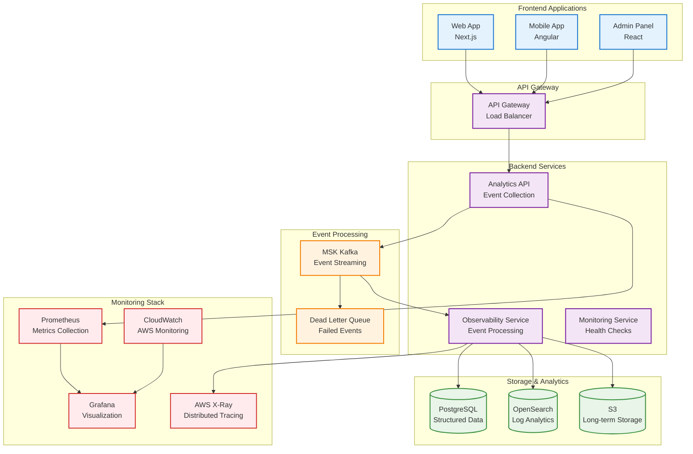
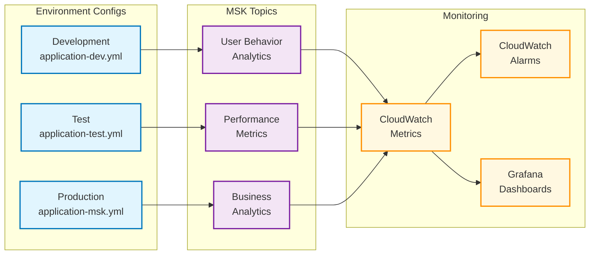

# Observability Configuration Guide

## Overview

This guide provides detailed instructions on configuring the frontend-backend observability integration system, including environment-specific configurations, MSK topic setup, and monitoring configurations.

## Environment Configuration

### Development Environment Configuration

#### Backend Configuration (application-dev.yml)

```yaml
spring:
  profiles:
    active: dev
  datasource:
    url: jdbc:h2:file:./data/genai-demo-dev
    driver-class-name: org.h2.Driver
    username: sa
    password: 
  jpa:
    hibernate:
      ddl-auto: update
    show-sql: true

# Observability Configuration
genai-demo:
  events:
    publisher: in-memory  # Use in-memory event processing
    async: false         # Synchronous processing for debugging
  observability:
    analytics:
      enabled: true
      storage: in-memory  # Store metrics in memory
      retention-minutes: 60
      batch-size: 10      # Small batches for testing
      flush-interval: 10s # Fast refresh for debugging
    tracing:
      enabled: true
      sample-rate: 1.0    # 100% sampling rate for development
    metrics:
      enabled: true
      export-interval: 30s

# Logging Configuration
logging:
  level:
    solid.humank.genaidemo.infrastructure.observability: DEBUG
    solid.humank.genaidemo.application.observability: DEBUG
    org.springframework.kafka: INFO
  pattern:
    console: "%d{HH:mm:ss.SSS} [%thread] %-5level [%X{correlationId:-},%X{traceId:-},%X{sessionId:-}] %logger{36} - %msg%n"
```

#### Frontend Configuration (environments/environment.ts)

```typescript
export const environment = {
  production: false,
  apiUrl: 'http://localhost:8080',
  observability: {
    enabled: true,
    batchSize: 10,
    flushInterval: 10000, // 10 seconds
    retryAttempts: 3,
    enableDebugLogs: true,
    sampleRate: 1.0, // 100% sampling for development
    endpoints: {
      analytics: '/api/analytics/events',
      performance: '/api/analytics/performance',
      errors: '/api/monitoring/events'
    },
    webSocket: {
      url: 'ws://localhost:8080/ws/analytics',
      reconnectInterval: 5000,
      maxReconnectAttempts: 5
    }
  }
};
```

### Test Environment Configuration

#### Backend Configuration (application-test.yml)

```yaml
spring:
  profiles:
    active: test
  datasource:
    url: jdbc:h2:mem:testdb
    driver-class-name: org.h2.Driver
  jpa:
    hibernate:
      ddl-auto: create-drop

# Observability Configuration
genai-demo:
  events:
    publisher: in-memory
    async: false
  observability:
    analytics:
      enabled: true
      storage: in-memory
      retention-minutes: 10  # Short retention for testing
      batch-size: 5
      flush-interval: 5s
    tracing:
      enabled: false  # Disable tracing in tests for speed
    metrics:
      enabled: false  # Disable metrics collection in tests

logging:
  level:
    solid.humank.genaidemo: WARN
    org.springframework.kafka: ERROR
```

### Production Environment Configuration

#### Backend Configuration (application-msk.yml)

```yaml
spring:
  profiles:
    active: msk
  kafka:
    bootstrap-servers: ${MSK_BOOTSTRAP_SERVERS}
    security:
      protocol: SASL_SSL
    sasl:
      mechanism: AWS_MSK_IAM
    producer:
      key-serializer: org.apache.kafka.common.serialization.StringSerializer
      value-serializer: org.springframework.kafka.support.serializer.JsonSerializer
      acks: all
      retries: 3
      batch-size: 16384
      linger-ms: 5
      buffer-memory: 33554432
    consumer:
      key-deserializer: org.apache.kafka.common.serialization.StringDeserializer
      value-deserializer: org.springframework.kafka.support.serializer.JsonDeserializer
      group-id: ${spring.application.name}-${spring.profiles.active}
      auto-offset-reset: earliest
      enable-auto-commit: false
      properties:
        spring.json.trusted.packages: "solid.humank.genaidemo.domain.events"

# Observability Configuration
genai-demo:
  events:
    publisher: kafka     # Use MSK event processing
    async: true         # Asynchronous processing
  domain-events:
    topic:
      prefix: genai-demo.${spring.profiles.active}
      partitions: 6
      replication-factor: 3
      # Observability-specific topics
      observability:
        user-behavior: genai-demo.${spring.profiles.active}.observability.user.behavior
        performance-metrics: genai-demo.${spring.profiles.active}.observability.performance.metrics
        business-analytics: genai-demo.${spring.profiles.active}.observability.business.analytics
    publishing:
      enabled: true
      async: true
      dlq:
        enabled: true    # Dead letter queue handling
        topic-suffix: .dlq
  observability:
    analytics:
      enabled: true
      storage: kafka      # Use Kafka storage
      retention-days: 90  # 90-day retention period
      batch-size: 100     # Large batches for performance
      flush-interval: 30s # 30-second flush interval
    tracing:
      enabled: true
      sample-rate: 0.1    # 10% sampling rate
    metrics:
      enabled: true
      export-interval: 60s

# AWS X-Ray Configuration
aws:
  xray:
    tracing-name: genai-demo-${spring.profiles.active}
    context-missing: LOG_ERROR

# CloudWatch Configuration
management:
  metrics:
    export:
      cloudwatch:
        namespace: GenAI/Demo/${spring.profiles.active}
        batch-size: 20
        step: 60s
        enabled: true

# Logging Configuration
logging:
  level:
    solid.humank.genaidemo: INFO
    org.springframework.kafka: WARN
  pattern:
    console: "%d{yyyy-MM-dd HH:mm:ss.SSS} [%thread] %-5level [%X{correlationId:-}] %logger{36} - %msg%n"
```

## MSK Topic Configuration

### Topic Naming Convention

```
Format: ${projectName}.${environment}.${domain}.${event}
Example: genai-demo.production.observability.user.behavior
```

### Observability Topic List

#### User Behavior Analytics Topics

```
genai-demo.${environment}.observability.user.behavior
genai-demo.${environment}.observability.user.behavior.dlq
```

**Configuration Parameters:**

- Partitions: 6
- Replication Factor: 3
- Retention: 7 days (development), 30 days (production)
- Compression: gzip

#### Performance Metrics Topics

```
genai-demo.${environment}.observability.performance.metrics
genai-demo.${environment}.observability.performance.metrics.dlq
```

**Configuration Parameters:**

- Partitions: 3
- Replication Factor: 3
- Retention: 3 days (development), 14 days (production)
- Compression: lz4

#### Business Analytics Topics

```
genai-demo.${environment}.observability.business.analytics
genai-demo.${environment}.observability.business.analytics.dlq
```

**Configuration Parameters:**

- Partitions: 6
- Replication Factor: 3
- Retention: 30 days (development), 90 days (production)
- Compression: gzip

## Monitoring and Alerting Configuration

### CloudWatch Metrics

#### Custom Business Metrics

```yaml
# application-msk.yml
management:
  metrics:
    export:
      cloudwatch:
        namespace: GenAI/Demo/Observability
        dimensions:
          Environment: ${spring.profiles.active}
          Service: ${spring.application.name}
        metrics:
          - name: observability.events.received
            description: "Number of observability events received"
          - name: observability.events.processed
            description: "Number of observability events processed"
          - name: observability.events.failed
            description: "Number of observability events failed"
          - name: observability.batch.size
            description: "Average batch size for event processing"
          - name: observability.processing.latency
            description: "Event processing latency in milliseconds"
```

### CloudWatch Alarms

#### Critical Alarms

```yaml
# High event processing failure rate
EventProcessingFailureRate:
  MetricName: observability.events.failed
  Threshold: 5  # More than 5 failed events per minute
  ComparisonOperator: GreaterThanThreshold
  EvaluationPeriods: 2
  Period: 60

# High API response time
AnalyticsAPILatency:
  MetricName: http.server.requests
  Dimensions:
    uri: /api/analytics/events
  Threshold: 1000  # 1 second
  ComparisonOperator: GreaterThanThreshold
  Statistic: Average
  EvaluationPeriods: 3
  Period: 300

# Kafka consumer lag
KafkaConsumerLag:
  MetricName: kafka.consumer.lag
  Threshold: 1000  # 1000 message lag
  ComparisonOperator: GreaterThanThreshold
  EvaluationPeriods: 2
  Period: 300
```

## Security Configuration

### Data Encryption

#### Encryption in Transit

```yaml
# TLS Configuration
server:
  ssl:
    enabled: true
    key-store: classpath:keystore.p12
    key-store-password: ${SSL_KEYSTORE_PASSWORD}
    key-store-type: PKCS12

# Kafka TLS Configuration
spring:
  kafka:
    security:
      protocol: SASL_SSL
    ssl:
      trust-store-location: ${KAFKA_TRUSTSTORE_LOCATION}
      trust-store-password: ${KAFKA_TRUSTSTORE_PASSWORD}
```

#### Encryption at Rest

```yaml
# Database encryption
spring:
  datasource:
    url: jdbc:postgresql://${DB_HOST}:5432/${DB_NAME}?sslmode=require
  jpa:
    properties:
      hibernate:
        dialect: org.hibernate.dialect.PostgreSQLDialect
        
# KMS Configuration
aws:
  kms:
    key-id: ${KMS_KEY_ID}
    region: ${AWS_REGION}
```

## Performance Tuning

### JVM Configuration

```bash
# Production JVM parameters
JAVA_OPTS="-Xms2g -Xmx4g \
  -XX:+UseG1GC \
  -XX:MaxGCPauseMillis=200 \
  -XX:+UseStringDeduplication \
  -XX:+OptimizeStringConcat \
  -Dspring.profiles.active=msk"
```

### Kafka Configuration Optimization

```yaml
spring:
  kafka:
    producer:
      batch-size: 16384      # 16KB batch size
      linger-ms: 5           # 5ms delay to increase batch efficiency
      buffer-memory: 33554432 # 32MB buffer
      compression-type: gzip  # Compression to reduce network transfer
      acks: all              # Wait for all replica acknowledgments
      retries: 3             # Number of retries
      enable-idempotence: true # Enable idempotence
    consumer:
      fetch-min-size: 1024   # Minimum fetch size 1KB
      fetch-max-wait: 500    # Maximum wait time 500ms
      max-poll-records: 500  # Maximum records per poll
      session-timeout-ms: 30000 # Session timeout 30 seconds
      heartbeat-interval-ms: 3000 # Heartbeat interval 3 seconds
```

## Troubleshooting

### Common Configuration Issues

#### 1. MSK Connection Failure

**Symptoms**: Unable to connect to MSK cluster

**Solutions**:

```bash
# Check network connectivity
telnet ${MSK_BOOTSTRAP_SERVERS} 9098

# Check IAM permissions
aws sts get-caller-identity

# Check security group rules
aws ec2 describe-security-groups --group-ids ${MSK_SECURITY_GROUP_ID}
```

#### 2. Events Not Being Processed

**Symptoms**: Frontend sends events but backend doesn't receive them

**Checklist**:

- [ ] Confirm API endpoint URL is correct
- [ ] Check CORS configuration
- [ ] Verify request header format
- [ ] Review network error logs

#### 3. Performance Issues

**Symptoms**: High event processing latency

**Optimization Suggestions**:

- Increase Kafka partition count
- Adjust batch size
- Optimize JVM parameters
- Check database query performance

### Log Analysis

#### Key Log Patterns

```bash
# Event reception logs
grep "Received.*analytics events" /var/log/genai-demo/application.log

# Event processing failure logs
grep "Failed to process.*event" /var/log/genai-demo/application.log

# Kafka connection issues
grep "kafka.*connection" /var/log/genai-demo/application.log

# Performance warnings
grep "processing.*took.*ms" /var/log/genai-demo/application.log
```

## Configuration Validation

### Automated Validation Script

```bash
#!/bin/bash
# validate-observability-config.sh

echo "Validating observability configuration..."

# Check backend health status
curl -f http://localhost:8080/actuator/health || exit 1

# Check Kafka connectivity
curl -f http://localhost:8080/actuator/health/kafka || exit 1

# Test analytics API
curl -X POST http://localhost:8080/api/analytics/events \
  -H "Content-Type: application/json" \
  -H "X-Trace-Id: test-trace-123" \
  -H "X-Session-Id: test-session-456" \
  -d '[{"eventId":"test","eventType":"page_view","sessionId":"test-session-456","traceId":"test-trace-123","timestamp":1640995200000,"data":{"page":"/test"}}]' || exit 1

echo "Configuration validation completed!"
```

### Configuration Checklist

#### Development Environment

- [ ] H2 database accessible
- [ ] In-memory event processor enabled
- [ ] Debug logging enabled
- [ ] Local WebSocket connection working

#### Test Environment

- [ ] Test database isolated
- [ ] Observability features selectively enabled
- [ ] Fast event processing configured
- [ ] Test data auto-cleanup

#### Production Environment

- [ ] MSK cluster connection working
- [ ] SSL/TLS encryption enabled
- [ ] IAM permissions correctly configured
- [ ] CloudWatch metrics reporting normally
- [ ] Alert rules configured
- [ ] Data retention policies configured

## Related Diagrams

### Observability Architecture



### Configuration Flow



## Relationships with Other Viewpoints

- **[Deployment Viewpoint](../deployment/README.md)**: Configuration management for deployment environments
- **[Development Viewpoint](../development/README.md)**: Development environment configuration settings
- **[Security Perspective](../../perspectives/security/README.md)**: Security configuration and encryption settings

## Related Documentation

- [Observability System Overview](observability-overview.md)
- [Production Environment Testing Guide](production-observability-testing-guide.md)
- [Troubleshooting Guide](../../troubleshooting/observability-troubleshooting.md)
