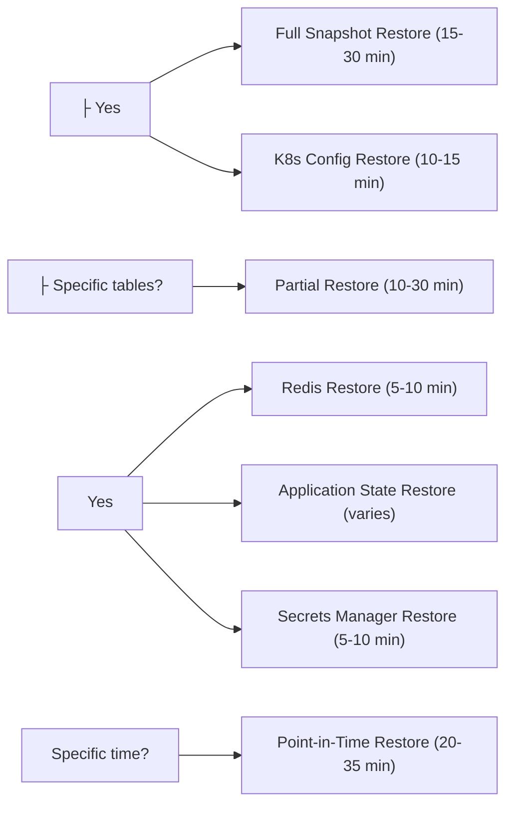

## Detailed Restore Procedures

This section provides comprehensive, step-by-step restore workflows for all backup types, including database, application state, configuration, and partial restore scenarios.

### Database Restore Workflows

#### Full Database Restore from Automated Snapshot

**Use Case**: Complete database failure or corruption requiring full restoration

**Prerequisites**:

- Identify the snapshot to restore from
- Verify snapshot integrity and availability
- Ensure sufficient RDS instance capacity
- Notify stakeholders of maintenance window

**Estimated Time**: 15-30 minutes (depending on database size)

**Step-by-Step Procedure**:

```bash
#!/bin/bash
# full-database-restore.sh

set -e

# Configuration
SNAPSHOT_ID="$1"
TARGET_INSTANCE="ecommerce-prod-db-restored-$(date +%s)"
INSTANCE_CLASS="db.r5.2xlarge"
SUBNET_GROUP="ecommerce-db-subnet-group"
SECURITY_GROUPS="sg-0123456789abcdef0"
PARAMETER_GROUP="ecommerce-postgres-params"

if [ -z "$SNAPSHOT_ID" ]; then
  echo "Usage: $0 <snapshot-id>"
  echo "Example: $0 rds:ecommerce-prod-db-2025-10-23-05-00"
  exit 1
fi

echo "=== Step 1: Validate Snapshot ==="
echo "Checking snapshot availability..."
SNAPSHOT_STATUS=$(aws rds describe-db-snapshots \
  --db-snapshot-identifier "$SNAPSHOT_ID" \
  --query 'DBSnapshots[0].Status' \
  --output text)

if [ "$SNAPSHOT_STATUS" != "available" ]; then
  echo "ERROR: Snapshot $SNAPSHOT_ID is not available (Status: $SNAPSHOT_STATUS)"
  exit 1
fi

echo "✓ Snapshot is available"

# Get snapshot metadata
SNAPSHOT_SIZE=$(aws rds describe-db-snapshots \
  --db-snapshot-identifier "$SNAPSHOT_ID" \
  --query 'DBSnapshots[0].AllocatedStorage' \
  --output text)

SNAPSHOT_TIME=$(aws rds describe-db-snapshots \
  --db-snapshot-identifier "$SNAPSHOT_ID" \
  --query 'DBSnapshots[0].SnapshotCreateTime' \
  --output text)

echo "Snapshot Details:"
echo "  - Size: ${SNAPSHOT_SIZE} GB"
echo "  - Created: $SNAPSHOT_TIME"
echo ""

echo "=== Step 2: Create Restore Instance ==="
echo "Restoring database from snapshot..."
aws rds restore-db-instance-from-db-snapshot \
  --db-instance-identifier "$TARGET_INSTANCE" \
  --db-snapshot-identifier "$SNAPSHOT_ID" \
  --db-instance-class "$INSTANCE_CLASS" \
  --db-subnet-group-name "$SUBNET_GROUP" \
  --vpc-security-group-ids "$SECURITY_GROUPS" \
  --db-parameter-group-name "$PARAMETER_GROUP" \
  --publicly-accessible false \
  --multi-az true \
  --storage-type gp3 \
  --iops 12000 \
  --storage-throughput 500 \
  --enable-cloudwatch-logs-exports '["postgresql"]' \
  --deletion-protection true \
  --tags Key=Environment,Value=production \
         Key=RestoredFrom,Value="$SNAPSHOT_ID" \
         Key=RestoreDate,Value="$(date +%Y-%m-%d)" \
         Key=Purpose,Value=restore

echo "✓ Restore initiated for instance: $TARGET_INSTANCE"
echo ""

echo "=== Step 3: Wait for Instance Availability ==="
echo "This may take 10-20 minutes depending on database size..."
START_TIME=$(date +%s)

aws rds wait db-instance-available \
  --db-instance-identifier "$TARGET_INSTANCE"

END_TIME=$(date +%s)
DURATION=$((END_TIME - START_TIME))
echo "✓ Instance available after $((DURATION / 60)) minutes $((DURATION % 60)) seconds"
echo ""

echo "=== Step 4: Get Instance Endpoint ==="
DB_ENDPOINT=$(aws rds describe-db-instances \
  --db-instance-identifier "$TARGET_INSTANCE" \
  --query 'DBInstances[0].Endpoint.Address' \
  --output text)

DB_PORT=$(aws rds describe-db-instances \
  --db-instance-identifier "$TARGET_INSTANCE" \
  --query 'DBInstances[0].Endpoint.Port' \
  --output text)

echo "Database Endpoint: $DB_ENDPOINT:$DB_PORT"
echo ""

echo "=== Step 5: Validate Data Integrity ==="
echo "Running data integrity checks..."

# Create validation script
cat > /tmp/validate-restore.sql <<'EOF'
-- Check table counts
SELECT 'orders' as table_name, COUNT(*) as row_count FROM orders
UNION ALL
SELECT 'customers', COUNT(*) FROM customers
UNION ALL
SELECT 'products', COUNT(*) FROM products
UNION ALL
SELECT 'order_items', COUNT(*) FROM order_items
UNION ALL
SELECT 'payments', COUNT(*) FROM payments;

-- Check for orphaned records
SELECT 'Orphaned Order Items' as check_name, COUNT(*) as issue_count
FROM order_items oi
LEFT JOIN orders o ON oi.order_id = o.id
WHERE o.id IS NULL;

-- Check referential integrity
SELECT 'Invalid Customer References' as check_name, COUNT(*) as issue_count
FROM orders o
LEFT JOIN customers c ON o.customer_id = c.id
WHERE c.id IS NULL;

-- Check for null primary keys
SELECT 'Null Primary Keys' as check_name, COUNT(*) as issue_count
FROM orders WHERE id IS NULL;

-- Check recent data
SELECT 'Recent Orders (24h)' as check_name, COUNT(*) as count
FROM orders
WHERE created_at > NOW() - INTERVAL '24 hours';

-- Calculate checksums
SELECT 'Order Checksum' as check_name,
       md5(string_agg(id::text, ',' ORDER BY id)) as checksum
FROM orders;
EOF

# Run validation
psql -h "$DB_ENDPOINT" -p "$DB_PORT" -U admin -d ecommerce -f /tmp/validate-restore.sql > /tmp/validation-results.txt

echo "Validation Results:"
cat /tmp/validation-results.txt
echo ""

# Check for critical issues
CRITICAL_ISSUES=$(grep -E "Orphaned|Invalid|Null" /tmp/validation-results.txt | awk '{sum += $NF} END {print sum}')

if [ "$CRITICAL_ISSUES" -gt 0 ]; then
  echo "⚠ WARNING: Found $CRITICAL_ISSUES critical data integrity issues"
  echo "Review /tmp/validation-results.txt for details"
else
  echo "✓ No critical data integrity issues found"
fi
echo ""

echo "=== Step 6: Performance Baseline Check ==="
echo "Running performance tests..."

cat > /tmp/performance-test.sql <<'EOF'
-- Test query performance
EXPLAIN ANALYZE
SELECT o.*, c.name, c.email
FROM orders o
JOIN customers c ON o.customer_id = c.id
WHERE o.created_at > NOW() - INTERVAL '7 days'
ORDER BY o.created_at DESC
LIMIT 100;

-- Check index health
SELECT schemaname, tablename, indexname, idx_scan, idx_tup_read, idx_tup_fetch
FROM pg_stat_user_indexes
WHERE schemaname = 'public'
ORDER BY idx_scan DESC
LIMIT 10;

-- Check table statistics
SELECT schemaname, tablename, n_live_tup, n_dead_tup, last_vacuum, last_autovacuum
FROM pg_stat_user_tables
WHERE schemaname = 'public'
ORDER BY n_live_tup DESC;
EOF

psql -h "$DB_ENDPOINT" -p "$DB_PORT" -U admin -d ecommerce -f /tmp/performance-test.sql > /tmp/performance-results.txt

echo "✓ Performance baseline captured"
echo ""

echo "=== Step 7: Create Restore Report ==="
cat > /tmp/restore-report-${TARGET_INSTANCE}.md <<EOF
# Database Restore Report

## Restore Details

- **Restore Date**: $(date +"%Y-%m-%d %H:%M:%S %Z")
- **Source Snapshot**: $SNAPSHOT_ID
- **Snapshot Date**: $SNAPSHOT_TIME
- **Target Instance**: $TARGET_INSTANCE
- **Instance Endpoint**: $DB_ENDPOINT:$DB_PORT
- **Restore Duration**: $((DURATION / 60)) minutes $((DURATION % 60)) seconds

## Validation Results
$(cat /tmp/validation-results.txt)

## Performance Baseline
$(cat /tmp/performance-results.txt)

## Next Steps

1. Review validation results for any data integrity issues
2. Update application configuration to use new endpoint
3. Perform application-level smoke tests
4. Monitor database performance for 24 hours
5. If successful, update DNS/load balancer
6. Schedule old instance deletion after 7 days

## Rollback Procedure
If issues are discovered:
\`\`\`bash
# Revert application to original database
kubectl set env deployment/order-service DATABASE_HOST=<original-endpoint>

# Delete restored instance (if needed)
aws rds delete-db-instance \\
  --db-instance-identifier $TARGET_INSTANCE \\
  --skip-final-snapshot
\`\`\`
EOF

echo "✓ Restore report created: /tmp/restore-report-${TARGET_INSTANCE}.md"
echo ""

echo "=== Restore Complete ==="
echo ""
echo "Database Instance: $TARGET_INSTANCE"
echo "Endpoint: $DB_ENDPOINT:$DB_PORT"
echo ""
echo "⚠ IMPORTANT: Before switching production traffic:"
echo "1. Review restore report: /tmp/restore-report-${TARGET_INSTANCE}.md"
echo "2. Perform application smoke tests"
echo "3. Verify data integrity with business team"
echo "4. Update application configuration"
echo "5. Monitor for 24 hours before decommissioning old instance"
echo ""

# Cleanup
rm -f /tmp/validate-restore.sql /tmp/performance-test.sql

# Send notification
aws sns publish \
  --topic-arn arn:aws:sns:us-east-1:123456789012:database-operations \
  --subject "Database Restore Completed - $TARGET_INSTANCE" \
  --message file:///tmp/restore-report-${TARGET_INSTANCE}.md

echo "✓ Notification sent to operations team"
```

**Post-Restore Checklist**:

- [ ] Validation results reviewed and approved
- [ ] Application smoke tests passed
- [ ] Performance metrics within acceptable range
- [ ] Business team verified critical data
- [ ] Application configuration updated
- [ ] DNS/load balancer updated (if applicable)
- [ ] Monitoring alerts configured for new instance
- [ ] Old instance scheduled for deletion (after 7 days)
- [ ] Incident documentation updated
- [ ] Post-mortem scheduled (if applicable)

#### Point-in-Time Database Restore

**Use Case**: Restore database to a specific point in time (e.g., before data corruption or accidental deletion)

**Prerequisites**:

- Point-in-time recovery must be enabled
- Target restore time must be within retention period (30 days)
- Verify transaction logs are available

**Estimated Time**: 20-35 minutes

**Step-by-Step Procedure**:

```bash
#!/bin/bash
# point-in-time-restore.sh

set -e

SOURCE_INSTANCE="$1"
RESTORE_TIME="$2"  # Format: 2025-10-23T14:30:00Z
TARGET_INSTANCE="ecommerce-prod-db-pitr-$(date +%s)"

if [ -z "$SOURCE_INSTANCE" ] || [ -z "$RESTORE_TIME" ]; then
  echo "Usage: $0 <source-instance> <restore-time>"
  echo "Example: $0 ecommerce-prod-db 2025-10-23T14:30:00Z"
  exit 1
fi

echo "=== Step 1: Validate Restore Time ==="
# Get earliest and latest restorable times
EARLIEST=$(aws rds describe-db-instances \
  --db-instance-identifier "$SOURCE_INSTANCE" \
  --query 'DBInstances[0].EarliestRestorableTime' \
  --output text)

LATEST=$(aws rds describe-db-instances \
  --db-instance-identifier "$SOURCE_INSTANCE" \
  --query 'DBInstances[0].LatestRestorableTime' \
  --output text)

echo "Restorable Time Window:"
echo "  Earliest: $EARLIEST"
echo "  Latest: $LATEST"
echo "  Requested: $RESTORE_TIME"

# Validate restore time is within window
if [[ "$RESTORE_TIME" < "$EARLIEST" ]] || [[ "$RESTORE_TIME" > "$LATEST" ]]; then
  echo "ERROR: Restore time $RESTORE_TIME is outside restorable window"
  exit 1
fi

echo "✓ Restore time is valid"
echo ""

echo "=== Step 2: Initiate Point-in-Time Restore ==="
aws rds restore-db-instance-to-point-in-time \
  --source-db-instance-identifier "$SOURCE_INSTANCE" \
  --target-db-instance-identifier "$TARGET_INSTANCE" \
  --restore-time "$RESTORE_TIME" \
  --db-instance-class db.r5.2xlarge \
  --multi-az true \
  --publicly-accessible false \
  --deletion-protection true \
  --tags Key=RestoreType,Value=point-in-time \
         Key=RestoreTime,Value="$RESTORE_TIME"

echo "✓ Point-in-time restore initiated"
echo ""

echo "=== Step 3: Monitor Restore Progress ==="
echo "Waiting for instance to be available..."
aws rds wait db-instance-available \
  --db-instance-identifier "$TARGET_INSTANCE"

echo "✓ Restore completed"
echo ""

# Continue with validation steps (same as full restore)
echo "=== Step 4: Validate Restored Data ==="
DB_ENDPOINT=$(aws rds describe-db-instances \
  --db-instance-identifier "$TARGET_INSTANCE" \
  --query 'DBInstances[0].Endpoint.Address' \
  --output text)

# Verify data at specific point in time
psql -h "$DB_ENDPOINT" -U admin -d ecommerce <<EOF
-- Verify no data exists after restore time
SELECT COUNT(*) as records_after_restore_time
FROM orders
WHERE created_at > '$RESTORE_TIME'::timestamp;

-- This should return 0 if restore was successful
EOF

echo ""
echo "Restored Instance: $TARGET_INSTANCE"
echo "Endpoint: $DB_ENDPOINT"
echo "Restore Time: $RESTORE_TIME"
```

#### Partial Database Restore (Specific Tables)

**Use Case**: Restore only specific tables without affecting the entire database

**Prerequisites**:

- Export of specific tables from snapshot
- Target database is accessible
- Sufficient storage space for temporary data

**Estimated Time**: 10-30 minutes (depending on table size)

**Step-by-Step Procedure**:

```bash
#!/bin/bash
# partial-table-restore.sh

set -e

SNAPSHOT_ID="$1"
TABLES="$2"  # Comma-separated list: "orders,order_items"
TARGET_DB="$3"

if [ -z "$SNAPSHOT_ID" ] || [ -z "$TABLES" ] || [ -z "$TARGET_DB" ]; then
  echo "Usage: $0 <snapshot-id> <tables> <target-db-endpoint>"
  echo "Example: $0 rds:ecommerce-prod-db-2025-10-23 'orders,order_items' restored-db.xxx.rds.amazonaws.com"
  exit 1
fi

echo "=== Step 1: Create Temporary Restore Instance ==="
TEMP_INSTANCE="temp-restore-$(date +%s)"

aws rds restore-db-instance-from-db-snapshot \
  --db-instance-identifier "$TEMP_INSTANCE" \
  --db-snapshot-identifier "$SNAPSHOT_ID" \
  --db-instance-class db.t3.medium \
  --no-multi-az \
  --publicly-accessible false

echo "Waiting for temporary instance..."
aws rds wait db-instance-available --db-instance-identifier "$TEMP_INSTANCE"

TEMP_ENDPOINT=$(aws rds describe-db-instances \
  --db-instance-identifier "$TEMP_INSTANCE" \
  --query 'DBInstances[0].Endpoint.Address' \
  --output text)

echo "✓ Temporary instance ready: $TEMP_ENDPOINT"
echo ""

echo "=== Step 2: Export Specific Tables ==="
IFS=',' read -ra TABLE_ARRAY <<< "$TABLES"

for TABLE in "${TABLE_ARRAY[@]}"; do
  echo "Exporting table: $TABLE"
  
  # Dump specific table
  pg_dump -h "$TEMP_ENDPOINT" -U admin -d ecommerce \
    --table="$TABLE" \
    --no-owner --no-acl \
    --format=custom \
    --file="/tmp/${TABLE}_backup.dump"
  
  echo "✓ Exported $TABLE"
done

echo ""

echo "=== Step 3: Backup Current Tables (Safety) ==="
for TABLE in "${TABLE_ARRAY[@]}"; do
  echo "Backing up current $TABLE..."
  
  pg_dump -h "$TARGET_DB" -U admin -d ecommerce \
    --table="$TABLE" \
    --format=custom \
    --file="/tmp/${TABLE}_current_backup.dump"
  
  echo "✓ Current $TABLE backed up"
done

echo ""

echo "=== Step 4: Restore Tables to Target Database ==="
for TABLE in "${TABLE_ARRAY[@]}"; do
  echo "Restoring table: $TABLE"
  
  # Drop existing table (with confirmation)
  read -p "Drop and restore $TABLE? (yes/no): " CONFIRM
  if [ "$CONFIRM" = "yes" ]; then
    psql -h "$TARGET_DB" -U admin -d ecommerce -c "DROP TABLE IF EXISTS $TABLE CASCADE;"
    
    # Restore table
    pg_restore -h "$TARGET_DB" -U admin -d ecommerce \
      --table="$TABLE" \
      --no-owner --no-acl \
      "/tmp/${TABLE}_backup.dump"
    
    echo "✓ Restored $TABLE"
  else
    echo "Skipped $TABLE"
  fi
done

echo ""

echo "=== Step 5: Validate Restored Tables ==="
for TABLE in "${TABLE_ARRAY[@]}"; do
  echo "Validating $TABLE..."
  
  ROW_COUNT=$(psql -h "$TARGET_DB" -U admin -d ecommerce -t -c "SELECT COUNT(*) FROM $TABLE;")
  echo "  Row count: $ROW_COUNT"
  
  # Check for primary key violations
  PK_ISSUES=$(psql -h "$TARGET_DB" -U admin -d ecommerce -t -c \
    "SELECT COUNT(*) FROM $TABLE WHERE id IS NULL;")
  echo "  Null PKs: $PK_ISSUES"
done

echo ""

echo "=== Step 6: Cleanup ==="
echo "Deleting temporary instance..."
aws rds delete-db-instance \
  --db-instance-identifier "$TEMP_INSTANCE" \
  --skip-final-snapshot

echo "✓ Cleanup complete"
echo ""

echo "=== Restore Complete ==="
echo "Restored tables: $TABLES"
echo "Target database: $TARGET_DB"
echo ""
echo "Rollback files available at:"
for TABLE in "${TABLE_ARRAY[@]}"; do
  echo "  /tmp/${TABLE}_current_backup.dump"
done
```

**Rollback Procedure**:

```bash
# If restore needs to be rolled back
for TABLE in orders order_items; do
  psql -h $TARGET_DB -U admin -d ecommerce -c "DROP TABLE IF EXISTS $TABLE CASCADE;"
  pg_restore -h $TARGET_DB -U admin -d ecommerce \
    --table="$TABLE" \
    "/tmp/${TABLE}_current_backup.dump"
done
```

### Application State Restore Procedures

#### Redis Cache Restore

**Use Case**: Restore Redis cache from snapshot after cache failure or data loss

**Prerequisites**:

- Redis snapshot available
- Target Redis cluster provisioned or existing
- Application can tolerate brief cache unavailability

**Estimated Time**: 5-10 minutes

**Step-by-Step Procedure**:

```bash
#!/bin/bash
# redis-cache-restore.sh

set -e

SNAPSHOT_NAME="$1"
RESTORE_MODE="$2"  # "new" or "existing"

if [ -z "$SNAPSHOT_NAME" ]; then
  echo "Usage: $0 <snapshot-name> [new|existing]"
  echo "Example: $0 ecommerce-redis-2025-10-23 new"
  exit 1
fi

RESTORE_MODE=${RESTORE_MODE:-new}

echo "=== Step 1: Validate Snapshot ==="
SNAPSHOT_STATUS=$(aws elasticache describe-snapshots \
  --snapshot-name "$SNAPSHOT_NAME" \
  --query 'Snapshots[0].SnapshotStatus' \
  --output text)

if [ "$SNAPSHOT_STATUS" != "available" ]; then
  echo "ERROR: Snapshot not available (Status: $SNAPSHOT_STATUS)"
  exit 1
fi

echo "✓ Snapshot is available"
echo ""

if [ "$RESTORE_MODE" = "new" ]; then
  echo "=== Step 2: Create New Redis Cluster from Snapshot ==="
  NEW_CLUSTER="ecommerce-redis-restored-$(date +%s)"
  
  aws elasticache create-replication-group \
    --replication-group-id "$NEW_CLUSTER" \
    --replication-group-description "Restored from $SNAPSHOT_NAME" \
    --snapshot-name "$SNAPSHOT_NAME" \
    --cache-node-type cache.r5.large \
    --engine redis \
    --engine-version 7.0 \
    --num-cache-clusters 3 \
    --automatic-failover-enabled \
    --multi-az-enabled \
    --cache-subnet-group-name ecommerce-redis-subnet-group \
    --security-group-ids sg-0123456789abcdef0 \
    --preferred-cache-cluster-a-zs us-east-1a us-east-1b us-east-1c \
    --tags Key=RestoredFrom,Value="$SNAPSHOT_NAME"
  
  echo "Waiting for cluster to be available..."
  aws elasticache wait replication-group-available \
    --replication-group-id "$NEW_CLUSTER"
  
  CLUSTER_ENDPOINT=$(aws elasticache describe-replication-groups \
    --replication-group-id "$NEW_CLUSTER" \
    --query 'ReplicationGroups[0].NodeGroups[0].PrimaryEndpoint.Address' \
    --output text)
  
  echo "✓ New cluster created: $NEW_CLUSTER"
  echo "  Endpoint: $CLUSTER_ENDPOINT"
  
else
  echo "=== Step 2: Restore to Existing Cluster ==="
  echo "⚠ WARNING: This will replace all data in the existing cluster"
  read -p "Continue? (yes/no): " CONFIRM
  
  if [ "$CONFIRM" != "yes" ]; then
    echo "Restore cancelled"
    exit 0
  fi
  
  EXISTING_CLUSTER="ecommerce-redis-cluster"
  
  # Backup current state first
  BACKUP_SNAPSHOT="backup-before-restore-$(date +%s)"
  aws elasticache create-snapshot \
    --replication-group-id "$EXISTING_CLUSTER" \
    --snapshot-name "$BACKUP_SNAPSHOT"
  
  echo "✓ Current state backed up to: $BACKUP_SNAPSHOT"
  
  # Note: ElastiCache doesn't support direct restore to existing cluster
  # Must create new cluster and update application
  echo "ERROR: Cannot restore directly to existing cluster"
  echo "Please use 'new' mode and update application configuration"
  exit 1
fi

echo ""

echo "=== Step 3: Verify Restored Data ==="
redis-cli -h "$CLUSTER_ENDPOINT" -p 6379 <<EOF
# Check key count
DBSIZE

# Sample some keys
RANDOMKEY
RANDOMKEY
RANDOMKEY

# Check memory usage
INFO memory

# Check replication status
INFO replication
EOF

echo ""

echo "=== Step 4: Update Application Configuration ==="
echo "Update application to use new Redis endpoint:"
echo ""
echo "kubectl set env deployment/order-service \\"
echo "  REDIS_HOST=$CLUSTER_ENDPOINT"
echo ""
echo "kubectl set env deployment/customer-service \\"
echo "  REDIS_HOST=$CLUSTER_ENDPOINT"
echo ""

echo "=== Step 5: Warm Up Cache (Optional) ==="
echo "Consider warming up cache with frequently accessed data:"
echo ""
cat > /tmp/cache-warmup.sh <<'WARMUP'
#!/bin/bash
# Warm up cache with top products
psql -h $DB_HOST -U admin -d ecommerce -t -c \
  "SELECT id, name, price FROM products ORDER BY view_count DESC LIMIT 1000;" | \
while IFS='|' read -r id name price; do
  redis-cli -h $REDIS_HOST SET "product:$id" "{\"name\":\"$name\",\"price\":$price}"
done
WARMUP

chmod +x /tmp/cache-warmup.sh
echo "Cache warmup script created: /tmp/cache-warmup.sh"
echo ""

echo "=== Restore Complete ==="
echo "Cluster: $NEW_CLUSTER"
echo "Endpoint: $CLUSTER_ENDPOINT"
```

### Configuration Restore Procedures

#### Kubernetes Configuration Restore

**Use Case**: Restore Kubernetes ConfigMaps, Secrets, and Deployments after cluster failure or misconfiguration

**Prerequisites**:

- Configuration backup available in S3
- kubectl access to target cluster
- Appropriate RBAC permissions

**Estimated Time**: 10-15 minutes

**Step-by-Step Procedure**:

```bash
#!/bin/bash
# k8s-config-restore.sh

set -e

BACKUP_DATE="$1"
S3_BUCKET="s3://ecommerce-backups-prod-us-east-1/application-config"
RESTORE_DIR="/tmp/k8s-restore-$(date +%s)"

if [ -z "$BACKUP_DATE" ]; then
  echo "Usage: $0 <backup-date>"
  echo "Example: $0 2025-10-23-050000"
  exit 1
fi

mkdir -p "$RESTORE_DIR"

echo "=== Step 1: Download Configuration Backup ==="
aws s3 cp "${S3_BUCKET}/${BACKUP_DATE}/config-backup.tar.gz" "$RESTORE_DIR/"

echo "✓ Backup downloaded"
echo ""

echo "=== Step 2: Extract Backup ==="
cd "$RESTORE_DIR"
tar -xzf config-backup.tar.gz

echo "✓ Backup extracted"
echo ""

echo "=== Step 3: Backup Current Configuration ==="
CURRENT_BACKUP="current-config-$(date +%s)"
mkdir -p "$CURRENT_BACKUP"

kubectl get configmaps --all-namespaces -o yaml > "$CURRENT_BACKUP/configmaps.yaml"
kubectl get secrets --all-namespaces -o yaml > "$CURRENT_BACKUP/secrets.yaml"
kubectl get deployments --all-namespaces -o yaml > "$CURRENT_BACKUP/deployments.yaml"

echo "✓ Current configuration backed up to: $CURRENT_BACKUP"
echo ""

echo "=== Step 4: Validate Backup Contents ==="
echo "ConfigMaps:"
grep -c "kind: ConfigMap" config-backup-*/configmaps.yaml || echo "0"

echo "Secrets:"
grep -c "kind: Secret" config-backup-*/secrets.yaml || echo "0"

echo "Deployments:"
grep -c "kind: Deployment" config-backup-*/deployments.yaml || echo "0"

echo ""

echo "=== Step 5: Restore ConfigMaps ==="
read -p "Restore ConfigMaps? (yes/no): " CONFIRM
if [ "$CONFIRM" = "yes" ]; then
  # Remove managed fields and status to avoid conflicts
  yq eval 'del(.items[].metadata.managedFields, .items[].metadata.resourceVersion, .items[].metadata.uid)' \
    config-backup-*/configmaps.yaml | kubectl apply -f -
  
  echo "✓ ConfigMaps restored"
else
  echo "Skipped ConfigMaps"
fi

echo ""

echo "=== Step 6: Restore Secrets ==="
read -p "Restore Secrets? (yes/no): " CONFIRM
if [ "$CONFIRM" = "yes" ]; then
  yq eval 'del(.items[].metadata.managedFields, .items[].metadata.resourceVersion, .items[].metadata.uid)' \
    config-backup-*/secrets.yaml | kubectl apply -f -
  
  echo "✓ Secrets restored"
else
  echo "Skipped Secrets"
fi

echo ""

echo "=== Step 7: Validate Restored Configuration ==="
echo "Checking ConfigMaps..."
kubectl get configmaps --all-namespaces | head -20

echo ""
echo "Checking Secrets..."
kubectl get secrets --all-namespaces | head -20

echo ""

echo "=== Step 8: Restart Affected Pods ==="
echo "Restarting deployments to pick up new configuration..."

NAMESPACES=("order-context" "customer-context" "product-context")

for NS in "${NAMESPACES[@]}"; do
  echo "Restarting deployments in namespace: $NS"
  kubectl rollout restart deployment --namespace="$NS"
done

echo ""

echo "=== Step 9: Verify Application Health ==="
echo "Waiting for deployments to be ready..."

for NS in "${NAMESPACES[@]}"; do
  kubectl wait --for=condition=available --timeout=300s \
    deployment --all --namespace="$NS"
done

echo "✓ All deployments are ready"
echo ""

echo "=== Restore Complete ==="
echo "Configuration restored from: $BACKUP_DATE"
echo "Rollback backup available at: $CURRENT_BACKUP"
echo ""
echo "Rollback command (if needed):"
echo "kubectl apply -f $CURRENT_BACKUP/configmaps.yaml"
echo "kubectl apply -f $CURRENT_BACKUP/secrets.yaml"
```

#### AWS Secrets Manager Restore

**Use Case**: Restore secrets after accidental deletion or corruption

**Estimated Time**: 5-10 minutes

```bash
#!/bin/bash
# secrets-manager-restore.sh

set -e

BACKUP_DATE="$1"
S3_BUCKET="s3://ecommerce-backups-prod-us-east-1/secrets"
RESTORE_DIR="/tmp/secrets-restore-$(date +%s)"

if [ -z "$BACKUP_DATE" ]; then
  echo "Usage: $0 <backup-date>"
  exit 1
fi

mkdir -p "$RESTORE_DIR"

echo "=== Step 1: Download Secrets Backup ==="
aws s3 cp "${S3_BUCKET}/${BACKUP_DATE}/secrets-backup.tar.gz" "$RESTORE_DIR/"
cd "$RESTORE_DIR"
tar -xzf secrets-backup.tar.gz

echo "✓ Backup downloaded and extracted"
echo ""

echo "=== Step 2: List Secrets to Restore ==="
ls -1 secrets-backup-*/*-value.json | while read SECRET_FILE; do
  SECRET_NAME=$(basename "$SECRET_FILE" | sed 's/-value.json$//')
  echo "  - $SECRET_NAME"
done

echo ""

echo "=== Step 3: Restore Secrets ==="
ls -1 secrets-backup-*/*-value.json | while read SECRET_FILE; do
  SECRET_NAME=$(basename "$SECRET_FILE" | sed 's/-value.json$//')
  SECRET_VALUE=$(jq -r '.SecretString' "$SECRET_FILE")
  
  echo "Restoring secret: $SECRET_NAME"
  
  # Check if secret exists
  if aws secretsmanager describe-secret --secret-id "$SECRET_NAME" 2>/dev/null; then
    # Update existing secret
    aws secretsmanager put-secret-value \
      --secret-id "$SECRET_NAME" \
      --secret-string "$SECRET_VALUE"
    echo "  ✓ Updated existing secret"
  else
    # Create new secret
    aws secretsmanager create-secret \
      --name "$SECRET_NAME" \
      --secret-string "$SECRET_VALUE" \
      --tags Key=RestoredFrom,Value="$BACKUP_DATE"
    echo "  ✓ Created new secret"
  fi
done

echo ""
echo "=== Restore Complete ==="
```

### Restore Testing in Isolated Environment

#### Creating Isolated Test Environment

**Purpose**: Test restore procedures without affecting production

**Prerequisites**:

- Separate AWS account or VPC for testing
- Copy of production backups
- Test database and application instances

**Step-by-Step Procedure**:

```bash
#!/bin/bash
# create-isolated-test-environment.sh

set -e

TEST_ENV_NAME="restore-test-$(date +%s)"
VPC_CIDR="10.100.0.0/16"

echo "=== Step 1: Create Isolated VPC ==="
VPC_ID=$(aws ec2 create-vpc \
  --cidr-block "$VPC_CIDR" \
  --tag-specifications "ResourceType=vpc,Tags=[{Key=Name,Value=$TEST_ENV_NAME}]" \
  --query 'Vpc.VpcId' \
  --output text)

echo "✓ VPC created: $VPC_ID"

# Create subnets
SUBNET_1=$(aws ec2 create-subnet \
  --vpc-id "$VPC_ID" \
  --cidr-block "10.100.1.0/24" \
  --availability-zone us-east-1a \
  --query 'Subnet.SubnetId' \
  --output text)

SUBNET_2=$(aws ec2 create-subnet \
  --vpc-id "$VPC_ID" \
  --cidr-block "10.100.2.0/24" \
  --availability-zone us-east-1b \
  --query 'Subnet.SubnetId' \
  --output text)

echo "✓ Subnets created"
echo ""

echo "=== Step 2: Create Security Group ==="
SG_ID=$(aws ec2 create-security-group \
  --group-name "$TEST_ENV_NAME-sg" \
  --description "Security group for restore testing" \
  --vpc-id "$VPC_ID" \
  --query 'GroupId' \
  --output text)

# Allow PostgreSQL access
aws ec2 authorize-security-group-ingress \
  --group-id "$SG_ID" \
  --protocol tcp \
  --port 5432 \
  --cidr "10.100.0.0/16"

echo "✓ Security group created: $SG_ID"
echo ""

echo "=== Step 3: Create DB Subnet Group ==="
aws rds create-db-subnet-group \
  --db-subnet-group-name "$TEST_ENV_NAME-subnet-group" \
  --db-subnet-group-description "Subnet group for restore testing" \
  --subnet-ids "$SUBNET_1" "$SUBNET_2" \
  --tags Key=Environment,Value=test

echo "✓ DB subnet group created"
echo ""

echo "=== Step 4: Restore Database to Test Environment ==="
SNAPSHOT_ID="$1"

if [ -z "$SNAPSHOT_ID" ]; then
  echo "ERROR: Snapshot ID required"
  echo "Usage: $0 <snapshot-id>"
  exit 1
fi

TEST_DB_INSTANCE="${TEST_ENV_NAME}-db"

aws rds restore-db-instance-from-db-snapshot \
  --db-instance-identifier "$TEST_DB_INSTANCE" \
  --db-snapshot-identifier "$SNAPSHOT_ID" \
  --db-instance-class db.t3.medium \
  --db-subnet-group-name "$TEST_ENV_NAME-subnet-group" \
  --vpc-security-group-ids "$SG_ID" \
  --no-publicly-accessible \
  --tags Key=Environment,Value=test Key=Purpose,Value=restore-testing

echo "Waiting for test database..."
aws rds wait db-instance-available --db-instance-identifier "$TEST_DB_INSTANCE"

TEST_DB_ENDPOINT=$(aws rds describe-db-instances \
  --db-instance-identifier "$TEST_DB_INSTANCE" \
  --query 'DBInstances[0].Endpoint.Address' \
  --output text)

echo "✓ Test database ready: $TEST_DB_ENDPOINT"
echo ""

echo "=== Step 5: Run Validation Tests ==="
cat > /tmp/test-validation.sh <<'VALIDATION'
#!/bin/bash
DB_HOST="$1"

echo "Running validation tests..."

# Test 1: Connection test
psql -h "$DB_HOST" -U admin -d ecommerce -c "SELECT version();" || exit 1
echo "✓ Connection successful"

# Test 2: Data integrity
psql -h "$DB_HOST" -U admin -d ecommerce -c \
  "SELECT COUNT(*) FROM orders;" || exit 1
echo "✓ Data accessible"

# Test 3: Query performance
psql -h "$DB_HOST" -U admin -d ecommerce -c \
  "EXPLAIN ANALYZE SELECT * FROM orders LIMIT 100;" || exit 1
echo "✓ Query performance acceptable"

echo "All validation tests passed"
VALIDATION

chmod +x /tmp/test-validation.sh
/tmp/test-validation.sh "$TEST_DB_ENDPOINT"

echo ""

echo "=== Test Environment Ready ==="
echo "VPC: $VPC_ID"
echo "Database: $TEST_DB_INSTANCE"
echo "Endpoint: $TEST_DB_ENDPOINT"
echo ""
echo "To cleanup test environment:"
echo "  aws rds delete-db-instance --db-instance-identifier $TEST_DB_INSTANCE --skip-final-snapshot"
echo "  aws ec2 delete-vpc --vpc-id $VPC_ID"
```

### Data Validation After Restore

#### Comprehensive Data Validation Script

**Purpose**: Verify data integrity, consistency, and completeness after restore

```bash
#!/bin/bash
# comprehensive-data-validation.sh

set -e

DB_HOST="$1"
DB_NAME="ecommerce"
DB_USER="admin"
VALIDATION_REPORT="/tmp/validation-report-$(date +%Y%m%d-%H%M%S).txt"

if [ -z "$DB_HOST" ]; then
  echo "Usage: $0 <database-host>"
  exit 1
fi

echo "=== Comprehensive Data Validation ===" | tee "$VALIDATION_REPORT"
echo "Database: $DB_HOST" | tee -a "$VALIDATION_REPORT"
echo "Timestamp: $(date)" | tee -a "$VALIDATION_REPORT"
echo "" | tee -a "$VALIDATION_REPORT"

# Test 1: Table Row Counts
echo "=== Test 1: Table Row Counts ===" | tee -a "$VALIDATION_REPORT"
psql -h "$DB_HOST" -U "$DB_USER" -d "$DB_NAME" -t <<'EOF' | tee -a "$VALIDATION_REPORT"
SELECT 
  schemaname || '.' || tablename as table_name,
  n_live_tup as row_count
FROM pg_stat_user_tables
ORDER BY n_live_tup DESC;
EOF

# Test 2: Referential Integrity
echo "" | tee -a "$VALIDATION_REPORT"
echo "=== Test 2: Referential Integrity ===" | tee -a "$VALIDATION_REPORT"
psql -h "$DB_HOST" -U "$DB_USER" -d "$DB_NAME" -t <<'EOF' | tee -a "$VALIDATION_REPORT"
-- Check for orphaned order items
SELECT 'Orphaned Order Items' as check_name, COUNT(*) as violations
FROM order_items oi
LEFT JOIN orders o ON oi.order_id = o.id
WHERE o.id IS NULL

UNION ALL

-- Check for invalid customer references
SELECT 'Invalid Customer References', COUNT(*)
FROM orders o
LEFT JOIN customers c ON o.customer_id = c.id
WHERE c.id IS NULL

UNION ALL

-- Check for invalid product references
SELECT 'Invalid Product References', COUNT(*)
FROM order_items oi
LEFT JOIN products p ON oi.product_id = p.id
WHERE p.id IS NULL;
EOF

# Test 3: Data Consistency
echo "" | tee -a "$VALIDATION_REPORT"
echo "=== Test 3: Data Consistency ===" | tee -a "$VALIDATION_REPORT"
psql -h "$DB_HOST" -U "$DB_USER" -d "$DB_NAME" -t <<'EOF' | tee -a "$VALIDATION_REPORT"
-- Check order totals match item sums
SELECT 
  'Order Total Mismatches' as check_name,
  COUNT(*) as violations
FROM (
  SELECT 
    o.id,
    o.total_amount as order_total,
    COALESCE(SUM(oi.quantity * oi.unit_price), 0) as calculated_total
  FROM orders o
  LEFT JOIN order_items oi ON o.id = oi.order_id
  GROUP BY o.id, o.total_amount
  HAVING ABS(o.total_amount - COALESCE(SUM(oi.quantity * oi.unit_price), 0)) > 0.01
) mismatches;
EOF

# Test 4: Null Constraints
echo "" | tee -a "$VALIDATION_REPORT"
echo "=== Test 4: Null Constraint Violations ===" | tee -a "$VALIDATION_REPORT"
psql -h "$DB_HOST" -U "$DB_USER" -d "$DB_NAME" -t <<'EOF' | tee -a "$VALIDATION_REPORT"
SELECT 'Orders with NULL ID' as check_name, COUNT(*) as violations
FROM orders WHERE id IS NULL

UNION ALL

SELECT 'Customers with NULL Email', COUNT(*)
FROM customers WHERE email IS NULL

UNION ALL

SELECT 'Products with NULL Price', COUNT(*)
FROM products WHERE price IS NULL;
EOF

# Test 5: Business Rule Violations
echo "" | tee -a "$VALIDATION_REPORT"
echo "=== Test 5: Business Rule Violations ===" | tee -a "$VALIDATION_REPORT"
psql -h "$DB_HOST" -U "$DB_USER" -d "$DB_NAME" -t <<'EOF' | tee -a "$VALIDATION_REPORT"
SELECT 'Negative Order Totals' as check_name, COUNT(*) as violations
FROM orders WHERE total_amount < 0

UNION ALL

SELECT 'Negative Product Prices', COUNT(*)
FROM products WHERE price < 0

UNION ALL

SELECT 'Future Dated Orders', COUNT(*)
FROM orders WHERE created_at > NOW()

UNION ALL

SELECT 'Zero Quantity Order Items', COUNT(*)
FROM order_items WHERE quantity <= 0;
EOF

# Test 6: Data Format Validation
echo "" | tee -a "$VALIDATION_REPORT"
echo "=== Test 6: Data Format Validation ===" | tee -a "$VALIDATION_REPORT"
psql -h "$DB_HOST" -U "$DB_USER" -d "$DB_NAME" -t <<'EOF' | tee -a "$VALIDATION_REPORT"
SELECT 'Invalid Email Formats' as check_name, COUNT(*) as violations
FROM customers
WHERE email !~ '^[A-Za-z0-9._%+-]+@[A-Za-z0-9.-]+\.[A-Z|a-z]{2,}$'

UNION ALL

SELECT 'Invalid Phone Numbers', COUNT(*)
FROM customers
WHERE phone IS NOT NULL AND phone !~ '^\+?[0-9]{10,15}$';
EOF

# Test 7: Temporal Consistency
echo "" | tee -a "$VALIDATION_REPORT"
echo "=== Test 7: Temporal Consistency ===" | tee -a "$VALIDATION_REPORT"
psql -h "$DB_HOST" -U "$DB_USER" -d "$DB_NAME" -t <<'EOF' | tee -a "$VALIDATION_REPORT"
SELECT 'Orders Updated Before Created' as check_name, COUNT(*) as violations
FROM orders WHERE updated_at < created_at

UNION ALL

SELECT 'Payments Before Order Creation', COUNT(*)
FROM payments p
JOIN orders o ON p.order_id = o.id
WHERE p.created_at < o.created_at;
EOF

# Test 8: Index Health
echo "" | tee -a "$VALIDATION_REPORT"
echo "=== Test 8: Index Health ===" | tee -a "$VALIDATION_REPORT"
psql -h "$DB_HOST" -U "$DB_USER" -d "$DB_NAME" -t <<'EOF' | tee -a "$VALIDATION_REPORT"
SELECT 
  schemaname || '.' || tablename as table_name,
  indexname,
  idx_scan as index_scans,
  CASE 
    WHEN idx_scan = 0 THEN 'UNUSED'
    WHEN idx_scan < 100 THEN 'LOW_USAGE'
    ELSE 'ACTIVE'
  END as status
FROM pg_stat_user_indexes
WHERE schemaname = 'public'
ORDER BY idx_scan ASC
LIMIT 20;
EOF

# Test 9: Table Statistics
echo "" | tee -a "$VALIDATION_REPORT"
echo "=== Test 9: Table Statistics ===" | tee -a "$VALIDATION_REPORT"
psql -h "$DB_HOST" -U "$DB_USER" -d "$DB_NAME" -t <<'EOF' | tee -a "$VALIDATION_REPORT"
SELECT 
  schemaname || '.' || tablename as table_name,
  n_live_tup as live_rows,
  n_dead_tup as dead_rows,
  ROUND(100.0 * n_dead_tup / NULLIF(n_live_tup + n_dead_tup, 0), 2) as dead_row_percent,
  last_vacuum,
  last_autovacuum
FROM pg_stat_user_tables
WHERE schemaname = 'public'
ORDER BY n_dead_tup DESC
LIMIT 10;
EOF

# Test 10: Data Checksums
echo "" | tee -a "$VALIDATION_REPORT"
echo "=== Test 10: Data Checksums ===" | tee -a "$VALIDATION_REPORT"
psql -h "$DB_HOST" -U "$DB_USER" -d "$DB_NAME" -t <<'EOF' | tee -a "$VALIDATION_REPORT"
SELECT 
  'orders' as table_name,
  md5(string_agg(id::text, ',' ORDER BY id)) as checksum,
  COUNT(*) as row_count
FROM orders

UNION ALL

SELECT 
  'customers',
  md5(string_agg(id::text, ',' ORDER BY id)),
  COUNT(*)
FROM customers

UNION ALL

SELECT 
  'products',
  md5(string_agg(id::text, ',' ORDER BY id)),
  COUNT(*)
FROM products;
EOF

# Summary
echo "" | tee -a "$VALIDATION_REPORT"
echo "=== Validation Summary ===" | tee -a "$VALIDATION_REPORT"

TOTAL_VIOLATIONS=$(grep -E "violations|Mismatches" "$VALIDATION_REPORT" | awk '{sum += $NF} END {print sum}')

if [ "$TOTAL_VIOLATIONS" -eq 0 ]; then
  echo "✓ All validation tests passed - No violations found" | tee -a "$VALIDATION_REPORT"
  EXIT_CODE=0
else
  echo "⚠ WARNING: Found $TOTAL_VIOLATIONS total violations" | tee -a "$VALIDATION_REPORT"
  echo "Review the report for details: $VALIDATION_REPORT" | tee -a "$VALIDATION_REPORT"
  EXIT_CODE=1
fi

echo "" | tee -a "$VALIDATION_REPORT"
echo "Full validation report: $VALIDATION_REPORT"

# Send report via email/SNS
aws sns publish \
  --topic-arn arn:aws:sns:us-east-1:123456789012:database-operations \
  --subject "Data Validation Report - $DB_HOST" \
  --message file://"$VALIDATION_REPORT"

exit $EXIT_CODE
```

### Rollback Procedures

#### Database Restore Rollback

**Use Case**: Revert to previous database state if restore causes issues

**Prerequisites**:

- Original database endpoint still available
- Application can be quickly reconfigured
- Backup of pre-restore state exists

**Estimated Time**: 5-10 minutes

```bash
#!/bin/bash
# database-restore-rollback.sh

set -e

ORIGINAL_ENDPOINT="$1"
RESTORED_INSTANCE="$2"

if [ -z "$ORIGINAL_ENDPOINT" ] || [ -z "$RESTORED_INSTANCE" ]; then
  echo "Usage: $0 <original-endpoint> <restored-instance-id>"
  exit 1
fi

echo "=== ROLLBACK PROCEDURE ===" 
echo "⚠ WARNING: This will revert application to original database"
echo "Original: $ORIGINAL_ENDPOINT"
echo "Restored: $RESTORED_INSTANCE"
echo ""

read -p "Proceed with rollback? (yes/no): " CONFIRM
if [ "$CONFIRM" != "yes" ]; then
  echo "Rollback cancelled"
  exit 0
fi

echo "=== Step 1: Revert Application Configuration ==="
# Update all deployments to use original endpoint
NAMESPACES=("order-context" "customer-context" "product-context" "payment-context")

for NS in "${NAMESPACES[@]}"; do
  echo "Reverting namespace: $NS"
  kubectl set env deployment --all \
    DATABASE_HOST="$ORIGINAL_ENDPOINT" \
    --namespace="$NS"
done

echo "✓ Application configuration reverted"
echo ""

echo "=== Step 2: Verify Application Health ==="
for NS in "${NAMESPACES[@]}"; do
  echo "Checking namespace: $NS"
  kubectl wait --for=condition=available --timeout=300s \
    deployment --all --namespace="$NS"
done

echo "✓ All deployments healthy"
echo ""

echo "=== Step 3: Mark Restored Instance for Deletion ==="
echo "Tagging restored instance for cleanup..."
aws rds add-tags-to-resource \
  --resource-name "arn:aws:rds:us-east-1:123456789012:db:$RESTORED_INSTANCE" \
  --tags Key=Status,Value=rollback Key=DeleteAfter,Value="$(date -d '+7 days' +%Y-%m-%d)"

echo "✓ Instance tagged for deletion in 7 days"
echo ""

echo "=== Step 4: Create Incident Report ==="
cat > /tmp/rollback-report-$(date +%Y%m%d-%H%M%S).md <<EOF
# Database Restore Rollback Report

## Rollback Details

- **Rollback Date**: $(date +"%Y-%m-%d %H:%M:%S %Z")
- **Original Endpoint**: $ORIGINAL_ENDPOINT
- **Restored Instance**: $RESTORED_INSTANCE
- **Reason**: [TO BE FILLED]

## Actions Taken

1. Reverted application configuration to original endpoint
2. Verified application health across all namespaces
3. Tagged restored instance for deletion

## Impact

- **Downtime**: [TO BE FILLED]
- **Affected Services**: [TO BE FILLED]
- **Data Loss**: [TO BE FILLED]

## Next Steps

1. Investigate root cause of restore issues
2. Update restore procedures if needed
3. Schedule restored instance deletion
4. Conduct post-mortem

## Lessons Learned
[TO BE FILLED]
EOF

echo "✓ Rollback report created"
echo ""

echo "=== Rollback Complete ==="
echo "Application reverted to original database: $ORIGINAL_ENDPOINT"
echo "Restored instance will be deleted in 7 days: $RESTORED_INSTANCE"
echo ""
echo "Complete the incident report: /tmp/rollback-report-*.md"
```

#### Configuration Restore Rollback

**Use Case**: Revert Kubernetes configuration changes

```bash
#!/bin/bash
# config-restore-rollback.sh

set -e

BACKUP_DIR="$1"

if [ -z "$BACKUP_DIR" ]; then
  echo "Usage: $0 <backup-directory>"
  echo "Example: $0 /tmp/k8s-restore-123456/current-config-789012"
  exit 1
fi

if [ ! -d "$BACKUP_DIR" ]; then
  echo "ERROR: Backup directory not found: $BACKUP_DIR"
  exit 1
fi

echo "=== Configuration Rollback ==="
echo "Backup directory: $BACKUP_DIR"
echo ""

read -p "Proceed with rollback? (yes/no): " CONFIRM
if [ "$CONFIRM" != "yes" ]; then
  echo "Rollback cancelled"
  exit 0
fi

echo "=== Step 1: Restore Previous ConfigMaps ==="
kubectl apply -f "$BACKUP_DIR/configmaps.yaml"
echo "✓ ConfigMaps restored"

echo "=== Step 2: Restore Previous Secrets ==="
kubectl apply -f "$BACKUP_DIR/secrets.yaml"
echo "✓ Secrets restored"

echo "=== Step 3: Restart Affected Pods ==="
NAMESPACES=("order-context" "customer-context" "product-context")

for NS in "${NAMESPACES[@]}"; do
  kubectl rollout restart deployment --namespace="$NS"
done

echo "✓ Pods restarted"

echo "=== Step 4: Verify Health ==="
for NS in "${NAMESPACES[@]}"; do
  kubectl wait --for=condition=available --timeout=300s \
    deployment --all --namespace="$NS"
done

echo "✓ All deployments healthy"
echo ""
echo "=== Rollback Complete ==="
```

### Restore Time Estimation

#### Database Restore Time Estimates

| Database Size | Snapshot Restore | Point-in-Time Restore | Validation | Total Time |
|---------------|------------------|----------------------|------------|------------|
| < 10 GB | 5-8 minutes | 8-12 minutes | 2-3 minutes | 10-15 minutes |
| 10-50 GB | 8-15 minutes | 12-20 minutes | 3-5 minutes | 15-25 minutes |
| 50-100 GB | 15-25 minutes | 20-35 minutes | 5-8 minutes | 25-40 minutes |
| 100-500 GB | 25-45 minutes | 35-60 minutes | 8-15 minutes | 40-75 minutes |
| 500 GB - 1 TB | 45-90 minutes | 60-120 minutes | 15-30 minutes | 75-150 minutes |
| > 1 TB | 90+ minutes | 120+ minutes | 30+ minutes | 150+ minutes |

**Factors Affecting Restore Time**:

- Database size and complexity
- Number of tables and indexes
- Instance class (CPU and I/O capacity)
- Network bandwidth
- Snapshot age and location
- Concurrent restore operations

#### Redis Cache Restore Time Estimates

| Cache Size | Snapshot Restore | Data Validation | Total Time |
|------------|------------------|-----------------|------------|
| < 1 GB | 2-3 minutes | 1 minute | 3-5 minutes |
| 1-10 GB | 3-5 minutes | 1-2 minutes | 5-8 minutes |
| 10-50 GB | 5-10 minutes | 2-3 minutes | 8-15 minutes |
| 50-100 GB | 10-20 minutes | 3-5 minutes | 15-25 minutes |
| > 100 GB | 20+ minutes | 5+ minutes | 25+ minutes |

#### Configuration Restore Time Estimates

| Configuration Type | Download | Apply | Validation | Total Time |
|-------------------|----------|-------|------------|------------|
| ConfigMaps only | 1 minute | 2 minutes | 2 minutes | 5 minutes |
| Secrets only | 1 minute | 2 minutes | 2 minutes | 5 minutes |
| Full K8s Config | 2 minutes | 5 minutes | 5 minutes | 12 minutes |
| AWS Secrets Manager | 2 minutes | 3 minutes | 2 minutes | 7 minutes |
| Complete Application Config | 3 minutes | 8 minutes | 7 minutes | 18 minutes |

#### Partial Restore Time Estimates

| Restore Scope | Setup | Export | Restore | Validation | Total Time |
|---------------|-------|--------|---------|------------|------------|
| Single table (< 1 GB) | 5 min | 2 min | 3 min | 2 min | 12 minutes |
| Single table (1-10 GB) | 5 min | 5 min | 8 min | 3 min | 21 minutes |
| Multiple tables (< 10 GB) | 5 min | 8 min | 12 min | 5 min | 30 minutes |
| Multiple tables (10-50 GB) | 5 min | 15 min | 25 min | 8 min | 53 minutes |
| Specific time range | 5 min | 10 min | 15 min | 5 min | 35 minutes |

#### Complete Disaster Recovery Time Estimates

| Scenario | Database | Cache | Config | Application | DNS | Total RTO |
|----------|----------|-------|--------|-------------|-----|-----------|
| Single service failure | 15 min | 5 min | 5 min | 10 min | 2 min | 37 minutes |
| Database failure | 25 min | N/A | 5 min | 10 min | 2 min | 42 minutes |
| Complete region failure | 30 min | 10 min | 10 min | 15 min | 5 min | 70 minutes |
| Multi-service failure | 35 min | 10 min | 12 min | 20 min | 5 min | 82 minutes |

**Notes on Time Estimates**:

- Times are estimates based on typical scenarios
- Actual times may vary based on system load and conditions
- Parallel operations can reduce total time
- First-time restores may take longer due to learning curve
- Automated procedures are faster than manual processes

### Restore Procedure Decision Tree



### Restore Checklist Template

```markdown
# Restore Procedure Checklist

## Pre-Restore

- [ ] Incident documented with ticket number: ___________
- [ ] Stakeholders notified of restore operation
- [ ] Maintenance window scheduled: ___________
- [ ] Backup identified and validated: ___________
- [ ] Restore procedure reviewed and understood
- [ ] Rollback plan documented and ready
- [ ] Test environment validated (if applicable)

## During Restore

- [ ] Backup integrity verified
- [ ] Restore initiated at: ___________
- [ ] Progress monitored and logged
- [ ] Issues documented as they occur
- [ ] Communication updates sent every 15 minutes

## Post-Restore Validation

- [ ] Data integrity checks passed
- [ ] Referential integrity verified
- [ ] Business rule validation completed
- [ ] Performance baseline established
- [ ] Application smoke tests passed
- [ ] Critical business functions verified

## Application Update

- [ ] Configuration updated
- [ ] DNS/load balancer updated (if needed)
- [ ] Application restarted
- [ ] Health checks passing
- [ ] Monitoring alerts configured

## Verification

- [ ] End-to-end testing completed
- [ ] Business team sign-off received
- [ ] Performance metrics acceptable
- [ ] No data loss confirmed
- [ ] Restore completed at: ___________

## Post-Restore

- [ ] Incident ticket updated
- [ ] Restore report generated
- [ ] Stakeholders notified of completion
- [ ] Old resources tagged for cleanup
- [ ] Post-mortem scheduled (if needed)
- [ ] Documentation updated with lessons learned

## Rollback (if needed)

- [ ] Rollback decision made by: ___________
- [ ] Rollback procedure executed
- [ ] Application reverted to previous state
- [ ] Rollback verified and confirmed
- [ ] Incident escalated appropriately

```

---

**Document Version**: 1.0  
**Last Updated**: 2025-10-26  
**Owner**: Operations Team  
**Related**: [Backup and Recovery](backup-recovery.md)
