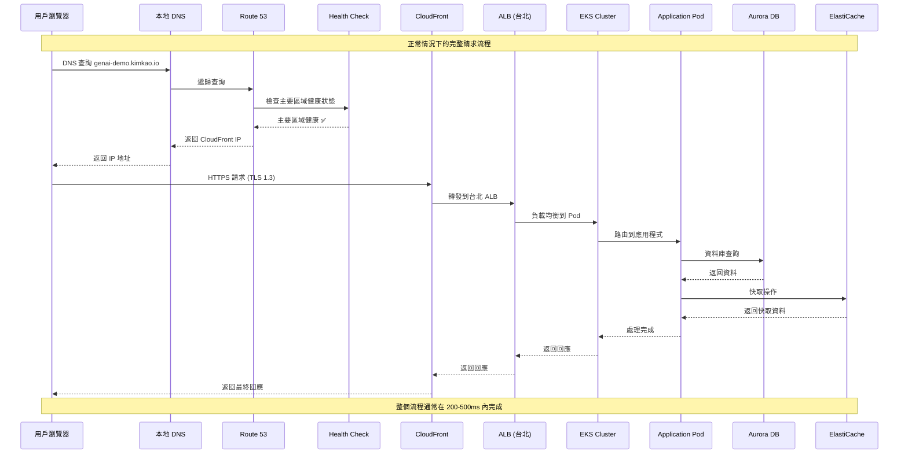
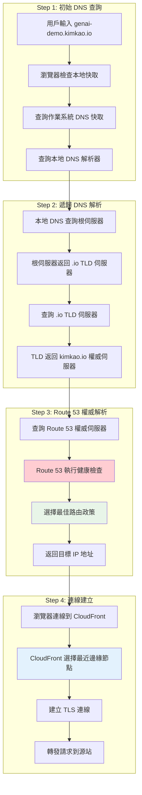
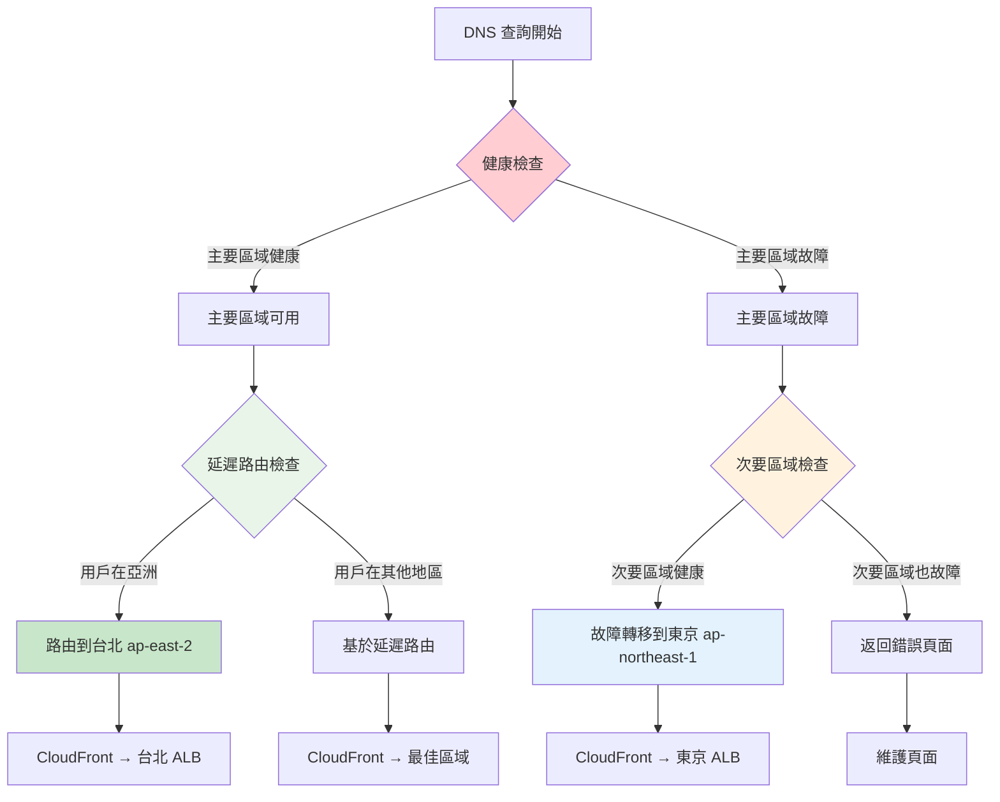
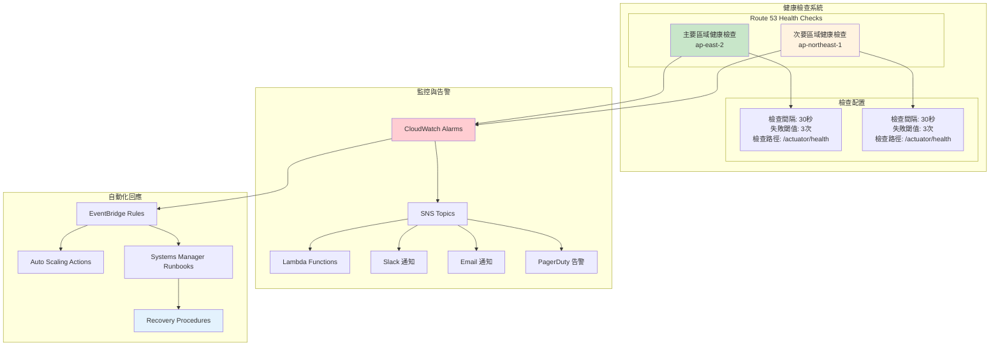
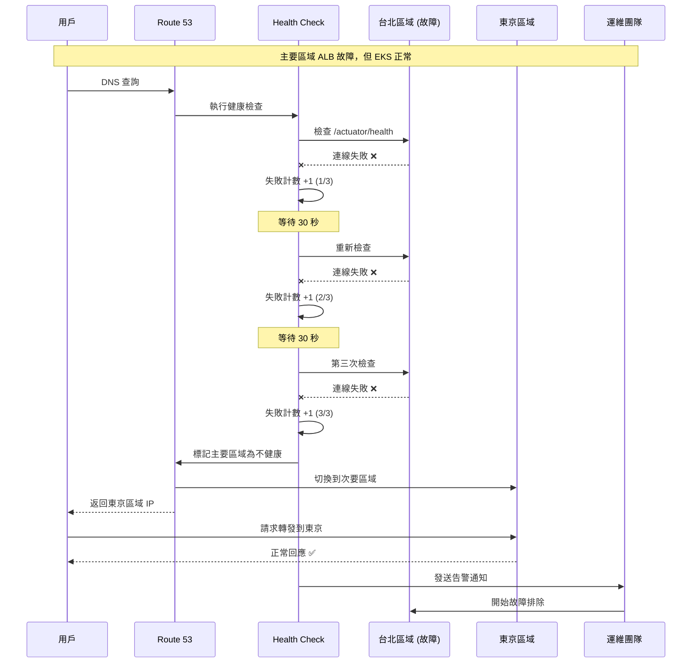
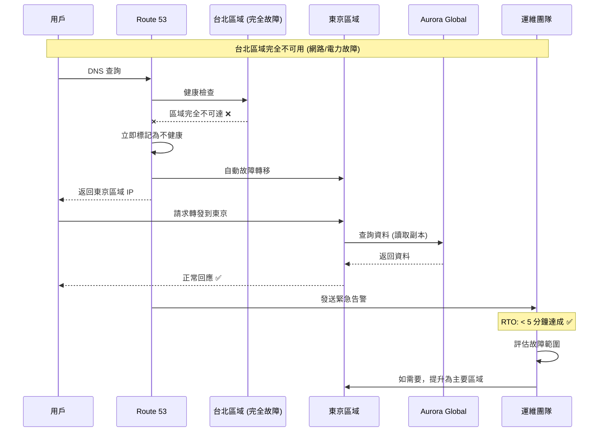
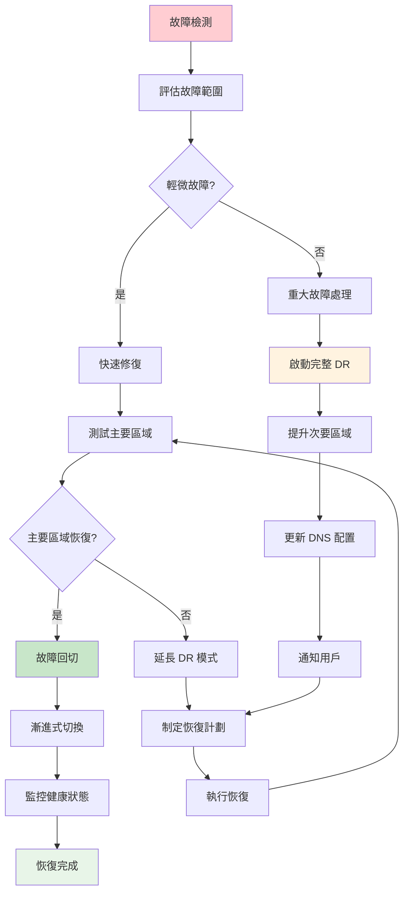
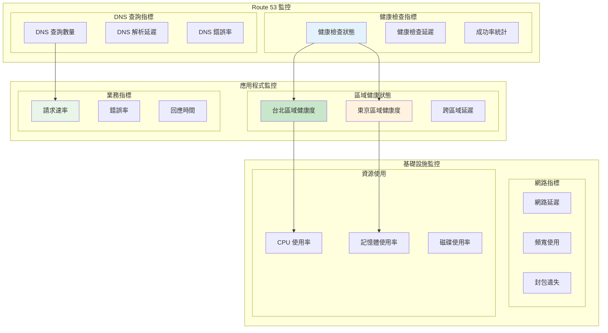
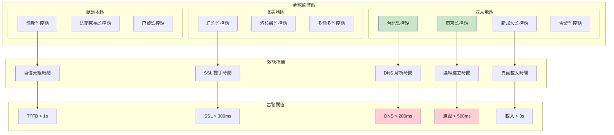

# Operational Viewpoint - DNS 解析與災難恢復

**文件版本**: 1.0  
**最後更新**: 2025年9月24日 下午5:15 (台北時間)  
**作者**: Operations Team  
**狀態**: Active

## 📋 目錄

- [概覽](#概覽)
- [DNS 解析架構](#dns-解析架構)
- [正常流量路由](#正常流量路由)
- [災難恢復機制](#災難恢復機制)
- [故障轉移流程](#故障轉移流程)
- [監控和告警](#監控和告警)
- [運維流程](#運維流程)
- [效能優化](#效能優化)

## 概覽

GenAI Demo 採用 Multi-Region Active-Active 架構，透過 Amazon Route 53 實現智能 DNS 解析和自動故障轉移。系統設計確保在主要區域 (ap-east-2) 發生故障時，能夠自動切換到次要區域 (ap-northeast-1)，提供持續的服務可用性。

### 運維目標

- **高可用性**: 99.9% 服務可用性
- **快速恢復**: RTO < 5分鐘，RPO < 1分鐘
- **自動故障轉移**: 無需人工干預
- **透明切換**: 用戶無感知的區域切換
- **全球效能**: 最佳化的全球存取體驗

## DNS 解析架構

### 整體 DNS 架構

```mermaid
graph TB
    subgraph "Global DNS Infrastructure"
        subgraph "用戶端"
            User[用戶瀏覽器]
            Mobile[行動應用程式]
            API[API 客戶端]
        end
        
        subgraph "DNS 解析鏈"
            LocalDNS[本地 DNS 解析器]
            ISP_DNS[ISP DNS 伺服器]
            Root[根 DNS 伺服器]
            TLD[.io TLD 伺服器]
        end
        
        subgraph "Route 53"
            HostedZone[Hosted Zone<br/>kimkao.io]
            HealthChecks[Health Checks]
            
            subgraph "DNS Records"
                ARecord[A Record<br/>genai-demo.kimkao.io]
                CNAMERecord[CNAME Records]
                AAAARecord[AAAA Record (IPv6)]
            end
            
            subgraph "Routing Policies"
                Weighted[Weighted Routing]
                Latency[Latency-based Routing]
                Failover[Failover Routing]
                Geolocation[Geolocation Routing]
            end
        end
    end
    
    subgraph "CloudFront Distribution"
        CF[CloudFront Edge Locations]
        CFOrigin[Origin Configuration]
    end
    
    subgraph "ap-east-2 (台北) - Primary"
        ALB1[Application Load Balancer]
        EKS1[EKS Cluster]
        Health1[Health Check Endpoint]
    end
    
    subgraph "ap-northeast-1 (東京) - Secondary"
        ALB2[Application Load Balancer]
        EKS2[EKS Cluster]
        Health2[Health Check Endpoint]
    end
    
    User --> LocalDNS
    Mobile --> LocalDNS
    API --> LocalDNS
    LocalDNS --> ISP_DNS
    ISP_DNS --> Root
    Root --> TLD
    TLD --> HostedZone
    HostedZone --> ARecord
    HostedZone --> CNAMERecord
    HostedZone --> AAAARecord
    ARecord --> Weighted
    ARecord --> Latency
    ARecord --> Failover
    ARecord --> Geolocation
    HealthChecks --> Health1
    HealthChecks --> Health2
    Failover --> CF
    CF --> CFOrigin
    CFOrigin --> ALB1
    CFOrigin -.-> ALB2
    ALB1 --> EKS1
    ALB2 --> EKS2
    
    style HostedZone fill:#e3f2fd
    style HealthChecks fill:#ffcdd2
    style ALB1 fill:#c8e6c9
    style ALB2 fill:#fff3e0
```

### DNS 記錄配置

```yaml
Route 53 Hosted Zone: kimkao.io
DNS Records:
  主要記錄:
    - genai-demo.kimkao.io (A Record)
    - api.genai-demo.kimkao.io (CNAME)
    - www.genai-demo.kimkao.io (CNAME)
  
  故障轉移記錄:
    Primary:
      - 記錄名稱: api.genai-demo.kimkao.io
      - 類型: A (Alias)
      - 目標: ALB ap-east-2
      - 路由政策: Failover (Primary)
      - 健康檢查: 啟用
      - TTL: 60秒
    
    Secondary:
      - 記錄名稱: api.genai-demo.kimkao.io
      - 類型: A (Alias)
      - 目標: ALB ap-northeast-1
      - 路由政策: Failover (Secondary)
      - 健康檢查: 啟用
      - TTL: 60秒
  
  延遲路由記錄:
    Taipei:
      - 記錄名稱: api-latency.genai-demo.kimkao.io
      - 區域: ap-east-2
      - 目標: ALB ap-east-2
      - 健康檢查: 啟用
    
    Tokyo:
      - 記錄名稱: api-latency.genai-demo.kimkao.io
      - 區域: ap-northeast-1
      - 目標: ALB ap-northeast-1
      - 健康檢查: 啟用
```

## 正常流量路由

### 用戶訪問 https://genai-demo.kimkao.io 的完整流程



### DNS 解析詳細步驟



### 路由政策決策流程



## 災難恢復機制

### 故障檢測與轉移架構



### 災難恢復場景

#### 場景 1: 主要區域部分故障



#### 場景 2: 主要區域完全故障



## 故障轉移流程

### 自動故障轉移時序圖

```mermaid
gantt
    title 故障轉移時間線 (RTO < 5分鐘)
    dateFormat X
    axisFormat %M:%S
    
    section 檢測階段
    健康檢查失敗 (第1次)    :0, 30s
    健康檢查失敗 (第2次)    :30s, 60s
    健康檢查失敗 (第3次)    :60s, 90s
    
    section 切換階段
    DNS 記錄更新           :90s, 95s
    DNS 傳播              :95s, 155s
    
    section 恢復階段
    用戶流量切換完成        :155s, 180s
    告警通知發送           :90s, 120s
    運維團隊響應           :120s, 300s
```

### 故障轉移決策矩陣

```yaml
故障轉移觸發條件:
  自動觸發:
    - 健康檢查連續失敗 3 次 (90秒)
    - HTTP 5xx 錯誤率 > 50% (持續 2分鐘)
    - 回應時間 > 10秒 (持續 1分鐘)
    - 連線超時 > 30秒

  手動觸發:
    - 計劃性維護
    - 安全事件
    - 效能問題
    - 運維決策

故障轉移動作:
  DNS 層面:
    - 更新 Route 53 記錄
    - 調整 TTL 為 60秒
    - 啟用次要區域路由
    - 停用主要區域路由

  應用層面:
    - 切換資料庫連線到讀取副本
    - 更新快取配置
    - 調整監控閾值
    - 啟用降級模式

  通知層面:
    - 發送 Slack 通知
    - 觸發 PagerDuty 告警
    - 更新狀態頁面
    - 通知相關團隊
```

### 故障恢復流程



## 監控和告警

### 監控儀表板



### 告警配置

```yaml
CloudWatch Alarms:
  健康檢查告警:
    PrimaryHealthCheckFailure:
      指標: Route53 HealthCheckStatus
      閾值: < 1 (不健康)
      評估期間: 2 個數據點，共 2 分鐘
      動作: SNS → PagerDuty (P1)
    
    SecondaryHealthCheckFailure:
      指標: Route53 HealthCheckStatus
      閾值: < 1 (不健康)
      評估期間: 2 個數據點，共 2 分鐘
      動作: SNS → PagerDuty (P0 - 兩個區域都故障)

  應用程式告警:
    HighErrorRate:
      指標: ALB 5xx 錯誤率
      閾值: > 5%
      評估期間: 3 個數據點，共 3 分鐘
      動作: SNS → Slack + Email
    
    HighLatency:
      指標: ALB 回應時間
      閾值: > 2 秒 (95th percentile)
      評估期間: 2 個數據點，共 4 分鐘
      動作: SNS → Slack

  DNS 告警:
    DNSResolutionFailure:
      指標: Route53 查詢失敗率
      閾值: > 1%
      評估期間: 2 個數據點，共 2 分鐘
      動作: SNS → PagerDuty (P1)

SNS Topics:
  genai-demo-critical-alerts:
    訂閱者:
      - PagerDuty 整合
      - 運維團隊 Email
      - Slack #alerts 頻道
  
  genai-demo-warning-alerts:
    訂閱者:
      - Slack #monitoring 頻道
      - 開發團隊 Email
```

## 運維流程

### 日常運維檢查清單

```yaml
每日檢查 (自動化):
  健康檢查狀態:
    - ✅ 主要區域健康檢查正常
    - ✅ 次要區域健康檢查正常
    - ✅ DNS 解析正常
    - ✅ SSL 憑證有效 (>30天)

  效能指標:
    - ✅ 平均回應時間 < 1秒
    - ✅ 錯誤率 < 1%
    - ✅ 可用性 > 99.9%
    - ✅ DNS 解析時間 < 100ms

每週檢查 (手動):
  故障轉移測試:
    - 🔧 模擬主要區域故障
    - 🔧 驗證自動切換功能
    - 🔧 測試故障回切流程
    - 🔧 檢查告警通知

  容量規劃:
    - 📊 分析流量趨勢
    - 📊 評估資源使用率
    - 📊 預測容量需求
    - 📊 更新擴展計劃

每月檢查 (深度):
  災難恢復演練:
    - 🎯 完整 DR 演練
    - 🎯 RTO/RPO 驗證
    - 🎯 流程文檔更新
    - 🎯 團隊培訓

  安全審查:
    - 🔒 存取權限審查
    - 🔒 SSL/TLS 配置檢查
    - 🔒 安全群組規則審查
    - 🔒 合規性檢查
```

### 故障排除手冊

```yaml
常見問題診斷:
  DNS 解析問題:
    症狀: 用戶無法存取網站
    檢查步驟:
      1. 驗證 Route 53 健康檢查狀態
      2. 檢查 DNS 記錄配置
      3. 測試從不同地點的 DNS 解析
      4. 檢查 TTL 設定
    解決方案:
      - 更新 DNS 記錄
      - 清除 DNS 快取
      - 調整健康檢查配置

  健康檢查失敗:
    症狀: Route 53 顯示區域不健康
    檢查步驟:
      1. 檢查 ALB 狀態
      2. 驗證目標群組健康狀態
      3. 檢查 /actuator/health 端點
      4. 查看應用程式日誌
    解決方案:
      - 重啟不健康的實例
      - 調整健康檢查參數
      - 修復應用程式問題

  跨區域延遲高:
    症狀: 用戶回報存取速度慢
    檢查步驟:
      1. 檢查 CloudFront 快取命中率
      2. 測量區域間網路延遲
      3. 分析 ALB 存取日誌
      4. 檢查資料庫查詢效能
    解決方案:
      - 優化 CloudFront 配置
      - 調整快取策略
      - 優化資料庫查詢
      - 考慮增加邊緣節點

緊急聯絡資訊:
  P0 事件 (服務完全中斷):
    - PagerDuty: 自動呼叫值班工程師
    - Slack: #incident-response
    - 升級路徑: 值班工程師 → 技術主管 → CTO

  P1 事件 (部分功能影響):
    - Slack: #alerts
    - Email: ops-team@company.com
    - 回應時間: 1小時內

  P2 事件 (效能問題):
    - Slack: #monitoring
    - 回應時間: 4小時內
```

## 效能優化

### DNS 效能優化

```yaml
DNS 快取優化:
  TTL 設定:
    - A 記錄: 300秒 (正常情況)
    - A 記錄: 60秒 (故障轉移期間)
    - CNAME 記錄: 3600秒
    - NS 記錄: 86400秒

  解析器優化:
    - 使用 Route 53 Resolver
    - 啟用 DNS64 支援
    - 配置條件轉發規則
    - 監控查詢模式

CloudFront 優化:
  快取策略:
    - 靜態資源: 24小時
    - API 回應: 5分鐘
    - 動態內容: 不快取
    - 錯誤頁面: 5分鐘

  邊緣節點:
    - 啟用所有邊緣節點
    - 使用 HTTP/2 和 HTTP/3
    - 啟用 Gzip 壓縮
    - 配置自定義錯誤頁面

網路效能:
  連線優化:
    - 啟用 TCP Fast Open
    - 使用 Keep-Alive 連線
    - 優化 SSL/TLS 握手
    - 實施 HTTP/2 Server Push

  頻寬管理:
    - 監控頻寬使用
    - 實施 QoS 政策
    - 優化資料傳輸
    - 使用 CDN 分流
```

### 全球效能監控



---

**文件狀態**: ✅ 完成  
**下一步**: 查看 [Deployment Viewpoint](../deployment/deployment-architecture.md) 了解部署架構  
**相關文件**: 
- [Infrastructure Viewpoint](../infrastructure/aws-resource-architecture.md)
- [Security Viewpoint](../security/iam-permissions-architecture.md)
- [Deployment Viewpoint](../deployment/deployment-architecture.md)