# Operational Viewpoint - DNS Resolution and Disaster Recovery

**Document Version**: 1.0  
**Last Updated**: September 24, 2025 5:15 PM (Taipei Time)  
**Author**: Operations Team  
**Status**: Active

## 📋 Table of Contents

- [Overview](#overview)
- [DNS Resolution Architecture](#dns-resolution-architecture)
- [Normal Traffic Routing](#normal-traffic-routing)
- [Disaster Recovery Mechanisms](#disaster-recovery-mechanisms)
- [Failover Procedures](#failover-procedures)
- [Monitoring and Alerting](#monitoring-and-alerting)
- [Operations Procedures](#operations-procedures)
- [Performance Optimization](#performance-optimization)

## Overview

GenAI Demo adopts a Multi-Region Active-Active architecture, implementing intelligent DNS resolution and automatic failover through Amazon Route 53. The system design ensures that when the primary region (ap-east-2) fails, it can automatically switch to the secondary region (ap-northeast-1), providing continuous service availability.

### Operational Objectives

- **High Availability**: 99.9% service availability
- **Fast Recovery**: RTO < 5 minutes, RPO < 1 minute
- **Automatic Failover**: No manual intervention required
- **Transparent Switching**: Seamless region switching for users
- **Global Performance**: Optimized global access experience

## DNS Resolution Architecture

### Overall DNS Architecture

```mermaid
graph TB
    subgraph "Global DNS Infrastructure"
        subgraph "Clients"
            User[User Browser]
            Mobile[Mobile Application]
            API[API Client]
        end
        
        subgraph "DNS Resolution Chain"
            LocalDNS[Local DNS Resolver]
            ISP_DNS[ISP DNS Server]
            Root[Root DNS Server]
            TLD[.io TLD Server]
        end
        
        subgraph "Route 53"
            HostedZone[Hosted Zone<br/>kimkao.io]
            HealthChecks[Health Checks]
            
            subgraph "DNS Records"
                ARecord[A Record<br/>genai-demo.kimkao.io]
                CNAMERecord[CNAME Records]
                AAAARecord[AAAA Record (IPv6)]
            end
            
            subgraph "Routing Policies"
                Weighted[Weighted Routing]
                Latency[Latency-based Routing]
                Failover[Failover Routing]
                Geolocation[Geolocation Routing]
            end
        end
    end
    
    subgraph "CloudFront Distribution"
        CF[CloudFront Edge Locations]
        CFOrigin[Origin Configuration]
    end
    
    subgraph "ap-east-2 (Taipei) - Primary"
        ALB1[Application Load Balancer]
        EKS1[EKS Cluster]
        Health1[Health Check Endpoint]
    end
    
    subgraph "ap-northeast-1 (Tokyo) - Secondary"
        ALB2[Application Load Balancer]
        EKS2[EKS Cluster]
        Health2[Health Check Endpoint]
    end
    
    User --> LocalDNS
    Mobile --> LocalDNS
    API --> LocalDNS
    LocalDNS --> ISP_DNS
    ISP_DNS --> Root
    Root --> TLD
    TLD --> HostedZone
    HostedZone --> ARecord
    HostedZone --> CNAMERecord
    HostedZone --> AAAARecord
    ARecord --> Weighted
    ARecord --> Latency
    ARecord --> Failover
    ARecord --> Geolocation
    HealthChecks --> Health1
    HealthChecks --> Health2
    Failover --> CF
    CF --> CFOrigin
    CFOrigin --> ALB1
    CFOrigin -.-> ALB2
    ALB1 --> EKS1
    ALB2 --> EKS2
    
    style HostedZone fill:#e3f2fd
    style HealthChecks fill:#ffcdd2
    style ALB1 fill:#c8e6c9
    style ALB2 fill:#fff3e0
```

### DNS Record Configuration

```yaml
Route 53 Hosted Zone: kimkao.io
DNS Records:
  Primary Records:
    - genai-demo.kimkao.io (A Record)
    - api.genai-demo.kimkao.io (CNAME)
    - www.genai-demo.kimkao.io (CNAME)
  
  Failover Records:
    Primary:
      - Record Name: api.genai-demo.kimkao.io
      - Type: A (Alias)
      - Target: ALB ap-east-2
      - Routing Policy: Failover (Primary)
      - Health Check: Enabled
      - TTL: 60 seconds
    
    Secondary:
      - Record Name: api.genai-demo.kimkao.io
      - Type: A (Alias)
      - Target: ALB ap-northeast-1
      - Routing Policy: Failover (Secondary)
      - Health Check: Enabled
      - TTL: 60 seconds
  
  Latency Routing Records:
    Taipei:
      - Record Name: api-latency.genai-demo.kimkao.io
      - Region: ap-east-2
      - Target: ALB ap-east-2
      - Health Check: Enabled
    
    Tokyo:
      - Record Name: api-latency.genai-demo.kimkao.io
      - Region: ap-northeast-1
      - Target: ALB ap-northeast-1
      - Health Check: Enabled
```

## Normal Traffic Routing

### Complete Flow for User Accessing https://genai-demo.kimkao.io


### Detailed DNS Resolution Steps


### Routing Policy Decision Flow


## Disaster Recovery Mechanisms

### Failure Detection and Failover Architecture


### Disaster Recovery Scenarios

#### Scenario 1: Primary Region Partial Failure


#### Scenario 2: Primary Region Complete Failure

```mermaid
sequenceDiagram
    participant User as User
    participant Route53 as Route 53
    participant Primary as Taipei Region (Complete Failure)
    participant Secondary as Tokyo Region
    participant RDS as Aurora Global
    participant Ops as Operations Team
    
    Note over User,Ops: Taipei region completely unavailable (network/power failure)
    
    User->>Route53: DNS query
    Route53->>Primary: Health check
    Primary--xRoute53: Region completely unreachable ❌
    
    Route53->>Route53: Immediately mark as unhealthy
    Route53->>Secondary: Automatic failover
    Route53-->>User: Return Tokyo region IP
    
    User->>Secondary: Request forwarded to Tokyo
    Secondary->>RDS: Query data (read replica)
    RDS-->>Secondary: Return data
    Secondary-->>User: Normal response ✅
    
    Route53->>Ops: Send emergency alert
    Note over Ops: RTO: < 5 minutes achieved ✅
    
    Ops->>Ops: Assess failure scope
    Ops->>Secondary: If needed, promote to primary region
```



## Failover Procedures

### Automatic Failover Timeline

```mermaid
gantt
    title Failover Timeline (RTO < 5 minutes)
    dateFormat X
    axisFormat %M:%S
    
    section Detection Phase
    Health check failure (1st)    :0, 30s
    Health check failure (2nd)    :30s, 60s
    Health check failure (3rd)    :60s, 90s
    
    section Switching Phase
    DNS record update             :90s, 95s
    DNS propagation              :95s, 155s
    
    section Recovery Phase
    User traffic switch complete  :155s, 180s
    Alert notifications sent      :90s, 120s
    Operations team response      :120s, 300s
```

### Failover Decision Matrix

```yaml
Failover Trigger Conditions:
  Automatic Triggers:
    - Health check fails 3 consecutive times (90 seconds)
    - HTTP 5xx error rate > 50% (sustained for 2 minutes)
    - Response time > 10 seconds (sustained for 1 minute)
    - Connection timeout > 30 seconds

  Manual Triggers:
    - Planned maintenance
    - Security incidents
    - Performance issues
    - Operational decisions

Failover Actions:
  DNS Level:
    - Update Route 53 records
    - Adjust TTL to 60 seconds
    - Enable secondary region routing
    - Disable primary region routing

  Application Level:
    - Switch database connections to read replicas
    - Update cache configuration
    - Adjust monitoring thresholds
    - Enable degraded mode

  Notification Level:
    - Send Slack notifications
    - Trigger PagerDuty alerts
    - Update status page
    - Notify relevant teams
```

### Failure Recovery Process


## Monitoring and Alerting

### Monitoring Dashboard


### Alert Configuration

```yaml
CloudWatch Alarms:
  Health Check Alerts:
    PrimaryHealthCheckFailure:
      Metric: Route53 HealthCheckStatus
      Threshold: < 1 (unhealthy)
      Evaluation Period: 2 datapoints within 2 minutes
      Action: SNS → PagerDuty (P1)
    
    SecondaryHealthCheckFailure:
      Metric: Route53 HealthCheckStatus
      Threshold: < 1 (unhealthy)
      Evaluation Period: 2 datapoints within 2 minutes
      Action: SNS → PagerDuty (P0 - both regions failed)

  Application Alerts:
    HighErrorRate:
      Metric: ALB 5xx error rate
      Threshold: > 5%
      Evaluation Period: 3 datapoints within 3 minutes
      Action: SNS → Slack + Email
    
    HighLatency:
      Metric: ALB response time
      Threshold: > 2 seconds (95th percentile)
      Evaluation Period: 2 datapoints within 4 minutes
      Action: SNS → Slack

  DNS Alerts:
    DNSResolutionFailure:
      Metric: Route53 query failure rate
      Threshold: > 1%
      Evaluation Period: 2 datapoints within 2 minutes
      Action: SNS → PagerDuty (P1)

SNS Topics:
  genai-demo-critical-alerts:
    Subscribers:
      - PagerDuty integration
      - Operations team email
      - Slack #alerts channel
  
  genai-demo-warning-alerts:
    Subscribers:
      - Slack #monitoring channel
      - Development team email
```

## Operations Procedures

### Daily Operations Checklist

```yaml
Daily Checks (Automated):
  Health Check Status:
    - ✅ Primary region health check normal
    - ✅ Secondary region health check normal
    - ✅ DNS resolution normal
    - ✅ SSL certificate valid (>30 days)

  Performance Metrics:
    - ✅ Average response time < 1 second
    - ✅ Error rate < 1%
    - ✅ Availability > 99.9%
    - ✅ DNS resolution time < 100ms

Weekly Checks (Manual):
  Failover Testing:
    - 🔧 Simulate primary region failure
    - 🔧 Verify automatic switching functionality
    - 🔧 Test failback process
    - 🔧 Check alert notifications

  Capacity Planning:
    - 📊 Analyze traffic trends
    - 📊 Evaluate resource utilization
    - 📊 Predict capacity requirements
    - 📊 Update scaling plans

Monthly Checks (Deep):
  Disaster Recovery Drills:
    - 🎯 Complete DR drill
    - 🎯 RTO/RPO verification
    - 🎯 Process documentation update
    - 🎯 Team training

  Security Review:
    - 🔒 Access permission review
    - 🔒 SSL/TLS configuration check
    - 🔒 Security group rules review
    - 🔒 Compliance check
```

### Troubleshooting Manual

```yaml
Common Issue Diagnosis:
  DNS Resolution Issues:
    Symptoms: Users cannot access website
    Check Steps:
      1. Verify Route 53 health check status
      2. Check DNS record configuration
      3. Test DNS resolution from different locations
      4. Check TTL settings
    Solutions:
      - Update DNS records
      - Clear DNS cache
      - Adjust health check configuration

  Health Check Failures:
    Symptoms: Route 53 shows region as unhealthy
    Check Steps:
      1. Check ALB status
      2. Verify target group health status
      3. Check /actuator/health endpoint
      4. Review application logs
    Solutions:
      - Restart unhealthy instances
      - Adjust health check parameters
      - Fix application issues

  High Cross-region Latency:
    Symptoms: Users report slow access
    Check Steps:
      1. Check CloudFront cache hit rate
      2. Measure inter-region network latency
      3. Analyze ALB access logs
      4. Check database query performance
    Solutions:
      - Optimize CloudFront configuration
      - Adjust caching strategy
      - Optimize database queries
      - Consider adding edge locations

Emergency Contact Information:
  P0 Incidents (Complete service outage):
    - PagerDuty: Automatically calls on-call engineer
    - Slack: #incident-response
    - Escalation Path: On-call engineer → Tech lead → CTO

  P1 Incidents (Partial functionality impact):
    - Slack: #alerts
    - Email: ops-team@company.com
    - Response Time: Within 1 hour

  P2 Incidents (Performance issues):
    - Slack: #monitoring
    - Response Time: Within 4 hours
```

## Performance Optimization

### DNS Performance Optimization

```yaml
DNS Cache Optimization:
  TTL Settings:
    - A records: 300 seconds (normal conditions)
    - A records: 60 seconds (during failover)
    - CNAME records: 3600 seconds
    - NS records: 86400 seconds

  Resolver Optimization:
    - Use Route 53 Resolver
    - Enable DNS64 support
    - Configure conditional forwarding rules
    - Monitor query patterns

CloudFront Optimization:
  Cache Strategy:
    - Static resources: 24 hours
    - API responses: 5 minutes
    - Dynamic content: No cache
    - Error pages: 5 minutes

  Edge Locations:
    - Enable all edge locations
    - Use HTTP/2 and HTTP/3
    - Enable Gzip compression
    - Configure custom error pages

Network Performance:
  Connection Optimization:
    - Enable TCP Fast Open
    - Use Keep-Alive connections
    - Optimize SSL/TLS handshake
    - Implement HTTP/2 Server Push

  Bandwidth Management:
    - Monitor bandwidth usage
    - Implement QoS policies
    - Optimize data transfer
    - Use CDN for traffic distribution
```

### Global Performance Monitoring


---

**Document Status**: ✅ Complete  
**Next Step**: Review [Deployment Viewpoint](../deployment/deployment-architecture.md) for deployment architecture  
**Related Documents**: 
- [Infrastructure Viewpoint](../infrastructure/aws-resource-architecture.md)
- [Security Viewpoint](../security/iam-permissions-architecture.md)
- [Deployment Viewpoint](../deployment/deployment-architecture.md)