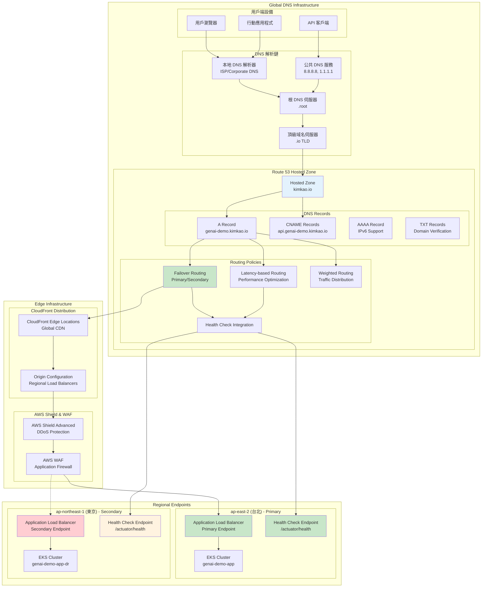
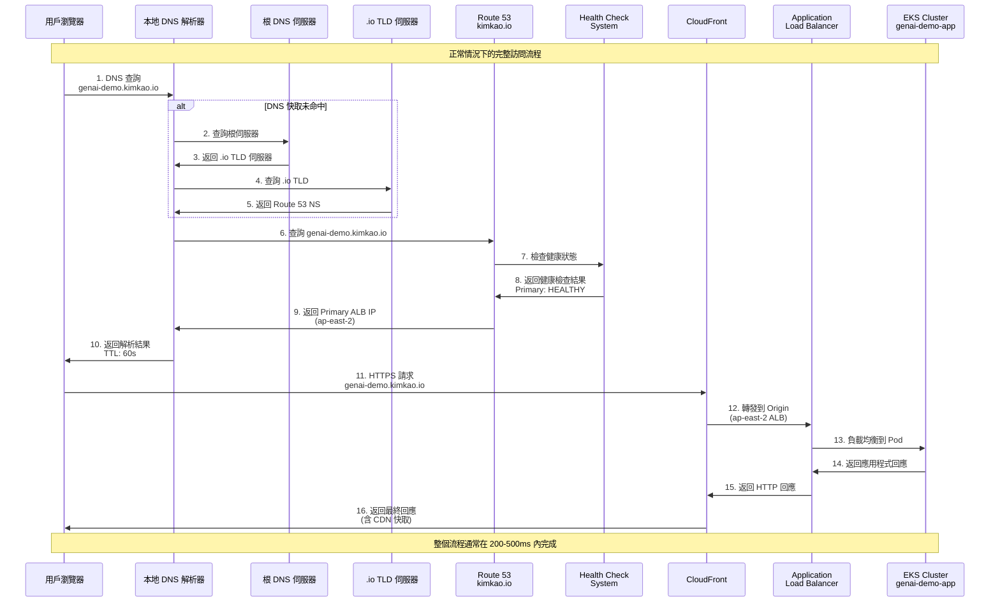
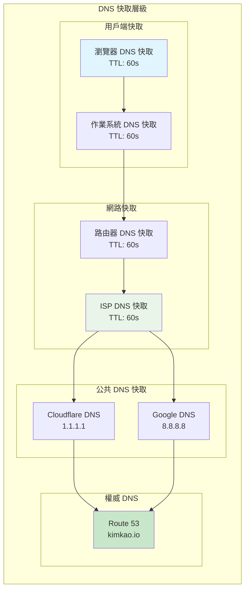
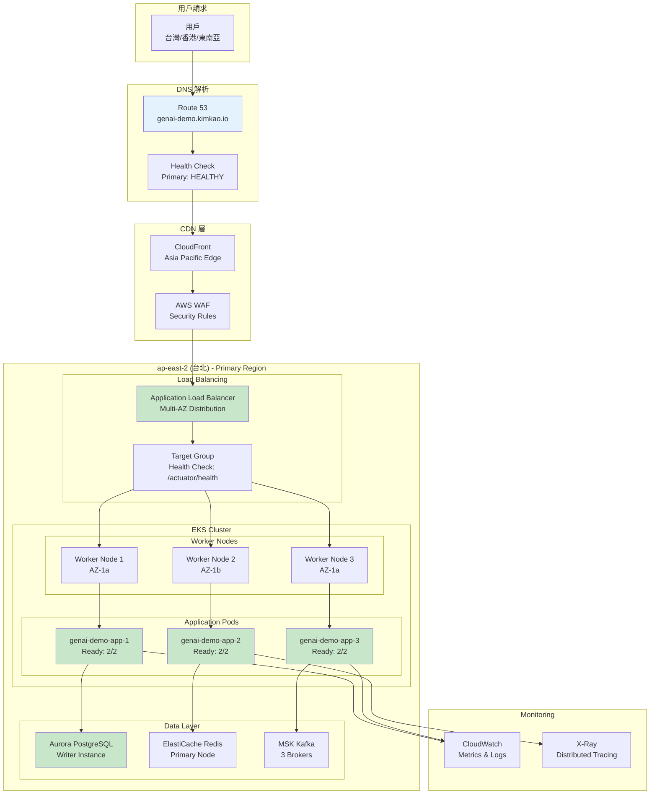
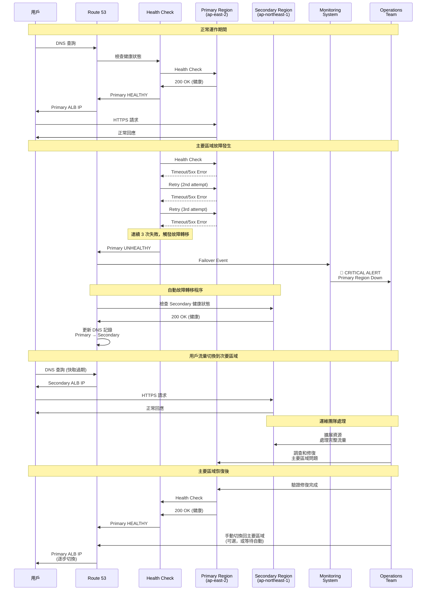
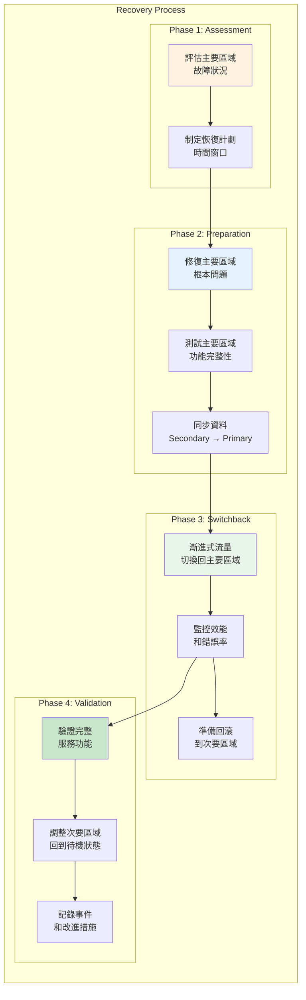
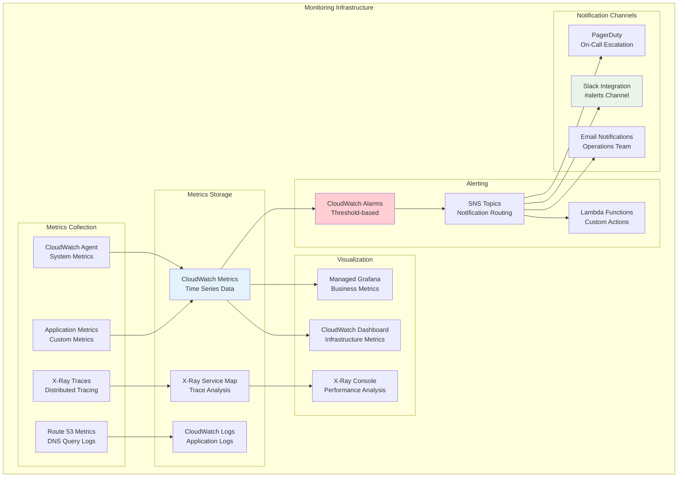

# DNS 解析與災難恢復 - Operational Viewpoint

**文件版本**: 1.0  
**最後更新**: 2025年9月24日 下午6:02 (台北時間)  
**作者**: Operations Team  
**狀態**: Active

## 📋 目錄

- [概覽](#概覽)
- [DNS 解析架構](#dns-解析架構)
- [用戶訪問流程](#用戶訪問流程)
- [正常流量路由](#正常流量路由)
- [災難恢復機制](#災難恢復機制)
- [故障轉移流程](#故障轉移流程)
- [健康檢查機制](#健康檢查機制)
- [監控和告警](#監控和告警)
- [運維操作手冊](#運維操作手冊)

## 概覽

GenAI Demo 採用 Amazon Route 53 實現智能 DNS 解析和自動故障轉移機制。當用戶訪問 `https://genai-demo.kimkao.io` 時，系統會根據健康檢查結果和路由策略，將流量導向最佳的區域端點。在主要區域 (ap-east-2 台北) 發生故障時，能夠自動切換到次要區域 (ap-northeast-1 東京)。

### 運維目標

- **高可用性**: 99.9% 服務可用性 (RTO < 5分鐘)
- **自動故障轉移**: 無需人工干預的區域切換
- **透明切換**: 用戶無感知的服務連續性
- **快速恢復**: RPO < 1分鐘，資料損失最小化
- **全球效能**: 基於延遲的最佳路由選擇

## DNS 解析架構

### 整體 DNS 基礎設施



### DNS 記錄配置

```yaml
Route 53 Hosted Zone: kimkao.io
DNS Records Configuration:

# 主要應用程式記錄
genai-demo.kimkao.io:
  Type: A (Alias)
  Routing Policy: Failover
  Primary Record:
    Target: ALB-ap-east-2.elb.amazonaws.com
    Set Identifier: "genai-demo-primary"
    Failover Type: PRIMARY
    Health Check: genai-demo-primary-health-check
    TTL: 60 seconds
  
  Secondary Record:
    Target: ALB-ap-northeast-1.elb.amazonaws.com
    Set Identifier: "genai-demo-secondary"
    Failover Type: SECONDARY
    Health Check: genai-demo-secondary-health-check
    TTL: 60 seconds

# API 端點記錄
api.genai-demo.kimkao.io:
  Type: CNAME
  Target: genai-demo.kimkao.io
  TTL: 300 seconds

# 延遲優化記錄
api-latency.genai-demo.kimkao.io:
  Type: A (Alias)
  Routing Policy: Latency-based
  Primary Record:
    Target: ALB-ap-east-2.elb.amazonaws.com
    Set Identifier: "genai-demo-latency-primary"
    Region: ap-east-2
    Health Check: genai-demo-primary-health-check
  
  Secondary Record:
    Target: ALB-ap-northeast-1.elb.amazonaws.com
    Set Identifier: "genai-demo-latency-secondary"
    Region: ap-northeast-1
    Health Check: genai-demo-secondary-health-check

# 健康檢查配置
Health Checks:
  genai-demo-primary-health-check:
    Type: HTTPS
    FQDN: api.genai-demo.kimkao.io
    Port: 443
    Path: /actuator/health
    Request Interval: 30 seconds
    Failure Threshold: 3 consecutive failures
    
  genai-demo-secondary-health-check:
    Type: HTTPS
    FQDN: api-dr.genai-demo.kimkao.io
    Port: 443
    Path: /actuator/health
    Request Interval: 30 seconds
    Failure Threshold: 3 consecutive failures
```

## 用戶訪問流程

### 完整 DNS 解析流程



### DNS 快取行為



## 正常流量路由

### 主要區域流量處理



### 流量分配策略

```yaml
Load Balancer Configuration:
  Algorithm: Round Robin with Sticky Sessions
  Health Check:
    Path: /actuator/health
    Interval: 30 seconds
    Timeout: 5 seconds
    Healthy Threshold: 2
    Unhealthy Threshold: 3
    
Target Group Configuration:
  Protocol: HTTP
  Port: 8080
  Health Check Grace Period: 300 seconds
  Deregistration Delay: 30 seconds
  
Pod Distribution:
  Availability Zone A: 2 Pods
  Availability Zone B: 1 Pod
  Anti-Affinity: Enabled (避免單點故障)
  
Session Affinity:
  Type: Application Load Balancer Cookie
  Duration: 1 hour
  Fallback: Round Robin
```

## 災難恢復機制

### 故障檢測和切換機制

```mermaid
graph TB
    subgraph "Health Check System"
        subgraph "Primary Region Monitoring"
            HC1[Health Check 1<br/>ALB Health]
            HC2[Health Check 2<br/>Application Health]
            HC3[Health Check 3<br/>Database Health]
        end
        
        subgraph "Secondary Region Monitoring"
            HC4[Health Check 4<br/>ALB Health (Standby)]
            HC5[Health Check 5<br/>Application Health (Standby)]
        end
        
        subgraph "Health Check Logic"
            Aggregator[Health Aggregator<br/>Route 53]
            Decision[Failover Decision<br/>Engine]
        end
    end
    
    subgraph "Failover Actions"
        subgraph "DNS Updates"
            DNSUpdate[DNS Record Update<br/>Primary → Secondary]
            TTLReduce[TTL Reduction<br/>60s → 30s]
        end
        
        subgraph "Data Synchronization"
            DBFailover[Aurora Global<br/>Promote Reader]
            CacheWarmup[Redis Cache<br/>Warmup Process]
            MSKSwitch[MSK Cross-Region<br/>Consumer Switch]
        end
        
        subgraph "Application Scaling"
            EKSScale[EKS Auto Scaling<br/>Secondary Region]
            PodScale[Pod Horizontal<br/>Scaling]
        end
    end
    
    subgraph "Notification System"
        Alerts[CloudWatch Alarms<br/>SNS Notifications]
        Slack[Slack Integration<br/>Operations Channel]
        PagerDuty[PagerDuty<br/>On-Call Engineer]
    end
    
    HC1 --> Aggregator
    HC2 --> Aggregator
    HC3 --> Aggregator
    HC4 --> Aggregator
    HC5 --> Aggregator
    
    Aggregator --> Decision
    
    Decision --> DNSUpdate
    Decision --> TTLReduce
    Decision --> DBFailover
    Decision --> CacheWarmup
    Decision --> MSKSwitch
    Decision --> EKSScale
    Decision --> PodScale
    
    Decision --> Alerts
    Alerts --> Slack
    Alerts --> PagerDuty
    
    style HC1 fill:#c8e6c9
    style HC2 fill:#c8e6c9
    style HC3 fill:#ffcdd2
    style Decision fill:#fff3e0
    style DNSUpdate fill:#e3f2fd
    style Alerts fill:#fce4ec
```

### 災難恢復時序圖



## 故障轉移流程

### 自動故障轉移觸發條件

```yaml
Failover Trigger Conditions:
  Primary Health Check Failures:
    Consecutive Failures: 3 次
    Check Interval: 30 秒
    Total Detection Time: 90 秒
    
  Failure Types:
    - HTTP Status: 5xx 錯誤
    - Connection Timeout: > 10 秒
    - SSL Certificate: 無效或過期
    - Response Content: 不包含預期內容
    
  Secondary Region Requirements:
    Health Status: HEALTHY
    Capacity: 至少 50% 生產容量
    Data Sync: 延遲 < 5 分鐘
    
Automatic Actions:
  1. DNS Record Update (0-30 秒)
  2. TTL Reduction (立即生效)
  3. Secondary Region Scaling (30-120 秒)
  4. Cache Warmup (60-180 秒)
  5. Monitoring Alert (立即)
```

### 手動故障轉移程序

```bash
# 緊急手動故障轉移腳本
#!/bin/bash

# 1. 驗證次要區域健康狀態
aws route53 get-health-check --health-check-id $SECONDARY_HEALTH_CHECK_ID

# 2. 更新 DNS 記錄指向次要區域
aws route53 change-resource-record-sets \
  --hosted-zone-id $HOSTED_ZONE_ID \
  --change-batch file://failover-to-secondary.json

# 3. 縮短 TTL 加速 DNS 傳播
aws route53 change-resource-record-sets \
  --hosted-zone-id $HOSTED_ZONE_ID \
  --change-batch file://reduce-ttl.json

# 4. 擴展次要區域容量
kubectl --context=secondary-region scale deployment genai-demo-app --replicas=6

# 5. 觸發快取預熱
curl -X POST https://api-dr.genai-demo.kimkao.io/admin/cache/warmup

# 6. 發送通知
aws sns publish \
  --topic-arn $ALERT_TOPIC_ARN \
  --message "Manual failover to secondary region completed"

echo "Manual failover completed. Monitor secondary region performance."
```

### 故障恢復流程



## 健康檢查機制

### 多層健康檢查架構

```mermaid
graph TB
    subgraph "Health Check Layers"
        subgraph "Route 53 Health Checks"
            R53HC1[Primary Region<br/>HTTPS Health Check]
            R53HC2[Secondary Region<br/>HTTPS Health Check]
        end
        
        subgraph "Load Balancer Health Checks"
            ALBHC1[ALB Target Group<br/>Health Check]
            ALBHC2[ALB Target Group<br/>Health Check (DR)]
        end
        
        subgraph "Kubernetes Health Checks"
            K8sLiveness[Pod Liveness Probe<br/>/actuator/health/liveness]
            K8sReadiness[Pod Readiness Probe<br/>/actuator/health/readiness]
        end
        
        subgraph "Application Health Checks"
            AppHealth[Spring Boot Actuator<br/>/actuator/health]
            DBHealth[Database Health<br/>Connection Pool]
            CacheHealth[Redis Health<br/>Connection Status]
            MSKHealth[Kafka Health<br/>Producer/Consumer]
        end
        
        subgraph "Infrastructure Health Checks"
            NodeHealth[Node Health<br/>CPU/Memory/Disk]
            NetworkHealth[Network Health<br/>Connectivity]
            StorageHealth[Storage Health<br/>EBS/Aurora]
        end
    end
    
    R53HC1 --> ALBHC1
    R53HC2 --> ALBHC2
    
    ALBHC1 --> K8sReadiness
    ALBHC2 --> K8sReadiness
    
    K8sLiveness --> AppHealth
    K8sReadiness --> AppHealth
    
    AppHealth --> DBHealth
    AppHealth --> CacheHealth
    AppHealth --> MSKHealth
    
    NodeHealth --> K8sLiveness
    NetworkHealth --> K8sLiveness
    StorageHealth --> DBHealth
    
    style R53HC1 fill:#c8e6c9
    style R53HC2 fill:#fff3e0
    style AppHealth fill:#e3f2fd
    style DBHealth fill:#e8f5e8
```

### 健康檢查配置詳情

```yaml
Route 53 Health Check Configuration:
  Primary Region Health Check:
    Type: HTTPS
    FQDN: api.genai-demo.kimkao.io
    Port: 443
    Path: /actuator/health
    Request Interval: 30 seconds
    Failure Threshold: 3 consecutive failures
    Success Threshold: 2 consecutive successes
    Timeout: 10 seconds
    Regions: 3 AWS regions for checking
    
  Secondary Region Health Check:
    Type: HTTPS
    FQDN: api-dr.genai-demo.kimkao.io
    Port: 443
    Path: /actuator/health
    Request Interval: 30 seconds
    Failure Threshold: 3 consecutive failures
    Success Threshold: 2 consecutive successes
    
Application Load Balancer Health Check:
  Protocol: HTTP
  Port: 8080
  Path: /actuator/health/readiness
  Interval: 30 seconds
  Timeout: 5 seconds
  Healthy Threshold: 2
  Unhealthy Threshold: 3
  HTTP Success Codes: 200
  
Kubernetes Pod Health Checks:
  Liveness Probe:
    HTTP Get: /actuator/health/liveness
    Initial Delay: 30 seconds
    Period: 10 seconds
    Timeout: 5 seconds
    Failure Threshold: 3
    
  Readiness Probe:
    HTTP Get: /actuator/health/readiness
    Initial Delay: 10 seconds
    Period: 5 seconds
    Timeout: 3 seconds
    Failure Threshold: 3
    Success Threshold: 1
    
Spring Boot Actuator Health Indicators:
  Database Health:
    Query: SELECT 1
    Timeout: 5 seconds
    
  Redis Health:
    Command: PING
    Timeout: 3 seconds
    
  Kafka Health:
    Producer Test: Send test message
    Consumer Test: Receive test message
    Timeout: 10 seconds
    
  Custom Business Health:
    Critical Services: Payment Gateway, User Service
    Timeout: 15 seconds
```

## 監控和告警

### 監控儀表板架構



### 關鍵監控指標

```yaml
DNS and Failover Metrics:
  Route 53 Health Check Status:
    Metric: HealthCheckStatus
    Threshold: < 1 (Unhealthy)
    Evaluation: 2 consecutive periods
    Action: Immediate alert + Failover
    
  DNS Query Response Time:
    Metric: ConnectionTime
    Threshold: > 5000ms
    Evaluation: 3 consecutive periods
    Action: Performance alert
    
  Failover Events:
    Metric: Custom metric (failover_events_total)
    Threshold: > 0
    Evaluation: Immediate
    Action: Critical alert + Page on-call
    
Application Performance Metrics:
  HTTP Response Time:
    Metric: ALB TargetResponseTime
    Threshold: > 2000ms (95th percentile)
    Evaluation: 5 minutes
    Action: Performance degradation alert
    
  HTTP Error Rate:
    Metric: ALB HTTPCode_Target_5XX_Count
    Threshold: > 1% of total requests
    Evaluation: 2 minutes
    Action: Service degradation alert
    
  Application Availability:
    Metric: ALB HealthyHostCount
    Threshold: < 2 healthy hosts
    Evaluation: 1 minute
    Action: Capacity alert
    
Infrastructure Metrics:
  EKS Cluster Health:
    Node Ready Status: All nodes ready
    Pod Restart Count: < 5 restarts/hour
    Resource Utilization: CPU < 80%, Memory < 85%
    
  Database Performance:
    Aurora CPU Utilization: < 80%
    Database Connections: < 80% of max
    Read/Write Latency: < 100ms (95th percentile)
    
  Cache Performance:
    Redis CPU Utilization: < 70%
    Cache Hit Rate: > 90%
    Memory Utilization: < 80%
```

### 告警升級策略

```yaml
Alert Escalation Matrix:

Level 1 - Information (Green):
  Conditions:
    - Performance degradation (non-critical)
    - Resource utilization warnings
    - Scheduled maintenance notifications
  Actions:
    - Slack notification to #monitoring
    - Email to operations team
    - Log to incident tracking system
  Response Time: 4 hours (business hours)

Level 2 - Warning (Yellow):
  Conditions:
    - Single region performance issues
    - Non-critical service degradation
    - Resource capacity warnings
  Actions:
    - Slack notification to #alerts
    - Email to on-call engineer
    - Create incident ticket
  Response Time: 1 hour

Level 3 - Critical (Orange):
  Conditions:
    - Service availability < 99%
    - Primary region health check failures
    - Database connection issues
  Actions:
    - Slack notification to #critical-alerts
    - PagerDuty alert to on-call engineer
    - SMS to operations manager
    - Auto-trigger runbook procedures
  Response Time: 15 minutes

Level 4 - Emergency (Red):
  Conditions:
    - Complete service outage
    - Failover events
    - Security incidents
    - Data loss scenarios
  Actions:
    - PagerDuty high-priority alert
    - Phone call to on-call engineer
    - SMS to all operations team
    - Auto-execute emergency procedures
    - Notify management team
  Response Time: 5 minutes
```

## 運維操作手冊

### 日常運維檢查清單

```yaml
Daily Operations Checklist:

Morning Health Check (09:00 UTC+8):
  □ 檢查 Route 53 健康檢查狀態
  □ 驗證主要和次要區域服務狀態
  □ 檢查過夜的告警和事件
  □ 驗證備份作業完成狀態
  □ 檢查資源使用率趨勢

Midday Performance Review (13:00 UTC+8):
  □ 檢查應用程式效能指標
  □ 驗證流量分配是否正常
  □ 檢查資料庫效能和連線狀態
  □ 驗證快取命中率和效能
  □ 檢查任何容量規劃需求

Evening System Review (18:00 UTC+8):
  □ 檢查當日的錯誤率和可用性
  □ 驗證監控系統正常運作
  □ 檢查安全事件和異常活動
  □ 準備夜間維護作業 (如有)
  □ 更新運維日誌和交接事項

Weekly Deep Dive (每週一 10:00 UTC+8):
  □ 檢查災難恢復測試結果
  □ 分析效能趨勢和容量規劃
  □ 檢查成本優化機會
  □ 驗證備份和恢復程序
  □ 更新運維文件和程序
```

### 故障排除指南

```yaml
DNS Resolution Issues:
  Symptoms:
    - 用戶無法訪問 genai-demo.kimkao.io
    - DNS 查詢超時或返回錯誤
    - 間歇性連線問題
    
  Troubleshooting Steps:
    1. 檢查 Route 53 健康檢查狀態
       aws route53 get-health-check --health-check-id $HC_ID
    
    2. 驗證 DNS 記錄配置
       dig genai-demo.kimkao.io
       nslookup genai-demo.kimkao.io 8.8.8.8
    
    3. 檢查 ALB 目標群組健康狀態
       aws elbv2 describe-target-health --target-group-arn $TG_ARN
    
    4. 驗證應用程式健康端點
       curl -v https://api.genai-demo.kimkao.io/actuator/health
    
    5. 檢查 CloudWatch 指標和日誌
       - Route 53 健康檢查指標
       - ALB 存取日誌
       - 應用程式日誌

Application Performance Issues:
  Symptoms:
    - 回應時間超過 2 秒
    - 高錯誤率 (5xx 錯誤)
    - 用戶回報載入緩慢
    
  Troubleshooting Steps:
    1. 檢查 ALB 指標
       - TargetResponseTime
       - HTTPCode_Target_5XX_Count
       - RequestCount
    
    2. 檢查 EKS Pod 狀態
       kubectl get pods -n default
       kubectl describe pod $POD_NAME
    
    3. 檢查應用程式日誌
       kubectl logs $POD_NAME -f
    
    4. 檢查資源使用率
       kubectl top pods
       kubectl top nodes
    
    5. 檢查資料庫效能
       - Aurora 效能洞察
       - 連線池使用率
       - 慢查詢日誌

Failover Issues:
  Symptoms:
    - 故障轉移未自動觸發
    - 次要區域無法處理流量
    - 資料同步問題
    
  Troubleshooting Steps:
    1. 檢查健康檢查配置和狀態
    2. 驗證次要區域服務狀態
    3. 檢查 Aurora Global 同步狀態
    4. 驗證 DNS TTL 和傳播
    5. 檢查自動擴展配置
```

### 緊急應變程序

```bash
#!/bin/bash
# 緊急應變腳本 - emergency-response.sh

# 設定變數
PRIMARY_REGION="ap-east-2"
SECONDARY_REGION="ap-northeast-1"
HOSTED_ZONE_ID="Z1234567890ABC"
ALERT_TOPIC="arn:aws:sns:ap-east-2:123456789012:emergency-alerts"

# 函數：檢查區域健康狀態
check_region_health() {
    local region=$1
    local endpoint=$2
    
    echo "檢查 $region 區域健康狀態..."
    response=$(curl -s -o /dev/null -w "%{http_code}" --max-time 10 "$endpoint/actuator/health")
    
    if [ "$response" = "200" ]; then
        echo "✅ $region 區域健康"
        return 0
    else
        echo "❌ $region 區域不健康 (HTTP $response)"
        return 1
    fi
}

# 函數：執行緊急故障轉移
emergency_failover() {
    echo "🚨 執行緊急故障轉移到次要區域..."
    
    # 1. 更新 DNS 記錄
    aws route53 change-resource-record-sets \
        --hosted-zone-id "$HOSTED_ZONE_ID" \
        --change-batch file://emergency-failover.json
    
    # 2. 擴展次要區域容量
    kubectl --context="$SECONDARY_REGION" scale deployment genai-demo-app --replicas=6
    
    # 3. 發送緊急通知
    aws sns publish \
        --topic-arn "$ALERT_TOPIC" \
        --subject "🚨 EMERGENCY FAILOVER EXECUTED" \
        --message "Emergency failover to secondary region completed at $(date)"
    
    echo "✅ 緊急故障轉移完成"
}

# 主要邏輯
echo "🔍 開始緊急健康檢查..."

if ! check_region_health "$PRIMARY_REGION" "https://api.genai-demo.kimkao.io"; then
    if check_region_health "$SECONDARY_REGION" "https://api-dr.genai-demo.kimkao.io"; then
        emergency_failover
    else
        echo "💥 兩個區域都不健康！需要立即人工介入！"
        aws sns publish \
            --topic-arn "$ALERT_TOPIC" \
            --subject "💥 CRITICAL: ALL REGIONS DOWN" \
            --message "Both primary and secondary regions are unhealthy. Immediate manual intervention required!"
        exit 1
    fi
else
    echo "✅ 主要區域正常運作"
fi
```

---

**文件狀態**: ✅ 完成  
**下一步**: 查看 [Context Viewpoint](../context/iam-permissions-relationships.md) 了解 IAM 權限關係  
**相關文件**: 
- [Deployment Viewpoint - AWS 基礎設施架構](../deployment/aws-infrastructure-architecture.md)
- [Context Viewpoint - IAM 權限關係](../context/iam-permissions-relationships.md)
- [Security Perspective](../../perspectives/security/aws-security-implementation.md)
