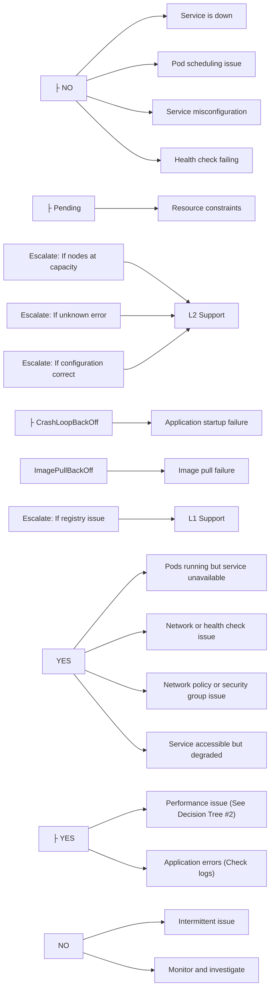
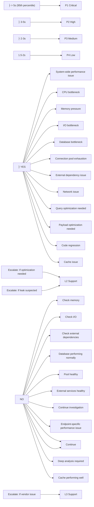
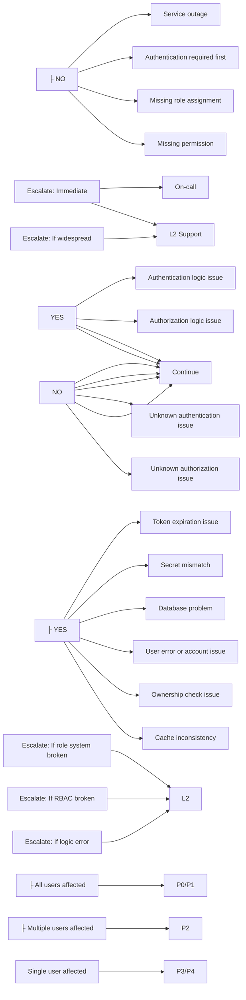
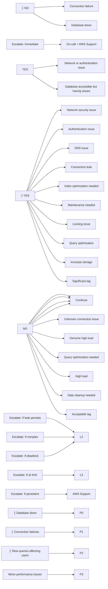
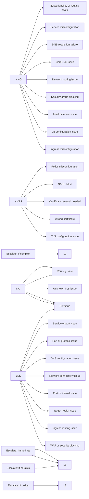
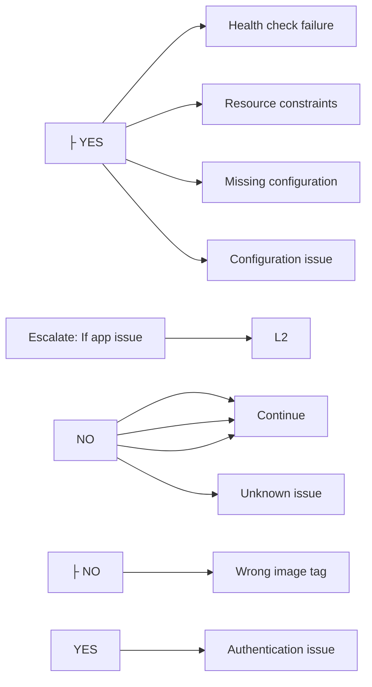
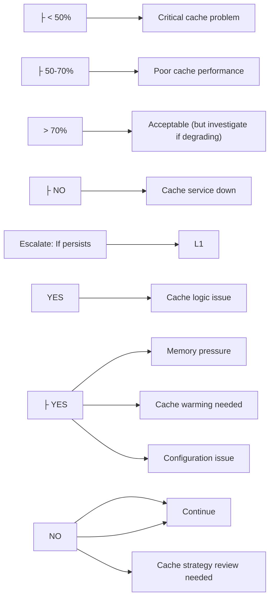
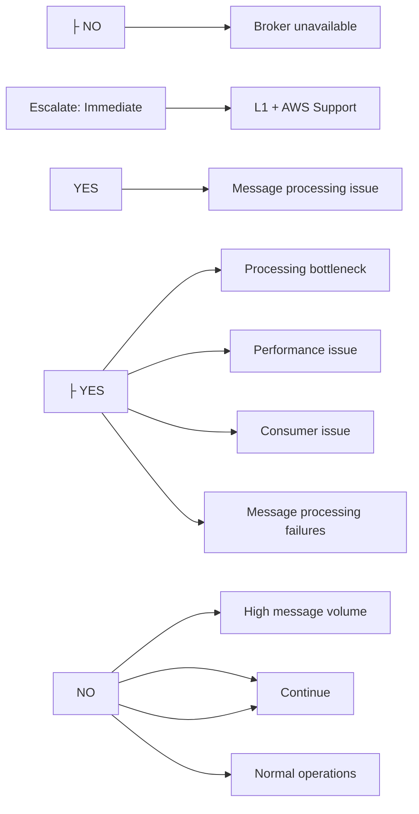

# Troubleshooting Decision Trees

## Overview

This document provides systematic decision trees for diagnosing and resolving common issues in the Enterprise E-Commerce Platform. Each decision tree follows an if-then-else diagnostic workflow with clear escalation criteria and procedures.

**Purpose**: Provide structured troubleshooting workflows for rapid issue resolution  
**Audience**: DevOps engineers, SREs, on-call engineers, support teams  
**Usage**: Follow the decision tree from top to bottom, answering each question to reach the appropriate resolution path

---

## How to Use This Guide

### Decision Tree Structure

Each decision tree follows this format:

1. **Initial Symptom**: The observable problem or alert
2. **Diagnostic Questions**: Yes/No questions to narrow down the issue
3. **Action Steps**: Specific commands or procedures to execute
4. **Escalation Criteria**: When to escalate to the next level
5. **Resolution Verification**: How to confirm the issue is resolved

### Severity Classification

| Severity | Response Time | Escalation | Examples |
|----------|---------------|------------|----------|
| **P0 - Critical** | Immediate | CTO + Security Team | System down, data breach, active attack |
| **P1 - High** | 15 minutes | Engineering Manager | Service degradation, authentication failure |
| **P2 - Medium** | 1 hour | On-call Engineer | Performance issues, partial outage |
| **P3 - Low** | 4 hours | Team Lead | Minor issues, warnings |
| **P4 - Informational** | 24 hours | Regular Sprint | Optimization opportunities |

### Escalation Contacts

- **L1 Support**: DevOps Team (Slack: #devops-support)
- **L2 Support**: Backend Engineering Team (Slack: #backend-eng)
- **L3 Support**: Architecture Team (Slack: #architecture)
- **Security Team**: <security@company.com> (PagerDuty: Security On-Call)
- **On-Call Engineer**: PagerDuty rotation
- **AWS Support**: Premium support portal

---

## Decision Tree Index

1. [Service Availability Issues](#1-service-availability-decision-tree)
2. [Performance Degradation](#2-performance-degradation-decision-tree)
3. [Authentication & Authorization](#3-authentication--authorization-decision-tree)
4. [Database Issues](#4-database-issues-decision-tree)
5. [Network Connectivity](#5-network-connectivity-decision-tree)
6. [Security Incidents](#6-security-incident-decision-tree)
7. [Deployment Failures](#7-deployment-failure-decision-tree)
8. [Cache Issues](#8-cache-issues-decision-tree)
9. [Message Queue Issues](#9-message-queue-issues-decision-tree)
10. [Resource Exhaustion](#10-resource-exhaustion-decision-tree)

---

## 1. Service Availability Decision Tree

### Initial Symptom: Service Unreachable or Down



### Quick Commands

```bash
# Check service status
kubectl get pods,svc,endpoints -n production -l app=ecommerce-backend

# Check pod health
kubectl exec -it ${POD_NAME} -n production -- \
  curl http://localhost:8080/actuator/health

# Check recent events
kubectl get events -n production --sort-by='.lastTimestamp' | tail -20

# Rollback if needed
kubectl rollout undo deployment/ecommerce-backend -n production
```

### Escalation Criteria

- **Immediate (P0)**: Complete service outage affecting all users
- **15 minutes (P1)**: Partial outage or critical functionality unavailable
- **1 hour (P2)**: Degraded performance but service functional
- **4 hours (P3)**: Minor issues or warnings

---

## 2. Performance Degradation Decision Tree

### Initial Symptom: Slow Response Times or High Latency



### Quick Commands

```bash
# Check response times
curl http://localhost:8080/actuator/metrics/http.server.requests | \
  jq '.measurements[] | select(.statistic == "MAX")'

# Check resource usage
kubectl top pods -n production -l app=ecommerce-backend

# Check database performance
kubectl exec -it ${POD_NAME} -- \
  psql -c "SELECT query, mean_time FROM pg_stat_statements ORDER BY mean_time DESC LIMIT 10;"

# Check cache hit rate
curl http://localhost:8080/actuator/metrics/cache.gets | jq
```

### Escalation Criteria

- **Immediate (P1)**: Response time > 5s affecting all users
- **15 minutes (P2)**: Response time > 3s or affecting critical endpoints
- **1 hour (P3)**: Response time > 2s or affecting non-critical endpoints
- **4 hours (P4)**: Minor performance degradation

---

## 3. Authentication & Authorization Decision Tree

### Initial Symptom: Users Cannot Login or Access Resources



### Quick Commands

```bash
# Check authentication service
kubectl get pods -l app=auth-service -n production
curl http://auth-service:8080/actuator/health

# Validate JWT token
curl -H "Authorization: Bearer ${TOKEN}" \
  http://localhost:8080/api/v1/auth/validate

# Check user roles
curl -H "Authorization: Bearer ${ADMIN_TOKEN}" \
  http://localhost:8080/api/v1/users/${USER_ID}/roles

# Clear RBAC cache
kubectl exec -it ${POD_NAME} -n production -- \
  redis-cli DEL "rbac:cache:*"

# Check authentication logs
kubectl logs -l app=ecommerce-backend -n production | \
  grep "Authentication" | tail -50
```

### Escalation Criteria

- **Immediate (P0)**: All users cannot authenticate
- **15 minutes (P1)**: Authentication service down or widespread failures
- **1 hour (P2)**: Authorization issues affecting multiple users
- **4 hours (P3)**: Individual user access issues

---

## 4. Database Issues Decision Tree

### Initial Symptom: Database Errors or Slow Queries



### Quick Commands

```bash
# Check database connectivity
pg_isready -h ${DB_HOST}

# Check active connections
psql -c "SELECT count(*), state FROM pg_stat_activity GROUP BY state;"

# Check slow queries
psql -c "SELECT query, mean_time FROM pg_stat_statements ORDER BY mean_time DESC LIMIT 10;"

# Check for locks
psql -c "SELECT * FROM pg_locks WHERE NOT granted;"

# Kill idle connections
psql -c "SELECT pg_terminate_backend(pid) FROM pg_stat_activity WHERE state = 'idle' AND query_start < NOW() - INTERVAL '10 minutes';"
```

### Escalation Criteria

- **Immediate (P0)**: Database completely unavailable
- **15 minutes (P1)**: Connection failures or critical query failures
- **1 hour (P2)**: Performance degradation affecting users
- **4 hours (P3)**: Minor performance issues or warnings

---

## 5. Network Connectivity Decision Tree

### Initial Symptom: Connection Timeouts or Network Errors



### Quick Commands

```bash
# Test pod-to-pod connectivity
kubectl exec -it ${SOURCE_POD} -- nc -zv ${TARGET_POD_IP} ${PORT}

# Test DNS resolution
kubectl exec -it ${POD_NAME} -- nslookup ${HOSTNAME}

# Check network policies
kubectl get networkpolicies -n production

# Check service endpoints
kubectl get endpoints -n production

# Test external connectivity
kubectl exec -it ${POD_NAME} -- curl -v https://external-service.com

# Check CoreDNS
kubectl get pods -n kube-system -l k8s-app=kube-dns
kubectl logs -n kube-system -l k8s-app=kube-dns

# Check load balancer
aws elbv2 describe-load-balancers
aws elbv2 describe-target-health --target-group-arn ${TG_ARN}
```

### Escalation Criteria

- **Immediate (P0)**: Complete network outage or external access down
- **15 minutes (P1)**: Critical service connectivity issues
- **1 hour (P2)**: Intermittent connectivity or performance issues
- **4 hours (P3)**: Minor connectivity issues or warnings

---

## 6. Security Incident Decision Tree

### Initial Symptom: Security Alert or Suspicious Activity

```mermaid
graph LR
    N5["├ YES"]
    N6["Potential brute force attack"]
    N5 --> N6
    N11["Targeted attack"]
    N5 --> N11
    N16["NO"]
    N17["Distributed attack"]
    N16 --> N17
    N21["Escalate: Immediate"]
    N22["Security Team"]
    N21 --> N22
    N28["Continue investigation"]
    N16 --> N28
    N30["Critical security incident"]
    N5 --> N30
    N35["Security Team + CTO"]
    N21 --> N35
    N36["Continue"]
    N16 --> N36
    N38["Potential account compromise"]
    N5 --> N38
    N43["Account compromise"]
    N5 --> N43
    N21 --> N22
    N48["Enhanced monitoring"]
    N16 --> N48
    N56["False alarm"]
    N16 --> N56
    N60["Potential data breach"]
    N5 --> N60
    N65["Active data breach"]
    N5 --> N65
    N70["Security Team + CTO + Legal"]
    N21 --> N70
    N71["Legitimate bulk operation"]
    N16 --> N71
    N78["Continue monitoring"]
    N16 --> N78
    N80["Potential data scraping"]
    N5 --> N80
    N16 --> N36
    N85["Investigate exports"]
    N5 --> N85
    N89["Normal operations"]
    N16 --> N89
    N92["Potential DDoS"]
    N5 --> N92
    N97["DDoS attack"]
    N5 --> N97
    N102["Security + AWS Support"]
    N21 --> N102
    N103["Single source attack"]
    N16 --> N103
    N109["Legitimate traffic spike"]
    N16 --> N109
    N112["See Performance Tree (#2)"]
    N5 --> N112
    N16 --> N78
    N115["Injection attack"]
    N5 --> N115
    N16 --> N36
    N120["XSS attack"]
    N5 --> N120
    N16 --> N36
    N125["Malware upload attempt"]
    N5 --> N125
    N21 --> N22
    N16 --> N36
    N131["Credential exposure"]
    N5 --> N131
    N21 --> N22
    N16 --> N36
    N136["Security misconfiguration"]
    N5 --> N136
    N16 --> N36
    N139["Security patch needed"]
    N5 --> N139
    N16 --> N78
```



### Quick Commands

```bash
# Check authentication failures
kubectl logs -l app=ecommerce-backend -n production | \
  grep "Authentication failed" | tail -100

# Check for suspicious IPs
kubectl logs -l app=ecommerce-backend -n production | \
  grep "403\|401" | awk '{print $3}' | sort | uniq -c | sort -rn

# Block IP in WAF
aws wafv2 update-ip-set \
  --id ${IP_SET_ID} \
  --addresses ${MALICIOUS_IP}/32

# Disable user account
curl -X POST http://localhost:8080/api/v1/admin/users/${USER_ID}/disable

# Check security audit logs
kubectl logs -l app=ecommerce-backend -n production | \
  grep "SECURITY" | tail -100
```

### Escalation Criteria

- **Immediate (P0)**: Active breach, data exfiltration, DDoS attack
- **15 minutes (P1)**: Unauthorized access, injection attempts, credential exposure
- **1 hour (P2)**: Suspicious activity, failed attacks, security warnings
- **4 hours (P3)**: Minor security events, false positives

### Incident Response Team

- **Security Team**: <security@company.com> (PagerDuty: Security On-Call)
- **CTO**: For P0 incidents
- **Legal**: For data breach incidents
- **AWS Support**: For infrastructure attacks

---

## 7. Deployment Failure Decision Tree

### Initial Symptom: Deployment Not Completing Successfully



### Quick Commands

```bash
# Check deployment status
kubectl rollout status deployment/${NAME} -n production

# Check pod events
kubectl describe pod ${POD_NAME} -n production

# Rollback deployment
kubectl rollout undo deployment/${NAME} -n production

# Check rollout history
kubectl rollout history deployment/${NAME} -n production
```

### Escalation Criteria

- **Immediate (P1)**: Production deployment failed, service down
- **15 minutes (P2)**: Deployment stuck, partial rollout
- **1 hour (P3)**: Slow deployment, minor issues

---

## 8. Cache Issues Decision Tree

### Initial Symptom: Cache Performance Problems



### Quick Commands

```bash
# Check cache hit rate
curl http://localhost:8080/actuator/metrics/cache.gets | jq

# Check Redis status
kubectl exec -it redis-0 -n production -- redis-cli INFO stats

# Warm cache
curl -X POST http://localhost:8080/admin/cache/warm

# Clear cache
kubectl exec -it redis-0 -n production -- redis-cli FLUSHDB
```

---

## 9. Message Queue Issues Decision Tree

### Initial Symptom: Message Processing Problems



### Quick Commands

```bash
# Check consumer lag
kubectl exec -it kafka-0 -- \
  kafka-consumer-groups --bootstrap-server localhost:9092 \
  --describe --group ${GROUP_NAME}

# Check topic status
kubectl exec -it kafka-0 -- \
  kafka-topics --bootstrap-server localhost:9092 --describe

# Scale consumers
kubectl scale deployment/consumer --replicas=5
```

---

## 10. Resource Exhaustion Decision Tree

### Initial Symptom: Resource Limits Reached

```text
Resource Exhaustion
│
├─ What resource is exhausted?
│  │
│  ├─ CPU > 90%
│  │  ├─ Check: CPU-intensive processes
│  │  ├─ Action: Scale horizontally
│  │  ├─ Severity: P1 - High
│  │  └─ See: Performance Tree (#2)
│  │
│  ├─ Memory > 90%
│  │  ├─ Check: Memory leaks
│  │  ├─ Action: Restart or scale
│  │  ├─ Severity: P1 - High
│  │  └─ See: Performance Tree (#2)
│  │
│  ├─ Disk > 85%
│  │  ├─ Check: Log files
│  │  ├─ Action: Clean up or expand
│  │  ├─ Severity: P1 - High
│  │  └─ Escalate: L1 Support
│  │
│  ├─ File descriptors exhausted
│  │  ├─ Check: Open file count
│  │  ├─ Action: Increase limits
│  │  ├─ Severity: P1 - High
│  │  └─ Escalate: L1 Support
│  │
│  └─ Connection pool exhausted
│     ├─ See: Database Tree (#4)
│     └─ Severity: P1 - High
│
└─ Resolution Verification:
   ├─ Resource utilization < 70%
   ├─ No resource warnings
   └─ System stable
```

---

## Summary and Best Practices

### Using Decision Trees Effectively

1. **Start at the top**: Always begin with the initial symptom
2. **Answer honestly**: Base decisions on actual data, not assumptions
3. **Document findings**: Record what you checked and found
4. **Follow escalation**: Don't hesitate to escalate when criteria met
5. **Verify resolution**: Always confirm the issue is resolved

### Common Patterns

- **Check availability first**: Is the service/component accessible?
- **Check recent changes**: Did a deployment or configuration change trigger this?
- **Check resources**: Are CPU/memory/disk/network adequate?
- **Check dependencies**: Are external services healthy?
- **Check logs**: What do the logs say about the issue?

### Escalation Guidelines

- **P0 (Critical)**: Escalate immediately, engage multiple teams
- **P1 (High)**: Escalate within 15 minutes if not resolved
- **P2 (Medium)**: Escalate within 1 hour if not progressing
- **P3 (Low)**: Escalate within 4 hours if needed
- **P4 (Info)**: Handle during regular sprint planning

### Documentation Requirements

For every incident, document:

- Initial symptom and alert
- Decision tree path followed
- Commands executed and results
- Actions taken
- Resolution steps
- Root cause (if identified)
- Prevention measures

---

## Related Documentation

- [Common Issues Guide](common-issues.md) - Quick fixes for common problems
- [Performance Degradation Guide](performance-degradation.md) - Detailed performance troubleshooting
- [Security Incidents Guide](security-incidents.md) - Security incident procedures
- [Database Issues Guide](database-issues.md) - Database-specific troubleshooting
- [Network Connectivity Guide](network-connectivity.md) - Network troubleshooting
- [Runbooks](../runbooks/README.md) - Step-by-step operational procedures
- [Monitoring Strategy](../monitoring/monitoring-strategy.md) - Monitoring and alerting setup

---

**Last Updated**: 2025-10-26  
**Owner**: DevOps Team  
**Review Cycle**: Quarterly  
**Feedback**: <devops@company.com>
