# Performance Degradation Troubleshooting Guide

## Overview

This guide provides a systematic approach to diagnosing and resolving performance degradation issues in the Enterprise E-Commerce Platform. It covers APM tool usage, cache analysis, database optimization, API performance, resource contention, and external dependency issues.

## Performance Degradation Indicators

### Key Symptoms

- Response time increasing over time
- Gradual increase in error rates
- Resource utilization trending upward
- Cache hit rate declining
- Database query times increasing
- External API timeouts increasing
- User complaints about slowness

### Severity Classification

| Severity | Response Time | Impact | Action Required |
|----------|---------------|--------|-----------------|
| **P1 - Critical** | > 5s (95th percentile) | All users affected | Immediate action |
| **P2 - High** | > 3s (95th percentile) | Significant user impact | Within 1 hour |
| **P3 - Medium** | > 2s (95th percentile) | Degraded experience | Within 4 hours |
| **P4 - Low** | > 1.5s (95th percentile) | Minor impact | Within 24 hours |

## Systematic Performance Analysis Workflow

### Phase 1: Initial Assessment (5-10 minutes)

#### Step 1: Identify Scope of Impact

```bash
# Check overall system health
curl http://localhost:8080/actuator/health | jq

# Check response time metrics
curl http://localhost:8080/actuator/metrics/http.server.requests | jq '.measurements'

# Identify affected endpoints
kubectl logs deployment/ecommerce-backend -n production --tail=1000 | \
  grep "duration" | awk '{print $NF, $0}' | sort -rn | head -20
```

#### Step 2: Check Resource Utilization

```bash
# Pod resource usage
kubectl top pods -n production -l app=ecommerce-backend

# Node resource usage
kubectl top nodes

# Database resource usage
aws rds describe-db-instances \
  --db-instance-identifier ecommerce-prod \
  --query 'DBInstances[0].[CPUUtilization,FreeableMemory,DatabaseConnections]'

# Redis resource usage
kubectl exec -it redis-0 -n production -- redis-cli INFO stats
```

#### Step 3: Review Recent Changes

```bash
# Check recent deployments
kubectl rollout history deployment/ecommerce-backend -n production

# Check recent configuration changes
kubectl get configmap ecommerce-config -n production -o yaml | \
  kubectl diff -f - 2>&1 | head -50

# Review recent code changes
git log --oneline --since="24 hours ago" --all
```

### Phase 2: APM Tool Analysis (10-20 minutes)

#### CloudWatch Insights Analysis

##### Query 1: Identify Slow Requests

```sql
-- CloudWatch Insights query for slow requests
fields @timestamp, @message, duration, endpoint, traceId
| filter @message like /duration/
| parse @message /duration=(?<duration>\d+)/
| filter duration > 2000
| sort duration desc
| limit 100
```

##### Query 2: Error Rate Analysis

```sql
-- Error rate by endpoint
fields @timestamp, endpoint, statusCode
| filter statusCode >= 400
| stats count() as errorCount by endpoint, statusCode
| sort errorCount desc
```

##### Query 3: Request Volume Patterns

```sql
-- Request volume over time
fields @timestamp
| filter @message like /HTTP/
| stats count() as requestCount by bin(5m)
| sort @timestamp desc
```

##### Query 4: Database Query Performance

```sql
-- Slow database queries
fields @timestamp, @message, queryTime, query
| filter @message like /query/
| parse @message /queryTime=(?<queryTime>\d+)/
| filter queryTime > 100
| stats avg(queryTime) as avgTime, max(queryTime) as maxTime, count() as queryCount by query
| sort avgTime desc
```

#### AWS X-Ray Distributed Tracing

##### Analyze Service Map

```bash
# Get service map for time range
aws xray get-service-graph \
  --start-time $(date -u -d '1 hour ago' +%s) \
  --end-time $(date -u +%s) \
  --output json | jq '.Services[] | {Name: .Name, ResponseTime: .SummaryStatistics.TotalResponseTime}'

# Identify bottleneck services
aws xray get-service-graph \
  --start-time $(date -u -d '1 hour ago' +%s) \
  --end-time $(date -u +%s) \
  --output json | jq '.Services[] | select(.SummaryStatistics.TotalResponseTime.Average > 1)'
```

##### Trace Analysis for Slow Requests

```bash
# Get trace summaries for slow requests
aws xray get-trace-summaries \
  --start-time $(date -u -d '1 hour ago' +%s) \
  --end-time $(date -u +%s) \
  --filter-expression 'duration > 2' \
  --output json | jq '.TraceSummaries[] | {Id: .Id, Duration: .Duration, Http: .Http}'

# Get detailed trace
TRACE_ID="1-5f8a1234-abcd1234efgh5678ijkl9012"
aws xray batch-get-traces --trace-ids ${TRACE_ID} --output json | \
  jq '.Traces[0].Segments[] | {Name: .Document.name, Duration: .Document.end_time - .Document.start_time}'
```

##### Identify Subsegment Bottlenecks

```bash
# Analyze subsegments within a trace
aws xray batch-get-traces --trace-ids ${TRACE_ID} --output json | \
  jq '.Traces[0].Segments[0].Document.subsegments[] | 
      {Name: .name, Duration: (.end_time - .start_time), 
       Error: .error, Fault: .fault}' | \
  jq -s 'sort_by(.Duration) | reverse'
```

#### Prometheus Metrics Analysis

```bash
# Query response time percentiles
curl -g 'http://prometheus:9090/api/v1/query?query=histogram_quantile(0.95,rate(http_request_duration_seconds_bucket[5m]))' | \
  jq '.data.result[] | {endpoint: .metric.uri, p95: .value[1]}'

# Query error rate
curl -g 'http://prometheus:9090/api/v1/query?query=rate(http_requests_total{status=~"5.."}[5m])' | \
  jq '.data.result[] | {endpoint: .metric.uri, errorRate: .value[1]}'

# Query throughput
curl -g 'http://prometheus:9090/api/v1/query?query=rate(http_requests_total[5m])' | \
  jq '.data.result[] | {endpoint: .metric.uri, rps: .value[1]}'
```

### Phase 3: Cache Performance Analysis (10-15 minutes)

#### Application Cache Analysis

```bash
# Check cache hit rate
HIT=$(curl -s http://localhost:8080/actuator/metrics/cache.gets?tag=result:hit | jq '.measurements[0].value')
MISS=$(curl -s http://localhost:8080/actuator/metrics/cache.gets?tag=result:miss | jq '.measurements[0].value')
TOTAL=$((HIT + MISS))
HIT_RATE=$(echo "scale=2; $HIT / $TOTAL * 100" | bc)
echo "Cache hit rate: ${HIT_RATE}%"

# Check cache size
curl http://localhost:8080/actuator/metrics/cache.size | jq

# Check cache evictions
curl http://localhost:8080/actuator/metrics/cache.evictions | jq
```

#### Redis Cache Analysis

```bash
# Connect to Redis
kubectl exec -it redis-0 -n production -- redis-cli

# Check Redis stats
INFO stats

# Key metrics to review:
# - keyspace_hits: Number of successful lookups
# - keyspace_misses: Number of failed lookups
# - instantaneous_ops_per_sec: Current operations per second
# - used_memory: Current memory usage
# - evicted_keys: Number of evicted keys

# Calculate hit rate
redis-cli INFO stats | grep -E "keyspace_hits|keyspace_misses" | \
  awk -F: '{sum+=$2} END {print "Hit rate:", (NR>0 ? $2/sum*100 : 0) "%"}'

# Check slow log
redis-cli SLOWLOG GET 20

# Check memory usage by key pattern
redis-cli --bigkeys

# Check key expiration
redis-cli TTL <key>

# Monitor real-time commands
redis-cli MONITOR | head -100
```

#### Cache Optimization Strategies

**Low Hit Rate (< 70%)**:

```bash
# Identify frequently accessed keys that aren't cached
kubectl logs deployment/ecommerce-backend -n production --tail=5000 | \
  grep "cache miss" | awk '{print $NF}' | sort | uniq -c | sort -rn | head -20

# Warm cache with frequently accessed data
curl -X POST http://localhost:8080/admin/cache/warm \
  -H "Content-Type: application/json" \
  -d '{"keys": ["popular-products", "categories"]}'
```

**High Eviction Rate**:

```bash
# Increase cache size
kubectl set env deployment/ecommerce-backend \
  SPRING_CACHE_REDIS_TIME_TO_LIVE=3600000 \
  -n production

# Or increase Redis memory
kubectl edit statefulset redis -n production
# Update resources.limits.memory
```

### Phase 4: Database Query Optimization Workflow (15-30 minutes)

#### Step 1: Identify Slow Queries

```bash
# Connect to database
kubectl exec -it ${POD_NAME} -n production -- \
  psql -h ${DB_HOST} -U ${DB_USER} -d ${DB_NAME}
```

```sql
-- Get slowest queries from pg_stat_statements
SELECT 
    query,
    calls,
    total_time,
    mean_time,
    max_time,
    stddev_time,
    rows,
    100.0 * shared_blks_hit / NULLIF(shared_blks_hit + shared_blks_read, 0) AS cache_hit_ratio
FROM pg_stat_statements
WHERE query NOT LIKE '%pg_stat_statements%'
ORDER BY mean_time DESC
LIMIT 20;

-- Get currently running slow queries
SELECT 
    pid,
    now() - query_start AS duration,
    state,
    wait_event_type,
    wait_event,
    query
FROM pg_stat_activity
WHERE state != 'idle'
  AND now() - query_start > interval '5 seconds'
ORDER BY duration DESC;

-- Check for blocking queries
SELECT 
    blocked_locks.pid AS blocked_pid,
    blocked_activity.usename AS blocked_user,
    blocking_locks.pid AS blocking_pid,
    blocking_activity.usename AS blocking_user,
    blocked_activity.query AS blocked_statement,
    blocking_activity.query AS blocking_statement
FROM pg_catalog.pg_locks blocked_locks
JOIN pg_catalog.pg_stat_activity blocked_activity ON blocked_activity.pid = blocked_locks.pid
JOIN pg_catalog.pg_locks blocking_locks 
    ON blocking_locks.locktype = blocked_locks.locktype
    AND blocking_locks.database IS NOT DISTINCT FROM blocked_locks.database
    AND blocking_locks.relation IS NOT DISTINCT FROM blocked_locks.relation
    AND blocking_locks.page IS NOT DISTINCT FROM blocked_locks.page
    AND blocking_locks.tuple IS NOT DISTINCT FROM blocked_locks.tuple
    AND blocking_locks.virtualxid IS NOT DISTINCT FROM blocked_locks.virtualxid
    AND blocking_locks.transactionid IS NOT DISTINCT FROM blocked_locks.transactionid
    AND blocking_locks.classid IS NOT DISTINCT FROM blocked_locks.classid
    AND blocking_locks.objid IS NOT DISTINCT FROM blocked_locks.objid
    AND blocking_locks.objsubid IS NOT DISTINCT FROM blocked_locks.objsubid
    AND blocking_locks.pid != blocked_locks.pid
JOIN pg_catalog.pg_stat_activity blocking_activity ON blocking_activity.pid = blocking_locks.pid
WHERE NOT blocked_locks.granted;
```

#### Step 2: Analyze Query Execution Plans

```sql
-- Analyze specific slow query
EXPLAIN (ANALYZE, BUFFERS, VERBOSE, FORMAT JSON)
SELECT o.*, c.name, c.email
FROM orders o
JOIN customers c ON o.customer_id = c.id
WHERE o.created_at > NOW() - INTERVAL '7 days'
ORDER BY o.created_at DESC
LIMIT 100;

-- Look for:
-- - Sequential scans on large tables (Seq Scan)
-- - High execution time
-- - High buffer reads
-- - Missing indexes
```

#### Step 3: Index Analysis and Optimization

```sql
-- Find missing indexes
SELECT 
    schemaname,
    tablename,
    attname,
    n_distinct,
    correlation
FROM pg_stats
WHERE schemaname = 'public'
  AND n_distinct > 100
  AND correlation < 0.1
ORDER BY n_distinct DESC;

-- Check index usage
SELECT 
    schemaname,
    tablename,
    indexname,
    idx_scan,
    idx_tup_read,
    idx_tup_fetch,
    pg_size_pretty(pg_relation_size(indexrelid)) AS index_size
FROM pg_stat_user_indexes
ORDER BY idx_scan ASC, pg_relation_size(indexrelid) DESC;

-- Find unused indexes (candidates for removal)
SELECT 
    schemaname,
    tablename,
    indexname,
    idx_scan,
    pg_size_pretty(pg_relation_size(indexrelid)) AS index_size
FROM pg_stat_user_indexes
WHERE idx_scan = 0
  AND indexrelname NOT LIKE '%pkey'
ORDER BY pg_relation_size(indexrelid) DESC;

-- Create missing indexes
CREATE INDEX CONCURRENTLY idx_orders_created_at_customer_id 
ON orders(created_at, customer_id) 
WHERE status = 'ACTIVE';

-- Verify index is being used
EXPLAIN ANALYZE
SELECT * FROM orders 
WHERE created_at > NOW() - INTERVAL '7 days' 
  AND status = 'ACTIVE';
```

#### Step 4: Connection Pool Analysis

```bash
# Check connection pool metrics
curl http://localhost:8080/actuator/metrics/hikaricp.connections.active | jq
curl http://localhost:8080/actuator/metrics/hikaricp.connections.idle | jq
curl http://localhost:8080/actuator/metrics/hikaricp.connections.pending | jq
curl http://localhost:8080/actuator/metrics/hikaricp.connections.timeout | jq

# Check database connections
kubectl exec -it ${POD_NAME} -n production -- \
  psql -h ${DB_HOST} -U ${DB_USER} -d ${DB_NAME} -c \
  "SELECT count(*), state FROM pg_stat_activity GROUP BY state;"
```

```sql
-- Identify connection leaks
SELECT 
    pid,
    usename,
    application_name,
    client_addr,
    state,
    state_change,
    now() - state_change AS idle_duration,
    query
FROM pg_stat_activity
WHERE state = 'idle in transaction'
  AND now() - state_change > interval '5 minutes'
ORDER BY idle_duration DESC;

-- Kill idle connections
SELECT pg_terminate_backend(pid)
FROM pg_stat_activity
WHERE state = 'idle in transaction'
  AND now() - state_change > interval '10 minutes';
```

#### Step 5: Database Maintenance

```sql
-- Check table bloat
SELECT 
    schemaname,
    tablename,
    pg_size_pretty(pg_total_relation_size(schemaname||'.'||tablename)) AS total_size,
    pg_size_pretty(pg_relation_size(schemaname||'.'||tablename)) AS table_size,
    pg_size_pretty(pg_total_relation_size(schemaname||'.'||tablename) - pg_relation_size(schemaname||'.'||tablename)) AS index_size
FROM pg_tables
WHERE schemaname = 'public'
ORDER BY pg_total_relation_size(schemaname||'.'||tablename) DESC
LIMIT 20;

-- Run VACUUM ANALYZE
VACUUM ANALYZE orders;
VACUUM ANALYZE customers;

-- Reindex if needed
REINDEX TABLE CONCURRENTLY orders;
```

### Phase 5: API Response Time Analysis (10-15 minutes)

#### Endpoint Performance Profiling

```bash
# Get response time by endpoint
curl http://localhost:8080/actuator/metrics/http.server.requests | \
  jq '.availableTags[] | select(.tag == "uri") | .values[]' | \
  while read endpoint; do
    echo "Endpoint: $endpoint"
    curl -s "http://localhost:8080/actuator/metrics/http.server.requests?tag=uri:$endpoint" | \
      jq '.measurements[] | select(.statistic == "TOTAL_TIME") | .value'
  done

# Analyze request patterns
kubectl logs deployment/ecommerce-backend -n production --tail=5000 | \
  grep "HTTP" | \
  awk '{print $7}' | \
  sort | uniq -c | sort -rn | head -20

# Identify slow endpoints
kubectl logs deployment/ecommerce-backend -n production --tail=5000 | \
  grep "duration" | \
  awk '{if ($NF > 2000) print $0}' | \
  awk '{print $(NF-1)}' | \
  sort | uniq -c | sort -rn
```

#### Request Payload Analysis

```bash
# Check for large request/response payloads
kubectl logs deployment/ecommerce-backend -n production --tail=1000 | \
  grep -E "request|response" | \
  grep -oP 'size=\K\d+' | \
  awk '{sum+=$1; count++} END {print "Average size:", sum/count, "bytes"}'

# Identify endpoints with large payloads
kubectl logs deployment/ecommerce-backend -n production --tail=5000 | \
  grep "response" | \
  awk '{print $(NF-1), $NF}' | \
  awk '{if ($2 > 100000) print $0}' | \
  sort -k2 -rn | head -20
```

#### API Gateway Analysis

```bash
# Check API Gateway metrics (if using AWS API Gateway)
aws apigateway get-rest-apis --query 'items[].{name:name,id:id}'

# Get API Gateway metrics
aws cloudwatch get-metric-statistics \
  --namespace AWS/ApiGateway \
  --metric-name Latency \
  --dimensions Name=ApiName,Value=ecommerce-api \
  --start-time $(date -u -d '1 hour ago' --iso-8601=seconds) \
  --end-time $(date -u --iso-8601=seconds) \
  --period 300 \
  --statistics Average,Maximum
```

### Phase 6: Resource Contention Identification (10-15 minutes)

#### CPU Contention Analysis

```bash
# Check CPU usage by pod
kubectl top pods -n production -l app=ecommerce-backend --sort-by=cpu

# Get detailed CPU metrics
kubectl exec -it ${POD_NAME} -n production -- top -b -n 1

# Check for CPU throttling
kubectl describe pod ${POD_NAME} -n production | grep -A 5 "cpu"

# Analyze CPU usage patterns
aws cloudwatch get-metric-statistics \
  --namespace AWS/ECS \
  --metric-name CPUUtilization \
  --dimensions Name=ServiceName,Value=ecommerce-backend \
  --start-time $(date -u -d '1 hour ago' --iso-8601=seconds) \
  --end-time $(date -u --iso-8601=seconds) \
  --period 60 \
  --statistics Average,Maximum
```

#### Memory Contention Analysis

```bash
# Check memory usage
kubectl top pods -n production -l app=ecommerce-backend --sort-by=memory

# Check for OOM kills
kubectl get events -n production | grep OOMKilled

# Analyze heap usage
curl http://localhost:8080/actuator/metrics/jvm.memory.used | jq
curl http://localhost:8080/actuator/metrics/jvm.memory.max | jq

# Check garbage collection
curl http://localhost:8080/actuator/metrics/jvm.gc.pause | jq
curl http://localhost:8080/actuator/metrics/jvm.gc.memory.allocated | jq

# Get heap dump for analysis
kubectl exec -it ${POD_NAME} -n production -- \
  jmap -dump:format=b,file=/tmp/heap.hprof 1

# Copy heap dump locally
kubectl cp production/${POD_NAME}:/tmp/heap.hprof ./heap.hprof
```

#### I/O Contention Analysis

```bash
# Check disk I/O
kubectl exec -it ${POD_NAME} -n production -- iostat -x 1 5

# Check network I/O
kubectl exec -it ${POD_NAME} -n production -- \
  cat /proc/net/dev | awk '{print $1, $2, $10}'

# Check for I/O wait
kubectl exec -it ${POD_NAME} -n production -- \
  top -b -n 1 | grep "Cpu(s)" | awk '{print "I/O wait:", $10}'
```

#### Thread Contention Analysis

```bash
# Get thread dump
kubectl exec -it ${POD_NAME} -n production -- \
  jstack 1 > /tmp/thread-dump.txt

# Analyze thread states
kubectl exec -it ${POD_NAME} -n production -- \
  jstack 1 | grep "java.lang.Thread.State" | sort | uniq -c

# Check for deadlocks
kubectl exec -it ${POD_NAME} -n production -- \
  jstack 1 | grep -A 10 "Found.*deadlock"

# Monitor thread pool metrics
curl http://localhost:8080/actuator/metrics/executor.active | jq
curl http://localhost:8080/actuator/metrics/executor.queued | jq
curl http://localhost:8080/actuator/metrics/executor.pool.size | jq
```

#### Database Lock Contention

```sql
-- Check for lock waits
SELECT 
    locktype,
    relation::regclass,
    mode,
    transactionid AS tid,
    virtualtransaction AS vtid,
    pid,
    granted
FROM pg_locks
WHERE NOT granted
ORDER BY relation;

-- Check for table-level locks
SELECT 
    l.locktype,
    l.database,
    l.relation::regclass,
    l.page,
    l.tuple,
    l.transactionid,
    l.mode,
    l.granted,
    a.usename,
    a.query,
    a.query_start
FROM pg_locks l
LEFT JOIN pg_stat_activity a ON l.pid = a.pid
WHERE l.relation IS NOT NULL
ORDER BY l.granted, a.query_start;
```

### Phase 7: External Dependency Performance Issues (10-15 minutes)

#### Identify External Dependencies

```bash
# List external service calls from logs
kubectl logs deployment/ecommerce-backend -n production --tail=5000 | \
  grep -i "external\|http\|api" | \
  grep -oP 'host=\K[^,]+' | \
  sort | uniq -c | sort -rn

# Check circuit breaker status
curl http://localhost:8080/actuator/circuitbreakers | jq

# Check retry metrics
curl http://localhost:8080/actuator/metrics/resilience4j.retry.calls | jq
```

#### Payment Gateway Analysis

```bash
# Test payment gateway connectivity
curl -w "@curl-format.txt" -o /dev/null -s https://payment-gateway.example.com/health

# Check payment gateway response times
kubectl logs deployment/ecommerce-backend -n production --tail=5000 | \
  grep "payment" | \
  grep "duration" | \
  awk '{print $NF}' | \
  awk '{sum+=$1; count++} END {print "Average:", sum/count, "ms"}'

# Check payment gateway error rate
kubectl logs deployment/ecommerce-backend -n production --tail=5000 | \
  grep "payment" | \
  grep -c "error"
```

#### Email Service Analysis

```bash
# Check email service performance
kubectl logs deployment/ecommerce-backend -n production --tail=5000 | \
  grep "email" | \
  grep "duration" | \
  awk '{print $NF}' | \
  sort -rn | head -20

# Check email queue depth
curl http://localhost:8080/actuator/metrics/email.queue.size | jq
```

#### Shipping Provider Analysis

```bash
# Test shipping provider API
curl -w "@curl-format.txt" -o /dev/null -s https://shipping-api.example.com/health

# Check shipping API response times
kubectl logs deployment/ecommerce-backend -n production --tail=5000 | \
  grep "shipping" | \
  grep "duration" | \
  awk '{sum+=$1; count++} END {print "Average:", sum/count, "ms"}'
```

#### Kafka/MSK Performance Analysis

```bash
# Check consumer lag
kubectl exec -it kafka-0 -n production -- \
  kafka-consumer-groups --bootstrap-server localhost:9092 \
  --describe --group ecommerce-consumer

# Check broker metrics
kubectl exec -it kafka-0 -n production -- \
  kafka-broker-api-versions --bootstrap-server localhost:9092

# Monitor message throughput
aws cloudwatch get-metric-statistics \
  --namespace AWS/Kafka \
  --metric-name BytesInPerSec \
  --dimensions Name=Cluster Name,Value=ecommerce-cluster \
  --start-time $(date -u -d '1 hour ago' --iso-8601=seconds) \
  --end-time $(date -u --iso-8601=seconds) \
  --period 300 \
  --statistics Average,Maximum
```

#### DNS Resolution Issues

```bash
# Test DNS resolution
kubectl exec -it ${POD_NAME} -n production -- \
  nslookup payment-gateway.example.com

# Check DNS query time
kubectl exec -it ${POD_NAME} -n production -- \
  time nslookup payment-gateway.example.com

# Check CoreDNS logs
kubectl logs -n kube-system -l k8s-app=kube-dns --tail=100

# Test with different DNS server
kubectl exec -it ${POD_NAME} -n production -- \
  nslookup payment-gateway.example.com 8.8.8.8
```

#### Network Latency Analysis

```bash
# Test network latency to external services
kubectl exec -it ${POD_NAME} -n production -- \
  ping -c 10 payment-gateway.example.com

# Traceroute to external service
kubectl exec -it ${POD_NAME} -n production -- \
  traceroute payment-gateway.example.com

# Check network policies
kubectl get networkpolicies -n production

# Test connectivity with curl timing
kubectl exec -it ${POD_NAME} -n production -- \
  curl -w "@curl-format.txt" -o /dev/null -s https://payment-gateway.example.com/health
```

## Resolution Strategies

### Immediate Actions (0-15 minutes)

#### 1. Scale Resources

```bash
# Horizontal scaling
kubectl scale deployment/ecommerce-backend --replicas=10 -n production

# Vertical scaling (requires restart)
kubectl set resources deployment/ecommerce-backend \
  --limits=cpu=2000m,memory=4Gi \
  --requests=cpu=1000m,memory=2Gi \
  -n production
```

#### 2. Clear Problematic Cache

```bash
# Clear specific cache
curl -X POST http://localhost:8080/actuator/caches/products \
  -H "Content-Type: application/json" \
  -d '{"action":"clear"}'

# Clear all caches
curl -X DELETE http://localhost:8080/actuator/caches

# Clear Redis cache
kubectl exec -it redis-0 -n production -- redis-cli FLUSHDB
```

#### 3. Kill Blocking Queries

```sql
-- Kill specific query
SELECT pg_terminate_backend(12345);

-- Kill all long-running queries
SELECT pg_terminate_backend(pid)
FROM pg_stat_activity
WHERE state = 'active'
  AND now() - query_start > interval '30 seconds'
  AND query NOT LIKE '%pg_stat_activity%';
```

#### 4. Restart Problematic Services

```bash
# Restart application
kubectl rollout restart deployment/ecommerce-backend -n production

# Restart Redis
kubectl rollout restart statefulset/redis -n production

# Restart specific pod
kubectl delete pod ${POD_NAME} -n production
```

### Short-term Fixes (15 minutes - 4 hours)

#### 1. Database Query Optimization

```sql
-- Add missing indexes
CREATE INDEX CONCURRENTLY idx_orders_customer_created 
ON orders(customer_id, created_at DESC);

-- Update statistics
ANALYZE orders;
ANALYZE customers;

-- Optimize query
-- Before: N+1 problem
-- After: Use JOIN FETCH in JPA
```

```java
// Optimize repository query
@Query("SELECT o FROM Order o " +
       "JOIN FETCH o.customer " +
       "JOIN FETCH o.items " +
       "WHERE o.createdAt > :date")
List<Order> findRecentOrdersWithDetails(@Param("date") LocalDateTime date);
```

#### 2. Implement Caching

```java
@Service
public class ProductService {
    
    @Cacheable(value = "products", key = "#id", unless = "#result == null")
    public Product findById(String id) {
        return productRepository.findById(id)
            .orElseThrow(() -> new ProductNotFoundException(id));
    }
    
    @CacheEvict(value = "products", key = "#product.id")
    public Product updateProduct(Product product) {
        return productRepository.save(product);
    }
}
```

#### 3. Optimize External API Calls

```java
@Service
public class PaymentService {
    
    @CircuitBreaker(name = "payment", fallbackMethod = "paymentFallback")
    @Retry(name = "payment")
    @TimeLimiter(name = "payment")
    public CompletableFuture<PaymentResult> processPayment(PaymentRequest request) {
        return CompletableFuture.supplyAsync(() -> 
            paymentClient.process(request)
        );
    }
    
    public CompletableFuture<PaymentResult> paymentFallback(
        PaymentRequest request, Exception ex) {
        return CompletableFuture.completedFuture(
            PaymentResult.queued("Payment queued for processing")
        );
    }
}
```

#### 4. Connection Pool Tuning

```yaml
# Update application configuration
spring:
  datasource:
    hikari:
      maximum-pool-size: 30
      minimum-idle: 10
      connection-timeout: 20000
      idle-timeout: 300000
      max-lifetime: 1200000
      leak-detection-threshold: 60000
```

```bash
# Apply configuration
kubectl set env deployment/ecommerce-backend \
  SPRING_DATASOURCE_HIKARI_MAXIMUM_POOL_SIZE=30 \
  SPRING_DATASOURCE_HIKARI_MINIMUM_IDLE=10 \
  -n production
```

### Long-term Solutions (> 4 hours)

#### 1. Code Optimization

```java
// Implement pagination
@GetMapping("/orders")
public Page<OrderDTO> getOrders(
    @RequestParam(defaultValue = "0") int page,
    @RequestParam(defaultValue = "20") int size) {
    
    Pageable pageable = PageRequest.of(page, size, 
        Sort.by("createdAt").descending());
    return orderService.findOrders(pageable);
}

// Use database projections
@Query("SELECT new com.example.OrderSummaryDTO(o.id, o.total, c.name) " +
       "FROM Order o JOIN o.customer c WHERE o.status = :status")
List<OrderSummaryDTO> findOrderSummaries(@Param("status") OrderStatus status);

// Implement async processing
@Async
public CompletableFuture<Void> sendOrderConfirmation(Order order) {
    emailService.sendConfirmation(order);
    return CompletableFuture.completedFuture(null);
}
```

#### 2. Architecture Improvements

- Implement read replicas for read-heavy operations
- Add CDN for static content
- Implement API rate limiting
- Add request queuing for burst traffic
- Implement database sharding for large tables

#### 3. Infrastructure Optimization

```bash
# Enable RDS Performance Insights
aws rds modify-db-instance \
  --db-instance-identifier ecommerce-prod \
  --enable-performance-insights \
  --performance-insights-retention-period 7

# Configure ElastiCache cluster mode
aws elasticache modify-replication-group \
  --replication-group-id ecommerce-redis \
  --cache-node-type cache.r6g.xlarge \
  --apply-immediately

# Enable EKS cluster autoscaling
kubectl apply -f - <<EOF
apiVersion: autoscaling/v2
kind: HorizontalPodAutoscaler
metadata:
  name: ecommerce-backend-hpa
  namespace: production
spec:
  scaleTargetRef:
    apiVersion: apps/v1
    kind: Deployment
    name: ecommerce-backend
  minReplicas: 3
  maxReplicas: 20
  metrics:

  - type: Resource

    resource:
      name: cpu
      target:
        type: Utilization
        averageUtilization: 70

  - type: Resource

    resource:
      name: memory
      target:
        type: Utilization
        averageUtilization: 80
EOF
```

## Verification Checklist

After implementing fixes, verify the following:

- [ ] Response time < 2s (95th percentile)
- [ ] Error rate < 1%
- [ ] Cache hit rate > 80%
- [ ] Database query time < 100ms (95th percentile)
- [ ] Connection pool utilization < 80%
- [ ] CPU utilization < 70%
- [ ] Memory utilization < 80%
- [ ] No slow query alerts
- [ ] External API calls within SLA
- [ ] No resource contention
- [ ] User experience improved

### Verification Commands

```bash
# Monitor response times
watch -n 5 'curl -s http://localhost:8080/actuator/metrics/http.server.requests | \
  jq ".measurements[] | select(.statistic == \"MAX\") | .value"'

# Monitor error rate
watch -n 5 'kubectl logs deployment/ecommerce-backend -n production --tail=100 | \
  grep -c "ERROR"'

# Monitor resource usage
watch -n 5 'kubectl top pods -n production -l app=ecommerce-backend'
```

## Prevention Strategies

### 1. Continuous Monitoring

```yaml
# Set up comprehensive alerts
groups:

  - name: performance-degradation

    rules:

      - alert: ResponseTimeDegrading

        expr: |
          rate(http_request_duration_seconds_sum[5m]) / 
          rate(http_request_duration_seconds_count[5m]) > 1.5
        for: 10m
        labels:
          severity: warning
        annotations:
          summary: "API response time degrading"
          
      - alert: CacheHitRateLow

        expr: |
          rate(cache_gets_total{result="hit"}[5m]) / 
          rate(cache_gets_total[5m]) < 0.7
        for: 15m
        labels:
          severity: warning
          
      - alert: DatabaseQuerySlow

        expr: pg_stat_statements_mean_exec_time_seconds > 0.1
        for: 10m
        labels:
          severity: warning
```

### 2. Regular Performance Testing

```bash
# Weekly load testing
./scripts/load-test.sh \
  --duration=30m \
  --users=1000 \
  --ramp-up=5m

# Performance regression testing
./scripts/performance-test.sh \
  --baseline=v1.0.0 \
  --current=HEAD \
  --threshold=10%
```

### 3. Database Maintenance Schedule

```bash
# Daily maintenance script
#!/bin/bash
# Run VACUUM ANALYZE
psql -c "VACUUM ANALYZE;"

# Update statistics
psql -c "ANALYZE;"

# Check for bloat
psql -f check-bloat.sql

# Reindex if needed
psql -c "REINDEX DATABASE ecommerce_production CONCURRENTLY;"
```

### 4. Capacity Planning

- Monitor growth trends
- Plan for 2x current capacity
- Regular load testing with projected traffic
- Quarterly infrastructure review

## Troubleshooting Decision Tree

```mermaid
graph LR
    N3["├ Yes"]
    N4["P1 Incident"]
    N3 --> N4
    N8["No"]
    N9["Continue analysis"]
    N8 --> N9
    N11["System-wide issue"]
    N3 --> N11
    N15["Endpoint-specific issue"]
    N8 --> N15
    N20["Cache issue"]
    N3 --> N20
    N8 --> N9
    N25["Database issue"]
    N3 --> N25
    N8 --> N9
    N30["External dependency issue"]
    N3 --> N30
    N8 --> N9
    N35["Resource contention"]
    N3 --> N35
    N39["Deep dive analysis required"]
    N8 --> N39
```



## Common Patterns and Solutions

### Pattern 1: Gradual Degradation Over Days

**Symptoms**: Performance slowly degrading over several days

**Common Causes**:

- Memory leak
- Database bloat
- Cache pollution
- Log file growth

**Solution**:

1. Analyze memory trends
2. Run database maintenance
3. Clear and rebuild cache
4. Implement log rotation

### Pattern 2: Sudden Performance Drop

**Symptoms**: Immediate performance degradation after deployment or change

**Common Causes**:

- New code with performance issues
- Configuration change
- Database migration
- Infrastructure change

**Solution**:

1. Rollback recent changes
2. Compare before/after metrics
3. Review deployment logs
4. Analyze new code paths

### Pattern 3: Periodic Performance Issues

**Symptoms**: Performance issues at specific times (e.g., daily at 2 AM)

**Common Causes**:

- Scheduled jobs
- Batch processing
- Backup operations
- Maintenance windows

**Solution**:

1. Identify scheduled tasks
2. Optimize batch jobs
3. Reschedule non-critical tasks
4. Implement job throttling

### Pattern 4: Traffic Spike Degradation

**Symptoms**: Performance degrades during high traffic

**Common Causes**:

- Insufficient capacity
- Connection pool exhaustion
- Cache overwhelmed
- Database overload

**Solution**:

1. Implement auto-scaling
2. Increase connection pools
3. Optimize cache strategy
4. Add read replicas

## Escalation Path

### Level 1: DevOps Team (0-30 minutes)

- Initial assessment
- Resource scaling
- Cache clearing
- Service restarts

### Level 2: Backend Engineering (30 minutes - 2 hours)

- Code analysis
- Query optimization
- Cache strategy review
- External API investigation

### Level 3: Architecture Team (2-4 hours)

- Architecture review
- Infrastructure optimization
- Long-term solutions
- Capacity planning

### Level 4: Vendor Support (> 4 hours)

- AWS Support
- Database vendor
- External service providers

## Tools and Resources

### APM Tools

- **AWS CloudWatch Insights**: Log analysis and metrics
- **AWS X-Ray**: Distributed tracing
- **Prometheus**: Metrics collection
- **Grafana**: Visualization and dashboards
- **New Relic/DataDog**: (if configured) Full-stack observability

### Database Tools

- **pg_stat_statements**: Query performance analysis
- **EXPLAIN ANALYZE**: Query execution plans
- **pg_stat_activity**: Active connections and queries
- **pgBadger**: PostgreSQL log analyzer

### Profiling Tools

- **async-profiler**: CPU and memory profiling
- **jmap**: Heap dump generation
- **jstack**: Thread dump generation
- **VisualVM**: JVM monitoring and profiling

### Load Testing Tools

- **Apache JMeter**: Load and performance testing
- **Gatling**: Scala-based load testing
- **k6**: Modern load testing tool
- **Artillery**: Node.js load testing

## Related Documentation

- [Slow API Responses Runbook](../runbooks/slow-api-responses.md) - Quick fixes for slow APIs
- [High CPU Usage Runbook](../runbooks/high-cpu-usage.md) - CPU-specific troubleshooting
- [High Memory Usage Runbook](../runbooks/high-memory-usage.md) - Memory-specific troubleshooting
- [Database Issues Guide](database-issues.md) - Comprehensive database troubleshooting
- [Application Debugging Guide](application-debugging.md) - Detailed debugging workflows
- [Monitoring Strategy](../monitoring/monitoring-strategy.md) - Monitoring setup and best practices
- [Performance Standards](../../perspectives/performance/README.md) - Performance requirements and targets

## Appendix: Useful Scripts

### curl-format.txt

Create this file for detailed curl timing:

```yaml
     time_namelookup:  %{time_namelookup}s\n
        time_connect:  %{time_connect}s\n
     time_appconnect:  %{time_appconnect}s\n
    time_pretransfer:  %{time_pretransfer}s\n
       time_redirect:  %{time_redirect}s\n
  time_starttransfer:  %{time_starttransfer}s\n
                     ----------\n
          time_total:  %{time_total}s\n
```

### Performance Analysis Script

```bash
#!/bin/bash
# performance-analysis.sh

echo "=== Performance Analysis Report ==="
echo "Generated: $(date)"
echo ""

echo "=== Response Times ==="
curl -s http://localhost:8080/actuator/metrics/http.server.requests | \
  jq '.measurements[] | select(.statistic == "MAX") | .value'

echo ""
echo "=== Resource Usage ==="
kubectl top pods -n production -l app=ecommerce-backend

echo ""
echo "=== Database Connections ==="
kubectl exec -it ${POD_NAME} -n production -- \
  psql -h ${DB_HOST} -U ${DB_USER} -d ${DB_NAME} -c \
  "SELECT count(*), state FROM pg_stat_activity GROUP BY state;"

echo ""
echo "=== Cache Hit Rate ==="
HIT=$(curl -s http://localhost:8080/actuator/metrics/cache.gets?tag=result:hit | jq '.measurements[0].value')
MISS=$(curl -s http://localhost:8080/actuator/metrics/cache.gets?tag=result:miss | jq '.measurements[0].value')
echo "Hit rate: $(echo "scale=2; $HIT / ($HIT + $MISS) * 100" | bc)%"
```

---

**Last Updated**: 2025-10-26  
**Owner**: DevOps Team  
**Review Cycle**: Quarterly  
**Related Runbooks**: slow-api-responses, high-cpu-usage, high-memory-usage, database-connection-issues
