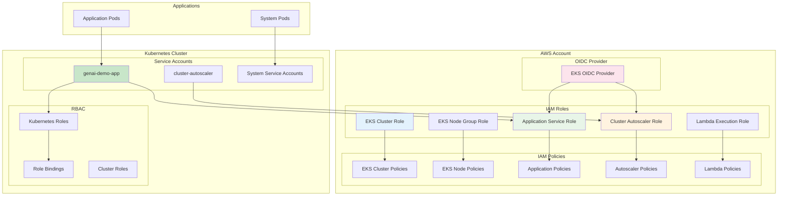
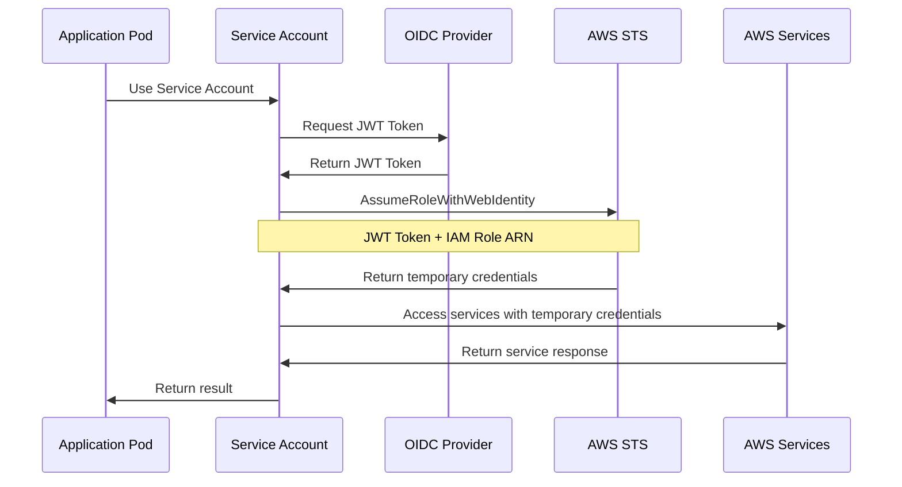
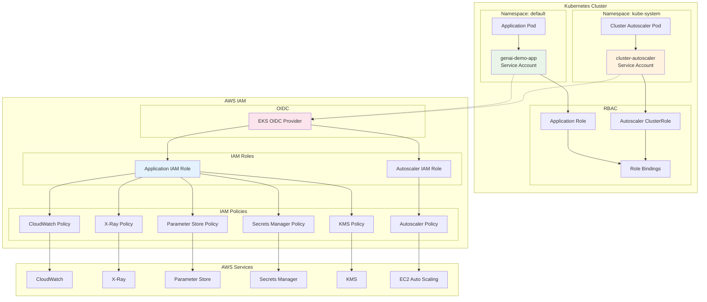
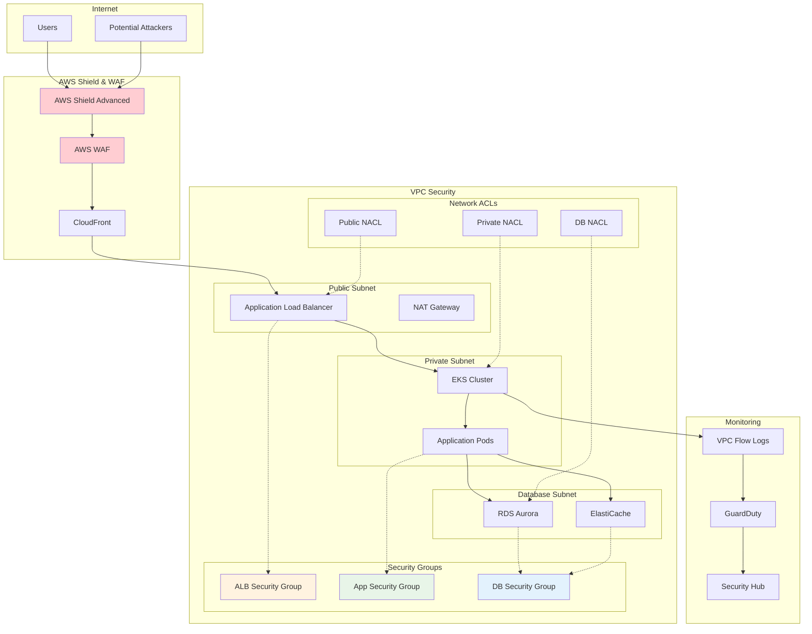
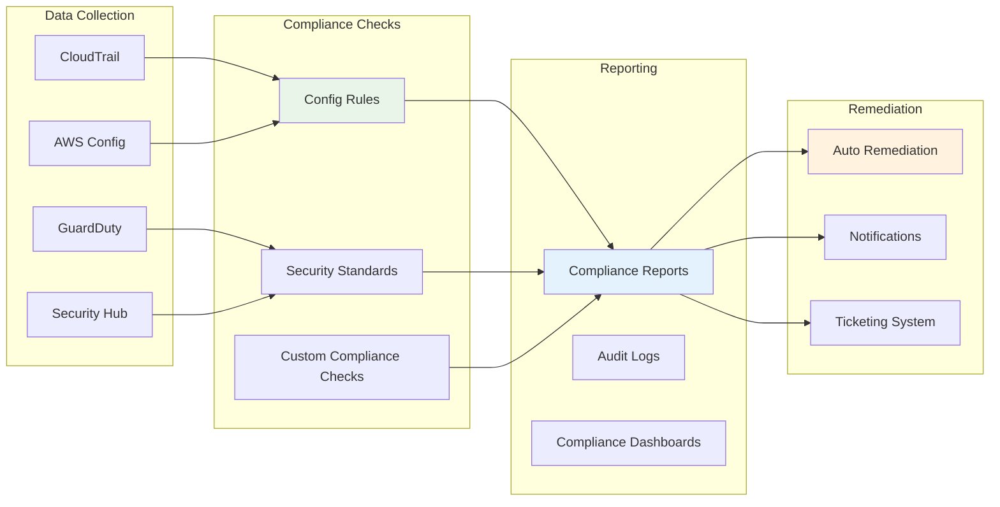
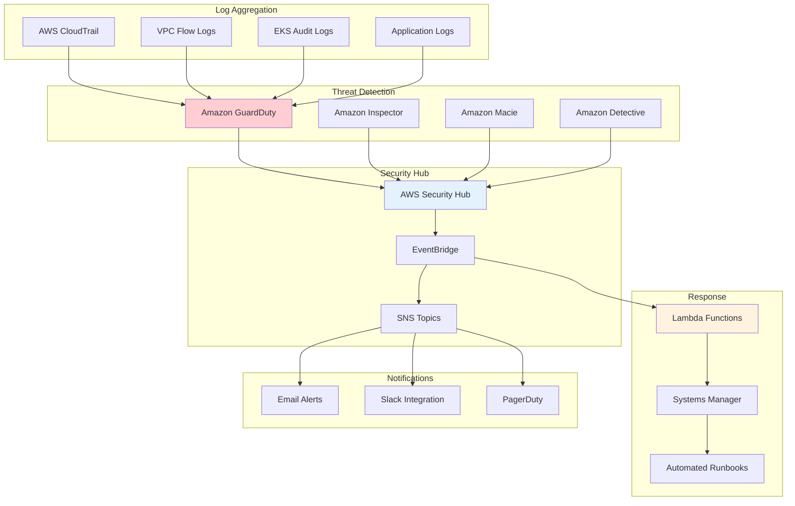

# Security Viewpoint - IAM Permissions and Security Architecture

**Document Version**: 1.0  
**Last Updated**: September 28, 2025 11:12 PM (Taipei Time)  
**Author**: Security Team  
**Status**: Active

## 📋 Table of Contents

- Overview
- Security Design Principles
- IAM Permissions Architecture
- Service Account Design
- Permission Relationship Diagram
- Encryption Strategy
- Network Security
- Compliance
- Security Monitoring

## Overview

GenAI Demo adopts a zero-trust security architecture with a defense-in-depth strategy. All inter-component communications are authenticated and authorized, following the principle of least privilege. The system integrates AWS IAM, Kubernetes RBAC, and application-layer security controls to form a multi-layered security protection system.

### Security Objectives

- **Authentication**: All access requires authentication
- **Authorization Control**: Role-based least privilege access
- **Data Protection**: End-to-end encryption, at rest and in transit
- **Audit Trail**: Complete access and operation logs
- **Compliance**: Meets SOC 2, ISO 27001 requirements

## Security Design Principles

### 1. Zero Trust Architecture

```yaml
Core Principles:
  - Never trust, always verify
  - Least privilege access
  - Assume network is compromised
  - Continuous monitoring and verification

Implementation Strategy:
  - Multi-factor authentication
  - Network micro-segmentation
  - Encrypt all communications
  - Real-time threat detection
```

### 2. Defense in Depth

```yaml
Protection Layers:
  1. Network Layer: VPC, Security Groups, NACLs
  2. Application Layer: WAF, API Gateway, Rate Limiting
  3. Data Layer: Encryption, Access Control, Backup
  4. Identity Layer: IAM, RBAC, MFA
  5. Monitoring Layer: CloudTrail, GuardDuty, Security Hub
```

### 3. Principle of Least Privilege

```yaml
Implementation Methods:
  - Role-Based Access Control (RBAC)
  - Time-limited permissions
  - Conditional access control
  - Regular permission reviews
```

## IAM Permissions Architecture

### Overall IAM Architecture



### IAM Role Detailed Design

#### 1. EKS Cluster Role

```yaml
Role Name: genai-demo-{environment}-eks-cluster-role
Trust Policy:
  - Service: eks.amazonaws.com
  - Action: sts:AssumeRole

Attached Policies:
  - AmazonEKSClusterPolicy
  - AmazonEKSVPCResourceController

Custom Policies:
  - CloudWatch Logs write permissions
  - EC2 network interface management
  - ELB management permissions
```

#### 2. EKS Node Group Role

```yaml
Role Name: genai-demo-{environment}-eks-node-role
Trust Policy:
  - Service: ec2.amazonaws.com
  - Action: sts:AssumeRole

Attached Policies:
  - AmazonEKSWorkerNodePolicy
  - AmazonEKS_CNI_Policy
  - AmazonEC2ContainerRegistryReadOnly

Custom Policies:
  - CloudWatch Agent permissions
  - Systems Manager permissions
```

#### 3. Application Service Role

```yaml
Role Name: genai-demo-{environment}-app-role
Trust Policy:
  - Federated: EKS OIDC Provider
  - Condition: StringEquals
    - {OIDC_URL}:sub: system:serviceaccount:default:genai-demo-app
    - {OIDC_URL}:aud: sts.amazonaws.com

Custom Policies:
  CloudWatch Permissions:
    - cloudwatch:PutMetricData
    - logs:CreateLogGroup
    - logs:CreateLogStream
    - logs:PutLogEvents
  
  X-Ray Permissions:
    - xray:PutTraceSegments
    - xray:PutTelemetryRecords
    - xray:GetSamplingRules
  
  Parameter Store Permissions:
    - ssm:GetParameter
    - ssm:GetParametersByPath
    Resource: arn:aws:ssm:*:*:parameter/genai-demo/{environment}/*
  
  Secrets Manager Permissions:
    - secretsmanager:GetSecretValue
    Resource: arn:aws:secretsmanager:*:*:secret:genai-demo/{environment}/*
  
  KMS Permissions:
    - kms:Decrypt
    - kms:GenerateDataKey
    Condition: kms:ViaService
```

## Service Account Design

### IRSA (IAM Roles for Service Accounts) Architecture



### Service Account Configuration

#### 1. Application Service Account

```yaml
apiVersion: v1
kind: ServiceAccount
metadata:
  name: genai-demo-app
  namespace: default
  annotations:
    eks.amazonaws.com/role-arn: arn:aws:iam::ACCOUNT:role/genai-demo-production-app-role
    eks.amazonaws.com/sts-regional-endpoints: "true"
  labels:
    app.kubernetes.io/name: genai-demo
    app.kubernetes.io/component: application
    app.kubernetes.io/managed-by: aws-cdk
```

#### 2. Cluster Autoscaler Service Account

```yaml
apiVersion: v1
kind: ServiceAccount
metadata:
  name: cluster-autoscaler
  namespace: kube-system
  annotations:
    eks.amazonaws.com/role-arn: arn:aws:iam::ACCOUNT:role/genai-demo-production-autoscaler-role
  labels:
    app.kubernetes.io/name: cluster-autoscaler
    app.kubernetes.io/managed-by: aws-cdk
```

## Permission Relationship Diagram

### Complete Permission Flow Diagram



### Permission Matrix

```yaml
Service Access Permission Matrix:
  Application Pod:
    CloudWatch:
      - PutMetricData: ✅
      - GetMetricStatistics: ✅
      - CreateLogGroup: ✅
      - PutLogEvents: ✅
    X-Ray:
      - PutTraceSegments: ✅
      - PutTelemetryRecords: ✅
      - GetSamplingRules: ✅
    Parameter Store:
      - GetParameter: ✅ (restricted paths)
      - GetParametersByPath: ✅ (restricted paths)
      - PutParameter: ❌
    Secrets Manager:
      - GetSecretValue: ✅ (restricted resources)
      - CreateSecret: ❌
      - UpdateSecret: ❌
    KMS:
      - Decrypt: ✅ (conditional restrictions)
      - Encrypt: ❌
      - CreateKey: ❌
    S3:
      - GetObject: ✅ (restricted buckets)
      - PutObject: ✅ (restricted buckets)
      - DeleteObject: ❌

  Cluster Autoscaler Pod:
    EC2:
      - DescribeAutoScalingGroups: ✅
      - DescribeInstances: ✅
      - SetDesiredCapacity: ✅
      - TerminateInstanceInAutoScalingGroup: ✅
    EKS:
      - DescribeCluster: ✅
      - DescribeNodegroup: ✅
```

## Encryption Strategy

### Encryption Architecture Diagram

```mermaid
graph TB
    subgraph "Data Classification"
        DataInTransit[Data in Transit]
        DataAtRest[Data at Rest]
        DataInUse[Data in Use]
    end
    
    subgraph "Encryption Services"
        KMS[AWS KMS]
        ACM[AWS Certificate Manager]
        SecretsManager[AWS Secrets Manager]
    end
    
    subgraph "Encryption Implementation"
        subgraph "Transit Encryption"
            TLS[TLS 1.2+]
            HTTPS[HTTPS]
            WSS[WebSocket Secure]
        end
        
        subgraph "At-Rest Encryption"
            EBSEncryption[EBS Encryption]
            RDSEncryption[RDS Encryption]
            S3Encryption[S3 Encryption]
            RedisEncryption[Redis Encryption]
        end
        
        subgraph "Application Layer Encryption"
            JWTEncryption[JWT Signing]
            PasswordHashing[Password Hashing]
            PIIEncryption[PII Field Encryption]
        end
    end
    
    DataInTransit --> TLS
    DataInTransit --> HTTPS
    DataInTransit --> WSS
    DataAtRest --> EBSEncryption
    DataAtRest --> RDSEncryption
    DataAtRest --> S3Encryption
    DataAtRest --> RedisEncryption
    DataInUse --> JWTEncryption
    DataInUse --> PasswordHashing
    DataInUse --> PIIEncryption
    KMS --> EBSEncryption
    KMS --> RDSEncryption
    KMS --> S3Encryption
    KMS --> RedisEncryption
    ACM --> TLS
    ACM --> HTTPS
    SecretsManager --> PIIEncryption
    
    style KMS fill:#fce4ec
    style TLS fill:#e8f5e8
    style EBSEncryption fill:#e3f2fd
```



### Encryption Configuration Details

```yaml
KMS Key Management:
  Application Key:
    Purpose: Application data encryption
    Rotation: Automatic annual rotation
    Permissions: Application IAM Role
  
  RDS Key:
    Purpose: Database encryption
    Rotation: Automatic annual rotation
    Permissions: RDS Service Role
  
  EBS Key:
    Purpose: Disk encryption
    Rotation: Automatic annual rotation
    Permissions: EC2 Instance Role

Transit Encryption:
  ALB:
    Protocol: TLS 1.2+
    Certificate: ACM managed
    Cipher Suites: Modern cipher suites
  
  RDS:
    SSL/TLS: Force enabled
    Certificate Validation: Enabled
  
  Redis:
    TLS: Enabled
    AUTH: Enabled
  
  MSK:
    Encryption: TLS
    Authentication: IAM

At-Rest Encryption:
  EBS Volumes: AES-256 (KMS)
  RDS Storage: AES-256 (KMS)
  S3 Objects: AES-256 (KMS)
  Redis: AES-256 (KMS)
  Secrets Manager: AES-256 (KMS)
  Parameter Store: AES-256 (KMS)
```

## Network Security

### Network Security Architecture



### Security Group Rules

```yaml
ALB Security Group:
  Inbound Rules:
    - Port 80: 0.0.0.0/0 (HTTP - redirect to HTTPS)
    - Port 443: 0.0.0.0/0 (HTTPS)
  Outbound Rules:
    - Port 8080: App Security Group (application)
    - Port 443: 0.0.0.0/0 (health checks)

Application Security Group:
  Inbound Rules:
    - Port 8080: ALB Security Group (application traffic)
    - Port 22: Bastion Security Group (SSH management)
    - Port 10250: EKS Control Plane (kubelet)
  Outbound Rules:
    - Port 443: 0.0.0.0/0 (AWS APIs, HTTPS)
    - Port 5432: DB Security Group (PostgreSQL)
    - Port 6379: DB Security Group (Redis)
    - Port 9092: MSK Security Group (Kafka)
    - Port 53: 0.0.0.0/0 (DNS)

Database Security Group:
  Inbound Rules:
    - Port 5432: App Security Group (PostgreSQL)
    - Port 6379: App Security Group (Redis)
  Outbound Rules:
    - None (accept connections only)

MSK Security Group:
  Inbound Rules:
    - Port 9092: App Security Group (Kafka)
    - Port 9094: App Security Group (Kafka TLS)
    - Port 2181: App Security Group (Zookeeper)
  Outbound Rules:
    - Port 9092: MSK Security Group (inter-broker communication)
```

## Compliance

### Compliance Framework

```yaml
SOC 2 Type II:
  Control Objectives:
    - Security: Multi-layer defense, access control
    - Availability: High availability architecture, disaster recovery
    - Processing Integrity: Data validation, error handling
    - Confidentiality: Encryption, access restrictions
    - Privacy: Data protection, user consent

ISO 27001:
  Control Measures:
    - A.9 Access Control: IAM, RBAC
    - A.10 Cryptography: KMS, TLS
    - A.12 Operations Security: Monitoring, logging
    - A.13 Communications Security: Network segmentation
    - A.14 System Acquisition: Secure development

GDPR:
  Data Protection:
    - Data Minimization: Collect only necessary data
    - Purpose Limitation: Clear usage purposes
    - Storage Limitation: Automatic deletion policies
    - Security: Encryption, access control
    - Accountability: Audit logs, documentation
```

### Compliance Monitoring



## Security Monitoring

### Security Monitoring Architecture



### Security Incident Response

```yaml
Threat Level Classification:
  Critical (P0):
    - Data breach
    - System intrusion
    - Complete service outage
    Response Time: 15 minutes
  
  High (P1):
    - Abnormal access patterns
    - Privilege escalation
    - Partial service outage
    Response Time: 1 hour
  
  Medium (P2):
    - Suspicious activity
    - Configuration drift
    - Performance anomalies
    Response Time: 4 hours
  
  Low (P3):
    - Informational warnings
    - Compliance drift
    - Maintenance notifications
    Response Time: 24 hours

Automated Response Actions:
  Account Anomalies:
    - Suspend suspicious IAM users
    - Revoke temporary credentials
    - Force MFA re-authentication
  
  Network Anomalies:
    - Update security group rules
    - Block suspicious IPs
    - Enable additional monitoring
  
  Data Anomalies:
    - Enable additional encryption
    - Restrict data access
    - Trigger data backup
```

---

**Document Status**: ✅ Complete  
**Next Step**: Review [Operational Viewpoint](../operational/dns-disaster-recovery.md) for DNS resolution and disaster recovery  
**Related Documents**: 
- [Infrastructure Viewpoint](../infrastructure/aws-resource-architecture.md)
- [Deployment Viewpoint](../deployment/deployment-architecture.md)
- [Operational Viewpoint](../operational/dns-disaster-recovery.md)