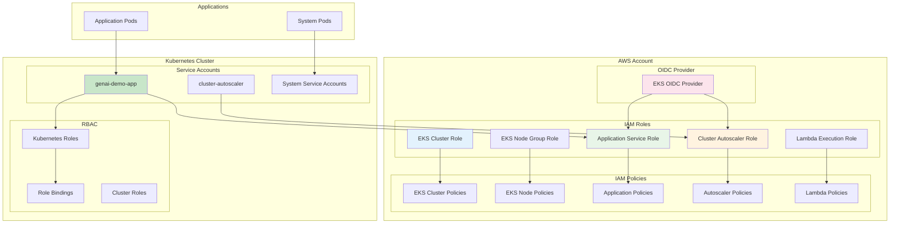
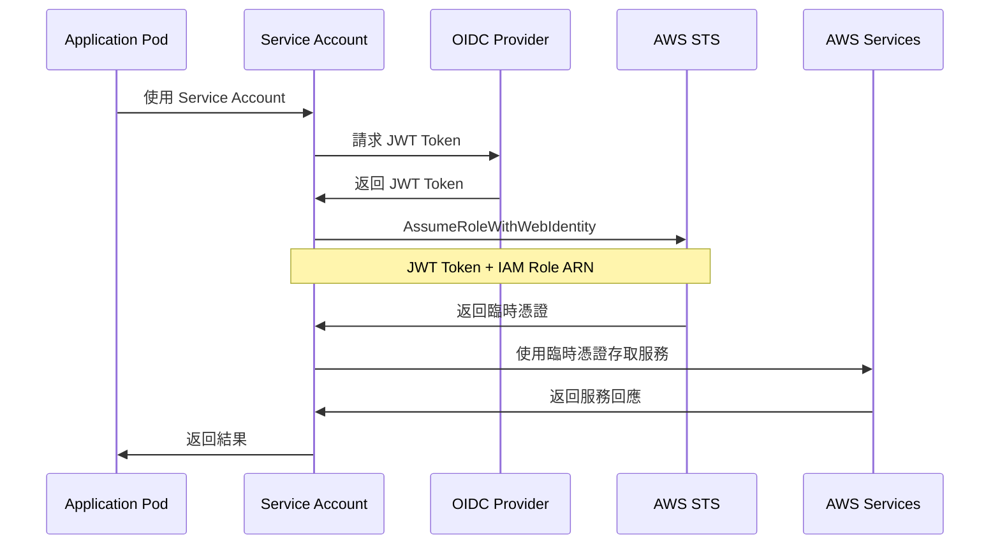
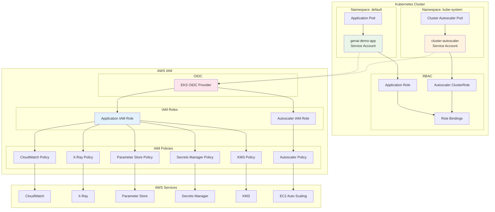
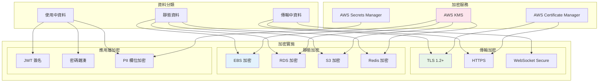
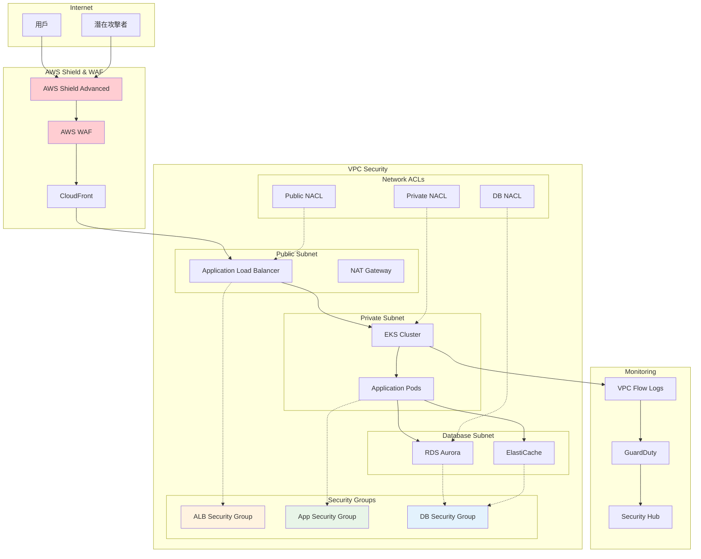
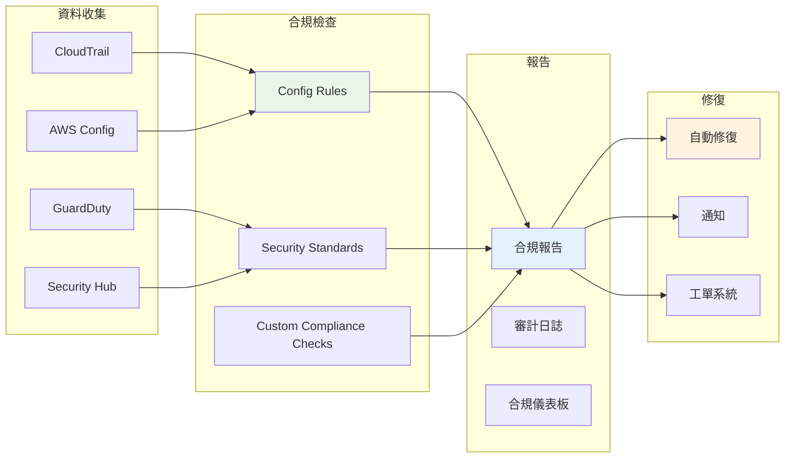
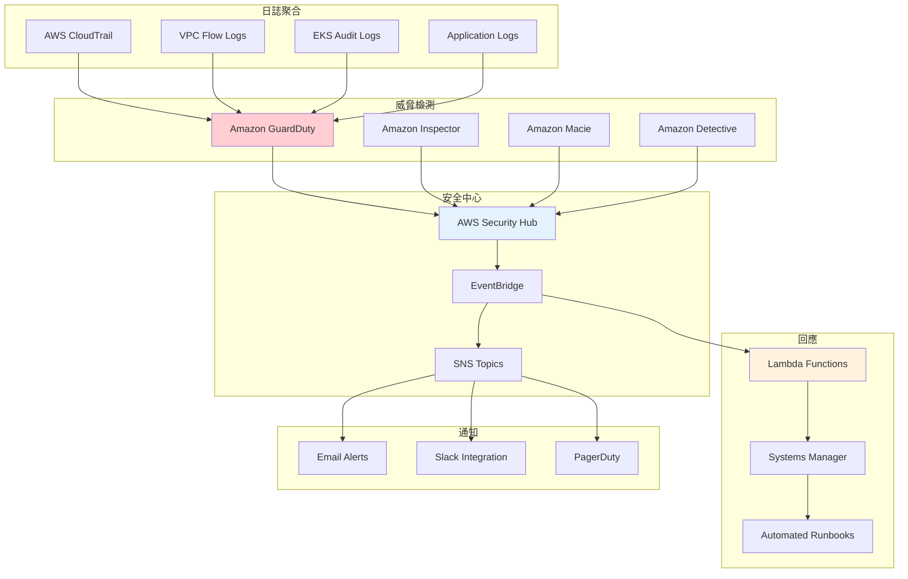

# Security Viewpoint - IAM 權限與安全架構

**文件版本**: 1.0  
**最後更新**: 2025年9月24日 下午5:15 (台北時間)  
**作者**: Security Team  
**狀態**: Active

## 📋 目錄

- [概覽](#概覽)
- [安全設計原則](#安全設計原則)
- [IAM 權限架構](#iam-權限架構)
- [Service Account 設計](#service-account-設計)
- [權限關係圖](#權限關係圖)
- [加密策略](#加密策略)
- [網路安全](#網路安全)
- [合規性](#合規性)
- [安全監控](#安全監控)

## 概覽

GenAI Demo 採用零信任安全架構，實施深度防禦策略。所有組件間的通訊都經過身份驗證和授權，遵循最小權限原則。系統整合了 AWS IAM、Kubernetes RBAC、和應用層安全控制，形成多層次的安全防護體系。

### 安全目標

- **身份驗證**: 所有存取都需要身份驗證
- **授權控制**: 基於角色的最小權限存取
- **資料保護**: 端到端加密，靜態和傳輸中
- **審計追蹤**: 完整的存取和操作日誌
- **合規性**: 符合 SOC 2、ISO 27001 要求

## 安全設計原則

### 1. 零信任架構 (Zero Trust)

```yaml
核心原則:
  - 永不信任，始終驗證
  - 最小權限存取
  - 假設網路已被入侵
  - 持續監控和驗證

實施策略:
  - 多因素身份驗證
  - 網路微分段
  - 加密所有通訊
  - 即時威脅檢測
```

### 2. 深度防禦 (Defense in Depth)

```yaml
防護層次:
  1. 網路層: VPC, Security Groups, NACLs
  2. 應用層: WAF, API Gateway, Rate Limiting
  3. 資料層: 加密, 存取控制, 備份
  4. 身份層: IAM, RBAC, MFA
  5. 監控層: CloudTrail, GuardDuty, Security Hub
```

### 3. 最小權限原則 (Principle of Least Privilege)

```yaml
實施方式:
  - 角色基礎存取控制 (RBAC)
  - 時間限制的權限
  - 條件式存取控制
  - 定期權限審查
```

## IAM 權限架構

### 整體 IAM 架構



### IAM Role 詳細設計

#### 1. EKS Cluster Role

```yaml
角色名稱: genai-demo-{environment}-eks-cluster-role
信任政策:
  - 服務: eks.amazonaws.com
  - 動作: sts:AssumeRole

附加政策:
  - AmazonEKSClusterPolicy
  - AmazonEKSVPCResourceController

自定義政策:
  - CloudWatch Logs 寫入權限
  - EC2 網路介面管理
  - ELB 管理權限
```

#### 2. EKS Node Group Role

```yaml
角色名稱: genai-demo-{environment}-eks-node-role
信任政策:
  - 服務: ec2.amazonaws.com
  - 動作: sts:AssumeRole

附加政策:
  - AmazonEKSWorkerNodePolicy
  - AmazonEKS_CNI_Policy
  - AmazonEC2ContainerRegistryReadOnly

自定義政策:
  - CloudWatch Agent 權限
  - Systems Manager 權限
```

#### 3. Application Service Role

```yaml
角色名稱: genai-demo-{environment}-app-role
信任政策:
  - Federated: EKS OIDC Provider
  - 條件: StringEquals
    - {OIDC_URL}:sub: system:serviceaccount:default:genai-demo-app
    - {OIDC_URL}:aud: sts.amazonaws.com

自定義政策:
  CloudWatch 權限:
    - cloudwatch:PutMetricData
    - logs:CreateLogGroup
    - logs:CreateLogStream
    - logs:PutLogEvents
  
  X-Ray 權限:
    - xray:PutTraceSegments
    - xray:PutTelemetryRecords
    - xray:GetSamplingRules
  
  Parameter Store 權限:
    - ssm:GetParameter
    - ssm:GetParametersByPath
    資源: arn:aws:ssm:*:*:parameter/genai-demo/{environment}/*
  
  Secrets Manager 權限:
    - secretsmanager:GetSecretValue
    資源: arn:aws:secretsmanager:*:*:secret:genai-demo/{environment}/*
  
  KMS 權限:
    - kms:Decrypt
    - kms:GenerateDataKey
    條件: kms:ViaService
```

## Service Account 設計

### IRSA (IAM Roles for Service Accounts) 架構



### Service Account 配置

#### 1. Application Service Account

```yaml
apiVersion: v1
kind: ServiceAccount
metadata:
  name: genai-demo-app
  namespace: default
  annotations:
    eks.amazonaws.com/role-arn: arn:aws:iam::ACCOUNT:role/genai-demo-production-app-role
    eks.amazonaws.com/sts-regional-endpoints: "true"
  labels:
    app.kubernetes.io/name: genai-demo
    app.kubernetes.io/component: application
    app.kubernetes.io/managed-by: aws-cdk
```

#### 2. Cluster Autoscaler Service Account

```yaml
apiVersion: v1
kind: ServiceAccount
metadata:
  name: cluster-autoscaler
  namespace: kube-system
  annotations:
    eks.amazonaws.com/role-arn: arn:aws:iam::ACCOUNT:role/genai-demo-production-autoscaler-role
  labels:
    app.kubernetes.io/name: cluster-autoscaler
    app.kubernetes.io/managed-by: aws-cdk
```

## 權限關係圖

### 完整權限流程圖



### 權限矩陣

```yaml
服務存取權限矩陣:
  Application Pod:
    CloudWatch:
      - PutMetricData: ✅
      - GetMetricStatistics: ✅
      - CreateLogGroup: ✅
      - PutLogEvents: ✅
    X-Ray:
      - PutTraceSegments: ✅
      - PutTelemetryRecords: ✅
      - GetSamplingRules: ✅
    Parameter Store:
      - GetParameter: ✅ (限定路徑)
      - GetParametersByPath: ✅ (限定路徑)
      - PutParameter: ❌
    Secrets Manager:
      - GetSecretValue: ✅ (限定資源)
      - CreateSecret: ❌
      - UpdateSecret: ❌
    KMS:
      - Decrypt: ✅ (條件限制)
      - Encrypt: ❌
      - CreateKey: ❌
    S3:
      - GetObject: ✅ (限定 bucket)
      - PutObject: ✅ (限定 bucket)
      - DeleteObject: ❌

  Cluster Autoscaler Pod:
    EC2:
      - DescribeAutoScalingGroups: ✅
      - DescribeInstances: ✅
      - SetDesiredCapacity: ✅
      - TerminateInstanceInAutoScalingGroup: ✅
    EKS:
      - DescribeCluster: ✅
      - DescribeNodegroup: ✅
```

## 加密策略

### 加密架構圖



### 加密配置詳情

```yaml
KMS 金鑰管理:
  應用程式金鑰:
    用途: 應用程式資料加密
    輪換: 自動年度輪換
    權限: 應用程式 IAM Role
  
  RDS 金鑰:
    用途: 資料庫加密
    輪換: 自動年度輪換
    權限: RDS 服務 Role
  
  EBS 金鑰:
    用途: 磁碟加密
    輪換: 自動年度輪換
    權限: EC2 實例 Role

傳輸加密:
  ALB:
    協定: TLS 1.2+
    憑證: ACM 管理
    密碼套件: 現代化密碼套件
  
  RDS:
    SSL/TLS: 強制啟用
    憑證驗證: 啟用
  
  Redis:
    TLS: 啟用
    AUTH: 啟用
  
  MSK:
    加密: TLS
    認證: IAM

靜態加密:
  EBS 磁碟: AES-256 (KMS)
  RDS 儲存: AES-256 (KMS)
  S3 物件: AES-256 (KMS)
  Redis: AES-256 (KMS)
  Secrets Manager: AES-256 (KMS)
  Parameter Store: AES-256 (KMS)
```

## 網路安全

### 網路安全架構



### 安全群組規則

```yaml
ALB Security Group:
  入站規則:
    - Port 80: 0.0.0.0/0 (HTTP - 重導向到 HTTPS)
    - Port 443: 0.0.0.0/0 (HTTPS)
  出站規則:
    - Port 8080: App Security Group (應用程式)
    - Port 443: 0.0.0.0/0 (健康檢查)

Application Security Group:
  入站規則:
    - Port 8080: ALB Security Group (應用流量)
    - Port 22: Bastion Security Group (SSH 管理)
    - Port 10250: EKS Control Plane (kubelet)
  出站規則:
    - Port 443: 0.0.0.0/0 (AWS APIs, HTTPS)
    - Port 5432: DB Security Group (PostgreSQL)
    - Port 6379: DB Security Group (Redis)
    - Port 9092: MSK Security Group (Kafka)
    - Port 53: 0.0.0.0/0 (DNS)

Database Security Group:
  入站規則:
    - Port 5432: App Security Group (PostgreSQL)
    - Port 6379: App Security Group (Redis)
  出站規則:
    - 無 (僅接受連線)

MSK Security Group:
  入站規則:
    - Port 9092: App Security Group (Kafka)
    - Port 9094: App Security Group (Kafka TLS)
    - Port 2181: App Security Group (Zookeeper)
  出站規則:
    - Port 9092: MSK Security Group (Broker 間通訊)
```

## 合規性

### 合規框架

```yaml
SOC 2 Type II:
  控制目標:
    - 安全性: 多層防護、存取控制
    - 可用性: 高可用架構、災難恢復
    - 處理完整性: 資料驗證、錯誤處理
    - 機密性: 加密、存取限制
    - 隱私: 資料保護、使用者同意

ISO 27001:
  控制措施:
    - A.9 存取控制: IAM、RBAC
    - A.10 密碼學: KMS、TLS
    - A.12 營運安全: 監控、日誌
    - A.13 通訊安全: 網路分段
    - A.14 系統取得: 安全開發

GDPR:
  資料保護:
    - 資料最小化: 僅收集必要資料
    - 目的限制: 明確使用目的
    - 儲存限制: 自動刪除政策
    - 安全性: 加密、存取控制
    - 問責制: 審計日誌、文檔
```

### 合規監控



## 安全監控

### 安全監控架構



### 安全事件回應

```yaml
威脅等級分類:
  Critical (P0):
    - 資料外洩
    - 系統入侵
    - 服務完全中斷
    回應時間: 15分鐘
  
  High (P1):
    - 異常存取模式
    - 權限提升
    - 部分服務中斷
    回應時間: 1小時
  
  Medium (P2):
    - 可疑活動
    - 配置偏移
    - 效能異常
    回應時間: 4小時
  
  Low (P3):
    - 資訊性警告
    - 合規偏移
    - 維護通知
    回應時間: 24小時

自動回應動作:
  帳戶異常:
    - 暫停可疑 IAM 使用者
    - 撤銷臨時憑證
    - 強制 MFA 重新驗證
  
  網路異常:
    - 更新安全群組規則
    - 封鎖可疑 IP
    - 啟用額外監控
  
  資料異常:
    - 啟用額外加密
    - 限制資料存取
    - 觸發資料備份
```

---

**文件狀態**: ✅ 完成  
**下一步**: 查看 [Operational Viewpoint](../operational/dns-disaster-recovery.md) 了解 DNS 解析與災難恢復  
**相關文件**: 
- [Infrastructure Viewpoint](../infrastructure/aws-resource-architecture.md)
- [Deployment Viewpoint](../deployment/deployment-architecture.md)
- [Operational Viewpoint](../operational/dns-disaster-recovery.md)