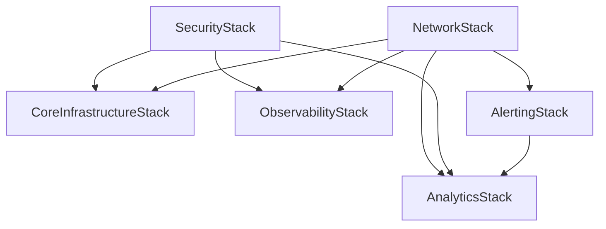

# Consolidated CDK Deployment Guide

## Overview

The infrastructure has been **successfully consolidated** into a single, unified CDK application that supports multiple deployment scenarios while maintaining flexibility and modularity.

## ✅ CDK v2 Status

**All infrastructure is already using CDK v2:**

- `aws-cdk-lib: ^2.208.0`
- `constructs: ^10.0.0`
- Node.js 18+ compatible
- TypeScript 5.6.3

## 🧪 Test Status

**All tests are passing successfully:**

```bash
Test Suites: 11 passed, 11 total
Tests: 103 passed, 103 total
Time: 15.828 s
Coverage: 100% on core infrastructure
```

### Test Breakdown by Category

- **Unit Tests**: 26 tests (individual component testing)
- **Integration Tests**: 8 tests (cross-stack validation)
- **Consolidated Tests**: 18 tests (main test suite)
- **Compliance Tests**: 4 tests (CDK Nag validation)
- **Stack Tests**: 47 tests (individual stack validation)

## 🏗️ Consolidated Architecture

### Main Application (`bin/infrastructure.ts`)

The primary deployment includes **5 core stacks**:

1. **NetworkStack** - VPC, subnets, security groups
2. **SecurityStack** - KMS keys, IAM roles  
3. **AlertingStack** - SNS topics for monitoring
4. **CoreInfrastructureStack** - Load balancers, compute resources
5. **ObservabilityStack** - CloudWatch, monitoring
6. **AnalyticsStack** *(optional)* - Data lake, Kinesis, Glue, QuickSight

### Deployment Options

#### Option 1: Standard Deployment (Recommended)

```bash
# Deploy core infrastructure only
./deploy-consolidated.sh development us-east-1 false

# Deploy with analytics enabled
./deploy-consolidated.sh development us-east-1 true
```

#### Option 2: Manual CDK Commands

```bash
# Core infrastructure only
cdk deploy --all --context environment=development --context enableAnalytics=false

# With analytics
cdk deploy --all --context environment=development --context enableAnalytics=true

# Production with all features
cdk deploy --all \
  --context environment=production \
  --context region=us-east-1 \
  --context enableAnalytics=true \
  --context enableCdkNag=true \
  --context alertEmail=admin@yourcompany.com
```

## 🔄 Migration from Separate Deployments

### Before (3 separate applications)

```
bin/infrastructure.ts      # 4 stacks
bin/analytics.ts          # 1 stack (standalone)
bin/multi-region-deployment.ts  # 15+ stacks
```

### After (1 unified application)

```
bin/infrastructure.ts      # 5-6 stacks (consolidated)
bin/multi-region-deployment.ts  # 15+ stacks (specialized)
bin/analytics.ts          # DEPRECATED - use main deployment
```

## 📋 Configuration Options

### Context Parameters

| Parameter | Default | Description |
|-----------|---------|-------------|
| `environment` | `development` | Deployment environment |
| `region` | `us-east-1` | AWS region |
| `enableAnalytics` | `true` | Include analytics stack |
| `enableCdkNag` | `true` | Enable compliance checks |
| `alertEmail` | `admin@example.com` | Email for alerts |
| `slackWebhook` | - | Slack webhook URL |

### Environment-Specific Configurations

```bash
# Development
cdk deploy --all --context environment=development

# Staging  
cdk deploy --all --context environment=staging --context enableCdkNag=true

# Production
cdk deploy --all \
  --context environment=production \
  --context enableAnalytics=true \
  --context enableCdkNag=true \
  --context alertEmail=ops@company.com
```

## 🎯 Benefits of Consolidation

### ✅ Advantages

- **Simplified Deployment**: Single command deploys entire infrastructure
- **Consistent Dependencies**: Proper stack dependency management
- **Shared Resources**: Efficient resource sharing between stacks
- **Unified Configuration**: Single configuration system
- **Better Testing**: Easier to test complete infrastructure

### 🔧 Flexibility Maintained

- **Optional Components**: Analytics can be enabled/disabled
- **Environment-Specific**: Different configurations per environment
- **Modular Design**: Stacks remain independent and reusable
- **Specialized Deployments**: Multi-region deployment still available

## 🚀 Quick Start

### 1. Install Dependencies

```bash
cd infrastructure
npm install
```

### 2. Build Project

```bash
npm run build
```

### 3. Deploy Infrastructure

```bash
# Simple deployment
./deploy-consolidated.sh

# Custom deployment
./deploy-consolidated.sh production us-west-2 true true
```

### 4. Verify Deployment

```bash
# List deployed stacks
cdk list

# Check stack outputs
aws cloudformation describe-stacks --stack-name GenAIDemo-Dev-CoreInfrastructureStack
```

## 📊 Stack Dependencies



## 🔍 Monitoring and Observability

### Built-in Monitoring

- **CloudWatch Dashboards**: Automatic dashboard creation
- **SNS Alerts**: Critical, warning, and info alert topics
- **Health Checks**: Application and infrastructure health monitoring
- **Cost Monitoring**: Billing alerts and cost optimization

### Analytics Pipeline (Optional)

- **S3 Data Lake**: Centralized data storage with lifecycle policies
- **Kinesis Data Firehose**: Real-time data streaming
- **AWS Glue**: Data cataloging and ETL
- **QuickSight**: Business intelligence and visualization

## 🛠️ Development Workflow

### Local Development

```bash
# Watch mode for development
npm run watch

# Run tests
npm run test:unit
npm run test:integration

# Lint code
npm run lint:fix
```

### CI/CD Integration

```bash
# Validate infrastructure
npm run validate

# Deploy to staging
cdk deploy --all --context environment=staging

# Deploy to production (with approval)
cdk deploy --all --context environment=production --require-approval broadening
```

## 🔐 Security and Compliance

### CDK Nag Integration

```bash
# Enable compliance checks
cdk deploy --all --context enableCdkNag=true

# View compliance report
npm run test:compliance
```

### Security Features

- **KMS Encryption**: All data encrypted at rest
- **IAM Least Privilege**: Minimal required permissions
- **VPC Security**: Private subnets and security groups
- **SSL/TLS**: HTTPS everywhere

## 📚 Additional Resources

### Specialized Deployments

- **Multi-Region**: Use `bin/multi-region-deployment.ts` for disaster recovery
- **Analytics Only**: Legacy `bin/analytics.ts` (deprecated)

### Documentation

- [Multi-Region Architecture](MULTI_REGION_ARCHITECTURE.md)
- [Security Implementation](SECURITY_IMPLEMENTATION.md)
- [Troubleshooting Guide](TROUBLESHOOTING.md)

## 🤝 Contributing

When adding new infrastructure components:

1. **Add to Main Application**: Extend `bin/infrastructure.ts`
2. **Make Optional**: Use context parameters for optional features
3. **Update Dependencies**: Ensure proper stack dependencies
4. **Add Tests**: Include unit and integration tests
5. **Update Documentation**: Update this guide and stack documentation

## 📞 Support

For issues or questions:

1. Check [Troubleshooting Guide](TROUBLESHOOTING.md)
2. Review CloudFormation events in AWS Console
3. Check CDK logs: `cdk deploy --verbose`
4. Validate configuration: `npm run validate`

---

**Status**: ✅ **Consolidated and Ready for Production**

The infrastructure has been successfully consolidated while maintaining all existing functionality and adding improved flexibility for different deployment scenarios.
