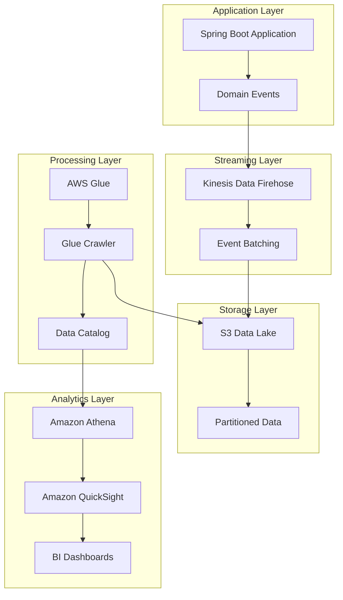

# Analytics Pipeline Implementation

## Overview

This document describes the implementation of the data analytics pipeline for the GenAI Demo application, which provides real-time business intelligence capabilities through AWS services integration.

## Architecture

The analytics pipeline follows a modern data lake architecture with the following components:



## Components

### 1. Event Streaming (Kinesis Data Firehose)

**Purpose**: Stream domain events from the application to the data lake in real-time.

**Configuration**:

- Delivery stream: `genai-demo-{environment}-domain-events-firehose`
- Buffer size: 5MB or 300 seconds (configurable)
- Compression: GZIP
- Partitioning: By year/month/day/hour for efficient querying

**Features**:

- Automatic batching and compression
- Error handling with backup to separate S3 prefix
- Encryption in transit and at rest
- CloudWatch monitoring and alerting

### 2. Data Lake (Amazon S3)

**Purpose**: Store domain events in a cost-effective, scalable data lake.

**Structure**:

```
s3://genai-demo-{environment}-data-lake/
├── domain-events/
│   ├── year=2024/
│   │   ├── month=01/
│   │   │   ├── day=15/
│   │   │   │   ├── hour=10/
│   │   │   │   │   └── firehose_output.gz
│   │   │   │   └── hour=11/
│   │   │   └── day=16/
│   │   └── month=02/
│   └── year=2025/
├── backup/
│   └── domain-events/
└── errors/
    └── domain-events/
```

**Features**:

- Lifecycle policies for cost optimization
- Automatic transition to IA, Glacier, and Deep Archive
- Versioning enabled for production
- Cross-region replication for disaster recovery

### 3. Data Cataloging (AWS Glue)

**Purpose**: Automatically discover and catalog data schema for querying.

**Components**:

- **Database**: `genai_demo_{environment}_data_lake`
- **Crawler**: `genai-demo-{environment}-domain-events-crawler`
- **Schedule**: Daily at 2 AM UTC

**Features**:

- Automatic schema detection and evolution
- Partition discovery for efficient querying
- Integration with Amazon Athena for SQL queries

### 4. Business Intelligence (Amazon QuickSight)

**Purpose**: Provide real-time dashboards and analytics for business stakeholders.

**Data Sources**:

- Athena connection to Glue Data Catalog
- Direct connection to RDS for operational data

**Dashboards**:

#### Executive Dashboard

- **Daily Revenue Trend**: Line chart showing revenue over time
- **Total Active Customers**: KPI showing customer count
- **Order Status Distribution**: Pie chart of order statuses
- **Key Metrics**: Revenue, orders, customers, conversion rates

#### Operations Dashboard

- **Order Processing Times**: Line chart showing processing performance
- **Low Stock Alerts**: Table of products requiring reorder
- **Payment Success Rates**: Gauge showing payment performance
- **System Health**: Status indicators for all services

**Data Sets**:

- **Customer Analytics**: Customer lifecycle, registration, churn
- **Order Analytics**: Order funnel, conversion rates, revenue
- **Inventory Analytics**: Stock levels, reorder alerts, demand forecasting

## Implementation Details

### Spring Boot Integration

The analytics pipeline is integrated into the Spring Boot application through:

1. **Configuration Properties** (`AnalyticsProperties`):

   ```yaml
   analytics:
     enabled: true
     firehose:
       stream-name: genai-demo-production-domain-events-firehose
       batch-size: 100
       max-wait-time-ms: 5000
     data-lake:
       bucket-name: genai-demo-production-data-lake
     glue:
       database-name: genai_demo_production_data_lake
     quicksight:
       data-source-id: genai-demo-production-athena-datasource
   ```

2. **Event Publisher** (`AnalyticsEventPublisher`):
   - Production: `FirehoseAnalyticsEventPublisher` (sends to Kinesis Firehose)
   - Development: `NoOpAnalyticsEventPublisher` (logs events only)

3. **Event Listener** (`AnalyticsEventListener`):
   - Subscribes to all domain events
   - Forwards events to analytics pipeline after transaction commit
   - Handles errors gracefully without affecting business operations

4. **Health Check** (`AnalyticsHealthIndicator`):
   - Monitors analytics pipeline health
   - Reports status through Spring Boot Actuator
   - Integrates with application health checks

### AWS CDK Infrastructure

The infrastructure is defined in `AnalyticsStack` with the following resources:

1. **S3 Data Lake Bucket**:
   - KMS encryption
   - Lifecycle policies for cost optimization
   - Public access blocked
   - CORS configuration for QuickSight

2. **Kinesis Data Firehose**:
   - IAM role with S3 and KMS permissions
   - CloudWatch logging
   - Error handling and backup configuration
   - Dynamic partitioning

3. **AWS Glue Resources**:
   - Database for data catalog
   - Crawler for schema discovery
   - IAM role with necessary permissions
   - Scheduled execution

4. **QuickSight Resources**:
   - Data source connected to Athena
   - Data sets for different business domains
   - Dashboards with visualizations
   - Proper permissions and sharing

5. **Monitoring and Alerting**:
   - CloudWatch alarms for pipeline health
   - SNS notifications for failures
   - Custom metrics for business events

## Data Flow

1. **Event Generation**: Domain events are generated during business operations
2. **Event Collection**: Events are collected by aggregate roots
3. **Event Publishing**: Application services publish events after transaction commit
4. **Event Forwarding**: Analytics listener forwards events to Firehose
5. **Event Streaming**: Firehose batches and streams events to S3
6. **Data Cataloging**: Glue crawler discovers and catalogs data schema
7. **Data Querying**: Athena provides SQL interface to data lake
8. **Data Visualization**: QuickSight creates dashboards from Athena queries

## Business Intelligence Capabilities

### Customer Analytics

- **Registration Trends**: Track new customer sign-ups over time
- **Customer Lifecycle**: Monitor activation, engagement, and churn
- **Segmentation**: Analyze customers by membership level, geography
- **Lifetime Value**: Calculate and track customer lifetime value

### Order Analytics

- **Order Funnel**: Track conversion from cart to completed order
- **Revenue Trends**: Monitor daily, weekly, monthly revenue
- **Order Processing**: Analyze processing times and bottlenecks
- **Product Performance**: Identify top-selling products

### Inventory Analytics

- **Stock Levels**: Monitor current inventory levels
- **Reorder Alerts**: Identify products requiring restock
- **Demand Forecasting**: Predict future inventory needs
- **Turnover Analysis**: Analyze inventory turnover rates

### Payment Analytics

- **Success Rates**: Monitor payment success and failure rates
- **Processing Times**: Track payment processing performance
- **Failure Analysis**: Analyze payment failure patterns
- **Revenue Impact**: Measure impact of payment issues

## Cost Optimization

### Storage Costs

- **Lifecycle Policies**: Automatic transition to cheaper storage classes
- **Compression**: GZIP compression reduces storage by ~70%
- **Partitioning**: Efficient querying reduces scan costs

### Processing Costs

- **Batch Processing**: Firehose batching reduces API calls
- **Scheduled Crawling**: Daily crawling vs. continuous
- **Query Optimization**: Partitioned queries reduce Athena costs

### Estimated Monthly Costs (10GB/day)

- **S3 Storage**: ~$50/month (with lifecycle policies)
- **Firehose**: ~$20/month (based on volume)
- **Glue**: ~$10/month (daily crawling)
- **Athena**: ~$30/month (based on queries)
- **QuickSight**: ~$24/month (2 users)
- **Total**: ~$134/month

## Monitoring and Alerting

### CloudWatch Alarms

- **Firehose Delivery Failures**: Alert when events fail to reach S3
- **Glue Crawler Failures**: Alert when schema discovery fails
- **Data Lake Size**: Alert when storage grows unexpectedly
- **Query Failures**: Alert when Athena queries fail

### Health Checks

- **Analytics Health Indicator**: Reports pipeline health status
- **Firehose Connectivity**: Verifies connection to AWS services
- **Data Freshness**: Monitors data recency in dashboards

### Business Metrics

- **Events Processed**: Count of events sent to analytics
- **Dashboard Refreshes**: Track dashboard usage
- **Data Quality Score**: Monitor data completeness and accuracy

## Security and Compliance

### Encryption

- **In Transit**: TLS encryption for all data transfers
- **At Rest**: KMS encryption for S3 and other services
- **Key Management**: Automatic key rotation enabled

### Access Control

- **IAM Roles**: Least privilege access for all services
- **QuickSight Permissions**: Role-based dashboard access
- **VPC Security**: Private subnets for sensitive operations

### Data Privacy

- **PII Masking**: Sensitive data masked in analytics
- **Retention Policies**: Automatic data deletion after retention period
- **Audit Logging**: Complete audit trail for data access

## Disaster Recovery

### Multi-Region Setup

- **Primary Region**: Taiwan (ap-east-2)
- **Secondary Region**: Tokyo (ap-northeast-1)
- **Cross-Region Replication**: S3 replication for data backup

### Recovery Procedures

- **RTO**: < 4 hours for full analytics restoration
- **RPO**: < 1 hour for data loss
- **Automated Failover**: Route 53 health checks trigger failover

## Future Enhancements

### Advanced Analytics

- **Machine Learning**: Integrate with SageMaker for predictive analytics
- **Real-time Analytics**: Add Kinesis Analytics for stream processing
- **Data Science**: Jupyter notebooks for advanced analysis

### Enhanced Visualizations

- **Custom Visuals**: Develop custom QuickSight visuals
- **Embedded Analytics**: Embed dashboards in application
- **Mobile Dashboards**: Optimize for mobile viewing

### Data Integration

- **External Data**: Integrate with external data sources
- **API Analytics**: Track API usage and performance
- **Social Media**: Integrate social media analytics

## Troubleshooting

### Common Issues

1. **Events Not Appearing**: Check Firehose delivery stream status
2. **Schema Changes**: Re-run Glue crawler after schema updates
3. **Query Failures**: Verify Athena permissions and data format
4. **Dashboard Errors**: Check QuickSight data source connectivity

### Debugging Steps

1. Check CloudWatch logs for error messages
2. Verify IAM permissions for all services
3. Test Firehose delivery with sample data
4. Validate Glue crawler configuration
5. Test Athena queries manually

### Performance Optimization

1. Optimize Athena queries with proper partitioning
2. Adjust Firehose buffer settings for throughput
3. Use columnar formats (Parquet) for better performance
4. Implement query result caching in QuickSight

This analytics pipeline provides comprehensive business intelligence capabilities while maintaining cost efficiency, security, and operational excellence.
