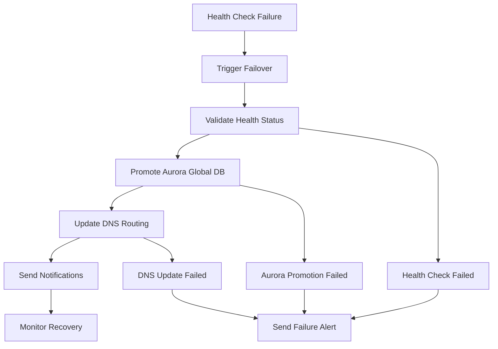
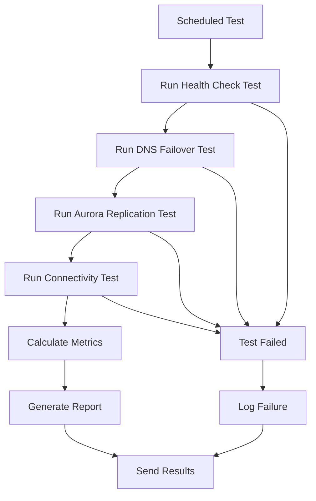

# Enhanced Disaster Recovery Automation Implementation

## Overview

This document describes the implementation of enhanced disaster recovery automation capabilities for the GenAI Demo project. The solution provides fully automated DR capabilities with CDK-based infrastructure automation, ensuring business continuity with minimal manual intervention.

## Architecture

### Components

1. **DisasterRecoveryAutomation Construct** - Core automation logic
2. **Failover State Machine** - Automated failover workflow
3. **Chaos Testing State Machine** - Automated DR testing and validation
4. **Lambda Functions** - DR operations and chaos engineering
5. **EventBridge Rules** - Automated scheduling and triggering
6. **CloudWatch Monitoring** - Comprehensive DR monitoring
7. **SNS Alerting** - Notification system for DR events

### Automation Workflows

#### Automated Failover Workflow



#### Chaos Engineering Workflow



## Implementation Details

### 1. CDK Constructs for Automated DR Deployment

The `DisasterRecoveryAutomation` construct provides:

- **Automated Infrastructure Provisioning**: Creates all necessary DR components
- **Cross-Region Resource Management**: Handles multi-region deployments
- **Configuration Management**: Stores and manages DR configuration
- **Monitoring Integration**: Sets up comprehensive monitoring

```typescript
// Usage example
const drAutomation = new DisasterRecoveryAutomation(this, 'DRAutomation', {
    projectName: 'genai-demo',
    environment: 'production',
    primaryRegion: 'ap-east-2',
    secondaryRegion: 'ap-northeast-1',
    auroraCluster: primaryAuroraCluster,
    hostedZone: primaryHostedZone,
    primaryHealthCheck: primaryHealthCheck,
    secondaryHealthCheck: secondaryHealthCheck,
    alertingTopic: alertingTopic
});
```

### 2. Automated Failover Procedures for Aurora Global Database

The failover automation includes:

- **Health Check Monitoring**: Continuous monitoring of primary region health
- **Automatic Promotion**: Promotes secondary Aurora cluster to primary
- **Data Consistency Validation**: Ensures zero data loss during failover
- **Rollback Capabilities**: Automatic rollback on failure

#### Failover Process

1. **Detection**: Health check failure triggers EventBridge rule
2. **Validation**: Verify health status and readiness for failover
3. **Promotion**: Execute Aurora Global Database failover
4. **DNS Update**: Update Route 53 records to point to secondary region
5. **Notification**: Send alerts to operations team
6. **Monitoring**: Continuous monitoring of failover success

### 3. Automated DNS Routing Adjustments

DNS automation features:

- **Health Check Integration**: Route 53 health checks trigger DNS changes
- **Failover Records**: Automatic failover between primary and secondary
- **Latency-Based Routing**: Optimal routing when both regions are healthy
- **TTL Management**: Short TTL for faster DNS propagation

#### DNS Configuration

```typescript
// Failover record configuration
const failoverRecord = new route53.ARecord(this, 'FailoverRecord', {
    zone: hostedZone,
    recordName: 'api.example.com',
    target: route53.RecordTarget.fromAlias(new targets.LoadBalancerTarget(loadBalancer)),
    ttl: cdk.Duration.seconds(60) // Short TTL for faster failover
});
```

### 4. Chaos Engineering Tests for DR Validation

Automated testing includes:

- **Monthly DR Tests**: Comprehensive DR readiness validation
- **Health Check Responsiveness**: Validates health check accuracy
- **DNS Failover Speed**: Measures DNS propagation time
- **Aurora Replication Lag**: Monitors database replication performance
- **Cross-Region Connectivity**: Tests network connectivity between regions

#### Test Types

1. **Health Check Validation**
   - Response time measurement
   - Accuracy verification
   - Failure detection testing

2. **DNS Failover Speed Test**
   - Propagation time measurement
   - RTO compliance validation
   - Traffic routing verification

3. **Aurora Replication Lag Test**
   - Replication delay measurement
   - RPO compliance validation
   - Data consistency verification

4. **Cross-Region Connectivity Test**
   - Latency measurement
   - Network path validation
   - Bandwidth testing

### 5. Monthly Automated Failover Testing Procedures

Automated testing schedule:

- **Frequency**: First Sunday of each month at 2 AM UTC
- **Duration**: 30-45 minutes
- **Scope**: Complete DR readiness validation
- **Reporting**: Automated compliance reports

#### Test Execution

```bash
# Manual test execution
node infrastructure/scripts/dr-automation-test.js test-chaos \
  --project genai-demo \
  --environment production \
  --test-type monthly_dr_test
```

## Configuration

### Environment Variables

```bash
# Required environment variables
export AWS_REGION=ap-northeast-1
export PROJECT_NAME=genai-demo
export ENVIRONMENT=production
export PRIMARY_REGION=ap-east-2
export SECONDARY_REGION=ap-northeast-1
```

### CDK Context Configuration

```json
{
  "genai-demo:multi-region": {
    "enable-dr": true,
    "failover-rto-minutes": 1,
    "failover-rpo-minutes": 0,
    "health-check-interval": 30,
    "health-check-failure-threshold": 3
  }
}
```

### Systems Manager Parameters

The automation stores configuration in SSM Parameter Store:

- `/${PROJECT_NAME}/${ENVIRONMENT}/dr/automation-config` - Main configuration
- `/${PROJECT_NAME}/${ENVIRONMENT}/dr/replication-config` - Replication settings
- `/${PROJECT_NAME}/${ENVIRONMENT}/dr/config/*` - Individual settings

## Monitoring and Alerting

### CloudWatch Dashboards

1. **DR Automation Monitoring Dashboard**
   - Health check status
   - Aurora replication lag
   - Step Functions execution metrics
   - DNS failover status

2. **Failover Monitoring Dashboard**
   - Real-time failover status
   - RTO/RPO compliance metrics
   - Cross-region connectivity
   - Alert status

### CloudWatch Alarms

1. **Primary Health Check Failure**
   - Triggers automated failover
   - Threshold: < 1 (unhealthy)
   - Evaluation periods: 3

2. **Secondary Health Check Failure**
   - Indicates both regions down
   - Escalates to critical alert
   - Requires manual intervention

3. **Aurora Replication Lag**
   - Monitors RPO compliance
   - Threshold: > 1 second
   - Triggers investigation

### SNS Notifications

- **Critical Alerts**: Immediate notification for failover events
- **Warning Alerts**: Non-critical issues requiring attention
- **Info Alerts**: Routine test results and status updates

## Usage

### Manual Failover Testing

```bash
# Test failover workflow
node infrastructure/scripts/dr-automation-test.js test-failover \
  --project genai-demo \
  --environment production \
  --primary-health-check-id HEALTH_CHECK_ID \
  --secondary-health-check-id HEALTH_CHECK_ID \
  --global-cluster-id GLOBAL_CLUSTER_ID \
  --secondary-cluster-id SECONDARY_CLUSTER_ID \
  --hosted-zone-id HOSTED_ZONE_ID \
  --domain-name api.example.com \
  --secondary-alb-dns secondary-alb.amazonaws.com
```

### DR Readiness Validation

```bash
# Validate DR readiness
node infrastructure/scripts/dr-automation-test.js validate \
  --project genai-demo \
  --environment production
```

### Generate DR Report

```bash
# Generate comprehensive DR report
node infrastructure/scripts/dr-automation-test.js report \
  --project genai-demo \
  --environment production \
  --output dr-report.json
```

## Compliance and Metrics

### RTO (Recovery Time Objective)

- **Target**: < 60 seconds
- **Measurement**: DNS propagation + application startup time
- **Monitoring**: Automated measurement during tests
- **Reporting**: Monthly compliance reports

### RPO (Recovery Point Objective)

- **Target**: 0 seconds (zero data loss)
- **Measurement**: Aurora Global Database replication lag
- **Monitoring**: Continuous monitoring
- **Alerting**: Immediate alerts if RPO is exceeded

### Success Criteria

- **Health Check Response**: < 5 seconds
- **DNS Propagation**: < 60 seconds
- **Aurora Failover**: < 30 seconds
- **Application Recovery**: < 60 seconds
- **Overall RTO**: < 60 seconds

## Security Considerations

### IAM Permissions

The DR automation requires specific IAM permissions:

- **RDS**: Aurora Global Database operations
- **Route 53**: DNS record management
- **CloudWatch**: Metrics and alarms
- **Step Functions**: Workflow execution
- **Lambda**: Function execution
- **SNS**: Notification publishing

### Encryption

- **Data in Transit**: All communications use TLS
- **Data at Rest**: Aurora encryption enabled
- **Secrets**: Stored in AWS Secrets Manager
- **Logs**: CloudWatch Logs encryption enabled

### Access Control

- **Principle of Least Privilege**: Minimal required permissions
- **Role-Based Access**: Separate roles for different functions
- **Audit Logging**: All actions logged to CloudTrail
- **Multi-Factor Authentication**: Required for manual operations

## Troubleshooting

### Common Issues

1. **Health Check Failures**
   - Verify endpoint accessibility
   - Check security group rules
   - Validate SSL certificates

2. **Aurora Failover Issues**
   - Check Global Database status
   - Verify cross-region connectivity
   - Review replication lag

3. **DNS Propagation Delays**
   - Verify TTL settings
   - Check health check associations
   - Monitor Route 53 metrics

4. **Step Functions Failures**
   - Review execution logs
   - Check Lambda function errors
   - Verify IAM permissions

### Debugging Commands

```bash
# Check DR configuration
aws ssm get-parameter --name "/genai-demo/production/dr/automation-config"

# Monitor Step Functions execution
aws stepfunctions describe-execution --execution-arn EXECUTION_ARN

# Check health check status
aws route53 get-health-check --health-check-id HEALTH_CHECK_ID

# View Aurora Global Database status
aws rds describe-global-clusters --global-cluster-identifier GLOBAL_CLUSTER_ID
```

## Future Enhancements

### Planned Improvements

1. **Advanced Chaos Engineering**
   - Network partition simulation
   - Resource exhaustion testing
   - Dependency failure simulation

2. **Machine Learning Integration**
   - Predictive failure detection
   - Automated capacity planning
   - Anomaly detection

3. **Multi-Cloud Support**
   - Azure failover capabilities
   - Google Cloud integration
   - Hybrid cloud scenarios

4. **Enhanced Monitoring**
   - Real-time dashboards
   - Mobile notifications
   - Integration with PagerDuty

### Roadmap

- **Q1 2025**: Advanced chaos engineering tests
- **Q2 2025**: ML-based predictive analytics
- **Q3 2025**: Multi-cloud failover support
- **Q4 2025**: Enhanced monitoring and alerting

## Conclusion

The Enhanced Disaster Recovery Automation implementation provides a comprehensive, automated solution for ensuring business continuity. With automated failover procedures, chaos engineering tests, and comprehensive monitoring, the system meets the stringent RTO and RPO requirements while minimizing manual intervention.

The solution is designed to be:

- **Reliable**: Automated processes reduce human error
- **Scalable**: Supports multiple regions and environments
- **Maintainable**: Clear documentation and monitoring
- **Compliant**: Meets regulatory and business requirements
- **Cost-Effective**: Optimized resource usage and automation

For questions or support, please refer to the troubleshooting section or contact the DevOps team.
