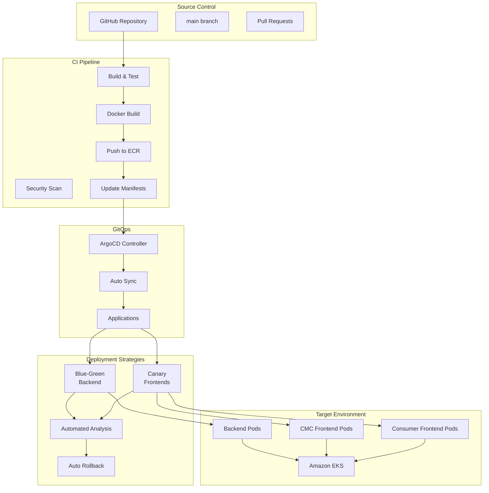
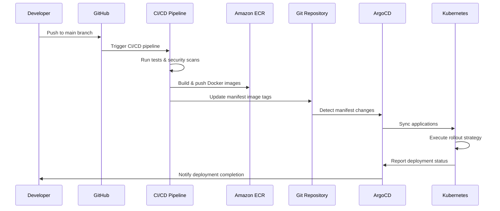

# GitOps with ArgoCD - GenAI Demo

This directory contains the GitOps configuration for the GenAI Demo application using ArgoCD and Argo Rollouts for advanced deployment strategies.

## 🏗️ Architecture Overview



## 📁 Directory Structure

```
infrastructure/k8s/gitops/
├── applications/                    # ArgoCD Application definitions
│   ├── genai-demo-backend.yaml     # Backend application with Blue-Green
│   ├── genai-demo-cmc-frontend.yaml # CMC Frontend with Canary
│   └── genai-demo-consumer-frontend.yaml # Consumer Frontend with Canary
├── projects/                       # ArgoCD Project definitions
│   └── genai-demo-project.yaml     # Project with RBAC and policies
└── README.md                       # This file

infrastructure/k8s/rollouts/
├── backend-blue-green.yaml         # Blue-Green rollout for backend
├── cmc-frontend-canary.yaml        # Canary rollout for CMC frontend
└── consumer-frontend-canary.yaml   # Canary rollout for consumer frontend

infrastructure/k8s/argocd/
├── namespace.yaml                  # ArgoCD namespace
├── install.yaml                    # ArgoCD installation with custom config
└── argo-rollouts.yaml             # Argo Rollouts installation

infrastructure/k8s/monitoring/
└── rollback-automation.yaml       # Automated rollback based on metrics
```

## 🚀 Deployment Strategies

### Backend - Blue-Green Deployment

The backend uses Blue-Green deployment strategy for zero-downtime deployments:

- **Active Service**: Serves production traffic
- **Preview Service**: Receives new version for testing
- **Automated Analysis**: Monitors success rate, response time, and error rate
- **Automatic Promotion**: Promotes after successful analysis
- **Instant Rollback**: Switches back to previous version if issues detected

```yaml
strategy:
  blueGreen:
    activeService: genai-demo-backend-active
    previewService: genai-demo-backend-preview
    autoPromotionEnabled: false
    prePromotionAnalysis:
      templates:
      - templateName: success-rate
    postPromotionAnalysis:
      templates:
      - templateName: success-rate
```

### Frontends - Canary Deployment

Both CMC and Consumer frontends use Canary deployment with gradual traffic shifting:

- **Traffic Progression**: 10% → 25% → 50% → 75% → 100%
- **Analysis at Each Step**: Health metrics validation
- **Automated Rollback**: Triggered on metric threshold breaches
- **ALB Integration**: Uses AWS Application Load Balancer for traffic routing

```yaml
strategy:
  canary:
    steps:
    - setWeight: 10
    - pause: { duration: 2m }
    - analysis: { templates: [frontend-success-rate] }
    - setWeight: 25
    - pause: { duration: 5m }
    # ... continues to 100%
```

## 📊 Health Metrics & Analysis

### Analysis Templates

#### Backend Success Rate Analysis

- **Success Rate**: ≥ 95%
- **Response Time**: ≤ 2 seconds (95th percentile)
- **Error Rate**: ≤ 5%
- **Evaluation**: 5 checks over 2.5 minutes

#### Frontend Success Rate Analysis

- **Success Rate**: ≥ 95%
- **Response Time**: ≤ 1 second (95th percentile)
- **Error Rate**: ≤ 5%
- **Evaluation**: 5 checks over 2.5 minutes

### Automated Rollback Triggers

The system automatically triggers rollback when:

1. **Error Rate Spike**: > 5% for 2+ consecutive checks
2. **High Response Time**: > threshold for 3+ consecutive checks
3. **Low Success Rate**: < 95% for 3+ consecutive checks
4. **Service Unavailability**: Health check failures
5. **Analysis Failure**: Analysis template failure limit reached

## 🔧 Installation & Setup

### Prerequisites

- Kubernetes cluster (EKS recommended)
- kubectl configured
- Helm 3.x installed
- Prometheus for metrics (optional but recommended)

### Quick Setup

1. **Install ArgoCD and Argo Rollouts**:

   ```bash
   ./infrastructure/scripts/setup-argocd.sh install
   ```

2. **Verify Installation**:

   ```bash
   ./infrastructure/scripts/setup-argocd.sh verify
   ```

3. **Get ArgoCD Password**:

   ```bash
   ./infrastructure/scripts/setup-argocd.sh password
   ```

4. **Access ArgoCD UI**:

   ```bash
   ./infrastructure/scripts/setup-argocd.sh port-forward
   ```

   Then open: <https://localhost:8080>

### Manual Installation Steps

1. **Create Namespaces**:

   ```bash
   kubectl apply -f infrastructure/k8s/argocd/namespace.yaml
   ```

2. **Install ArgoCD**:

   ```bash
   kubectl apply -n argocd -f https://raw.githubusercontent.com/argoproj/argo-cd/v2.9.3/manifests/install.yaml
   kubectl apply -f infrastructure/k8s/argocd/install.yaml
   ```

3. **Install Argo Rollouts**:

   ```bash
   kubectl apply -f infrastructure/k8s/argocd/argo-rollouts.yaml
   ```

4. **Setup Applications**:

   ```bash
   kubectl apply -f infrastructure/k8s/gitops/projects/
   kubectl apply -f infrastructure/k8s/gitops/applications/
   ```

5. **Deploy Rollout Configurations**:

   ```bash
   kubectl apply -f infrastructure/k8s/rollouts/
   ```

## 🎯 Usage & Operations

### Monitoring Deployments

#### ArgoCD Dashboard

- **URL**: <https://argocd.kimkao.io> (or localhost:8080 with port-forward)
- **Username**: admin
- **Password**: Retrieved using setup script

#### CLI Commands

```bash
# Watch rollout progress
kubectl argo rollouts get rollout genai-demo-backend -n genai-demo --watch
kubectl argo rollouts get rollout genai-demo-cmc-frontend -n genai-demo --watch

# Check application sync status
kubectl get applications -n argocd

# View analysis runs
kubectl get analysisruns -n genai-demo

# Check rollout history
kubectl argo rollouts history rollout genai-demo-backend -n genai-demo
```

### Manual Operations

#### Promote Rollout

```bash
kubectl argo rollouts promote genai-demo-backend -n genai-demo
```

#### Abort Rollout

```bash
kubectl argo rollouts abort genai-demo-backend -n genai-demo
```

#### Rollback to Previous Version

```bash
kubectl argo rollouts undo genai-demo-backend -n genai-demo
```

#### Restart Rollout

```bash
kubectl argo rollouts restart genai-demo-backend -n genai-demo
```

### Sync Applications

#### Sync All Applications

```bash
argocd app sync genai-demo-backend genai-demo-cmc-frontend genai-demo-consumer-frontend
```

#### Hard Refresh

```bash
argocd app sync genai-demo-backend --force
```

## 🔄 CI/CD Integration

### GitHub Actions Workflow

The CI/CD pipeline automatically:

1. **Builds and Tests**: Runs comprehensive test suites
2. **Security Scanning**: Performs vulnerability scans
3. **Docker Images**: Builds multi-architecture images
4. **Updates Manifests**: Updates image tags in rollout manifests
5. **Commits Changes**: Pushes updated manifests to Git
6. **Triggers Sync**: ArgoCD detects changes and syncs applications

### Deployment Flow



## 🛡️ Security & RBAC

### ArgoCD Project Security

The `genai-demo` project includes:

- **Source Repository Restrictions**: Only allowed repositories
- **Destination Restrictions**: Specific namespaces and clusters
- **Resource Whitelists**: Allowed Kubernetes resources
- **RBAC Roles**: Admin, Developer, and ReadOnly roles

### Sync Windows

Deployments are controlled by sync windows:

- **Allow Window**: Business hours (9 AM - 5 PM, Monday-Friday)
- **Deny Window**: Outside business hours for production apps
- **Manual Sync**: Always allowed for emergency deployments

## 📈 Monitoring & Alerting

### Prometheus Metrics

The system exposes metrics for:

- **Rollout Status**: Deployment progress and health
- **Analysis Results**: Success/failure rates of analysis runs
- **Application Health**: Overall application status
- **Sync Status**: ArgoCD sync success/failure rates

### Alerts

Configured alerts for:

- **Rollback Triggered**: When automated rollback occurs
- **High Error Rate**: When error rates exceed thresholds
- **Deployment Failures**: When rollouts fail
- **Sync Failures**: When ArgoCD sync fails

## 🔧 Troubleshooting

### Common Issues

#### Application Not Syncing

```bash
# Check application status
kubectl get application genai-demo-backend -n argocd -o yaml

# Force refresh
argocd app sync genai-demo-backend --force
```

#### Rollout Stuck

```bash
# Check rollout status
kubectl argo rollouts get rollout genai-demo-backend -n genai-demo

# Check analysis runs
kubectl get analysisruns -n genai-demo

# Abort and retry
kubectl argo rollouts abort genai-demo-backend -n genai-demo
kubectl argo rollouts retry genai-demo-backend -n genai-demo
```

#### Analysis Failures

```bash
# Check analysis run details
kubectl describe analysisrun <analysis-run-name> -n genai-demo

# Check Prometheus connectivity
kubectl exec -it <prometheus-pod> -n monitoring -- wget -qO- http://localhost:9090/../api/v1/query?query=up
```

### Logs

#### ArgoCD Logs

```bash
kubectl logs -f deployment/argocd-application-controller -n argocd
kubectl logs -f deployment/argocd-server -n argocd
```

#### Argo Rollouts Logs

```bash
kubectl logs -f deployment/argo-rollouts -n argo-rollouts
```

#### Application Logs

```bash
kubectl logs -f deployment/genai-demo-backend -n genai-demo
```

## 🔄 Backup & Recovery

### ArgoCD Configuration Backup

```bash
# Export applications
kubectl get applications -n argocd -o yaml > argocd-applications-backup.yaml

# Export projects
kubectl get appprojects -n argocd -o yaml > argocd-projects-backup.yaml

# Export settings
kubectl get configmaps -n argocd -o yaml > argocd-configmaps-backup.yaml
```

### Disaster Recovery

1. **Reinstall ArgoCD**: Use setup script
2. **Restore Configuration**: Apply backed up manifests
3. **Sync Applications**: Force sync all applications
4. **Verify Deployments**: Check rollout status

## 📚 Additional Resources

- [ArgoCD Documentation](https://argo-cd.readthedocs.io/)
- [Argo Rollouts Documentation](https://argoproj.github.io/argo-rollouts/)
- [GitOps Best Practices](https://www.gitops.tech/)
- [Kubernetes Deployment Strategies](https://kubernetes.io/docs/concepts/workloads/controllers/deployment/)

## 🤝 Contributing

When making changes to GitOps configurations:

1. **Test Locally**: Validate manifests with kubeval
2. **Update Documentation**: Keep README and comments current
3. **Follow Naming Conventions**: Use consistent labeling
4. **Security Review**: Ensure RBAC and security policies
5. **Gradual Rollout**: Test in development before production
