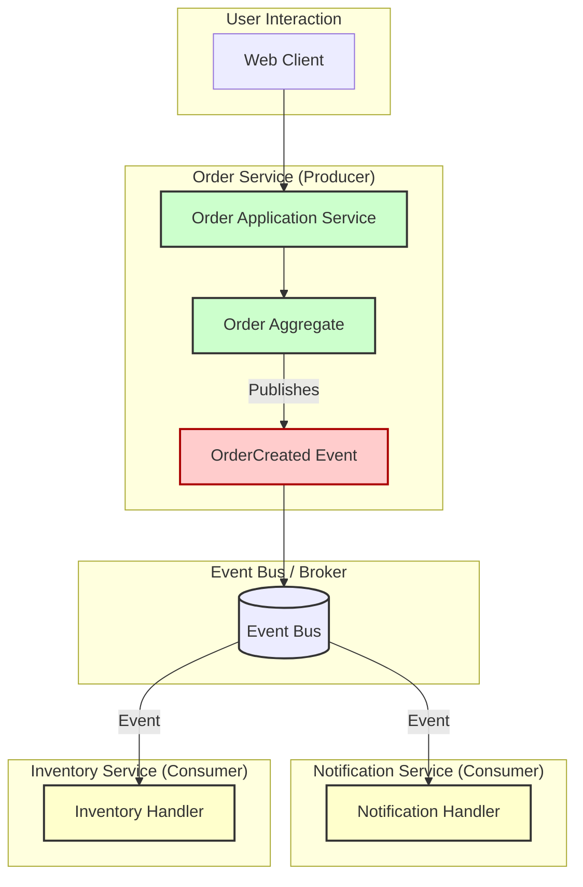

# 03: Event-Driven Architecture (EDA)

Event-Driven Architecture (EDA) is a software architecture pattern that promotes the production, detection, consumption of, and reaction to events. An "event" is a significant occurrence or change in state within a system or its environment. Unlike request-driven models where services explicitly call each other, in EDA, components communicate by broadcasting and consuming events asynchronously.

## Core Concepts

*   **Event:** An immutable fact about something that has happened. For example, `OrderCreated`, `PaymentProcessed`, `InventoryUpdated`. Events are typically lightweight and carry information about the occurrence.
*   **Event Producer (Publisher):** A component that detects an occurrence and generates an event to announce it.
*   **Event Consumer (Subscriber/Handler):** A component interested in certain types of events. It subscribes to these events and reacts when they occur, performing specific actions or logic.
*   **Event Channel (Event Bus/Broker/Stream):** The infrastructure that transports events from producers to consumers. This can range from simple in-memory dispatchers to robust message brokers like Apache Kafka, RabbitMQ, or cloud-based event services.

## Key Components in EDA

1.  **Events:**
    *   **Structure:** Typically include a name (e.g., `OrderCreatedEvent`), a timestamp, a unique ID, and a payload (the data related to the event).
    *   **Domain Events:** Represent occurrences within a specific domain model that domain experts care about. They are usually handled within the same Bounded Context.
    *   **Integration Events:** Used to communicate state changes between different Bounded Contexts or microservices. They are part of the public contract of a service.

2.  **Event Producers:**
    *   Any part of the system that can publish an event. In Domain-Driven Design, Aggregate Roots are often primary sources of domain events. Application services can also publish events.

3.  **Event Consumers:**
    *   Components that subscribe to one or more types of events. When an event they are interested in is published, they are notified and execute their logic. Consumers should be idempotent, meaning processing the same event multiple times should not have unintended side effects.

4.  **Event Bus/Broker:**
    *   Manages the transmission of events. It can provide features like persistence, guaranteed delivery, filtering, and routing of events.
    *   **Publish-Subscribe:** A common pattern where producers publish events to a topic or channel, and multiple consumers can subscribe to that topic to receive those events.
    *   **Event Streaming:** Platforms like Kafka allow events to be treated as continuous streams, enabling complex event processing, analytics, and durable event logs.

## Visualizing Event-Driven Architecture

This diagram shows a simplified flow where an Order Service publishes an `OrderCreated` event, which is then consumed by Notification and Inventory services.



## Benefits of EDA

*   **Loose Coupling:** Producers and consumers are independent. Producers don't know who is consuming their events, and consumers don't know who produced them. This reduces dependencies between services.
*   **Scalability:** Individual components (producers or consumers) can be scaled independently based on load.
*   **Resilience & Fault Tolerance:** If a consumer fails, other parts of the system can continue to function. Events can often be queued or replayed once the consumer recovers.
*   **Responsiveness:** Asynchronous nature allows for faster responses to users, as tasks can be processed in the background.
*   **Flexibility & Extensibility:** New consumers can be easily added to listen to existing events without modifying existing producers or consumers.

## EDA with DDD and Hexagonal Architecture

EDA, DDD, and Hexagonal Architecture are highly synergistic.

### EDA and DDD

*   **Domain Events:** DDD emphasizes "Domain Events" as first-class citizens. These are significant occurrences in the domain that business experts care about. Aggregates are natural publishers of domain events, capturing changes to their state.
    *   For example, when an `Order` aggregate is successfully paid, it might publish an `OrderPaidEvent`.
*   **Sagas:** Complex business processes that span multiple aggregates or bounded contexts can be managed using sagas, which are often event-driven. Each step in a saga can be triggered by an event, and upon completion, it publishes another event to trigger the next step or compensate for failures.
*   **Bounded Context Integration:** Domain events can be transformed into Integration Events to communicate changes between different Bounded Contexts, helping to maintain their autonomy.

### EDA and Hexagonal Architecture

*   **Event Publication (Output Port):** The application core (hexagon) can publish events (both domain and integration events) via an **Output Port**.
    *   An `EventPublisherPort` interface would be defined in the application or domain layer.
    *   A concrete **Driven Adapter** (e.g., `KafkaEventPublisherAdapter`, `InMemoryEventBusAdapter`) in the infrastructure layer would implement this port to send events to a specific message broker or bus.
*   **Event Consumption (Driving Adapter):** Event consumers/handlers can act as **Driving Adapters**.
    *   An adapter in the infrastructure layer (e.g., `KafkaOrderEventConsumer`) would listen to an event bus.
    *   When a relevant event is received, this adapter would translate it into a command or query and call an **Input Port** (use case interface) on the application core. This allows external events to drive behavior within the application.

## Common EDA Patterns

*   **Event Sourcing:** Instead of storing the current state of an entity, you store the full sequence of events that have affected that entity. The current state can be derived by replaying these events. This provides a full audit log and allows for temporal queries.
*   **Command Query Responsibility Segregation (CQRS):** Separates the model for writing data (commands) from the model for reading data (queries). Events are often used to keep the read model synchronized with changes made via commands. For example, when a command modifies an aggregate, it publishes an event. An event handler then updates one or more read models (e.g., denormalized views optimized for querying).
*   **Saga Pattern:** Manages distributed transactions by orchestrating a sequence of local transactions based on events. If a local transaction fails, the saga executes compensating transactions to undo preceding operations.

## Examples from This Project's Codebase

The `genaidemo` project incorporates an event-driven approach, particularly for domain events, using Spring's application event mechanism.

### 1. Domain Event Definition

The project defines a base interface for domain events and concrete event classes.

*   **`DomainEvent.java` (Interface)**:
    *   **Path**: `app/src/main/java/solid/humank/genaidemo/domain/common/events/DomainEvent.java`
    *   **Description**: A base interface that all domain events should implement. It defines common methods like `getOccurredOn()`, `getEventType()`, and `getSource()`.

*   **`AbstractDomainEvent.java` (Base Class)**:
    *   **Path**: `app/src/main/java/solid/humank/genaidemo/domain/common/events/AbstractDomainEvent.java` (existence inferred from `OrderCreatedEvent`)
    *   **Description**: A base class that likely implements `DomainEvent` and provides common functionality, such as setting the occurrence time.

*   **`OrderCreatedEvent.java` (Concrete Domain Event)**:
    *   **Path**: `app/src/main/java/solid/humank/genaidemo/domain/order/model/events/OrderCreatedEvent.java`
    *   **Description**: A specific domain event published when a new order is created. It carries data relevant to this occurrence, like `orderId`, `customerId`, `totalAmount`.

    ```java
    // Snippet from OrderCreatedEvent.java
    public class OrderCreatedEvent extends AbstractDomainEvent {
        private final OrderId orderId;
        private final String customerId;
        // ... other fields, constructor, getters ...

        public OrderCreatedEvent(OrderId orderId, String customerId, Money totalAmount, List<String> items) {
            super("order-service"); // Source of the event
            this.orderId = orderId;
            this.customerId = customerId;
            // ...
        }

        @Override
        public String getEventType() {
            return "OrderCreatedEvent";
        }
    }
    ```
    Other domain events like `OrderItemAddedEvent` are also present in the `domain/order/model/events/` directory.

### 2. Event Publication Mechanism

Events are published using a dedicated service that leverages Spring's `ApplicationEventPublisher`.

*   **`DomainEventPublisherService.java`**:
    *   **Path**: `app/src/main/java/solid/humank/genaidemo/domain/common/service/DomainEventPublisherService.java`
    *   **Description**: This service is used to publish domain events. It has a static `publishEvent` method that makes it easy to publish events from anywhere, typically from Aggregates or Application Services.
    *   **Usage**: The `Order` aggregate (in `Order.java`) calls `DomainEventPublisherService.publishEvent(new OrderCreatedEvent(...))` after an order is successfully created.

    ```java
    // Snippet from DomainEventPublisherService.java
    @Service
    public class DomainEventPublisherService {
        private static DomainEventBus eventBus;

        public DomainEventPublisherService(DomainEventBus eventBus) {
            DomainEventPublisherService.eventBus = eventBus;
        }

        public static void publishEvent(DomainEvent event) {
            if (eventBus != null) {
                eventBus.publish(event);
            }
        }
    }
    ```

*   **`DomainEventBus.java`**:
    *   **Path**: `app/src/main/java/solid/humank/genaidemo/domain/common/events/DomainEventBus.java`
    *   **Description**: This class acts as the event bus. It injects Spring's `ApplicationEventPublisher` and uses it to broadcast the domain events. This means the project uses Spring's built-in application event infrastructure for handling domain events within the same application context.

    ```java
    // Snippet from DomainEventBus.java
    @Component
    public class DomainEventBus {
        private final ApplicationEventPublisher eventPublisher;

        public DomainEventBus(ApplicationEventPublisher eventPublisher) {
            this.eventPublisher = eventPublisher;
        }

        public void publish(DomainEvent event) {
            if (event != null) {
                eventPublisher.publishEvent(event); // Delegates to Spring's publisher
            }
        }
    }
    ```

### 3. Event Consumption (Event Handlers)

Event handlers (or consumers) listen for specific events and react to them. In a Spring application using `ApplicationEventPublisher`, these are typically methods annotated with `@EventListener`.

While specific event handlers for `OrderCreatedEvent` (like updating an inventory service or sending a notification) were not found in the scanned codebase during this session, here's how a hypothetical handler would look:

```java
// Hypothetical Example: OrderConfirmationNotifier.java
// This class would typically reside in an application or infrastructure layer.
// For example: app/src/main/java/solid/humank/genaidemo/application/notification/handler/OrderNotificationHandler.java

/*
package solid.humank.genaidemo.application.notification.handler;

import org.springframework.stereotype.Component;
import org.springframework.context.event.EventListener;
import solid.humank.genaidemo.domain.order.model.events.OrderCreatedEvent;
import solid.humank.genaidemo.application.notification.port.incoming.NotificationUseCase; // Assuming a notification service

@Component
public class OrderNotificationHandler {

    private final NotificationUseCase notificationService;

    public OrderNotificationHandler(NotificationUseCase notificationService) {
        this.notificationService = notificationService;
    }

    @EventListener
    public void handleOrderCreatedEvent(OrderCreatedEvent event) {
        System.out.println("Received OrderCreatedEvent for order: " + event.getOrderId());
        // Example: Send a confirmation email
        // String customerEmail = lookupCustomerEmail(event.getCustomerId());
        // notificationService.sendEmail(
        //     customerEmail,
        //     "Order Confirmation",
        //     "Your order " + event.getOrderId() + " has been created."
        // );
    }
}
*/
```
This hypothetical `OrderNotificationHandler` would listen for `OrderCreatedEvent`s published on Spring's application event bus. When an event occurs, the `handleOrderCreatedEvent` method would be invoked.

**Note on Hexagonal Integration:**
*   **Publishing**: The `DomainEventPublisherService` and `DomainEventBus` can be seen as part of the application core's mechanism to signal occurrences. If events need to go to an external broker (like Kafka), the `DomainEventBus` or a similar component would call an **Output Port**, and a **Driven Adapter** in the infrastructure layer would handle the actual sending to Kafka.
*   **Consuming**: If this application were to consume events from an external broker, an **Adapter** in the infrastructure layer (e.g., a Kafka listener) would be a **Driving Adapter**. It would listen to the broker, and upon receiving a message, it would translate it into a command or query and call an **Input Port** on the application core. The hypothetical `@EventListener` above acts as an in-process driving adapter for locally published events.

This setup demonstrates a foundational EDA within the application, primarily for domain events. For inter-service communication in a microservices landscape, these domain events would often be transformed into integration events and published to an external message broker.

---
The project uses Spring's event mechanism for in-process eventing, which is a good way to decouple components within a single application or bounded context.
