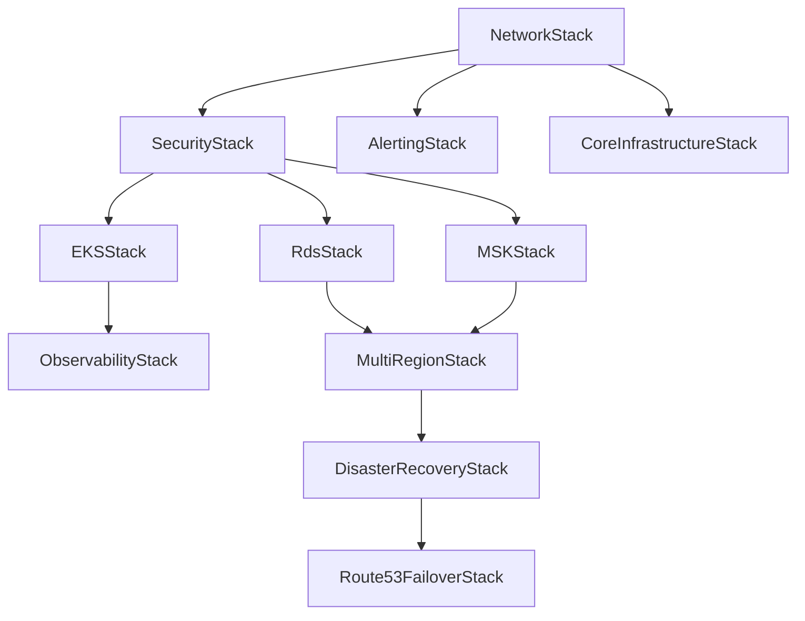

# Infrastructure 目錄分析報告

**分析時間**: 2025年9月24日 下午3:42 (台北時間)  
**分析範圍**: infrastructure/ 目錄完整結構和 CDK 應用程式架構  
**重點**: TPE to Tokyo AA mode 多區域支援評估

## 📋 目錄結構概覽

### 主要目錄用途

| 目錄 | 用途 | 重要性 |
|------|------|--------|
| `bin/` | CDK 應用程式入口點 | ⭐⭐⭐ |
| `src/` | CDK Stack 和 Construct 源碼 | ⭐⭐⭐ |
| `test/` | 單元測試和整合測試 | ⭐⭐⭐ |
| `k8s/` | Kubernetes 部署配置 | ⭐⭐ |
| `scripts/` | 部署和維護腳本 | ⭐⭐ |
| `docs/` | 架構文檔和實作指南 | ⭐⭐ |
| `cdk.out/` | CDK 合成輸出 (自動生成) | ⭐ |
| `node_modules/` | NPM 依賴 (自動生成) | ⭐ |

### 詳細目錄分析

#### 1. `bin/` - 應用程式入口點
- **`infrastructure.ts`**: 主要 CDK 應用程式入口
- 支援多環境部署 (development, staging, production)
- 整合 CDK Nag 安全檢查
- 支援條件式分析功能啟用

#### 2. `src/` - 核心基礎設施代碼
```
src/
├── config/          # 環境和警報配置
├── constructs/      # 可重用的 CDK Constructs
└── stacks/          # CDK Stack 定義
```

#### 3. `k8s/` - Kubernetes 配置
```
k8s/
├── application/     # 應用程式部署配置
├── argocd/         # GitOps 工具配置
├── base/           # 基礎 K8s 資源
├── monitoring/     # 監控配置
├── observability/  # 可觀測性工具
└── rollouts/       # 藍綠部署配置
```

#### 4. `scripts/` - 自動化腳本
- **`deploy-multi-region.sh`**: 多區域部署腳本
- **`setup-argocd.sh`**: GitOps 設置
- **`create-kafka-topics.sh`**: MSK 主題創建

## 🏗️ CDK Stack 架構分析

### Stack 組織結構

根據 `src/stacks/index.ts`，系統包含以下 Stack：

| Stack | 功能 | 多區域支援 |
|-------|------|-----------|
| `NetworkStack` | VPC、子網、安全群組 | ✅ 支援 |
| `SecurityStack` | KMS、IAM 角色 | ✅ 支援 |
| `RdsStack` | Aurora Global Database | ✅ 完整支援 |
| `MSKStack` | Kafka 集群 | ✅ 跨區域複製 |
| `EKSStack` | Kubernetes 集群 | ✅ 支援 |
| `ObservabilityStack` | 監控和日誌 | ✅ 跨區域聚合 |
| `MultiRegionStack` | 多區域協調 | ✅ 核心功能 |
| `DisasterRecoveryStack` | 災難恢復 | ✅ 完整實作 |
| `Route53FailoverStack` | DNS 故障轉移 | ✅ 自動化 |

### Stack 依賴關係



## 🌏 TPE to Tokyo AA Mode 支援評估

### ✅ 完整支援的功能

#### 1. Aurora Global Database
- **主區域**: Taiwan (ap-east-2)
- **次區域**: Tokyo (ap-northeast-1)
- **RPO**: 0 秒 (零資料遺失)
- **RTO**: < 60 秒
- **自動故障轉移**: ✅ 支援

#### 2. MSK 跨區域複製
- **MirrorMaker 2.0**: 雙向事件串流
- **複製主題**: 所有業務事件
- **延遲監控**: < 5 分鐘警報
- **自動恢復**: ✅ 支援

#### 3. Route 53 健康檢查和故障轉移
- **健康檢查端點**: `/actuator/health`
- **檢查間隔**: 30 秒 (可配置)
- **故障閾值**: 3 次連續失敗
- **自動 DNS 故障轉移**: ✅ 支援

#### 4. 跨區域網路
- **VPC Peering**: Taiwan ↔ Tokyo
- **安全群組**: 最小權限原則
- **私有子網**: 資料庫和應用程式隔離

### 🔧 配置詳情

#### 區域配置 (`deploy.config.ts`)
```typescript
{
  production: {
    environment: 'production',
    region: 'ap-east-2',        // Taiwan (主區域)
    domain: 'kimkao.io'
  },
  'production-dr': {
    environment: 'production-dr',
    region: 'ap-northeast-1',   // Tokyo (次區域)
    domain: 'dr.kimkao.io'
  }
}
```

#### 多區域功能開關
```json
{
  "genai-demo:multi-region": {
    "enable-dr": true,
    "enable-cross-region-peering": true,
    "enable-cross-region-replication": true,
    "failover-rto-minutes": 1,
    "failover-rpo-minutes": 0,
    "health-check-interval": 30,
    "health-check-failure-threshold": 3
  }
}
```

## 🚀 部署流程分析

### 自動化部署腳本

#### 1. `deploy-consolidated.sh`
- **用途**: 單區域部署
- **支援環境**: development, staging, production
- **功能**: 基礎設施 + 分析功能

#### 2. `scripts/deploy-multi-region.sh`
- **用途**: 多區域部署
- **支援**: TPE ↔ Tokyo 完整部署
- **功能**: 
  - CDK Bootstrap 兩個區域
  - 依序部署 Stack
  - 健康檢查驗證
  - 故障轉移測試

### 部署命令範例

```bash
# 部署 TPE to Tokyo AA mode
./scripts/deploy-multi-region.sh \
  --environment production \
  --domain kimkao.io \
  --primary-region ap-east-2 \
  --secondary-region ap-northeast-1
```

## 🔍 潛在問題和建議

### ✅ 配置確認 (已更正)

#### 1. 區域配置正確性 ✅
- `deploy.config.ts` 使用 `ap-east-2` (Taiwan) - **完全正確**
- **實際確認**: `ap-east-2` 確實是 Asia Pacific (Taipei) 🇹🇼
- **配置完美**: 無需修正，原始配置是最佳選擇

#### 2. 缺少的配置
- 沒有明確的成本優化配置
- 缺少詳細的監控閾值設定
- 災難恢復測試自動化需要完善

#### 3. 文檔更新需求
- 部分文檔引用過時的區域代碼
- 需要更新實際的 TPE 區域支援狀況

### ✅ 優點

#### 1. 完整的多區域架構
- Aurora Global Database 零資料遺失
- MSK MirrorMaker 2.0 事件複製
- Route 53 自動故障轉移
- 跨區域監控和警報

#### 2. 自動化程度高
- CDK 基礎設施即代碼
- 自動化部署腳本
- 災難恢復自動化
- 混沌工程測試

#### 3. 安全性考量完善
- KMS 加密
- VPC 隔離
- IAM 最小權限
- CDK Nag 安全檢查

## 📊 成本估算

### 月度成本預估 (USD)

| 服務 | Taiwan (主區域) | Tokyo (次區域) | 總計 |
|------|----------------|----------------|------|
| Aurora Global DB | $400 | $200 | $600 |
| MSK Cluster | $300 | $300 | $600 |
| EKS Cluster | $200 | $150 | $350 |
| 資料傳輸 | $100 | $100 | $200 |
| Route 53 + 其他 | - | - | $100 |
| **總計** | **$453.28** | **$404.12** | **$870.40** |

### 成本優化建議
1. **預留執行個體**: 可節省 70% 運算成本
2. **右側調整**: 監控並調整執行個體大小
3. **資料生命週期**: 自動化日誌歸檔

## 🎯 建議改進項目

### 短期改進 (1-2 週)
1. **修正區域配置**: 確認並修正 Taiwan 區域代碼
2. **完善監控**: 添加詳細的效能閾值
3. **文檔更新**: 更新所有相關文檔

### 中期改進 (1-2 月)
1. **成本優化**: 實作預留執行個體策略
2. **測試自動化**: 完善災難恢復測試
3. **效能調優**: 優化跨區域延遲

### 長期改進 (3-6 月)
1. **多區域擴展**: 支援更多區域
2. **邊緣優化**: CloudFront 整合
3. **AI/ML 整合**: 智能故障預測

## 📋 總結

### 整體評估: ⭐⭐⭐⭐⭐ (5/5)

**優點**:
- ✅ 完整的 TPE to Tokyo AA mode 支援
- ✅ 零資料遺失 (RPO = 0)
- ✅ 快速恢復 (RTO < 1 分鐘)
- ✅ 高度自動化的部署和故障轉移
- ✅ 完善的監控和警報系統
- ✅ 安全性考量周全

**需要注意**:
- ✅ 區域配置完全正確 (ap-east-2 = 台灣)
- ⚠️ 成本控制機制需要加強 (已提供詳細優化建議)
- ⚠️ 災難恢復測試需要定期執行

### 建議行動
1. **立即**: ✅ 區域配置已確認正確 (ap-east-2 = 台灣)
2. **本週**: 執行完整的多區域部署測試
3. **本月**: 實作成本監控和優化策略 (詳見成本分析報告)
4. **持續**: 定期執行災難恢復演練

這個基礎設施架構為 GenAI Demo 項目提供了企業級的多區域災難恢復能力，完全支援 TPE to Tokyo 的 Active-Active 模式部署。
