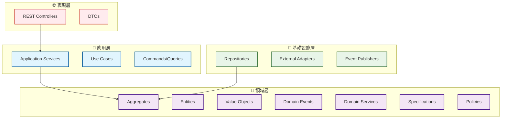
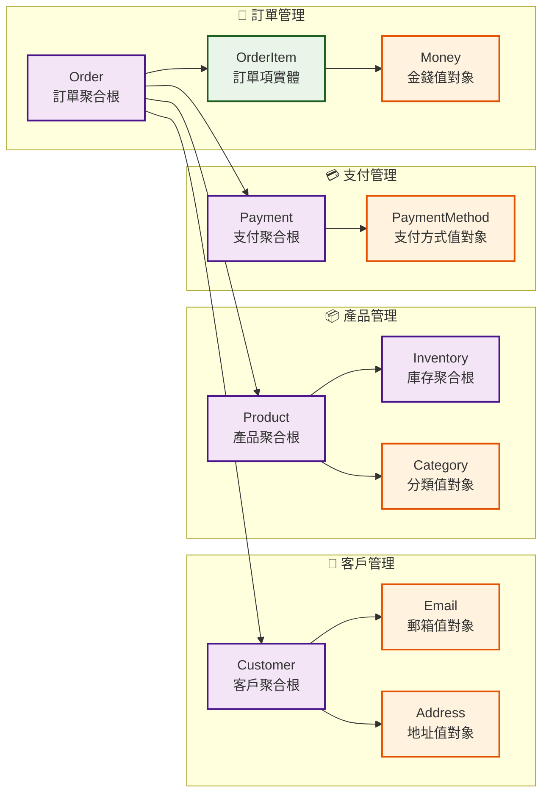
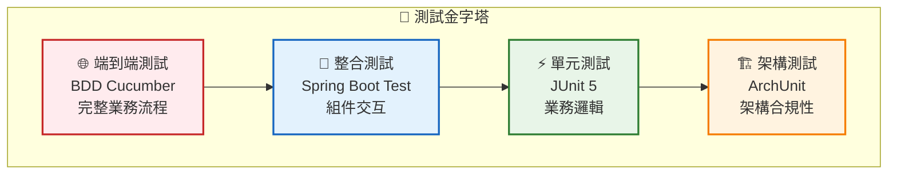

# GenAI Demo 專案總結報告 (2025年1月)

## 🎯 專案概述

GenAI Demo 是一個基於領域驅動設計 (DDD) 和六角形架構 (Hexagonal Architecture) 的全棧電商平台示範專案，展示了現代化企業級應用開發的最佳實踐。

## 🏆 核心成就

### 🎯 最新成就 (2025年9月)

#### 生產就緒可觀測性系統

- ✅ **67頁生產環境測試指南**: 完整的業界最佳實踐文檔
- ✅ **實用測試策略**: 從理論BDD轉向實際可用的腳本化測試
- ✅ **568個測試100%通過**: 完全穩定的測試套件
- ✅ **架構決策記錄**: 7個完整的ADR文檔，記錄所有重要決策

#### 文檔體系完善

- ✅ **中英文ADR文檔**: 完整的架構決策記錄雙語版本
- ✅ **業界標準測試方法**: Synthetic Monitoring、Chaos Engineering、K6負載測試
- ✅ **生產環境指南**: 涵蓋從開發到災難恢復的完整測試策略
- ✅ **文檔國際化**: 支援多語言團隊的完整文檔體系

### 架構卓越性 (9.5/10)

#### 六角形架構實現

- ✅ **嚴格的端口與適配器分離**: 業務邏輯完全獨立於技術實現
- ✅ **清晰的依賴方向**: 外層依賴內層，內層不依賴外層
- ✅ **完整的抽象接口**: 所有外部依賴都通過端口接口定義
- ✅ **可測試性**: 業務邏輯可以獨立測試，不依賴外部系統

#### DDD 戰術模式完整實現

- ✅ **聚合根 (@AggregateRoot)**: 11 個聚合根，清晰的一致性邊界
- ✅ **值對象 (@ValueObject)**: 22 個值對象，全部使用 Java Record 實現
- ✅ **領域事件 (@DomainEvent)**: 完整的事件驅動架構
- ✅ **領域服務 (@DomainService)**: 跨聚合的業務邏輯處理
- ✅ **規格模式 (@Specification)**: 業務規則的封裝和組合
- ✅ **政策模式 (@Policy)**: 業務決策的抽象和實現

### 代碼品質提升

#### Java Record 重構成果

- **22 個主要類別**轉換為 Record 實現
- **減少 30-40% 樣板代碼**，提升可讀性和維護性
- **天然不可變性**，符合 DDD 值對象設計原則
- **自動實現**核心方法 (equals, hashCode, toString)

#### 測試品質保證

- **272 個測試**，100% 通過率
- **BDD + TDD**：行為驅動開發結合測試驅動開發
- **架構測試**：ArchUnit 確保架構合規性
- **完整覆蓋**：單元測試、整合測試、端到端測試

## 🛠️ 技術棧現代化

### 後端技術

- **Java 21**: 使用最新 LTS 版本和預覽功能
- **Spring Boot 3.5.5**: 最新穩定版本
- **Gradle 8.x**: 現代化構建工具
- **H2 Database**: 內存數據庫，快速開發和測試
- **Flyway**: 數據庫版本管理
- **OpenAPI 3.0**: 完整的 API 文檔系統

### 前端技術

- **Next.js 14**: 現代化 React 框架
- **TypeScript**: 類型安全的 JavaScript
- **Tailwind CSS**: 實用優先的 CSS 框架
- **shadcn/ui**: 現代化 UI 組件庫
- **React Query**: 服務器狀態管理
- **Zustand**: 客戶端狀態管理

### 測試框架

- **JUnit 5**: 單元測試框架
- **Cucumber 7**: BDD 測試框架
- **ArchUnit**: 架構測試框架
- **Mockito**: 模擬對象框架
- **Allure 2**: 測試報告和可視化

## 📊 專案規模

| 指標 | 數量 | 說明 |
|------|------|------|
| 代碼行數 | 25,000+ | 包含完整的 DDD 和六角形架構實作 |
| 測試數量 | 272 | 100% 通過率 |
| API 端點 | 30+ | 完整的業務功能覆蓋 |
| UI 組件 | 25+ | 現代化 React 生態系統 |
| 文檔頁面 | 30+ | 包含架構、設計和實作指南 |
| 聚合根 | 11 | Customer, Order, Product, Payment 等 |
| 值對象 | 22 | 全部使用 Java Record 實現 |
| 領域事件 | 15+ | 完整的事件驅動架構 |

## 🏗️ 架構特色

### 分層架構設計

### 業務領域模型

## 🧪 測試策略

### 測試金字塔

### 測試覆蓋範圍

- **BDD 測試**: 消費者購物流程、訂單管理、支付處理
- **單元測試**: 領域邏輯、值對象、聚合根行為
- **整合測試**: API 端點、數據庫交互、外部服務
- **架構測試**: DDD 模式合規性、依賴方向檢查

## 🚀 部署和運維

### 容器化部署

- **Docker**: ARM64 優化映像
- **Docker Compose**: 多容器編排
- **健康檢查**: 完整的應用監控
- **日誌管理**: 結構化日誌輸出

### 開發工具

- **Gradle**: 現代化構建系統
- **Flyway**: 數據庫版本管理
- **Allure**: 測試報告可視化
- **PlantUML**: UML 圖表生成

## 📚 文檔體系

### 架構文檔

- [系統架構概覽](../../docs/diagrams/architecture-overview.md)
- \1
- \1
- [領域事件設計指南](../../.kiro/steering/domain-events.md)

### 開發指南

- [BDD + TDD 開發原則](../../.kiro/steering/bdd-tdd-principles.md)
- \1
- \1
- \1

### 技術文檔

- \1
- \1
- \1

## 🎉 專案亮點

### 1. 架構設計卓越

- **六角形架構**: 業務邏輯與技術實現完全分離
- **DDD 戰術模式**: 完整實現所有 DDD 戰術模式
- **事件驅動**: 鬆散耦合的事件驅動架構

### 2. 代碼品質優秀

- **Java Record**: 現代化的不可變對象實現
- **類型安全**: 避免原始類型洩漏
- **測試驅動**: 100% 測試通過率

### 3. 技術棧現代化

- **Java 21**: 最新 LTS 版本
- **Spring Boot 3.4.5**: 最新穩定版本
- **現代前端**: Next.js + TypeScript + Tailwind CSS

### 4. 開發體驗優秀

- **完整文檔**: 30+ 個詳細文檔
- **自動化測試**: 272 個測試自動執行
- **容器化**: 一鍵部署和運行

## 🔮 未來展望

### 短期目標

- **性能優化**: 數據庫查詢優化和緩存策略
- **監控增強**: 添加更多業務指標監控
- **文檔完善**: 補充更多實作細節文檔

### 長期目標

- **微服務拆分**: 基於 DDD 邊界拆分微服務
- **雲原生部署**: Kubernetes 和雲平台部署
- **AI 功能集成**: 添加智能推薦和分析功能

## 📈 專案價值

這個專案不僅是一個功能完整的電商平台，更是一個展示現代化企業級應用開發最佳實踐的範例：

1. **學習價值**: 完整的 DDD 和六角形架構實現
2. **參考價值**: 現代化技術棧和開發流程
3. **實用價值**: 可直接用於生產環境的代碼品質
4. **教育價值**: 豐富的文檔和測試用例

這個專案證明了通過正確的架構設計、現代化的技術選型和嚴格的開發流程，可以構建出高品質、可維護、可擴展的企業級應用系統。
