# 任務 9 與 Hook 自動化整合報告

## 🎯 衝突分析conclusion

**✅ 無邏輯衝突 - 完美互補**

經過詳細分析，任務 9 的架構圖表更新工作與現有的 Hook 自動化系統**沒有任何邏輯衝突**，反而形成了一個**完整的圖表自動化生態系統**。

## 📊 功能分工對照表

| 功能領域 | 任務 9 工作 | 現有 Hook 自動化 | 整合效果 |
|---------|------------|-----------------|----------|
| **圖表類型** | Mermaid (.mmd)<br/>Excalidraw (.excalidraw) | PlantUML (.puml) | 三種工具互補 |
| **觸發機制** | 手動執行腳本<br/>Architecture Design變更 | 程式碼變更自動觸發<br/>DDD 註解Monitoring | 自動+手動雙重保障 |
| **覆蓋範圍** | 系統架構層級<br/>Viewpoints 擴展 | 領域模型層級<br/>Aggregate Root詳細設計 | 從概覽到細節完整覆蓋 |
| **生成內容** | PNG/SVG 圖片生成<br/>工具使用指南 | 文檔引用同步<br/>PlantUML 自動更新 | 圖片+文檔雙重同步 |

## 🔄 協同工作流程

### 1. **程式碼驅動的自動化** (現有 Hook)

```mermaid
graph LR
    A[Java 程式碼變更] --> B[Hook Monitoring]
    B --> C[PlantUML 圖表更新]
    C --> D[文檔引用同步]
    D --> E[PNG/SVG 生成]
```


### 2. **架構驅動的手動更新** (任務 9)

```mermaid
graph LR
    A[Architecture Design變更] --> B[手動更新 Mermaid]
    B --> C[執行生成腳本]
    C --> D[所有格式圖片生成]
    D --> E[文檔總覽更新]
```


### 3. **統一協調機制** (整合方案)

```mermaid
graph TB
    A[檔案變更觸發] --> B{變更類型}
    B -->|程式碼註解| C[Hook 自動化]
    B -->|架構圖表| D[任務 9 工具]
    C --> E[統一同步腳本]
    D --> E
    E --> F[完整圖表生態]
```


## 🛠️ 技術整合點

### 目錄結構兼容性
```
docs/diagrams/
├── viewpoints/
│   ├── functional/          # Hook 主要處理區域
│   │   ├── *.puml          # PlantUML Aggregate Root圖表
│   │   └── system-overview.mmd # 任務 9 新增
│   ├── development/         # 任務 9 新增區域
│   │   ├── hexagonal-architecture.mmd
│   │   └── ddd-layered-architecture.mmd
│   ├── deployment/          # 任務 9 新增區域
│   │   └── infrastructure-overview.mmd
│   └── operational/         # 任務 9 新增區域
│       └── monitoring-architecture.mmd
├── *.mmd                   # 根級架構圖 (任務 9)
└── scripts/                # Tools
    ├── sync-diagram-references.py    # Hook 腳本
    ├── generate-all-diagrams.sh      # 任務 9 腳本
    └── unified-diagram-sync.sh       # 整合腳本
```

### 腳本整合Policy
```bash
# 統一入口點
./scripts/unified-diagram-sync.sh

# 內部調用順序
1. python3 scripts/sync-diagram-references.py --comprehensive
2. ./scripts/generate-all-diagrams.sh --all-formats  
3. 最終驗證和報告生成
```

## 📈 增強效果

### 1. **覆蓋範圍擴展**
- **原有**: Functional Viewpoint (Functional Viewpoint) 的Aggregate Root圖表
- **新增**: 開發、Deployment、運營、並發等 6 個視點的架構圖
- **結果**: 完整的 Rozanski & Woods 七大視點覆蓋

### Tools
- **原有**: PlantUML 專業 UML 圖表
- **新增**: Mermaid GitHub 友好圖表 + Excalidraw 概念設計
- **結果**: 從概念到實現的完整視覺化工具鏈

### 3. **自動化層級提升**
- **原有**: 程式碼變更 → 圖表更新
- **新增**: 架構變更 → 圖表生成 → 格式轉換
- **結果**: 雙重自動化保障，手動+自動互補

## 🔧 協調機制

### 統一同步腳本
創建了 `scripts/unified-diagram-sync.sh` 作為統一入口點：

```bash
#!/bin/bash
# 1. 執行 Hook 的文檔-圖表同步
python3 scripts/sync-diagram-references.py --comprehensive --validate --report

# 2. 執行任務 9 的圖表生成  
./scripts/generate-all-diagrams.sh "$@"

# 3. 最終驗證
python3 scripts/sync-diagram-references.py --validate --report
```

### Hook 配置更新
更新了 `.kiro/hooks/diagram-documentation-sync.kiro.hook`：
- 保持原有的Monitoring模式和觸發條件
- 新增統一腳本調用選項
- 說明任務 9 的互補功能

## 🎉 最終效果

### ✅ 無衝突確認
1. **檔案Monitoring範圍**: 互補不重疊
2. **處理邏輯**: 各自專精領域
3. **輸出結果**: 協同增強效果
4. **工具使用**: 三種工具各司其職

### 🚀 增強效果
1. **完整性**: 從系統概覽到Aggregate Root細節
2. **一致性**: 統一的同步和驗證機制  
3. **Maintainability**: 自動化 + 手動工具雙重保障
4. **Scalability**: 支援未來新增的圖表類型

## 📋 使用recommendations

### 日常開發流程
```bash
# 程式碼變更後 (Hook 自動觸發)
# 無需手動操作，Hook 會自動處理

# Design
./scripts/unified-diagram-sync.sh --comprehensive

# 只更新特定類型圖表
./scripts/generate-all-diagrams.sh --mermaid
```

### Maintenance
```bash
# 每週執行完整同步
./scripts/unified-diagram-sync.sh --clean --comprehensive

# 生成完整報告
./scripts/generate-all-diagrams.sh --report
```

## 🏆 conclusion

任務 9 的架構圖表更新工作與現有的 Hook 自動化系統形成了**完美的互補關係**：

- **Hook 自動化**: 負責程式碼驅動的細節圖表維護
- **任務 9 工具**: 負責架構驅動的概覽圖表管理
- **統一協調**: 確保兩套系統協同工作，避免重複和衝突

這種設計不僅避免了邏輯衝突，還創建了一個**更強大、更完整的圖表自動化生態系統**。

---

**報告生成時間**: 2025年1月21日  
**分析範圍**: 任務 9 所有子任務 + 現有 Hook 自動化系統  
**conclusion**: ✅ 無衝突，完美整合